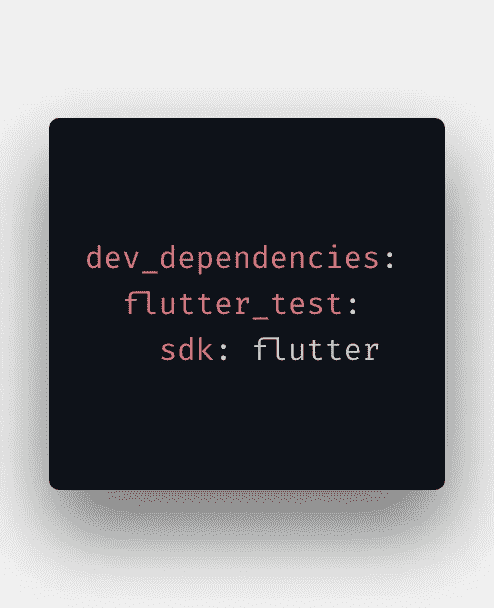
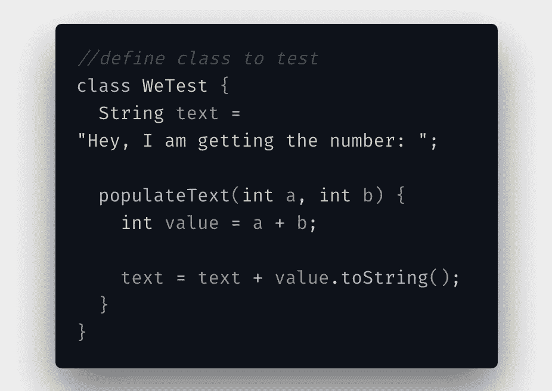
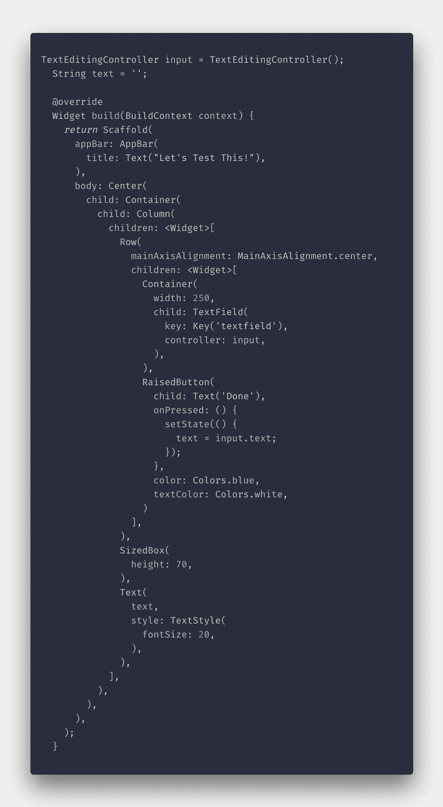
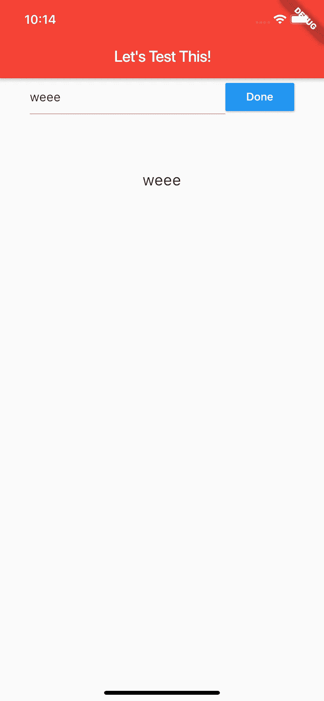
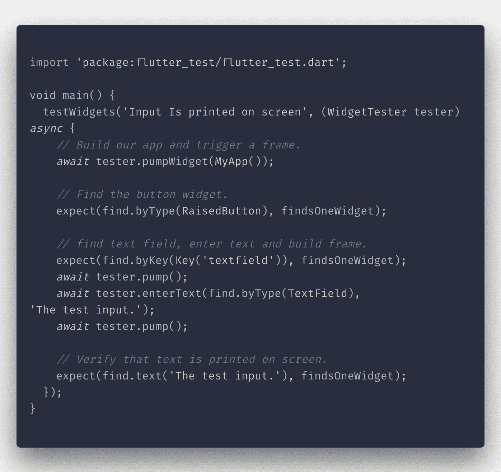

# 颤振自动测试——开始

> 原文：<https://betterprogramming.pub/flutter-automated-tests-get-started-424aec9430b3>

## 自动化单元和部件测试一览

软件开发中的自动化测试有助于你在发布应用程序之前发现它的错误和其他问题。这对于大型应用程序尤其有用，因为手动测试每个部分是不可能的。

幸运的是，Flutter 有不同类型的测试可供我们选择。

*   [单元测试](https://flutter.dev/docs/testing#unit-tests)
*   [小工具测试](https://flutter.dev/docs/testing#widget-tests)
*   [集成测试](https://flutter.dev/docs/testing#integration-tests)

在这篇文章中，我们将关注单元和小部件测试。

# 单元测试

单元测试是将你的代码分解成简单的部分(单元)*，*，然后这些部分被测试。这些单元通常是函数、方法、类，甚至是变量。我们来试试吧！

首先，您应该将 [*flutter_test*](https://api.flutter.dev/flutter/flutter_test/flutter_test-library.html) 包安装在您的`pubspec.yaml`文件中的开发依赖项中。

如果你正在构建一个不依赖于 Flutter 的 [Dart](https://dart.dev/) 应用，你可以安装[测试](https://github.com/dart-lang/test) 包作为开发依赖。

颤振 _ 测试依赖。

接下来，用你想要测试的代码创建一个类，我把它命名为 mine `we.dart` ***，*** ，也为这个类创建了测试文件，我把它命名为 mine `we_test.dart`。你的代码所在的文件可以在`lib/` 文件夹中，你的测试应该在根目录下的`tests/` 文件夹中。

我们要测试的类中的代码如下:

我们要测试的代码 we.dart

这里，我们有一个简单的类，有一个方法和一个字符串实例。调用字符串`text` 后，应该使用传递给`populateText()` 方法的参数之和对其进行编辑。

我们的测试文件如下所示:

我们的测试文件 we_test.dart

首先，我们导入 flutter_test 包和我们想要测试的类。然后，我们开始写作。

我们从 flutter_test 包中的`test()` 方法开始。该方法接受两个参数。第一，测试的描述，第二，运行测试的函数。

这里，我们首先将导入的类`WeTest()` *，*设置为一个变量，然后我们调用`populateText`方法，传入两个和三个参数。因此，我们期望求和的结果是 5。

然后我们从 flutter_test 调用`expect()`方法，该方法用于*断言* 我们正在测试的单元与代码运行时返回的匹配。这两个分别称为*实际*和*匹配器*。

如果它们匹配，那么我们的测试通过，如果不匹配，那么测试失败。

## 运行测试

您可以通过打开测试文件(`we_test.dart`)来运行测试，然后在 [VS 代码](https://code.visualstudio.com/)上从调试器运行 debug。

或者，在您的终端中运行`flutter test test/we_test.dart`。

# 小部件测试

小部件测试正如它们所暗示的那样:*测试小部件。*

小部件测试不同于单元测试，因为它们需要与单元测试中不同的类和函数。这些工具是`flutter_test`包的一部分。

我们开始吧！

此时，您应该已经通过您的`pubspec.yaml` 文件安装了`flutter_test`包。

接下来，我们需要小部件进行测试，因此我们将创建一个包含一些简单小部件的屏幕:

屏幕上有我们的小工具。

输出是一个带有文本字段(和控制器)、一个`RaisedButton`和一个文本小部件(用于显示输入的文本)的屏幕。

它看起来像什么。

现在我们有了小部件，让我们编写测试:

小部件测试。

很快，您应该开始发现这与我们之前编写的单元测试之间的差异。

1.  为每个测试创建一个新的`[WidgetTester](https://api.flutter.dev/flutter/flutter_test/WidgetTester-class.html)`的`testWidgets()`函数，在单元测试中用来代替`test()`函数。
2.  `[Finder](https://api.flutter.dev/flutter/flutter_test/Finder-class.html)`，用于定位各个小部件。
3.  匹配器(`findsOneWidget`、`findsNothing`、`findsNwidgets`)，我们用它来验证小部件。
4.  `pump()`，Flutter 用它来构建一个小部件。你也可以为动画之类的东西设置持续时间。

## 这是怎么回事？

*   首先，我们使用了`testWidgets()`函数，并为这个测试传递了一个描述，而`WidgetTester`将用于每个测试用例。
*   然后，我们通过调用`pumpWidget()`来构建小部件。
*   我们第一次使用`Finder`类是为了在屏幕上找到凸起的按钮。我们在这里使用了`byType()`方法，但是我们还可以尝试更多的方法，稍后我将通过使用`find.byKey()`来展示这些方法，以找到分配了键的文本字段。
*   接下来，我们试着测试一下`TextField`。首先，我们验证有一个带有`find.byKey()`查找器和`findsOneWidget`匹配器的`TextField`，然后触发视图的重建。
*   从`[WidgetTester](https://api.flutter.dev/flutter/flutter_test/WidgetTester-class.html)`调用`enterText()`方法允许 Flutter 将文本输入到找到的`TextField`中，然后再次重建视图。
*   最后，我们让 Flutter 检查打印在屏幕上的文本是否与上一步中输入的文本相同。

通过您的编辑器运行测试或在您的终端中运行`flutter test test/widget_test.dart`。这个测试应该会通过，但是玩玩它，看看事情会以不同的方式发生。

此外，查看所使用的类中的所有方法和示例。

作为这方面的延续，我可能会写一些关于模拟互联网调用和集成测试的文章。