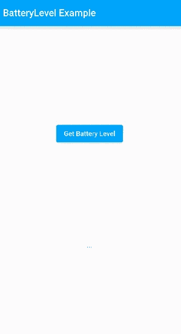
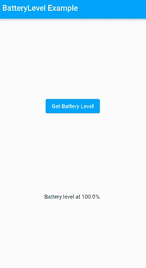
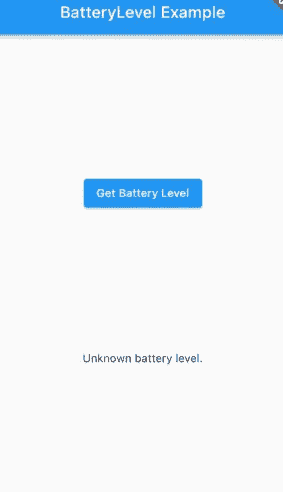

# 用 Klutter 制作的 Flutter 电池应用程序

> 原文：<https://betterprogramming.pub/flutter-battery-app-made-with-klutter-74d47002efb1>

## 构建你的第一个 Klutter 插件


照片由[菲利普·姆罗兹](https://unsplash.com/es/@mroz?utm_source=medium&utm_medium=referral)在 [Unsplash](https://unsplash.com?utm_source=medium&utm_medium=referral) 上拍摄

差不多 7 个月和 500 次提交之后，一个新的里程碑到来了:Klutter 现在可以在 [pub.dev](https://pub.dev/packages/klutter) 上下载了！有什么比做一个小演示更好的方式来庆祝一个里程碑呢？

我们带着 Klutter 试驾一下，重做一下 Flutter 电池 app。**注:**本教程最新版本见 [buijs.dev](https://buijs.dev/klutter-2/) 原文。

如果你已经熟悉了方法通道和在 Flutter 中使用特定于平台的代码，那么跳过这一节，直接从有趣的东西开始:[教程](https://buijs.dev/klutter-2/#Step%201:%20Create%20a%20Klutter%20project)。

如果你还没有跳过它，那么我建议你看一下在[文档](https://docs.flutter.dev/development/platform-integration/platform-channels)中的章节*例子:使用平台通道调用特定平台的 iOS 和 Android 代码*。

在这里，Flutter 团队使用一个示例应用程序 battery app 来演示如何使用方法通道在 iOS 和 Android 上调用特定于平台的代码。这个过程包括在 Flutter 端编写 Dart 代码，在 Android 上编写 Java/Kotlin 代码，在 iOS 上编写 Swift 代码，然后将它们粘合在一起。在进入下一个教程之前，有这些知识作为背景是很好的。

# 步骤 1:创建一个 Klutter 项目

首先创建一个新应用程序:

*   在终端运行中:`flutter create –org com.example –template=plugin –platforms=android,ios batterylevel`。**注意:**可能看不到，但使用双破折号'-'。
*   将 Klutter 框架作为依赖项安装:
*   将克鲁特:^0.1.3 添加到你的`pubspec.yaml`依赖块中。
*   在终端运行:`flutter pub get`
*   在终端运行中:`flutter pub run klutter:producer init`

Klutter 现在已经在插件项目中初始化了。让我们回顾一下 Klutter 所做的改变。以下 Gradle 文件应该添加到插件项目的根文件夹中:

*   `settings.gradle.kts`
*   `build.gradle.kts`
*   `gradlew`
*   `gradlew.bat`
*   `gradle.wrapper/gradle-wrapper.jar`
*   `gradle.wrapper/gradle-wrapper.properties`

构建 Kotlin 多平台模块(我们将在几分钟内完成)需要这些文件。最有趣的是 build.gradle.kts 文件。我想在此强调几个要点。

首先是 dependencies 块，它向 JVM 类路径添加了一些库:

```
dependencies {
    classpath("org.jetbrains.kotlin:kotlin-gradle-plugin:1.6.10")
    classpath("com.android.tools.build:gradle:7.0.4")
    classpath("dev.buijs.klutter:core:2022.r6-7.alpha")
    classpath("dev.buijs.klutter.gradle:dev.buijs.klutter.gradle.gradle.plugin:2022.r6-7.alpha")
}
```

通俗地说，这意味着这些库在平台模块中是可用的。因此，在这里我们看到我们的项目 Kotlin 多平台模块将与:

*   科特林版本 1.6.10
*   Android Gradle 版本 7.0.4
*   Klutter 核心版本 2022 . R6–7 . alpha
*   Klutter Gradle 版本 2022 . R6–7 . alpha

如果你想了解更多关于 Klutter Gradle 插件的信息，请阅读这里。

接下来，在 repositories 块中，添加 buijs-dev maven 存储库以下载 Klutter 库:

```
maven { url = uri("https://repsy.io/mvn/buijs-dev/klutter") }
```

最后，有几个注册的 Klutter 任务将用于构建我们的插件:

```
tasks.register("klutterInstallPlatform", Exec::class) {
    commandLine("bash", "./gradlew", "clean", "build", "-p", "platform")
    finalizedBy("klutterCopyAarFile", "klutterCopyFramework")
}tasks.register("klutterCopyAarFile", Copy::class) {
    from("platform/build/outputs/aar/batterylevel-release.aar")
    into("android/klutter")
    rename { fileName ->
        fileName.replace("batterylevel-release", "platform")
    }
}tasks.register("klutterCopyFramework", Copy::class) {
    from("platform/build/fat-framework/release")
    into("ios/Klutter")
}
```

# 步骤 2:编写特定于平台的代码

转到根文件夹中的平台模块。src 文件夹应该包含一个`androidMain`、`commonMain`和`iosMain`文件夹。这些文件夹中有一些示例代码。继续删除它们:

*   `androidMain/Platform.kt`
*   `commonMain/Greeting.kt`
*   `commonMain/Platform.kt`
*   `iosMain/Platform.kt`

在`commonMain`中创建一个名为 BatteryLevel 的新文件。增加以下内容:

```
package com.example.batterylevel.platformexpect class BatteryLevel(context: Any?) {
  val level: Float?
}
```

这个类是我们的平台接口。我们有一个`BatteryLevel`类，它的构造函数需要一个对象，这个对象可以是任何类型，也可以是 null。所以基本上可能有也可能没有一个物体，如果它在那里，它可能是任何东西。最后，我们有一个名为 level 的类成员，它可能会也可能不会返回浮点值。我们将很快看到为什么它是这样一个开放定义的契约。

最后请注意`expect`关键字。这个关键字是 Kotlin 多平台[特性](https://kotlinlang.org/docs/multiplatform-connect-to-apis.html)。这意味着对于这个类，在`androidMain`和`commonMain` `src`文件夹中应该有特定于平台的实现。让我们创造这些吧！

在`androidMain`中新建一个名为`BatteryLevel`的文件，并添加以下内容:

```
package com.example.batterylevel.platformimport android.content.Context
import android.os.BatteryManageractual class BatteryLevel actual constructor(context: Any?) { actual val level: Float? = context?.let {
    getBatteryLevel(context as Context).toFloat()
  } private fun getBatteryLevel(context: Context): Int {
    val batteryManager = context.getSystemService(Context.BATTERY_SERVICE) as BatteryManager
    return batteryManager.getIntProperty(BatteryManager.BATTERY_PROPERTY_CAPACITY)
  }}
```

在`iosMain`中新建一个名为`BatteryLevel`的文件，并添加以下内容:

```
package com.example.batterylevel.platformimport platform.UIKit.UIDeviceactual class BatteryLevel actual constructor(context: Any?) { actual val level: Float? = UIDevice.currentDevice.batteryLevel.let {
    if(it < 0) null else it * 100
  }}
```

就像`expect`关键字一样，`actual`也是一个 Kotlin 多平台特性。

`iosMain`和`androidMain`中的`actual`类是我们在`commonMain`类中定义的接口的实现。

只需这几行代码，我们就可以在 Android 和 iOS 上调用特定于平台的代码！

**注**:如果 iOS 设备禁用了电池监控，那么`batteryLevel`返回-1.0。为了本教程的简单，我们假设它是启用的，但对于一个生产应用程序，你必须考虑这一点。

我们现在需要做的就是定义一个将被 Flutter 调用的服务。在`commonMain`中添加一个名为`Platform`的新文件。添加以下代码:

```
package com.example.batterylevel.platformimport dev.buijs.klutter.annotations.kmp.*class Platform { @AndroidContext
  @KlutterAdaptee(name = "getBatteryLevel")
  fun getBatteryLevel(context: Any): Double? {
    return BatteryLevel(context).level?.toDouble()
  }}
```

这里发生了一些事情。我们创建了一个`BatteryLevel`的实例，它是我们在`commonMain`中定义的接口。在运行时，这要么是我们在 Android 设备上的`androidMain`中定义的`BatteryLevel`实现的实例，要么是 iOS 设备上的`iosMain`实现的实例。

我们还看到 2 个注释:`@AndroidContext`和`@KlutterAdaptee(name = “getBatteryLevel”)`。`KlutterAdaptee`告诉 Klutter 为该方法生成方法通道代码，并将其添加到 Flutter 库文件中。`AndroidContext`是一个可选的注释，告诉 Klutter 在从 Android 调用这个方法时传入一个(Android)上下文的实例。

最后，我们将 Float 转换为 Double 值，因为 Klutter 还不支持 Float 值。

# 步骤 3:构建 Flutter 库

*   在根文件夹中打开一个终端，运行:`flutter pub run klutter:producer install=platform`
*   在终端运行:`flutter pub run klutter:producer install=library`

这些命令执行以下步骤:

*   为 iOS(框架)和 Android (aar)构建工件。
*   在 lib 中生成 dart 文件。
*   在`root/android`中生成方法-通道代码。
*   在`root/ios`中生成方法-通道代码。

我们的图书馆现在可以使用了。我们很快就会这样做，但首先，为了好玩和笑声，让我们看看 Klutter 为我们创造了什么。

打开 root/lib 文件夹，应该有一个名为`batterylevel.dart`的文件。该文件应包含以下内容:

```
import 'dart:async';import 'package:flutter/services.dart';
import 'package:flutter/widgets.dart';
import 'package:klutter/klutter.dart';/// Autogenerated by Klutter Framework.
///
/// Do net edit directly, but recommended to store in VCS.
///
/// Adapter class which handles communication with the KMP library.
class Batterylevel {
  static const MethodChannel _channel =
  MethodChannel('com.example.batterylevel'); static Future<AdapterResponse<double>> getBatteryLevel(
    State caller, {
      void Function(double)? onSuccess,
      void Function(Exception)? onFailure,
      void Function()? onNullValue,
      void Function(AdapterResponse<double>)? onComplete,
    }) async {
    try {
      final json = await _channel.invokeMethod('getBatteryLevel');
      final value = json?.toDouble();
      final AdapterResponse<double> response = AdapterResponse.success(value); if (caller.mounted) {
        onComplete?.call(response);
        if (value == null) {
          onNullValue?.call();
        } else {
          onSuccess?.call(value!);
        }
      } return response;
    } catch (e) {
      final exception = e is Error ? Exception(e.stackTrace) : e as Exception; final AdapterResponse<double> response =
      AdapterResponse.failure(exception); if (caller.mounted) {
        onComplete?.call(response);
        onFailure?.call(exception);
      } return response;
    }
  }
}
```

这个 Dart 类是我们将从 Flutter 应用程序中使用的接口。我们看到创建了一个名为`com.example.batterylevel`的方法通道。

这是 Flutter 应用程序将用来与平台通信的通道。有一种方法叫做`getBatteryLevel`。这个名字来源于我们之前使用的`@KlutterAdaptee`注释。

# 步骤 4:测试库

在这一步，我们将添加一个非常基本的 UI 来验证插件的工作方式。Flutter 方便地自动生成一个依赖于我们插件的示例 Flutter 应用程序。打开`root/example`文件夹中的`pubspec.yaml`，添加一个对 Klutter 的依赖。像往常一样，在添加一个依赖项后运行 flutter pub get。

在终端运行中:

*   `flutter pub run klutter:consumer init`
*   `flutter pub run klutter:consumer add=batterylevel`

打开`example/lib`文件夹中的`main.dart`文件。您将看到`batterylevel`包已经被导入，并且有一些基本的 UI 代码。然而，这将不再工作，因为我们改变了我们的库代码。继续删除除了`initState`方法之外的`_MyAppState`类中的所有内容:

```
class _MyAppState extends State<MyApp> { @override
  void initState() {
    super.initState();
  }}
```

添加用户界面代码:

```
class _MyAppState extends State<MyApp> { @override
  void initState() {
    super.initState();
  } @override
  Widget build(BuildContext context) {
    return MaterialApp(
      home: Scaffold(
        appBar: AppBar(
          title: const Text('BatteryLevel Example'),
        ),
        body: Center(
          child: Column(
            mainAxisAlignment: MainAxisAlignment.spaceEvenly,
            children: [
              ElevatedButton(
                child: const Text('Get Battery Level'),
                onPressed: _getBatteryLevel,
              ),
              Text(_batteryLevel),
            ],
          ),
        ),
      ),
    );
  }

}
```

现在我们已经有了视图，剩下的就是调用我们的`Batterylevel`库了。为此，添加一个字符串变量来保存`batterylevel`状态:

```
String _batteryLevel = '...';
```

最后，添加`getBatteryLevel`方法:

```
Future<void> _getBatteryLevel() async {
  await Batterylevel.getBatteryLevel(this,
    onSuccess: (level) => setState(() {
      _batteryLevel = "Battery level at $level%.";
    }),
    onFailure: (exception) => setState(() {
      _batteryLevel = "Failed to get battery level: $exception.";
    }),
    onNullValue: () => setState(() {
      _batteryLevel = "Unknown battery level.";
    }),
  );
}
```

注意不需要 try-catch 块来捕捉`PlatformExceptions`。这都是由自动生成的 Klutter 代码处理的。`BatteryLevel`库总是会返回一个响应。

我们定义了几个回调函数，它们将根据平台调用给出的响应来运行。通过将对当前小部件的引用添加到方法调用(this ),我们使该方法能够检查小部件是否仍然被挂载。这样做是为了避免万一小部件已经被丢弃时调用`setState`。

概括一下，这是我们最后的 Flutter UI:

```
import 'package:flutter/material.dart';
import 'dart:async';import 'package:batterylevel/batterylevel.dart';void main() {
  runApp(const MyApp());
}class MyApp extends StatefulWidget {
  const MyApp({Key? key}) : super(key: key); @override
  State<MyApp> createState() => _MyAppState();
}class _MyAppState extends State<MyApp> { @override
  void initState() {
    super.initState();
  } String _batteryLevel = '...'; Future<void> _getBatteryLevel() async {
    await Batterylevel.getBatteryLevel(this,
      onSuccess: (level) => setState(() {
        _batteryLevel = "Battery level at $level%.";
      }),
      onFailure: (exception) => setState(() {
        _batteryLevel = "Failed to get battery level: $exception.";
      }),
      onNullValue: () => setState(() {
        _batteryLevel = "Unknown battery level.";
      }),
    );
  } @override
  Widget build(BuildContext context) {
    return MaterialApp(
      home: Scaffold(
        appBar: AppBar(
          title: const Text('BatteryLevel Example'),
        ),
        body: Center(
          child: Column(
            mainAxisAlignment: MainAxisAlignment.spaceEvenly,
            children: [
              ElevatedButton(
                child: const Text('Get Battery Level'),
                onPressed: _getBatteryLevel,
              ),
              Text(_batteryLevel),
            ],
          ),
        ),
      ),
    );
  }}
```

打开一个 Android 模拟器，运行应用程序。



按下按钮应该会显示当前的电池电量:



现在，在 iOS 模拟器中进行同样的操作，如果 iOS 设备上的电池监控被禁用(很可能是),您应该会看到以下内容:



仅此而已。祝贺你的第一个 Klutter 插件！

Klutter 能做的还很多，比如基于平台包中的 Kotlin 代码在 Dart 中生成完整的 DTO 类。参见 Klutter Gradle [文档](https://github.com/buijs-dev/klutter)中的示例。