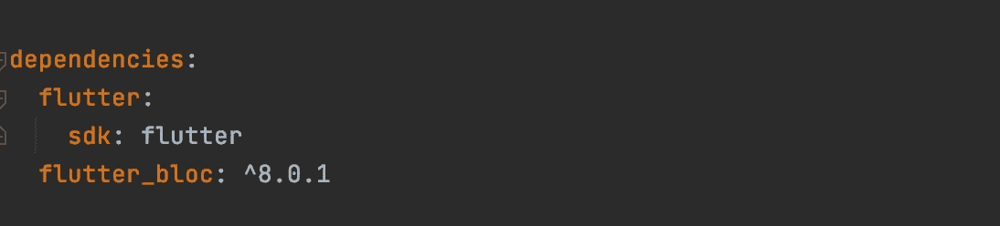
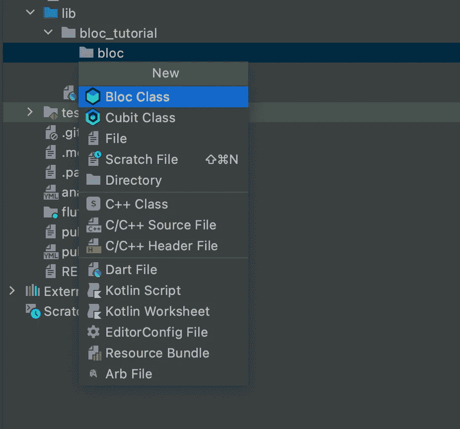
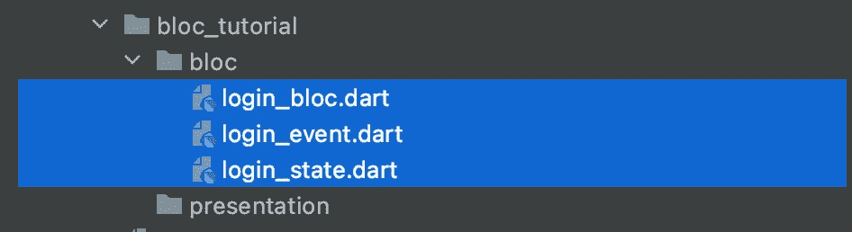
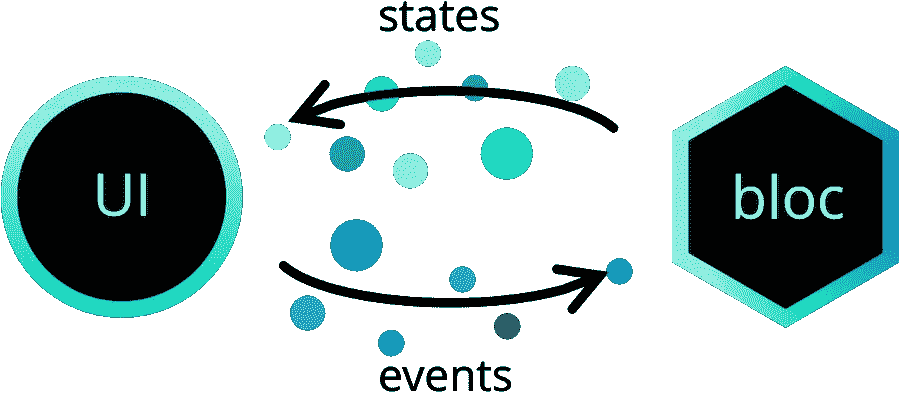

# 颤动块:简单介绍

> 原文：<https://betterprogramming.pub/flutter-blocs-a-simple-introduction-8e948456d741>

## 在项目中使用颤振块的逐步指南


由[凯伦·瑞金](https://unsplash.com/@kalaniparker?utm_source=unsplash&utm_medium=referral&utm_content=creditCopyText)在 [Unsplash](https://unsplash.com/?utm_source=unsplash&utm_medium=referral&utm_content=creditCopyText) 拍摄的照片

你觉得理解正在工作的 flutter_blocs 库很难吗？或者您知道它，但在实现它时可能会感到困惑？别担心，我们会一步一步来，详细了解每件事。

Flutter blocs 提供了一种简单的方法来处理应用程序中的不同状态，一旦你理解了它，它就很容易使用并扩展到任何规模的应用程序

# **为什么我们还要使用颤振模块？**

> *Bloc 使得将表示从业务逻辑中分离出来变得容易，使得你的代码*快速*，*易于测试*，*可重用*。—官方封锁文件*

Flutter Blocs 简化了应用程序中的状态管理，它提供了简单的 API 来使用，抽象了许多细节，使状态管理更容易，它是 Flutter 中最受欢迎的状态管理库之一，由[菲利克斯·安杰洛夫](https://github.com/felangel)和其他开源贡献者积极维护。

顾名思义，Blocs 处理所有的业务逻辑，无论是与数据层交互，还是在 UI 上显示某些内容或一些复杂的计算。

**但是，什么是状态管理？难道我们不能忽略它，我的意思是我们不用它在 Android 或 iOS 上？**

不，我们不能，因为 Flutter 是一个声明式框架，它构建自己的 UI 来显示应用程序的当前状态，所以每当应用程序的状态发生变化时，我们都会触发 UI 的重绘，所以基本上每个状态都有一些 UI，或者像官方文档所说的那样，“UI 是应用程序状态的功能”。

例如，—

*   网络不可用状态下，你显示一个小吃店。
*   获取数据状态，你显示一个加载指示器
*   数据被获取状态，显示一个包含数据的文本小部件，等等。

顺便说一下，在 flutter 中有多种状态管理解决方案，但 flutter_bloc 是最流行的一种。

我们将添加 [flutter_bloc](https://pub.dev/packages/flutter_bloc) 插件作为我们应用程序的依赖项，检查最新版本的库，并将其添加到您项目的`pubspec.yml`文件中，在依赖项部分下，缩进应该是正确的，检查下图。



我们将在 IDE 中添加一个 bloc 扩展(可用于 VSCode 和 Android Studio ),因为它有助于生成 bloc 文件并减少大量样板文件。

添加扩展名后，创建一个文件夹来存储 bloc 文件，并在文件夹上执行 Cmd+N，您将在下拉列表中看到一个 Bloc 类选项，



提供一个名字给你的集团，你也可以选择使用公平。这会生成三个文件。



我们将一个接一个地介绍它们，但在此之前，让我们看一个非常简单的图表来理解这些组件，以及它们如何与 UI 交互？



图片来自 [Bloc 图书馆官方文件](https://bloclibrary.dev/#/)

所以很简单明了，不是吗？这包括四个步骤，

*   UI 触发一个事件。
*   Bloc read 的事件运行一些商业逻辑。
*   计算完成后，Bloc 发出一个状态。
*   UI 监听状态并相应地更新自己。

这是三个文件，Bloc、event 和 state，检查一下你可以忽略的代码片段“稍后会用到”，注释我将在下一节中引用它们。

由于代码片段的每一行都有一个注释，希望您对这三个文件的作用有所了解，也可以将这些组件可视化，如上面的块架构图所示。

我们已经定义了块层，现在让我们构建一个简单的 UI 来看看，我们如何使用这个`LoginBloc`？

所以在 UI 中，我们添加了一个文本和按钮，点击按钮我们将改变文本。我们将在按钮上触发一个事件，该事件将从 Bloc 中获取一个我们将显示的文本。

等等！`LoginScreen`将如何了解`LoginBloc`？

啊！颤振集团已经有一个非常优雅的解决方案。由于微件在 Flutter 中无处不在，flutter blocs 提供了许多有用的微件，随着例子的进展，我们将在下一节研究其中的一些微件。

我们将讨论三个问题，以开始使用该模块

## **1。如何让 Bloc 对 Widget 树(UI)可用？**

提供该功能的小部件是 BlocProvider 小部件，BlocProvider 使 bloc 对整个小部件树可用，这在`child`参数中传递。

在上面的代码中，我们创建了一个`LoginBloc`的新实例，并且作为一个孩子，我们传递了我们的`LoginScreen`的实例，因此 Bloc Provider 使`LoginBloc`对`LoginScreen`的小部件树可用，Bloc Provider 自动处理 Bloc 的关闭。

## 2.**如何从 UI 触发某个动作的事件？**

现在我们已经在小部件树上设置了 Bloc，我们可以从任何地方访问它，有两种方法可以做到这一点

a.利用上下文，

```
context.read<BlocA>();
```

b.使用块提供程序，

```
BlocProvider.of<BlocA>(context)
```

*但是有什么区别呢？什么时候应该用哪一个？*

实际上没有太大区别，两者几乎相同，但第一个被定义为对`BuildContext`的扩展，所以更容易使用。你喜欢哪个就进行哪个。

让我们在块上添加一个按钮点击事件，

> 注意:—传递块的正确类型很重要，因为它试图查找树来找到该类型的实例，[您可以在这里阅读更多内容。](/exploring-inherited-widget-in-flutter-10ab959017cb)

回到事件，看看从 UI 触发事件有多容易，我们只需调用块上的`add`方法，并传递一个事件的实例。

现在，我们需要返回到 Bloc，检查我们是否已经注册了从 UI 发送的这个事件，在收到这个事件时，我们将发出一个状态，并在 UI 上显示一个字符串，您可以参考上面附加的 Bloc 代码，只需取消所有代码的注释“将在以后使用”。太好了，就这样。

## 3.**但是当一个新的状态发出时，UI 将如何更新自己呢？**

是的，你猜对了，这也有一个小部件。这叫做集团消费者。

让我们检查一下`BlocConsumer`，虽然上面的例子包含了整个`LoginScreen`，但是现在，你只需要关注`_buildScaffoldBody`函数。

如果你注意到了`BlocConsumer`，有四个论点让我们一个一个来看，

`builder` —它重建小部件树以响应状态变化，这意味着每当您发出新状态时，它将重建小部件，以便您可以使用从块发出的状态中发送的值。所以在这个例子中，我们已经在`UpdateTextState`中传递了来自 bloc 的文本，并在 UI 上使用它，每当“Tap me！!"点击按钮。

`listener` —因此，每当发出一个状态时，监听器也会被调用，但与 builder 不同，它不会返回任何小部件。它在每次状态改变时被调用一次，这就是为什么我们通常使用一个在状态改变时发生一次的侦听器，比如显示一个小吃店、对话框、底部表单或导航到下一个屏幕。

`buildWhen` —这是一个可选参数，它提供以前和当前的状态，并返回一个布尔值，因此如果我们返回 true，它将调用构建器，否则，如果您不使用此参数，每次状态改变时都会调用构建器。

`listenWhen` —这与`buildWhen`类似，但用于控制监听器，如果它返回 true，则监听器被调用。

所以在我们的例子中，我们使用 Listener 作为`ShowSnackBar`状态，它显示了一个小吃店，当点击按钮时会显示一个文本。我们正在为`LoginInitial`、`UpdateTextState`使用 builder，当点击一个按钮时，它会更新屏幕上的文本。

另一个值得注意的有趣的地方是，`BlocConsumer`接受一个可选的参数块，如果你不提供它，它会尝试使用`BlocProvider`和当前的`BuildContext`来查找。因此，如果您错过了注入 Bloc(问题 1 ),它将抛出一个异常。

有些情况下，你要么想使用`builder`或`listener`，对于这种情况，有不同的`BlocBuilder`和`BlocListener`部件，请随意探索它们，Flutter blocs 也提供了一些其他有用的部件，但那是改天的事了。

# 摘要

1.  构建一个 UI(你有一些业务逻辑要运行？).
2.  创建块(块、事件和状态类)。
3.  将它们绑定在一起(还记得那三个问题吗？).
4.  使用`BlocProvider`初始化块，使其可用于微件树。
5.  使用上下文查找块，以便可以添加事件。
6.  在块中执行您的业务逻辑并发出结果。
7.  使用`BlocConsumer`、`BlocBuilder`、`BlocListener`，监听状态变化并相应地执行动作。

# 有用的资源

*   [FlutterBloc 官方文档](https://gist.github.com/Sumit-Ghosh/50f1a2c636eba6dcf7414c4dec734091)
*   [费利克斯在欧洲的演讲](https://www.youtube.com/watch?v=knMvKPKBzGE)
*   [Flutterly Bloc 的教程](https://www.youtube.com/watch?v=THCkkQ-V1-8)