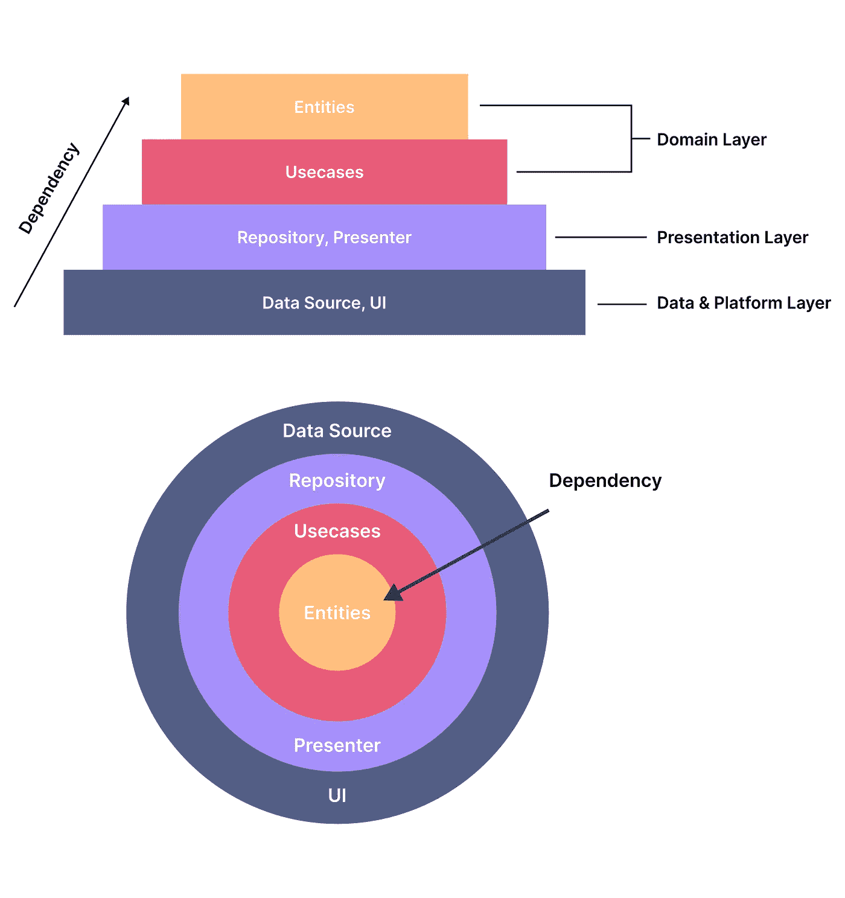
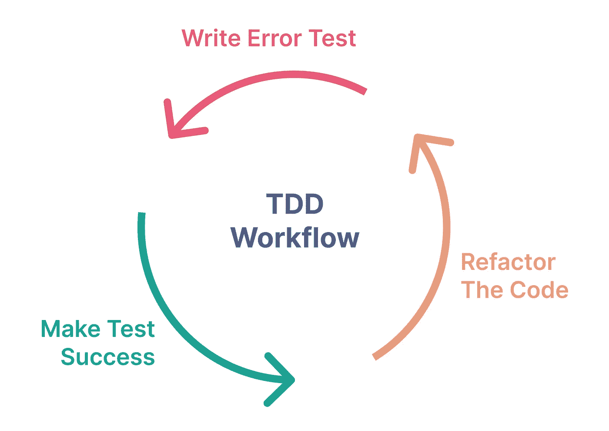
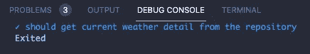
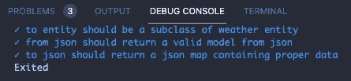
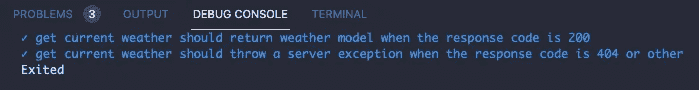
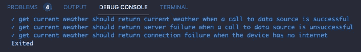
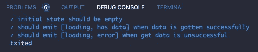
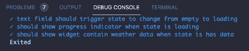
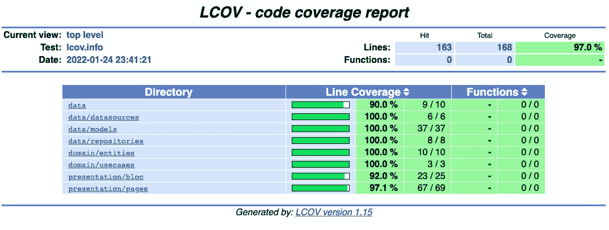

# 通过实现干净的架构和测试驱动的开发来增强你的 Flutter 开发过程

> 原文：<https://betterprogramming.pub/flutter-clean-architecture-test-driven-development-practical-guide-445f388e8604>

## 在 Flutter 代码库中建立干净架构的完整过程


瑞安·安塞尔在 [Unsplash](https://unsplash.com/s/photos/floor-plan?utm_source=unsplash&utm_medium=referral&utm_content=creditCopyText) 上拍摄的照片

自 2018 年 12 月 4 日向公众发布以来，带有 Flutter 的应用开发生态系统经历了非常迅速的发展。选择 Flutter 作为开发快速迭代产品的 SDK 是正确的选择。但是在选择 Flutter 的时候，开发者也要开始思考如何组织 app 的状态管理，如何设计 app(幕后)具有可维护性和可扩展性。

为了解决这些问题，我们需要在开始开发功能之前设计应用程序的架构。

# 干净的建筑

架构在开发应用程序时非常重要。架构可以比作平面图，它描述了应用程序项目中的流程。实现该架构的主要目的是关注点分离(SoC)。所以，如果我们能一次专注于一件事，事情会变得更容易。

在 Flutter 的上下文中，clean architecture 将帮助我们将业务逻辑的代码与平台相关的代码(如 UI、状态管理和外部数据源)分开。此外，我们编写的代码可以更容易独立测试(可测试)。



干净的架构图

如上图所示，从顶部看，干净的架构被描绘成一个金字塔或一片洋葱。clean 架构将把 Flutter 项目分为 3 个主要层，即:

## 数据和平台层

数据层位于最外层。这一层由数据源代码组成，如消费 Rest API、访问本地数据库、Firebase 或其他来源。此外，在这一层上，通常有构建 UI(小部件)的平台代码。

## 表示层

表示层由从存储库中访问应用程序数据的代码组成。此外，还有状态管理代码，如 providers、BLoC 等等。

## 畴层

领域层是干净架构中最深的一层。这一层包含业务逻辑应用程序的代码，例如实体和用例。

> 每一层都依赖于其他层。图上的箭头显示了各层之间的关系。最外层将依赖于内层等等。

这里不依赖于任何其他层的层只是领域层(独立的),它是业务逻辑的代码。这样，应用程序更具适应性和动态性。例如，如果我们想将状态管理从 provider 更改为 BLoC，迁移过程将不会干扰现有的业务逻辑。

# 测试驱动开发

除了实现干净的架构之外，为了在产生最小的错误和减少重复的调试和修复过程方面优化开发过程，我们必须经历一个测试过程。

测试驱动开发是一个应用程序开发过程，其中测试是驱动开发的主要特征。在应用程序中创建功能之前，将首先编写测试代码场景。



测试驱动的开发工作流

使用 TDD 的应用程序开发过程的工作流程如上图所示。注意，TDD 过程是迭代的，它被称为红绿重构过程。

## 步骤 1:编写测试场景(红色)

一个特性的开发首先从编写一个测试场景开始。编写测试场景通常遵循 PRD 文档中的特性需求(针对公司中的情况)。在测试场景中，通常会有一个开发功能的流程，例如确定使用的数据源(例如远程或本地)，确保来自 API 的传入数据产生适当的模型，根据数据设计视图的状态流，等等。。当我们第一次编写测试场景时，我们会得到错误。这是正常的，因为功能代码尚不存在。

> 为特性编写测试场景是作为开发特性(实际代码)的指南来完成的。

## 步骤 2:使测试场景成功(绿色)

在这一步中，实际的特征码编写已经完成。在这一阶段编写代码不一定要整洁和最佳，因为这一步的主要目标是使之前编写的测试代码成功。

## 步骤 3:重构代码

在测试代码成功运行并且没有任何错误之后，是时候整理和优化已经编写的代码了，包括测试代码和实际的功能代码。

使用 TDD 过程，最终获得的结果是除了一个具有最小缺陷的应用程序之外，还有一个整洁和最佳的应用程序代码。

# 案例研究实施

现在，我们将尝试在一个迷你项目中实现我们之前谈到的两个概念，即天气应用程序。这次我们将使用 [OpenWeather API](https://openweathermap.org/api) 作为我们应用程序的数据源。

该项目的文件夹结构如下所示:

```
lib
├── data
│   ├── constants.dart
│   ├── datasources
│   │   └── remote_data_source.dart
│   ├── exception.dart
│   ├── failure.dart
│   ├── models
│   │   └── weather_model.dart
│   └── repositories
│       └── weather_repository_impl.dart
├── domain
│   ├── entities
│   │   └── weather.dart
│   ├── repositories
│   │   └── weather_repository.dart
│   └── usecases
│       └── get_current_weather.dart
├── injection.dart
├── main.dart
└── presentation
    ├── bloc
    │   ├── weather_bloc.dart
    │   ├── weather_event.dart
    │   └── weather_state.dart
    └── pages
        └── weather_page.darttest
├── data
│   ├── datasources
│   │   └── remote_data_source_test.dart
│   ├── models
│   │   └── weather_model_test.dart
│   └── repositories
│       └── weather_repository_impl_test.dart
├── domain
│   └── usecases
│       └── get_current_weather_test.dart
├── helpers
│   ├── dummy_data
│   │   └── dummy_weather_response.json
│   ├── json_reader.dart
│   ├── test_helper.dart
│   └── test_helper.mocks.dart
└── presentation
    ├── bloc
    │   └── weather_bloc_test.dart
    └── pages
        └── weather_page_test.dart
```

如果你想遵循这个教程，你可以在这个 [Github 库](https://github.com/codestronaut/flutter-weather-app-sample.git)上使用下面的启动代码。

## 步骤 1:在领域层编写代码

第一步是在领域层编写代码。为什么是域层？因为这一层是不依赖于任何其他层的层。所以从这一层入手会比较安全。

## 用例

在测试/领域部分，我们只需要为用例编写测试场景。在这种情况下，我们有 1 个用例，`get_current_weather_test.dart`。

> 上面的测试代码在开始时会有一个错误。这很正常，因为我们还没有编写实际的代码。

对于领域层的实际特性代码，有 3 个部分，即实体、用例以及存储库。我们从写天气实体开始，它是`weather.dart`

之后，我们继续为`weather_repository.dart`写代码。天气知识库是一个抽象类，稍后将在数据层实现。

然后，我们将为用例`get_current_weather.dart`编写代码。

在回到测试代码之前，我们必须创建一个模拟天气知识库。打开`test_helper.dart`，添加`WeatherRepository`。在`test _helper.dart`中，还有一个对 HTTP 库的模拟，这样它可以在测试期间模拟对 API 的请求。

通过终端运行以下命令来生成模拟文件:

```
flutter pub run build_runner build
```

之后，回到`get_current_weather_test.dart`并导入`MockWeatherRepository`然后运行测试。



获取当前天气用例测试结果

## 步骤 2:在数据层编写代码

在领域层处理完测试代码和特性之后，我们现在可以继续处理数据层的代码。在数据层，有数据源、模型和存储库。

> 等等，领域层也有存储库吗？是的，领域层的存储库是一个抽象类的形式，其中有一些功能仍然需要实现。因此，在数据层的存储库中，我们将开始实现抽象类。

## 模型

好，我们将从模型开始，这个过程从为模型编写测试代码开始，`weather_model_test.dart`。在这里，我们将测试 3 个主要内容:

*   我们所创建的模型是否等同于领域层的实体？
*   `fromJson()`函数是否返回有效的模型？
*   `toJson()`函数是否返回合适的 JSON 映射？

然后，我们继续编写`weather_model.dart`的代码

之后，返回测试代码并导入`weather_model.dart`然后运行测试。



模型测试结果

## 数据源

我们继续处理数据源中的代码。这里是`remote_data_source_test.dart`的代码。

上面的`remote_data_source_test.dart`代码将测试从 API 获取天气数据的过程。有两个条件:

*   成功获取数据时返回有效模型
*   获取数据失败时返回一个`ServerException`

我们还需要像这样的`JSON`形式的虚拟数据:

JSON 响应示例

然后继续编写数据源的代码`remote_data_source.dart`。

之后，返回测试代码并导入`remote_data_source.dart`然后运行测试。



数据源测试结果

## 仓库

接下来，我们将处理存储库的代码，即`weather_repository_impl_test.dart`和`weather_repository_impl.dart`。这里的术语`impl`是实现的意思。

为了在`weather_repository_impl_test.dart`上进行测试，我们需要访问数据源。因此，我们将首先为之前创建的远程数据源生成一个模拟。将`RemoteDataSource`添加到`test_helper.dart`中，如下所示:

然后，运行下面的**命令**从数据源生成一个模拟:

```
flutter pub run build_runner build
```

现在，`MockRemoteDataSource`已经准备好用于测试，现在我们为`weather_repository_impl_test.dart`编写代码。

在上面的代码中，测试的场景是:

*   成功的 API 请求返回`current weather`数据
*   当对 API 的请求失败时返回`ServerFailure`
*   未连接互联网时恢复`ConnectionFailure`

现在让我们继续进行`weather_repository_impl.dart`的工作。

之后，返回测试代码并导入`weather_repository_impl.dart`然后运行测试。



知识库测试结果

## 步骤 3:在表示层编写代码

在领域和数据层工作之后，最后一步是在表示层处理代码。在这一层，有状态管理(在这种情况下我们使用 *BLoC* )和页面。

## 状态管理(*集团*)

首先，我们将代码状态管理( *BLoC* )。对于在`weather_bloc_test.dart`上的测试，我们需要访问用例`MockGetCurrentWeather`。

然后运行以下命令从 GetCurrentWeather 生成一个模拟。

```
flutter pub run build_runner build
```

然后，我们继续处理*块*状态管理代码。这里我们的 *BLoC* 代码由`weather_state.dart`、`weather_event.dart`和`weather_bloc.dart`组成。

之后，返回测试代码并导入`weather_bloc.dart`然后运行测试。



阻塞状态管理测试结果

## 页

在完成了*块*代码之后，我们将为应用程序的页面或用户界面创建代码。先说测试代码，即`weather_page_test.dart`。在这里，我们将测试 3 样东西:

*   完成填充`TextField`后，应用程序的状态应该从`WeatherEmpty`变为`WeatherLoading`。
*   当应用程序的状态为`WeatherLoading`时，显示进度指示器。
*   当应用程序的状态为`WeatherHasData`时，显示包含天气信息的小部件。

然后，我们继续编写`weather_page.dart`的代码。

之后，返回测试代码并导入`weather_page.dart`然后运行测试。



页面测试结果

# 运行应用程序

至此，我们已经完成了具有一个特性的应用程序，该特性基于对城市名称的搜索来获取最新的天气信息。现在，我们将尝试在模拟器上运行应用程序。


决赛成绩

# 概述

实现测试驱动开发和干净架构的过程确实非常复杂。然而，如果我们依赖于最终的结果，即最少的 bug、添加特性的便利性和库迁移(如状态管理)，这是值得的！

最后，我们可以运行测试覆盖，看看是否所有的代码都已经测试过了。在终端的项目目录中运行以下命令:

```
flutter test --coverage
genhtml coverage/lcov.info -o coverage/html
open coverage/html/index.html
```

结果是这样的:



测试覆盖率结果

这就是在 Flutter 项目中实现干净架构和测试驱动开发的过程。希望有用。谢谢大家！

完整的代码:

[](https://github.com/codestronaut/flutter-weather-app-sample.git) [## GitHub-codestronaut/flutter-weather-app-sample:这个库是一个学习 TDD 的样例应用程序…

### 一个新的颤振项目。这个项目是颤振应用的起点。一些帮助您入门的资源…

github.com](https://github.com/codestronaut/flutter-weather-app-sample.git) 

# 参考

*   [https://ieeexplore.ieee.org/abstract/document/9071367](https://ieeexplore.ieee.org/abstract/document/9071367)