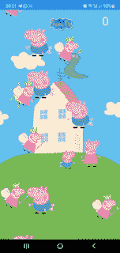

# 颤动+火焰:用颤动制作游戏入门

> 原文：<https://betterprogramming.pub/flutter-flame-intro-to-making-games-with-flutter-c4f5b2209a34>

## 这听起来好得令人难以置信，对吗？如果我告诉你不是呢。不相信我？别走远，你会看到的。

安德烈·梅特列夫在 [Unsplash](https://unsplash.com?utm_source=medium&utm_medium=referral) 上拍摄的照片

# 介绍

先说这里的真题，为什么会有人想在 Flutter 里做游戏？有很多成熟的游戏引擎，如 Unity、Unreal Engine、Godot 等，它们在这方面做得很好，那么为什么有人想在 Flutter 中开发游戏呢？

我将开门见山地说，你将不能在 Flutter 中制作 AAA 游戏(至少现在不能),但你可以在使用你最喜欢的编程语言 Dart 的同时，用出色的性能和所有这些好东西来制作好的 2D 游戏。因此，回答这个问题，它只是为了好玩，或者可能在所有平台上获得大量观众，这取决于你有多认真。

你将能够像你创建的任何其他 Flutter 应用程序一样为所有平台导出游戏。火焰已经有了稳定的版本( [v.1.0.0](https://docs.flame-engine.org/1.0.0/) )，并准备好了生产应用。他们提供了一个 2D 游戏引擎，以及 2D 物理、音频、动画等等(注意不是所有的组件都已经可以生产了，查看详情[这里](https://pub.dev/publishers/flame-engine.org/packages))。

# 了解火焰

到目前为止，我在创作第一个游戏时的经历既令人惊奇又令人困惑。Flame 有一个名为**的组件**，类似于 Flutter 组件，因此来回切换以了解何时何地使用什么可能会很麻烦。

也就是说，*这并不意味着它们是可以互换的，你不能把火焰组件直接放在一个颤动的树里面，反之亦然！*要将一个火焰组件放到 Flutter 小部件树中，我们必须使用一个名为 *GameWidget* 的“桥接”小部件。

我只能说，这不一样！有时你需要打破规则，跟随你的直觉，而其他时候你只需要重构你所做的。这仍然是一个新的未知领域，所以我们需要一些时间来适应它！但是伙计，就像开发一个普通的应用程序一样，开发速度非常快(特别是如果我把它与 Unity 或 Unreal 相比，后者要慢得多)。

我构建了一个简单的气球 popper 游戏，有背景图像、不同的气球类型、背景音乐、气球流行效果，并且在不到一天的时间内完成了分数，对 Flames engine 没有任何经验。(PS。抱歉粉红猪小妹主题，这游戏是我给儿子做的)。如果你对代码的外观感兴趣，可以在这里[亲自看看。](https://github.com/dbacic/flutter-flame-balloon-popper)

# 挑战

我在开发这款游戏时遇到的一个挑战是，不要以一个狂热的开发者的身份思考，而要以一个游戏/应用混合开发者的身份思考。

添加背景很容易，你只需要使用一个 sprite 组件，设置它的大小和优先级，这样它就不会出现在其他元素的前面，但是我花了一些时间来找出合适的图像大小和位置。

在另一边使用 Flames `Bloc` 实现是完全不同的，感觉很粗糙。当使用[颤动阻挡](https://pub.dev/packages/flutter_bloc)时，您可以使用`BlocProvider`提供肘/阻挡，这与火焰阻挡相同。

当使用 cubit/bloc 时，引用是通过调用小部件中的`context.read()`方法获得的，而在 Flame 中，它需要有对`FlameBlocGame`的引用(在组件中，这是通过扩展`[HasGameRef](https://pub.dev/documentation/flame/latest/components/HasGameRef-mixin.html)` mixin) *来实现的)。*

监听变化需要扩展 mixin `BlocComponent`并覆盖一旦状态变化就调用的`onNewState` 方法。

Flame 在 [GitHub](https://github.com/flame-engine/flame) 上有很好的文档和例子，我只是希望它能更多地关注新来者，而不是从一开始就在那里的老手。总之，这是一次愉快的经历，我相信旋舞和火焰有一个美好的未来！

在下一篇文章中，我将关注如何在火焰中创建一个 Flappy Bird 克隆体。

感谢阅读。