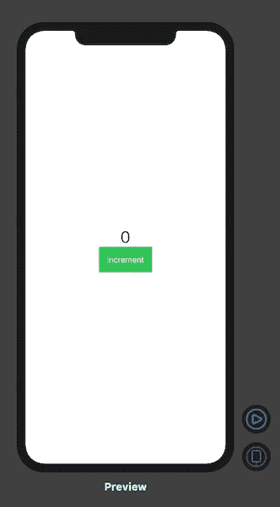
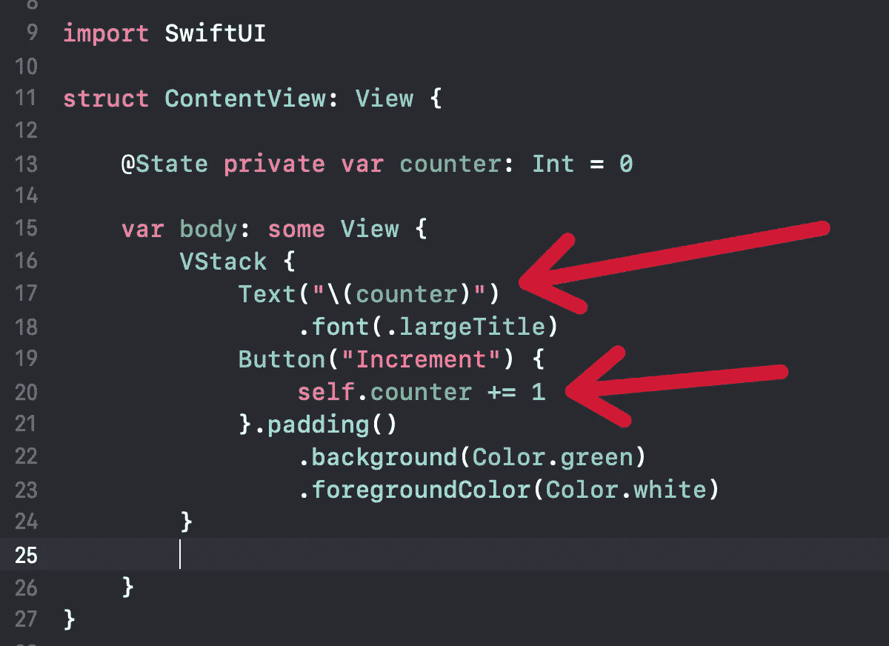
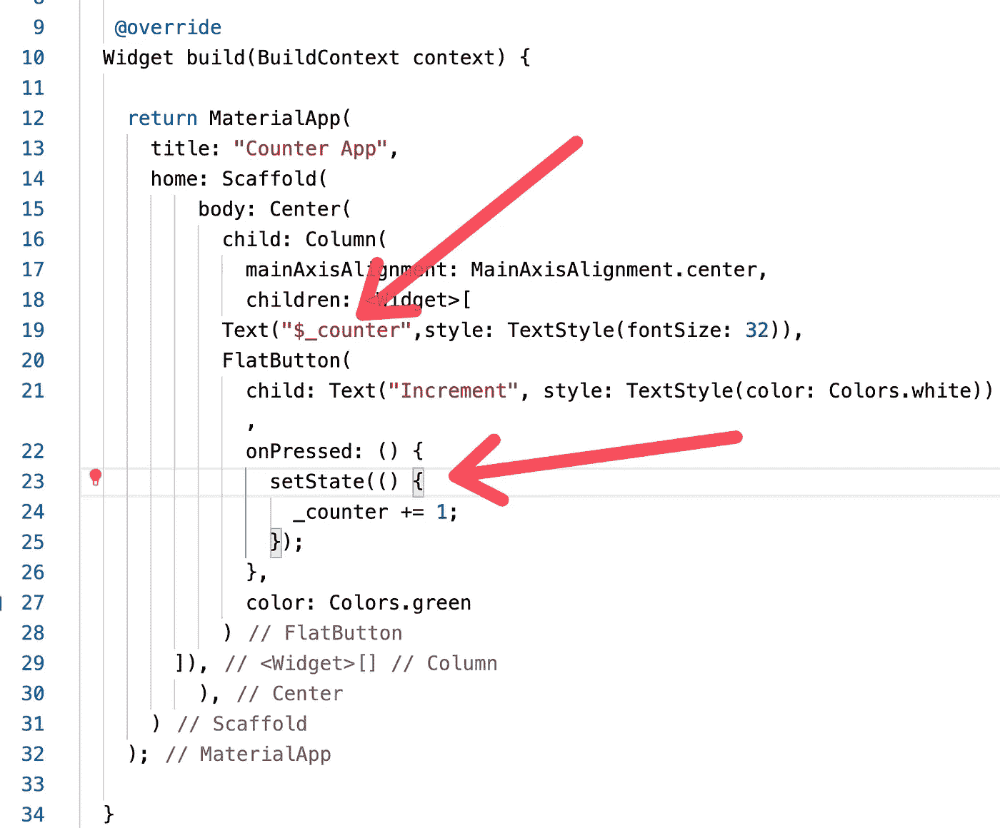

# SwiftUI 开发人员的困惑

> 原文：<https://betterprogramming.pub/flutter-for-swiftui-developers-3ee038ef1d4f>

## 比较构建移动应用程序的两种方法


作为一名编码训练营的讲师，我总是试图通过学习许多不同的框架来扩展我的范围。这不仅有助于教学，也有助于更详细地阐明概念。

2017 年第一次涉足 Flutter，发现和 React 和 React Native 很像。当苹果在 2019 年宣布 SwiftUI 框架时，我很惊讶地看到 SwiftUI 和 Flutter 的相似之处。我认为使用 SwiftUI 和 Flutter 框架构建一个非常简单的应用程序是一个很好的练习。在这篇文章中，我将在 Flutter 和 SwiftUI 中创建一个计数器应用程序来演示这两个框架之间的相似之处。

# 创建用户界面

我们将从实现应用程序的用户界面开始。用户界面将由一个按钮和一个文本标签组成。一旦用户按下按钮，计数器就会增加。

## 斯威夫特伊

SwiftUI 和 Flutter 的声明性质允许我们快速构建计数器用户界面。SwiftUI 实现如下所示:

结果如下所示:



相当简单！

## 摆动

创建计数器用户界面的代码在 Flutter 中并不那么简单，但请记住，Flutter 是一个跨平台的框架，这意味着它可以在 iOS、Android 甚至 web 上工作。

接下来，我们将了解如何在 SwiftUI 和 Flutter 中引入状态。状态的主要目的是维护 UI 呈现之间的计数器值。

# 介绍状态

## 斯威夫特伊

SwiftUI 提供了一种维护状态的简单方法。这是通过使用`@State`属性包装器完成的，如下面的实现所示:

```
@State private var counter: Int = 0
```

变量计数器现在将保持用户界面重建之间的值。`@State`不仅适用于隐式类型，也适用于类。

## 摆动

在 Flutter 中使用状态确实需要一些工作。您必须创建一个单独的类来维护状态，该类还将负责构建用户界面。实现如下所示:

`_AppState`阶层负责维护国家。我个人认为给小部件引入状态的工作量太大了。希望未来 Flutter 团队能让它成为基于属性的状态管理。

最后，让我们看看如何在 SwiftUI 和 Flutter 中递增计数器。

# 递增计数器

## 斯威夫特伊

我们简单地实现了按钮按下事件并更新了计数器值。一旦值被更新，它将再次呈现用户界面。这时我们在文本视图中注入新的计数器值。



## 摆动

我们在颤振中使用了非常相似的方法。`_counter`在`setState`闭包内递增。更新后，将再次启动构建函数来呈现用户界面。当时，我们在`Text`小部件中注入了`_counter`值。



# 结论

在这篇文章中，我们看了 SwiftUI 和 Flutter 之间的相似之处。这两个框架都受到 React 的启发，使用声明式方法而不是命令式方法。很高兴知道学习一个框架也会让你在学习其他框架时受益，但仍然有一个大问题:作为一名 SwiftUI 开发人员，你为什么要学习 Flutter？

我将在下一篇文章中回答这个问题。

# 资源

1.  [SwiftUI 官网](https://developer.apple.com/xcode/swiftui/)
2.  [颤振官网](https://flutter.dev)
3.  [swift ui——适用于任何苹果设备的声明式界面](https://www.udemy.com/course/swiftui-declarative-interfaces-for-any-apple-device/?referralCode=EB97896D293C976B3231)
4.  [终极手摇&MVVM——打造真实项目](https://www.udemy.com/course/flutter-dart-mvvm-design-pattern/?referralCode=3E32698D188E47553501)