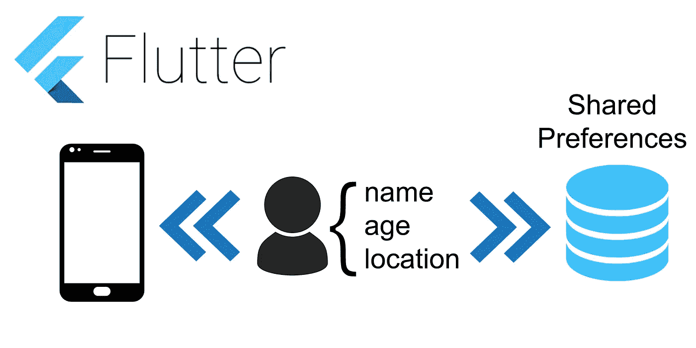
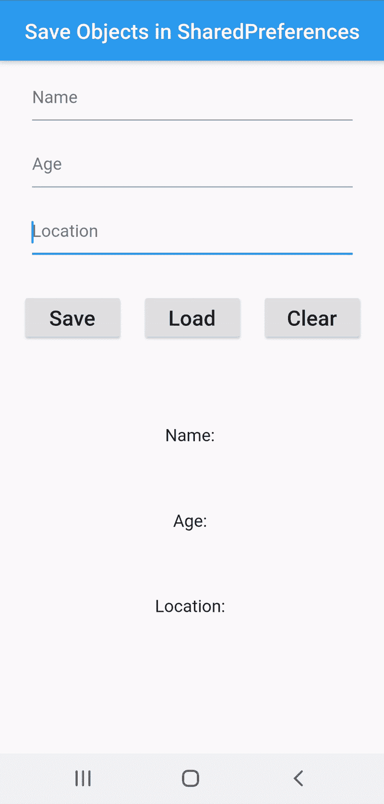

# Flutter:如何在 SharedPreferences 中保存对象

> 原文：<https://betterprogramming.pub/flutter-how-to-save-objects-in-sharedpreferences-b7880d0ee2e4>

## 少量数据的简单解决方案

开发移动应用程序时，您可能希望保存自定义对象以备后用，例如，在应用程序关闭时保存用户信息，并在稍后打开应用程序时使用它。

为此，我们将把我们的对象编码成一个 JSON 字符串，并保存在`SharedPreferences`空间中。当我们想要读取保存的数据时，我们只需要从 JSON 字符串解码回我们的对象。当您想要保存少量数据时，在`SharedPreferences`中保存数据是一个简单的解决方案。

# 创建自定义对象

对于我们的例子，我们将使用一个非常简单的对象来存储一些用户信息。

我们的对象将有三个属性:姓名、年龄**、**和位置；每一个都由一个字符串表示。

我们班真的很简单。在我们的例子中，它被初始化为一个具有空属性的对象，并且每一个属性都在后面被赋值。

# JSON:编码和解码

为了将我们的用户对象编码到 JSON 中，我们必须在类中创建一个函数来完成这种转换。它将创建一个映射，其中每个属性(值)对应一个键:

这将把我们的用户对象转换成一个`Map<String, dynamic>`。要将其转换成 JSON 字符串，我们稍后将不得不使用函数`json.encode(Map<String, dynamic>)`。这将把我们的用户对象转换成 JSON 字符串，如下所示:

`{“name”:“Alfonso”,“age”:“21”,“location”:“Portugal”}`

该字符串将保存在`SharedPreferences`中。

为了将 JSON 字符串解码成用户对象，我们必须首先使用函数`json.decode(JSON-String)`。这将返回一个`Map<String, dynamic>` ，然后我们可以将它转换成我们的用户对象:

因此，我们的用户类的最终代码将是:

# SharedPreferences:保存并阅读

首先，为了使用`SharedPreferences`，我们必须为它使用 [Flutter](https://flutter.dev/) 的[插件](https://pub.dev/packages/shared_preferences)。为此，请确保您的`pubspec.yaml` 文件中的`dependencies`看起来与此类似:

为了在`SharedPreferences`中保存一些东西，我们必须提供一个我们想要保存的值和一个标识它的键。

在我们的例子中，值将是一个字符串—键总是一个字符串。

我们首先要做的是`SharedPreferences`中的`getInstance`:

在这里，代码`await` 将暂停程序的执行，直到我们有了`SharedPreferences` 实例。如果你不是很了解*异步编程*，你可以在 [Dart](https://dart.dev/codelabs/async-await#execution-flow-with-async-and-await) 文档中了解更多。

有了`SharedPreferences`实例后，我们将希望保存带有给定键的字符串值:

记住，我们想要保存的值是一个定制对象，因此，我们需要将它编码成一个 JSON 字符串，如上所述。然后，代码变成:

我们的`save`功能是:

要特别注意这个函数是“异步”的。

读取(加载)功能类似于保存功能，其代码如下:

这里我们必须解码存储的字符串(JSON 字符串)。

之前，我们应该已经将用于管理`SharedPreferences` 的每个函数组织在一个名为`sharedPref.` 的类中，代码是:

还增加了“删除”功能。

# 演示:在应用程序中使用它

我们必须首先初始化我们的`sharedPref` 对象的一个实例，这个类将管理应用程序的`SharedPreferences`:

此后，在任何时候，我们都可以非常简单地将用户对象保存到我们的`SharedPreferences`中:

在实际应用中使用这种方法保存对象的棘手之处在于检索对象本身，而不是一个 `Future<Dynamic>`。诀窍是在我们的应用程序中有一个同步函数,它将检索我们的对象，并在准备就绪时更新应用程序的`state`。

该函数将类似于:

和以前一样，`await`将确保函数的执行处于暂停状态，直到我们从`SharedPreferences.`中检索到与键“user”相对应的值。之后，我们从检索到的 JSON 字符串中创建一个用户对象，并更新应用程序的`State`。

我创建了一个简单的演示应用程序来展示以上所有内容。下面是这款应用的 gif 图片:

这是代码:

这个项目的完整代码可以在这里找到:

 [## afonscoproso/save-shared preferences

### 此时您不能执行该操作。您已使用另一个标签页或窗口登录。您已在另一个选项卡中注销，或者…

github.com](https://github.com/Afonsocraposo/save-sharedpreferences)