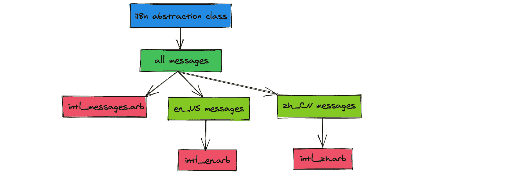
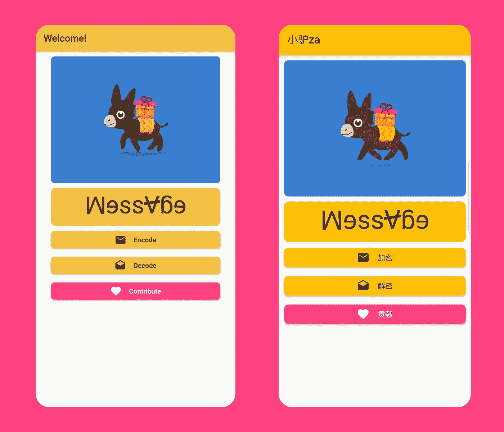

# 颤振国际化(i18n) 101

> 原文：<https://betterprogramming.pub/flutter-internationalization-i18n-101-8985259b735d>

## 详细的步骤和潜在的陷阱

照片由[汉娜·赖特](https://unsplash.com/@hannahwrightdesigner?utm_source=unsplash&utm_medium=referral&utm_content=creditCopyText)在 [Unsplash](https://unsplash.com/s/photos/languages?utm_source=unsplash&utm_medium=referral&utm_content=creditCopyText) 上拍摄

2020 年，随着中国和美国成为最大的智能手机市场，支持 i18n 对移动应用程序开发者来说变得至关重要。

我发现大多数关于 [Flutter i18n](https://flutter.dev/docs/development/accessibility-and-localization/internationalization) 的教程都遗漏了说明和详细步骤，让人很难理解。

在努力将 i18n 支持集成到我的 Flutter 应用程序中几天后，我决定写一个循序渐进的教程，试图澄清所有的设计决策。

# 属国

*   是支持 i18n 的 Flutter 框架，它为我们的 i18n 实现提供了一个 API。
*   `intl`是一个写 i18n 抽象接口的框架。
*   `intl_translation`是一个用于 i18n 代码数据分离的 CLI，从数据文件中生成代码，从代码中提取数据文件。

# 目标

i18n 的目标是:

*   将消息从 UI 中分离出来，让前端开发者不需要接触 i18n 相关代码。
*   将数据和代码分开，这样翻译人员就不需要接触代码了。

# 结构

为了实现这一目标，我们需要:

*   一个从其他 UI 代码中抽象出 i18n 的`dart`接口。
*   数据文件，`JSON`像`arb`文件，用于翻译。
*   每个本地化版本的实现。
*   将数据文件转换为本地化实现的转换器。

信用:[迷你驴](https://medium.com/minidonkey101)

# 让我们一步一步地构建 i18n

最终结果一瞥:

信用:[迷你驴](https://medium.com/minidonkey101)

我借用了 [Mini Donkey](https://medium.com/minidonkey101) 的代码，这是一款使用加密隐写术来保护社交媒体隐私的应用。如果您对源代码感兴趣，请查看:

 [## 天昊 95/照片

### 迷你驴携带加密(AES)和隐写术(的技术)安全和秘密的私人信息

github.com](https://github.com/tianhaoz95/photochat) 

# 第一步。安装依赖项

我们首先需要安装三个软件包:

如果你的 IDE 没有为你做这件事，那么之后再做一件。

# 第二步。编写一个存根接口

这里有一个来自 Flutter 文档的 i18n 接口存根，它应该足以满足 90%的用例:

对于使用未定义方法的存根接口，您可能会感到有悖常理。

不用担心，第 6 步会从数据文件中生成缺失的方法。

# 第三步。从存根接口生成数据文件

`intl_translation`收集来自接口的`intl`消息，并生成相应的数据文件；

# 第四步。翻译生成的数据文件

每个数据文件代表一个地区。我们可以通过添加新的数据文件来添加新的语言环境:

# 第五步。从数据文件生成接口实现

翻译完数据文件后，我们可以使用以下代码生成代码:

# 第六步。增强界面

既然接口的实现已经增强了语言环境，我们需要在`i18n.dart`中向接口添加方法来使用它们:

请注意，方法的名称必须与消息 ID 相同，在本例中是“title”。

# 第七步。将接口和实现注入 Material 应用程序

几乎所有 Flutter 应用都使用的[材质应用](https://api.flutter.dev/flutter/material/MaterialApp-class.html)为我们注入 i18n 接口提供了一个简洁的接口:

# 第八步。在材料应用程序中使用本地化信息

以下是如何在应用程序中使用本地化信息的示例:

万岁！用 i18n 黑客快乐！