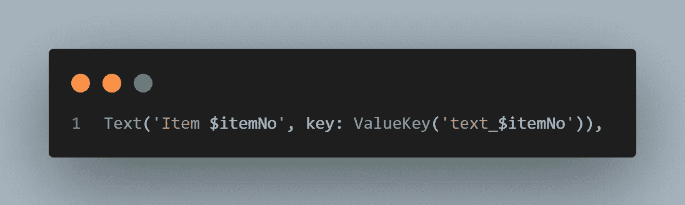
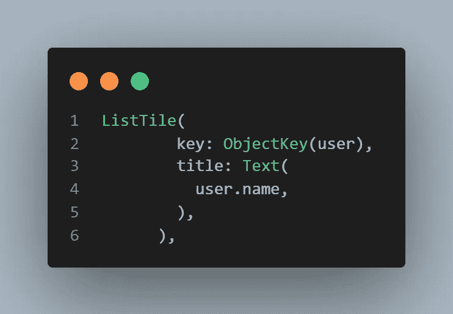
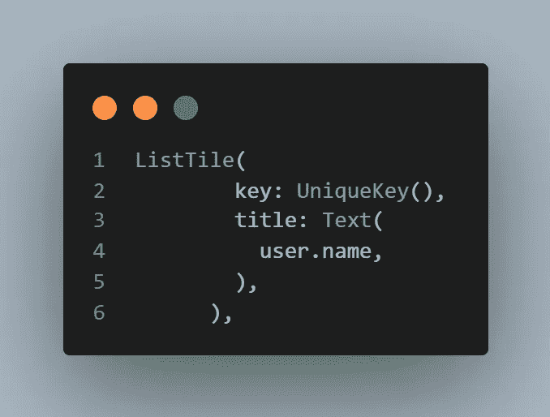

# 颤振键:为什么，什么时候，以及如何去做

> 原文：<https://betterprogramming.pub/flutter-keys-the-why-when-and-how-to-go-about-them-85f12a5a0445>

## 了解钥匙的类型以及如何使用它们

安吉拉·梅伦科娃在 [Unsplash](https://unsplash.com?utm_source=medium&utm_medium=referral) 上的照片

抖动键是一个经常被忽视的概念，直到你的数据显示出现问题。本文包含一些简短的参考注释，我用它们来实现这个概念并修复那些奇怪的错误。

## **什么时候？**

当我们修改保存某种状态的同类型小部件的集合时，经常会用到键。大多数时候，我们将它们应用于数据不断变化的小部件子部件，如 Listview 或有状态小部件。

## **为什么？**

关键的概念是 flutters 的方式来保存对状态的引用，并在不同的时间访问状态，或者在修改小部件树时维护它。

Flutter 会在重新渲染之前检查之前的状态，如果之前的小部件与新的小部件是同一类型的，那么它将保持原来的状态。

如果数据正在变化，我们不希望这样，因为 flutter 仍将引用旧数据。因此，我们需要键来惟一地标识小部件。这是因为一个新的小部件将有一个不同于前一个的密钥，因此旧的被销毁。

## **按键类型**

1.  `Valuekey`
2.  `Objectkey`
3.  `Uniquekey`
4.  `Globalkey`

## **数值键**

通常用在子列表中，其中每个子列表的值都是唯一且不变的。

## **对象键**

与`valuekey`相同，唯一的区别是它接受一个保存数据的类对象。

## **唯一键**

在孩子没有唯一值或根本没有值的情况下，`Uniquekey`用于标识每个孩子。

## **全局密钥**

这是有争议的一个。这把钥匙有可能打开所有的门，但也可能破坏所有的锁。

全局键可以用来从窗口小部件树中的任何地方访问另一个窗口小部件的状态，但是它是昂贵的，并且有更好的方法来这样做，例如提供者、继承的窗口小部件等。

但是它确实有一些好的和有效的用例，比如表单验证。当分配给一个表单时，用户可以访问`FormStates`公共函数和变量，并相应地使用它们。

为了使用它，小部件被分配密钥必须是有状态的，并且它的状态是公共的。没有下划线，你只能访问公共变量

钥匙到此为止。现在走出去，继续释放你的潜力。