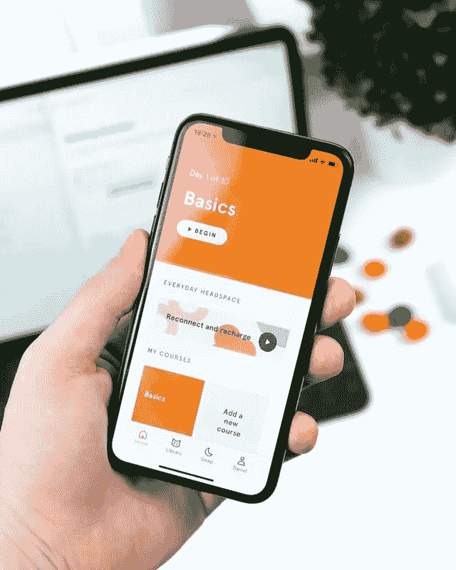
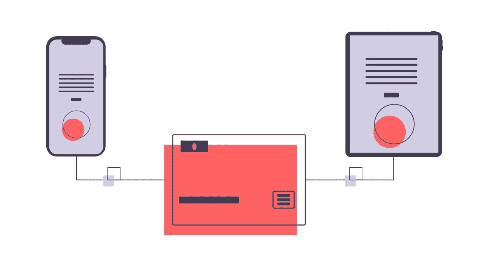
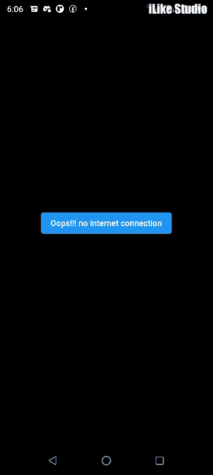

# 使用 TVmaze API 构建电影列表 Flutter 应用程序

> 原文：<https://betterprogramming.pub/flutter-network-request-movie-info-app-453b494c93c6>

## 颤动网络请求



# 信息应用

# 介绍

用最少的代码构建漂亮的应用程序是使用 Flutter 框架的最大优势之一。在制作应用程序的时候，我们必须与来自后端或数据库的数据进行交互。我们与这些数据交互的方式之一是通过 API。

# 什么是 API

API 是应用编程接口的缩写。API 允许两个软件产品之间的数据传输。它还规定了这种沟通的条款。我们使用的大多数移动应用程序通常与 API 通信，以提供良好的用户体验。让我们深入研究一下这个应用程序。



# 先决条件

为了遵循本教程，您必须安装 Flutter 2.10 或更高版本的 android studio，并设置必要的环境来运行您的 Flutter 应用程序。

我使用 VS 代码作为我的 IDE，因为它是轻量级的，尽管你可以使用 Android Studio 或 IntelliJ IDE 来编写你的代码。只要确保你已经安装了 Dart 和 Flutter 插件。有关如何安装的分步说明，请根据您的操作系统单击下面的链接。

*   [视窗](https://www.geeksforgeeks.org/how-to-install-flutter-on-windows/)
*   [苹果电脑](https://www.geeksforgeeks.org/flutter-installation-on-macos/)
*   [Linux](https://www.geeksforgeeks.org/how-to-install-flutter-on-linux/)

# 关于应用程序

我们将建立一个显示剧集和其他有用数据的电影系列应用程序。该系列是使用 tvmaze api 的流行 flash 系列。我们使用这个 API 是因为它是免费和开源的，不需要任何 API 密匙。要了解关于这个 API 的更多信息，请单击下面的任何链接。

**注意:在构建这个应用程序的最后，我们可以更改我们的 TVmaze URL 端点，仍然可以获得其他电影应用程序，因为它们都是相似的**

*   [TVmaze](https://api.tvmaze.com/)
*   [API 端点](https://api.tvmaze.com/singlesearch/shows?q=flash&embed=episodes)

# 构建应用程序

作为移动应用程序开发人员，我们的主要关注点是尽可能快地使用最佳实践编写经过良好测试的应用程序。大多数时候，编写应用程序需要在 google、stackoverflow 和其他开发者论坛上搜索现有的解决方案。有时我们甚至使用在线工具来加快我们的应用程序开发过程。

# 我们开始吧

我将这个应用命名为`flash_app`。在您的终端中运行代码:

```
flutter create flash_app
```

如果您使用 Vscode 作为您的 IDE，您可以执行以下操作，在 visual studio 代码中快速打开您的文件夹。

```
C:\app\app2>cd flash_appC:\app\app2\flash_app>code .
```

如果您想看看 JSON 数据是什么样子，单击这个 API [端点](https://api.tvmaze.com/singlesearch/shows?q=flash&embed=episodes)，它会向您显示原始的 API 数据。你可以复制所有的 JSON 数据，然后点击 [JSON 格式化器](https://jsonformatter.org/)。然后粘贴 JSON 文件。这将帮助我们了解我们要创建的模型的类型，并获得我们数据的总体视图，并决定我们将在应用程序中使用哪些数据。

为了序列化我们的 JSON 数据，有很多网站可以帮助我们。但是我们将使用 Javier Lecuona 的这个站点，因为它为我们生成了一个非常简单的 dart 模型。虽然我们没有使用所有返回的数据。

*注意:序列化 JSON 数据决定了与 API 数据交互的难易程度。在这个阶段简化 JSON 将有助于您快速工作。*

应用我们在报价应用程序中使用的相同文件夹结构，在 lib 文件夹中创建模型、屏幕和服务文件夹。不需要为存储图像创建资产文件夹，因为我们将从网络请求中获取它们。在 models 文件夹中创建一个`models.dart`文件。复制您生成的 dart 并粘贴到`models.dart` 文件中。然后删除必要的数据。删除所有 toJson 方法，因为我们只从 API 中获取数据，而不发布数据。格式化后，我只剩下数据:

```
class Flash {
  String? name;
  int? runtime;ModelImage? image;
  String? summary;
  Embedded? eEmbedded;Flash({
    this.name,
    this.runtime,
    this.image,
    this.summary,
    this.eEmbedded,
  });Flash.fromJson(Map<String, dynamic> json) {
    name = json['name'];
    runtime = json['runtime'];
    image = json['image'] != null ? ModelImage.fromJson(json['image']) : null;
    summary = json['summary'];
    eEmbedded =
        json['_embedded'] != null ? Embedded.fromJson(json['_embedded']) : null;
  }
}class ModelImage {
  String? medium;
  String? original;ModelImage({this.medium, this.original});ModelImage.fromJson(Map<String, dynamic> json) {
    medium = json['medium'];
    original = json['original'];
  }
}class Embedded {
  List<Episodes>? episodes;Embedded({this.episodes});Embedded.fromJson(Map<String, dynamic> json) {
    if (json['episodes'] != null) {
      episodes = <Episodes>[];
      json['episodes'].forEach((v) {
        episodes!.add(Episodes.fromJson(v));
      });
    }
  }
}class Episodes {
  String? name;
  int? season;
  int? number;
  int? runtime;
  ModelImage? image;
  String? summary;Episodes({
    this.name,
    this.season,
    this.number,
    this.runtime,
    this.image,
    this.summary,
  });Episodes.fromJson(Map<String, dynamic> json) {
    name = json['name'];
    season = json["season"];
    number = json['number'];
    runtime = json['runtime'];
    image = json['image'] != null ? ModelImage.fromJson(json['image']) : null;
    summary = json['summary'];
  }
}
```

然后创建我们的`HomeScreen`并添加一个脚手架:

```
import 'package:flutter/material.dart';class HomeScreen extends StatelessWidget {
  const HomeScreen({Key? key}) : super(key: key);[@override](http://twitter.com/override)
  Widget build(BuildContext context) {
    return Scaffold(
      appBar: AppBar(),
    );
  }
}
```

然后在我们的`main.dart`(这是我们应用程序的根)文件中导入`HomeScreen`，并在`MaterialApp`小部件的 home 小部件中添加`HomeScreen`。同样，将`debugShowCheckedModeBanner`设置为`false`。

```
import 'package:flash_app/screens/screens.dart';
import 'package:flutter/material.dart';void main() {
  runApp(const MyApp());
}class MyApp extends StatelessWidget {
  const MyApp({Key? key}) : super(key: key);// This widget is the root of your application.
  [@override](http://twitter.com/override)
  Widget build(BuildContext context) {
    return MaterialApp(
      debugShowCheckedModeBanner: false,
      title: 'Flutter Demo',
      theme: ThemeData(
        primarySwatch: Colors.blue,
      ),
      home: const HomeScreen(),
    );
  }
}
```

接下来，我们在`services.dart`中创建我们的 API 服务。

我们创建一个带有异步函数的类，该函数返回一个`Flash?`的`Future`。回想一下，这使得我们的数据类型可以为空。

对于我们的 API 调用，我们使用 HTTP 包。去 pub.dev 搜索 http。然后将最新版本复制到您的`pubspec.yaml`文件中，并运行 flutter pub get。在写这篇文章的时候，^0.13.4 是最新的版本。然后在`sevices.dart`文件中导入`http`包，用它从 API 获取数据，然后解码响应并将响应映射到您的模型文件。参见下面的代码

```
http: ^0.13.4import 'dart:convert';import 'package:flash_app/models/models.dart';
import 'package:http/http.dart' as http;class ApiServices {
  Future<Flash?> getMovies() async {
    var url = Uri.parse(
        "[https://api.tvmaze.com/singlesearch/shows?q=flash&embed=episodes](https://api.tvmaze.com/singlesearch/shows?q=flash&embed=episodes)");
    var response = await http.get(url);
    if (response.statusCode == 200) {
      var result = response.body;
      var decodedRes = jsonDecode(result);
      return Flash.fromJson(decodedRes);
    } else {
      return null;
    }
  }
}
```

让我们在我们的主屏幕上工作。我们的主屏幕是一个有状态的小部件，我们返回一个`futurebuilder`,它获取我们在 APiServices 类中创建的未来。然后，我们使用 switch、case 和 default 语句来检查我们与 tvMaze api 的连接状态。如果连接成功，我们的数据就会显示出来。如果不是，则传递一个提升的按钮。

```
import 'package:flash_app/models/models.dart';
import 'package:flash_app/services/services.dart';
import 'package:flutter/material.dart';class HomeScreen extends StatefulWidget {
  const HomeScreen({Key? key}) : super(key: key);[@override](http://twitter.com/override)
  State<HomeScreen> createState() => _HomeScreenState();
}class _HomeScreenState extends State<HomeScreen> {
  [@override](http://twitter.com/override)
  Widget build(BuildContext context) {
    return FutureBuilder(
      future: ApiServices().getMovies(),
      builder: (context, snapshot) {
        switch (snapshot.connectionState) {
          case ConnectionState.waiting:
            return const Center(
              child: CircularProgressIndicator(),
            );
          default:
            if (snapshot.hasError) {
              return Center(
                child: ElevatedButton(
                  onPressed: () {},
                  child: const Text("Oops!!! no internet connection"),
                ),
              );
            } else {
              final series = snapshot.data as Flash;
              return Padding(
                padding: const EdgeInsets.all(8.0),
                child: Container(
                    decoration: BoxDecoration(
                      image: DecorationImage(
                        image: NetworkImage(series.image!.original.toString()),
                        fit: BoxFit.cover,
                      ),
                    ),
                    child: SingleChildScrollView(
                      child: Center(
                        child: Card(
                          elevation: 5,
                          margin: const EdgeInsets.symmetric(
                              horizontal: 10, vertical: 6),
                          color: Colors.transparent,
                          child: Column(
                            crossAxisAlignment: CrossAxisAlignment.center,
                            mainAxisAlignment: MainAxisAlignment.start,
                            children: [
                              const SizedBox(
                                height: 70,
                              ),
                              Text(
                                series.name.toString(),
                                style: const TextStyle(
                                  color: Colors.black,
                                  fontSize: 30,
                                  fontWeight: FontWeight.w900,
                                ),
                              ),
                              const SizedBox(
                                height: 20,
                              ),
                              Text(
                                series.summary.toString(),
                                style: const TextStyle(
                                    color: Colors.white,
                                    fontSize: 20,
                                    fontWeight: FontWeight.w300),
                              ),
                              ElevatedButton(
                                onPressed: () {},
                                child: const Text('Episodes'),
                              )
                            ],
                          ),
                        ),
                      ),
                    )),
              );
            }
        }
      },
    );
  }
}
```

然后，我们创建下一个屏幕，即剧集屏幕。这是向我们展示 Gridview 格式的剧集列表。

它接受三个变量`episodes`、`images`和`_context`，如下面的代码所示。当点击任何`gridview.builder`项时，调用`summary()`函数，返回该集的`showdialog`和`summary`。

```
import 'package:flash_app/models/models.dart';
import 'package:flutter/material.dart';class EpisodesScreen extends StatelessWidget {
  final List<Episodes> episodes;
  final ModelImage images;
  late BuildContext _context;
  EpisodesScreen({
    Key? key,
    required this.episodes,
    required this.images,
  }) : super(key: key);
//Dialog for displaying summary
  summary(String? summary) {
    showDialog(
        context: _context,
        builder: (context) => Center(
              child: Padding(
                padding: const EdgeInsets.all(12.0),
                child: Card(
                  color: Colors.red.withOpacity(0.8),
                  child: Padding(
                    padding: const EdgeInsets.all(12.0),
                    child: Text(
                      summary.toString(),
                      style: const TextStyle(
                          color: Colors.white,
                          fontSize: 16,
                          fontWeight: FontWeight.w600),
                    ),
                  ),
                ),
              ),
            ));
  }[@override](http://twitter.com/override)
  Widget build(BuildContext context) {
    _context = context;
    return Scaffold(
      extendBodyBehindAppBar: true,
      appBar: AppBar(
        title: const Text("Flash Episodes"),
        centerTitle: true,
        backgroundColor: const Color.fromARGB(158, 214, 22, 22),
        elevation: 0,
      ),
      body: Container(
        decoration: BoxDecoration(
          image: DecorationImage(
            image: NetworkImage(images.original.toString()),
            fit: BoxFit.cover,
          ),
        ),
        child: Padding(
          padding: const EdgeInsets.all(8.0),
          child: GridView.builder(
              gridDelegate: const SliverGridDelegateWithFixedCrossAxisCount(
                crossAxisCount: 2,
                childAspectRatio: 1.0,
              ),
              itemCount: episodes.length,
              itemBuilder: (context, index) => InkWell(
                    onTap: () {
                      summary(episodes[index].summary);
                    },
                    child: Card(
                      child: Stack(
                        fit: StackFit.expand,
                        children: [
                          Image.network(
                            episodes[index].image!.original!,
                            fit: BoxFit.cover,
                          ),
                          Padding(
                            padding: const EdgeInsets.all(8.0),
                            child: Column(
                              mainAxisAlignment: MainAxisAlignment.end,
                              children: [
                                Text(
                                  episodes[index].name!,
                                  style: const TextStyle(
                                      fontWeight: FontWeight.bold,
                                      color: Colors.white,
                                      fontSize: 15.0),
                                )
                              ],
                            ),
                          ),
                          Positioned(
                            top: 0.0,
                            left: 0.0,
                            child: Padding(
                              padding:
                                  const EdgeInsets.symmetric(horizontal: 10),
                              child: Row(
                                crossAxisAlignment: CrossAxisAlignment.start,
                                mainAxisSize: MainAxisSize.max,
                                mainAxisAlignment: MainAxisAlignment.center,
                                children: [
                                  Container(
                                    color: Colors.black,
                                    child: Text(
                                      " Season ${episodes[index].season.toString()}",
                                      style: const TextStyle(
                                        color: Colors.white,
                                        fontSize: 15,
                                        fontWeight: FontWeight.bold,
                                      ),
                                    ),
                                  ),
                                  Container(
                                    color: Colors.red,
                                    child: Text(
                                      " Episode ${episodes[index].number.toString()}",
                                      style: const TextStyle(
                                        color: Colors.white,
                                        fontSize: 15,
                                        fontWeight: FontWeight.bold,
                                      ),
                                    ),
                                  ),
                                ],
                              ),
                            ),
                          )
                        ],
                      ),
                    ),
                  )),
        ),
      ),
    );
  }
}
```

接下来，我们从主页添加`Navigation`到剧集页面，然后添加`setstate(){}`函数来重新加载我们的应用程序。主屏幕的最后代码是

```
import 'package:flash_app/models/models.dart';
import 'package:flash_app/screens/episodes.dart';
import 'package:flash_app/services/services.dart';
import 'package:flutter/material.dart';class HomeScreen extends StatefulWidget {
  const HomeScreen({Key? key}) : super(key: key);[@override](http://twitter.com/override)
  State<HomeScreen> createState() => _HomeScreenState();
}class _HomeScreenState extends State<HomeScreen> {
  [@override](http://twitter.com/override)
  Widget build(BuildContext context) {
    return FutureBuilder(
      future: ApiServices().getMovies(),
      builder: (context, snapshot) {
        switch (snapshot.connectionState) {
          case ConnectionState.waiting:
            return const Center(
              child: CircularProgressIndicator(),
            );
          default:
            if (snapshot.hasError) {
              return Center(
                child: ElevatedButton(
                  onPressed: () {
                    setState(() {
                      snapshot.hasData;
                    });
                  },
                  child: const Text("Oops!!! no internet connection"),
                ),
              );
            } else {
              final series = snapshot.data as Flash;
              return Padding(
                padding: const EdgeInsets.all(8.0),
                child: Container(
                    decoration: BoxDecoration(
                      image: DecorationImage(
                        image: NetworkImage(series.image!.original.toString()),
                        fit: BoxFit.cover,
                      ),
                    ),
                    child: SingleChildScrollView(
                      child: Center(
                        child: Card(
                          elevation: 5,
                          margin: const EdgeInsets.symmetric(
                              horizontal: 10, vertical: 6),
                          color: Colors.transparent,
                          child: Column(
                            crossAxisAlignment: CrossAxisAlignment.center,
                            mainAxisAlignment: MainAxisAlignment.start,
                            children: [
                              const SizedBox(
                                height: 70,
                              ),
                              Text(
                                series.name.toString(),
                                style: const TextStyle(
                                  color: Colors.black,
                                  fontSize: 30,
                                  fontWeight: FontWeight.w900,
                                ),
                              ),
                              const SizedBox(
                                height: 20,
                              ),
                              Text(
                                series.summary.toString(),
                                style: const TextStyle(
                                    color: Colors.white,
                                    fontSize: 20,
                                    fontWeight: FontWeight.w300),
                              ),
                              ElevatedButton(
                                onPressed: () {
                                  Navigator.push(
                                    context,
                                    MaterialPageRoute(
                                      builder: ((context) => EpisodesScreen(
                                            episodes:
                                                series.eEmbedded!.episodes!,
                                            images: series.image!,
                                          )),
                                    ),
                                  );
                                },
                                child: const Text('Episodes'),
                              )
                            ],
                          ),
                        ),
                      ),
                    )),
              );
            }
        }
      },
    );
  }
}
```

瞧，您可以运行您的应用程序并查看您的 flash 系列应用程序。



# 摘要

在本文中，我们看到了如何用`http.get`发出简单的网络请求以及其他有趣的事情。关于这个应用需要注意的一个关键点是，它也可以用于其他 TVmaze 系列，只需改变 API 电影标题即可

```
“[https://api.tvmaze.com/singlesearch/shows?q=flash&embed=episodes](https://api.tvmaze.com/singlesearch/shows?q=flash&embed=episodes)you can change flash to any other movie included in the tvmaze API and get your app which is similar to what we did.
let’s try changing the url of our Apiservices() class in services.dart with any of this url and run our app
```

让我们尝试用这些 URL 中的任何一个来更改`services.dart`中的`Apiservices()`类的 URL，并运行我们的应用程序:

```
https://api.tvmaze.com/singlesearch/shows?q=girls&embed=episodes https://api.tvmaze.com/singlesearch/shows?q=orville&embed=episodes https://api.tvmaze.com/singlesearch/shows?q=boys&embed=episodes https://api.tvmaze.com/singlesearch/shows?q=24&embed=episodes https://api.tvmaze.com/singlesearch/shows?q=superman&embed=episodes https://api.tvmaze.com/singlesearch/shows?q=naruto&embed=episodes https://api.tvmaze.com/singlesearch/shows?q=avatar&embed=episodes
```

看这里的例子我改成了火影忍者动漫 api 端点:

```
class ApiServices {
  Future<Flash?> getMovies() async {
    var url = Uri.parse(
        "[https://api.tvmaze.com/singlesearch/shows?q=naruto&embed=episodes](https://api.tvmaze.com/singlesearch/shows?q=naruto&embed=episodes)");
    var response = await http.get(url);
    if (response.statusCode == 200) {
      var result = response.body;
      var decodedRes = jsonDecode(result);
      return Flash.fromJson(decodedRes);
    } else {
      return null;
    }
  }
}
```

# 最后一个音符

因此，有了这个应用程序教程，您可以使用`tvmaze`端点创建任何系列摘要应用程序，因为它们有相似的 JSON 响应格式，因此也有相似的模型。

根据你的时间，你可以查看所有你喜欢的电视剧的电视迷宫，并为它们开发一个应用程序，你可以在代码工作上与我分享

在我们的下一篇文章中，您将看到当有一个 API 键时如何发出请求。

源代码在 GitHub repo 中:

[](https://github.com/Obikwelu/flashapp) [## GitHub - Obikwelu/flashapp

### 一个新的颤振项目。这个项目是颤振应用的起点。一些帮助您入门的资源…

github.com](https://github.com/Obikwelu/flashapp) 

```
**Want to Connect?**This article is also published at [codenjobs.com](https://www.codenjobs.com/) .
```