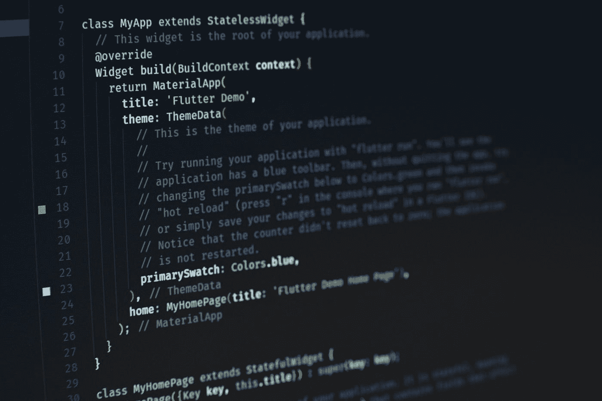
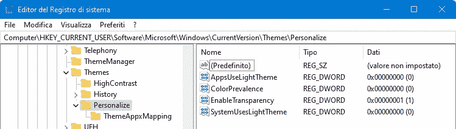
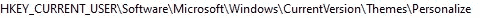
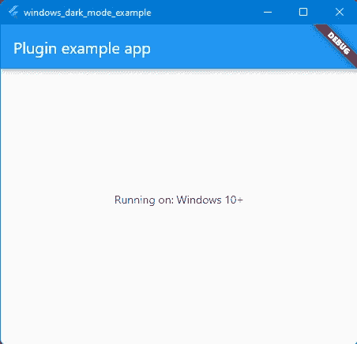
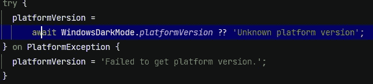
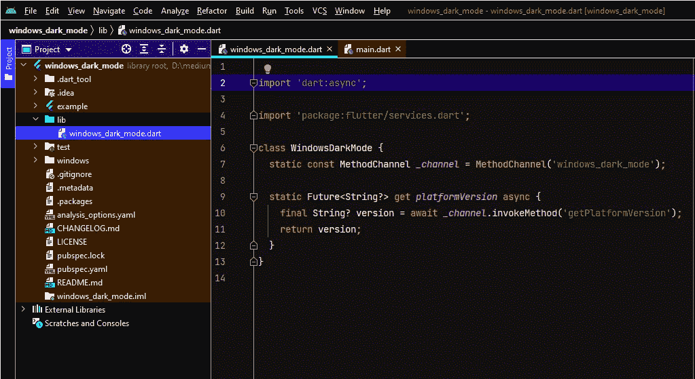
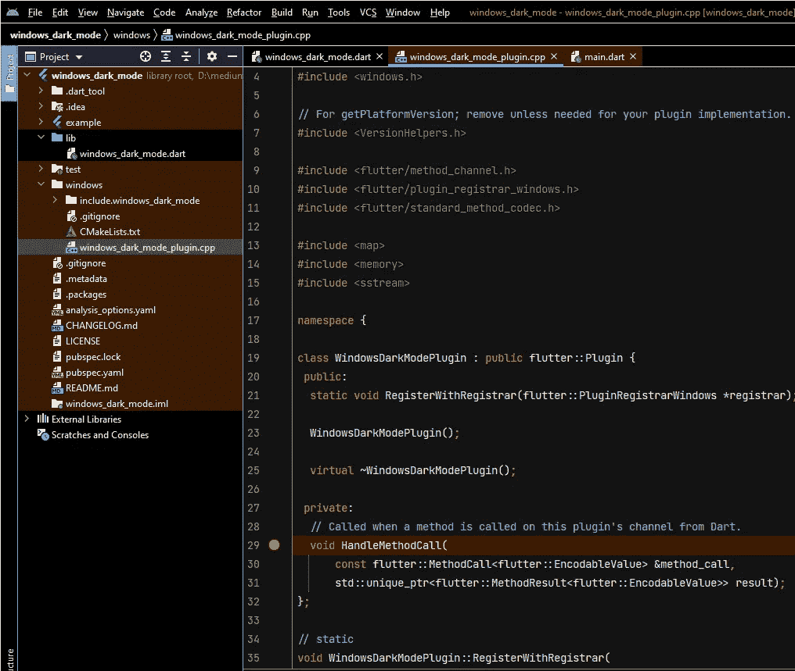
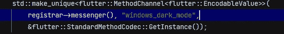
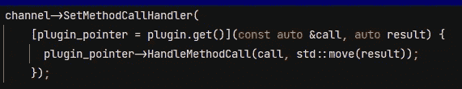

# 创建一个 Flutter 插件，为 Windows 编写特定于平台的代码

> 原文：<https://betterprogramming.pub/flutter-platform-plugin-windows-1-8b7c0a96fac4>

## 通过编写您的 Flutter 桌面应用程序来利用 Windows 特有的功能



桑杰·梅赫拉在 [Unsplash](https://unsplash.com?utm_source=medium&utm_medium=referral) 上的照片

*剧情简介:*学习在插件中使用*平台通道*从 Flutter 调用 Windows API。该示例显示了如何从 Windows 注册表中获取信息。

# 介绍

Flutter 是一个非常棒的工具，它让我们可以编写可以在越来越多的不同平台上编译和发布的应用程序。为了做到这一点，Flutter 通过从我们的角度完全抽象出操作系统或硬件层来工作。

因此，当开发我们的应用程序时，我们只“看到”Flutter APIs，我们不能包含汇编代码，使用 dll，调用 OS APIs，等等。该引擎控制着一切，当然，它有许多与屏幕和输入交互的功能，用于访问存储、网络和所有支持平台之间的其他通用功能。但其他一些东西并不是现成的，比如定位服务、运动传感器、蓝牙等。

当我们想把一个只写了一次的应用程序发布到每一个可用的平台上时，这是一个公平的价格，但是如果我们想要更多的目标操作系统可以提供给我们的东西，会发生什么呢？或者我们是否会访问特定的硬件或库？
在大多数情况下什么都没有，我们被覆盖了:在 [pub.dev](https://pub.dev/) 或 [Github](https://github.com/) 上搜索，我们会找到一个会给我们所需要的东西的包，有人已经为我们解决了那个问题。但是有时我们需要更多，或者我们不想只为一个 Win32 调用依赖一个巨大的包。

# **可能的解决方案**

Flutter 提供了两种方法来让我们的应用开箱即用:

*   [dart:ffi](https://dart.dev/guides/libraries/c-interop) ，是一个[外来函数接口](https://en.wikipedia.org/wiki/Foreign_function_interface)库，“调用原生 C APIs，对原生内存进行读写、分配、解除分配”(来自 dart.dev)。仅使用 Dart 语言，它允许我们编写 Dart 代码而不是 C 来调用外部库。然而，dart 代码在管理内存和变量、调用外部函数等方面与 C 代码相似..它也适用于纯 Dart 程序，没有抖动。
*   [插件](https://docs.flutter.dev/development/packages-and-plugins/developing-packages)，使用 Flutter 的[平台通道](https://docs.flutter.dev/development/platform-integration/platform-channels)，**这就是我们将在本教程中看到的。**

插件是“一个专门的 Dart 包，它包含一个用 Dart 代码编写的 API 以及一个或多个特定于平台的实现”。让我们看看它是如何工作的。

> 如果有时这个教程对飞镖/颤振专家来说很无聊，我提前道歉，但这也是初学者学习的机会。

# *例子:我们想要什么*

假设我们想知道在 Windows 中是否激活了黑暗模式，在 Flutter 中似乎很容易，我们可以读取 *MediaQuery* 对象的`platformBrightness`属性:

```
MediaQuery.of(context).platformBrightness
```

这看起来很容易，不是吗？该属性可以采用两个值之一:*暗*或*亮。* 但是有一个问题:要得到一个`MediaQuery`对象，我们必须使用*。服务定位器，它在窗口小部件树中查找实例化的服务定位器。所以我们有两个约束:我们需要一个上下文来向上搜索，并且这个上下文必须在他的父行中有一个`MediaQuery`。首先满足这些先决条件的地方是在`MaterialApp`(或者 Cupertino，Fluent 等。)子上下文。
假设出于某种原因我们需要知道黑暗模式是在 `MateralApp`正在构建之前**设置的，还是在构建之外(进入`Run()`方法？服役吗？一起吗？在供应商那里？)在这种情况下，我们必须找到另一种方法，我们必须偷偷离开 Flutter 让我们呆在里面的盒子。***

# 我们必须在哪里得到它

我们正在学习，所以在这个例子中，我们将抛开其他现成的解决方案(是的，有相应的包)并找到自己的方法。

在谷歌上快速搜索，我们发现当前的主题设置在 Windows 注册表中:



Windows 注册表编辑器

我们看到我们的设计值由`*AppUseLightTheme*` valueName 标识，它位于键:



# 如何获得(差不多)

要获得这个值，我们需要查询 Win32 API，如下所示:

我是一个栈溢出忍者(在借用代码中)，所以来自这里的。

好了，现在我们知道了地点和方法，让我们开始:

# 实施

在 Windows 命令提示符下，将 *cd* 放到我们要创建插件的文件夹中，并:

```
flutter create --org it.example --template=plugin --platforms=windows windows_dark_mode
```

假设 Flutter SDK 已经正确安装和配置，我们将获得一个新的“windows_dark_mode”文件夹，其中包含我们的插件存根。让我们用 IDE 打开这个项目，然后选择“windows”作为目标，点击“运行”或“调试”，这将运行 Flutter 在我们的包的子文件夹中为我们创建的示例项目:



它描述了我们的 Windows 版本，它是如何工作的？如果我们在“\example\lib\main.dart”中查找，我们会在 InitState 中找到以下内容:



通过访问该属性，我们可以从操作系统中获得平台版本。我们打开/lib/windows_dark_mode.dart:



我们在这里找到了我们的`WindowsDarkMode`类和`platformVersion` getter。这里没有 C 语言或 Win32 API 的痕迹，所以让我们试着去理解。这就是我们所看到的:

1.  我们的示例应用程序从`*platformVersion*`属性中检索 Windows 版本；
2.  该属性的 getter 依次调用 `*_channel*`对象上的`*invokeMethod*` *，在调用中指定“getPlatformVersion”；*
3.  *_channel* 声明为`[*MethodChannel*](https://api.flutter.dev/flutter/services/MethodChannel-class.html)`，实例化为“windows_dark_mode”通道名。

给定这些线索，我们可以假设当从*命名通道调用*命名方法*时，*这个请求到达某个地方，我们将从同一个地方收到答案。

> 等等，我们已经看到了，调用远程 API 是我们的日常工作！
> 
> 克拉罗阙司！我们从“后端”调用 API，`MethodChannel`是我们的传输。这就是[平台通道](https://docs.flutter.dev/development/platform-integration/platform-channels)的工作方式，我们在 Dart 端有一个代理 Api，它调用平台端的另一个 API。
> 
> 为什么有人决定走这条明显扭曲的道路，而不是让我们包含特定于平台的代码？
> 
> 可能有很多答案，但我更喜欢简单的:**抽象**。这样，我们就有了我们的应用程序代码，**在****每个平台上编译，因为 Dart 端不知道平台端的其他代码。如果您尝试在 Windows 以外的平台上运行这个示例，它会运行，这要感谢在示例的 main 中访问`*platformVersion*`属性时的 try-catch 块。**

**我们可以从这里开始写，让我们把这个方法添加到`*WindowsDarkMode*` 类中:**

**我更喜欢把`*try-catch*`放在这里，所以如果发生错误，我会简单地假设黑暗模式被禁用。如果你在 windows 以外的平台上使用这个插件运行你的应用，这是正常的。**

**让我们看看“后端”，打开`/windows/windows_dark_mode_plugin.cpp` *、*，专注于对我们来说重要的事情:**

****

**这里，我们有`WindowsDarkModePlugin`类，这是我们的平台端后端:**

**在`*RegisterWithRegistrar*`实现中，方法通道被实例化:**

****

> **其中一个参数是标识它的名称。它与/lib/windows_dark_mode.dart 中传递给`MethodChannel`实例化的名称相同**

**一些行之后，`*WindowsDarkModePlugin::HandleMethodCall*` 被设置为该通道的处理程序。当另一方发出请求时，它将被触发，比如在 Dart 中调用`*platformVersion*` getter:**

****

**让我们分析一下`WindowsDarkModePlugin::HandleMethodCall`方法的实现:**

**我们知道，每次从另一端发出请求时，都会调用这个方法。它接收一个具有`*method_name*`属性的`*method_call*`值。一个通道可以处理不同种类的请求，因此`method_name`识别来自“客户端”的特定请求。到目前为止，它只识别`getPlatformVersion`请求，这与我们在 Dart 客户端看到的字符串值相同。**

**处理程序返回一个`EncodableValue`对象，该对象是围绕要返回的字符串构造的。在 Dart 中，拆箱是隐式的，它发生在窗帘后面。**

**现在我们将开始实现我们的新端点，所以我们必须添加代码来响应我们的新请求，[有人](https://en.wikipedia.org/wiki/Robert_C._Martin)告诉我们(当时 Flutter 的构建方法还不存在)函数必须很短，所以最好稍微重构一下这个方法:**

**我们已经提取了`*getPlatformVersion()*` 方法，并修改了`*HandleMethodCall()*`以在方法名匹配并执行相关代码时退出，现在无需链接更多 if-else 块即可轻松添加新调用。我们可以继续添加新案例:**

**并添加我们的新方法，从注册表中获取所需的值:**

# **试运转**

**我们已经完成了实施。我们可以在我们的 IDE 中测试它的运行，但在此之前，我们必须更改`\example\lib\main.dart`*中的`*build*` 方法，调用我们的新平台方法。***

***在`_MyAppState`课上，声明:***

```
*bool _darkModeEnabled=false**;*** 
```

***让我们在`InitState`中设置它的值，调用我们新创建的属性:***

```
*_darkModeEnabled=await WindowsDarkMode.isDarkModeAppEnabled;*
```

***将`*Text()*` *小部件*初始化成`*build*` 方法*，*到显示其值 *:****

```
*Text('Running on: $_platformVersion\nDark Mode is : $_darkModeEnabled')*
```

***并运行:***

******

***实际上，这台电脑上启用了黑暗模式，相信我，如果我停用它并再次运行，应用程序将显示“假”。***

***希望这篇教程对你有用。很快我将继续这个话题，用其他教程，[展示我们如何从 OS](/dynamic-theme-settings-change-in-a-flutter-desktop-app-63f137630417) 接收动态事件，以及我们如何在 Windows 中调试插件的 c++代码。***

***上述教程的完整代码可以在这个 [GitHub 库](https://github.com/pgiacomo69/windows_dark_mode)中找到。感谢阅读。***