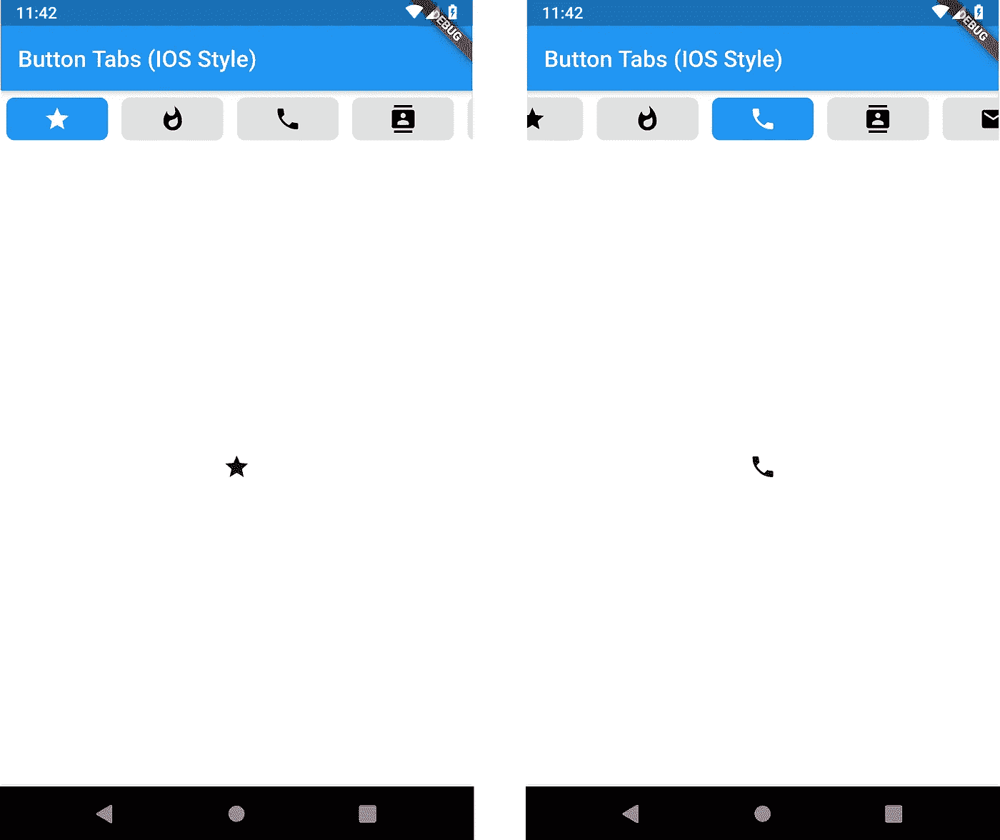
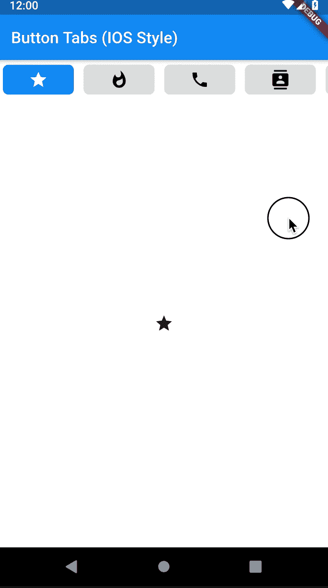
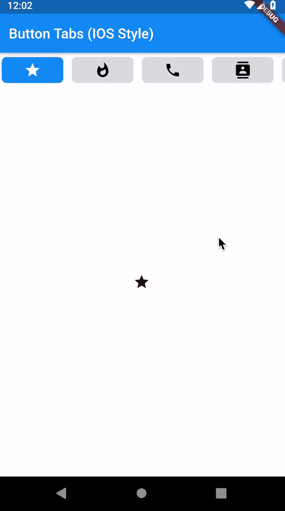
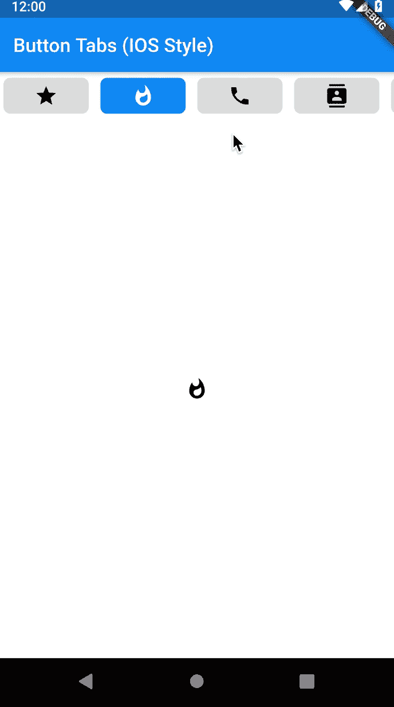
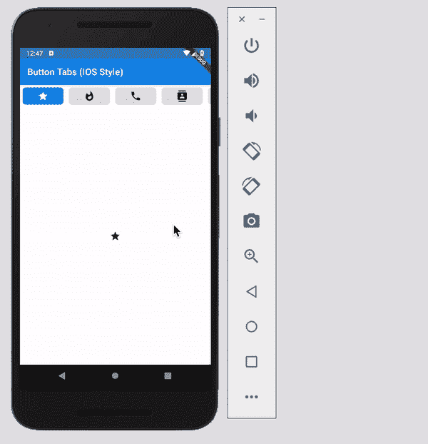

# Flutter:以按钮作为标签的标签栏

> 原文：<https://betterprogramming.pub/flutter-tabbar-with-buttons-as-tabs-ios-style-4dff5ae6c055>

## 就像在 IOS 应用上看到的那样

带有两个不同活动标签的结果截图。

当开发一个应用程序时，我需要一个带有按钮的标签栏。找了一圈，什么都没找到；默认的 TabBar 小部件没有这个选项，因此，我决定自己制作它。

(我对 Flutter 还比较陌生，所以请记住这一点🤓)

这种类型的 TabBar 在 IOS 应用中似乎很常见，但我用的是 Android，所以我不确定。无论如何，下面是我想要完成的一个例子(带有按钮的 TabBar:“电影”、“电视节目”和“体育”):

Apple TV 应用程序的屏幕截图。TabBar 风格是我的目标。

# 结果

我能够实现这个结果，它具有我预想的行为:

开发的 TabBar 演示。

# **完整代码**

这是完整的工作代码！你可以随意使用和修改它。

**说明:**

好吧，我希望我能解释一下我是怎么做的。如果最后你还有一些问题，欢迎在下面评论。

首先，一个人必须启动所有需要的变量和控制器，用于应用程序的动画和控制。选项卡的数量及其对应的图标也在这一部分中选择。

一切都有注释，这样更容易理解。

对于应用程序的主体，我使用了脚手架。在`appBar`、*、*中，我使用了一个简单的文本作为标题，在`body`中，一个*列*有两个孩子:一个`Container`对应于 TabBar，另一个`Flexible`包含`TabBarView`(我们将显示不同视图的地方)。

在 TabBar 中，一个`ListView.builder`用于创建选项卡按钮。每个选项卡按钮都有自己的`key`，稍后用于获取每个按钮的位置。每个按钮内部由一个`AnimatedBuilder`和一个`FlatButton`构成。`AnimatedBuilder`允许按钮选择动画的淡入/淡出。

当按下按钮时，会触发制表符更改和滚动动画，并设置当前索引。

现在是棘手的部分:处理动画。这非常具有挑战性，但我相信我能够创造出一些工作良好的东西，能够适应不同数量的标签、屏幕大小和方向。

我来分解一下。从标签变化动画时触发的`listener`开始:

变量`_aniValue`将包含动画值。想象一下`TabViews`是多张纸，一张纸的宽度并排放置，这导致一个宽度为 N 的大矩形，其中 N 对应于标签的数量。从-0.5 到 0.5，我们有第一个选项卡，从 0.5 到 1.5，我们有第二个，依此类推。例如，当我们从一个选项卡滑动到另一个选项卡时，我们将动画值从 0 更改为 1，*即*，我们将从第一个选项卡滑动到第二个选项卡。

刷卡的处理。

我们在另一个函数中处理按钮点击，因此，我们必须确保它不是一个`buttonTap`。我们还检查前一个动画值和当前动画值之间的差值是否小于 1。如果滑动速度太快，会出现一种奇怪的行为，动画值会跳到所需值的旁边。我知道，这很奇怪，但它发生了，以上确保了滑动动画不会跳转值。

现在，为了确保点击按钮时按钮动画也发生:

选项卡变化动画是由`_controller.animateTo(index)`在按钮`onPress`方法中触发的，因此，本节只触发按钮动画。按钮动画在`_setCurrentIndex()`内触发:

第一种方法用更新的索引设置新的`State`，触发按钮的淡入/淡出以及滚动动画:

如果可能的话，如果我们有一个可滚动类型的 TabBar，*即*，如果按钮的数量不适合屏幕宽度，TabBar 会尝试将每个按钮居中。如果不需要滚动，就没有滚动。

按钮开关的操作。

代码首先检查按钮离屏幕中间有多远。如果它在左边，它会检查按钮的左边是否有足够的空间，这样它就可以滚动 TabBar 并使按钮居中。第一个选项卡按钮的左侧不会离开屏幕的左侧。如果按钮在中间屏幕的右边，也要做同样的事情，而且要确保最后一个标签按钮的右边不会离开屏幕的右边。

这就是所有的人！我将在这里再举一个例子，说明 TabBar 如何处理更少的标签并对方向变化做出反应。我希望您会发现这很有用，并且可以节省一些工作和调试时间。

TabBar 使用较少数量的选项卡，并对方向变化做出反应。

完整代码:

 [## afonscorposo/TabBar-带按钮标签-IOS 风格-

### 在 GitHub 上创建一个帐户，为 afonscoproso/TabBar-with Button-Tabs-IOS-style-development 做贡献。

github.com](https://github.com/Afonsocraposo/TabBar-with-Button-Tabs-IOS-style-) 

> 我最近在 2020 年 4 月 24 日的[https://pub.dev/](https://pub.dev/)上发布了这个项目:

 [## buttons_tabbar | Flutter 包

### 开源的 Flutter 包，tabbar，其中每个标签指示器都是一个切换按钮。由 Afonso Raposo 制作。查看完整的…

公共开发](https://pub.dev/packages/buttons_tabbar)