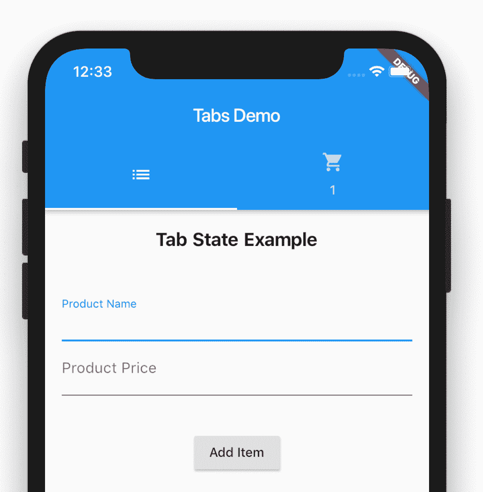
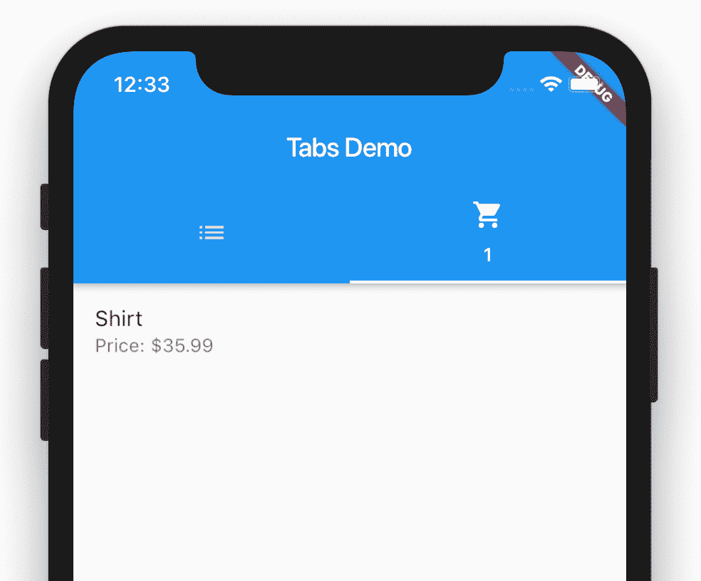

# 带状态管理的飘动标签

> 原文：<https://betterprogramming.pub/flutter-tabs-w-state-management-ac2049be7160>

## 使用 Tabs 小部件和提供者模式的新 Flutter 项目

提供程序是在 Flutter 应用程序中管理状态的推荐方法。它出现在 Google IO 上，并且在关于状态管理的 Flutter 文档中位于状态管理栈的顶端

*   视频来自 Google I/O[Flutter 中的实用状态管理(Google I/O’19)](https://youtu.be/d_m5csmrf7I)

## 入门指南

请确保将提供程序包添加到您的应用程序中。请在此处查看完整的文档和该软件包的使用说明:[https://pub.dev/packages/provider](https://pub.dev/packages/provider)

## **作为应用程序提供商的购物车模型服务…**

> 该提供程序基于 Flutter 文档中的示例。

我们有一个包含`Items`的列表和一个添加到列表的方法。我们希望能够从应用程序中的任何地方访问这个列表，我们希望对列表执行特定的操作，`add`,并让更改强制应用程序重新绘制适当的小部件。

## **设置访问状态**

因为我们需要所有的子部件都能够访问我们的`CartModel`，我们用`ChangeNotfierProvider.`包装了`TabBarDemo`部件，你可以在`ChangeNotfierProvider`上获得额外的信息

> [参见 ChangeNotifierProvider 文档](https://pub.dev/documentation/provider/latest/provider/ChangeNotifierProvider-class.html)

## **从顶层访问状态以在购物车标签标题中显示计数**

`Provider.of<CartModel>(context)`在小部件树中查找匹配类型`CartModel`的对象，并将其返回给我们。然后，这允许我们访问导出的对象、方法和对象上存在的属性。

## **向购物车添加商品时，从目录选项卡访问状态**

与上面类似，`Provider.of<CartModel>(context)`在部件树中查找匹配类型`CartModel`的对象，并将其返回给我们。这允许我们访问模型上存在的`add`方法，并使用它将商品添加到购物车中。

如果你回头看一下`CartModel`,你会看到在对象被添加到列表中后，我们调用方法`notifyListeners()`,这将导致窗口小部件被重新绘制为适当的更新值:

*   看完整的例子:https://github.com/aaronksaunders/flutter_simple_tabs
*   此代码基于[颤振文档示例](https://github.com/filiph/samples/tree/provider-shopper/provider_shopper)

## 关于开始使用 Flutter 的更多信息

这个项目是颤振应用的起点。

如果这是你的第一个 Flutter 项目，一些资源可以帮助你开始:

*   实验室:编写你的第一个颤振应用
*   [食谱:有用的颤振样本](https://flutter.dev/docs/cookbook)

要获得关于 Flutter 的入门帮助，请查看我们的[在线文档](https://flutter.dev/docs)，其中提供了教程、示例、移动开发指南和完整的 API 参考。

# 资源

## 此处提供源代码:

*   [https://github.com/aaronksaunders/flutter_simple_tabs](https://github.com/aaronksaunders/flutter_simple_tabs)

## 其他扑扑的故事

*   [颤振中的简单登录流程，然后是 Firebase](https://medium.com/better-programming/simple-firebase-login-flow-in-flutter-6f44c2b5c58a)
*   [简单的 Firebase 登录流程在颤振，现在 Firebase](https://medium.com/better-programming/simple-firebase-login-flow-in-flutter-now-firebase-79ecfe283dcf)