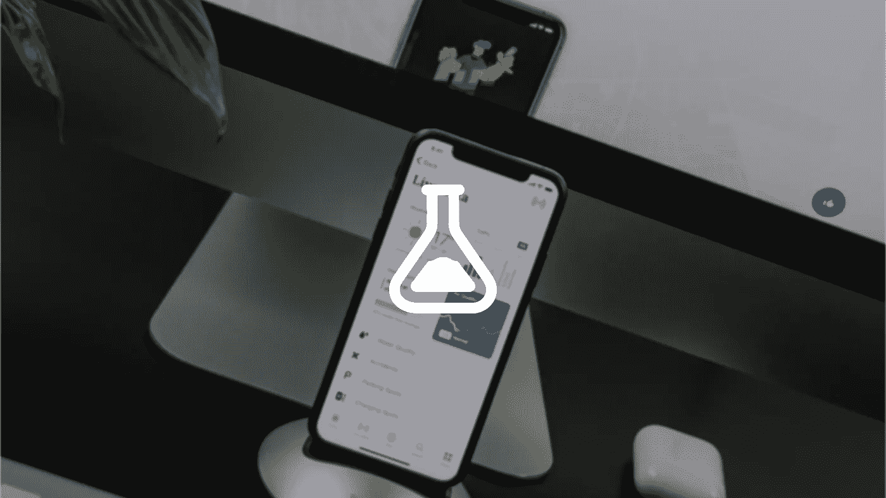
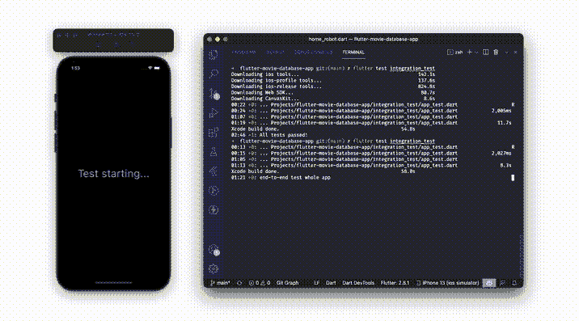

# 颤动测试——理解单元、部件和集成测试

> 原文：<https://betterprogramming.pub/flutter-testing-101-understand-unit-widget-and-integration-testing-fd5d07e312e>

## Flutter 中常见测试类型的实用指南，如单元测试、小部件测试和集成测试。



[巴拉兹·克提伊](https://unsplash.com/@balazsketyi?utm_source=unsplash&utm_medium=referral&utm_content=creditCopyText)在 [Unsplash](https://unsplash.com/s/photos/mobile-app?utm_source=unsplash&utm_medium=referral&utm_content=creditCopyText) 上的照片

当以应用程序的形式开发产品时，测试是很重要的。通过实施测试，我们将在向公众发布产品或应用程序时变得更加自信，因为我们可以确保我们开发的应用程序按预期运行，并且有更少的错误。

# 颤振试验的类型

颤振项目中通常采用三种类型的试验方法:

## 单元测试

单元测试是对应用程序的一种测试，其中测试集中在所谓的单元上。单元是构建应用程序的最小部分。当我们谈论 OOP(面向对象编程)时，最简单的单元例子是类和函数。单元测试将确保应用程序的小组件运行良好并符合预期。

为了执行单元测试，我们使用以下函数:

```
test('description', () {});
```

示例:

在上面的代码中，我们尝试对数据源`movie_remote_data_source.dart`进行单元测试，以从 API 获取电影数据。有两种情况:(1)成功检索到来自 API 的数据时，以及(2)检索不到来自 API 的数据时。

一组测试代码通常由 3 部分组成:

*   **安排—** 我们为测试准备对象或配置的阶段。在上面的例子中，我们设置了一个模拟 HTTP 客户端对象来模拟在测试中从 API 获取数据。

> **模仿**是创建一个模仿对象，这样它就可以用于测试，而不必考虑该对象与项目中其他对象的依赖关系。

以下是常用于模仿的库:

[](https://pub.dev/packages/mockito) [## 莫奇托|镖包

### 受 Mockito 启发的 Dart 模拟库。Mockito 5.0.0 支持 Dart 2.12 中 Dart 新的空安全语言特性…

公共开发](https://pub.dev/packages/mockito) [](https://pub.dev/packages/mocktail) [## 仿制品|省道包

### 受 mockito 启发的 Dart 模拟库。Mocktail 专注于提供一个熟悉的、简单的 API，用于在…

公共开发](https://pub.dev/packages/mocktail) 

*   **Act —** 调用我们想要测试的函数的阶段。在上面的例子中，我们调用了`MovieRemoteDataSourceImpl`类中的`getNowPlayingMovies()`函数。
*   **断言—** 我们验证已执行的行动是否符合预期的阶段。在上面的例子中，当从 API 中成功检索到数据时，我们验证了函数调用`getNowPlayingMovies()`的结果等于电影列表。

## 小部件测试

小部件测试或者用其他术语叫做**工具测试**是一种测试类型，它关注于构建应用程序用户界面的部分，比如按钮、文本字段等等。小部件测试将确保用户界面根据应用程序的 UI 设计进行布局，并且可以与用户进行良好的交互。

为了执行小部件测试，我们使用以下函数:

```
testWidgets('description', (WidgetTester tester) {});
```

示例:

小部件测试的过程仍然与单元测试相同(排列、动作和断言)。不同之处在于，这里我们测试的是应用程序的用户界面(小部件)的一部分。在上面的例子中，我们测试了当用户通过点击 save watchlist 按钮将一部电影添加到 watchlist 时，是否会出现一个小吃店。

当我们的应用程序实现诸如 provider、BLoC 等状态管理时，我们也需要在 pump 小部件过程中声明它。

## 集成测试

集成测试是一种专注于测试应用程序整个流程的测试(端到端测试)。要运行集成测试，您需要一个仿真器或真实的设备。在测试期间，应用程序将出现在模拟器或真实设备上，并自动运行该应用程序。

集成测试对于测试一个特性或整个应用程序在开发过程中是如何运行的非常有帮助。这将比我们必须手动运行应用程序并测试功能或整个应用程序更有效率。

为了实现集成测试，我们需要将库添加到`pubspec.yaml`中。

```
dev_dependencies:    
    ...
    **integration_test:       
        sdk: flutter**
```

然后在项目目录下，我们需要创建一个名为`integration_test`的新文件夹。例子如下:

```
**integration_test**
├── app_test.dart
└── robots
    ├── home_robot.dart
    └── ...
```

在那个文件夹中有`app_test.dart`，它包含了我们应用程序的所有端到端测试场景。然后还有一个包含每个测试场景的`robots`文件夹。应用程序测试场景可以被分离(例如通过页面)。

示例:

在上面的`home_robot.dart`中，我们为应用程序的主页创建了一个测试场景。一个例子是按下`AppBar`上的菜单按钮打开抽屉。

为了能够访问我们想要的小部件，我们可以使用`Key()`功能。所以我们必须在想要测试的小部件上注册一个键。例子如下:

然后我们就可以把所有的场景组合成`app_test.dart`。

在上面的代码中，我们首先调用`IntegrationTestWidgetsFlutterBinding.ensureInitialized()`函数来确保我们的应用程序页面已经准备好进行测试。

要运行集成测试，请设置一个模拟器或真实设备。之后，在终端上运行以下命令:

```
flutter test integration_test
```



集成测试结果

# 概述

总之，在开发应用程序时，尽可能多地考虑测试。以便应用程序的最终结果可以被正确地度量，并且在您想要修改或修复某些特性时便于维护。

完整源代码:

[](https://github.com/codestronautHub/flutter-movie-database-app) [## GitHub-codestronautHub/flutter-movie-database-app:这是一个电影目录 app。主要特点…

### 这是一个电影目录应用程序。主要功能是电影和电视节目列表，观看列表，等等。这个应用程序是…

github.com](https://github.com/codestronautHub/flutter-movie-database-app) 

以上是关于颤振应用项目测试的一些讨论，希望对大家有所帮助。