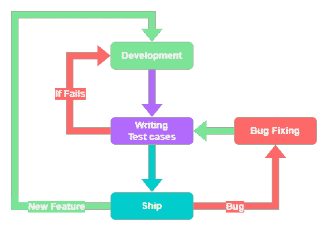
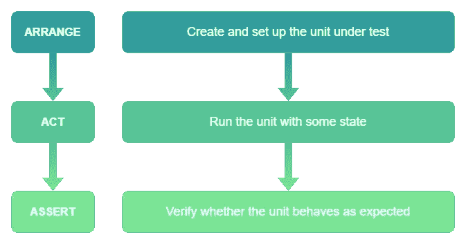

# 颤振单元试验——初学者指南

> 原文：<https://betterprogramming.pub/flutter-unit-testing-the-beginners-guide-35105164722e>

## 单元测试是自动化测试过程的一部分，在这个过程中测试小的代码单元


大家好。在这篇文章中，我们将学习所有关于单元测试的知识。

## 议程

*   什么是自动化测试？
*   [什么是单元测试？](#22c2)
*   [我们为什么需要测试？](#5d26)
*   我们可以在一个单元中测试什么？
*   [如何在 Dart 中做单元测试？](#e992)
*   [良好的单元测试实践](#5879)
*   [嘲讽](#e0a5)
*   [不同的嘲讽方式](#a1e6)
*   [莫奇托](#61f7)
*   [模仿秀](#8c58)

# 什么是自动化测试？

软件自动化测试是评估和验证软件产品或应用程序是否达到预期目的的过程。防止了 bug，降低了开发成本。

首先，我们需要明白一些事情。自动化测试只是防止软件出现预期错误的一种方式。这并不意味着软件没有任何缺陷。这只是意味着软件没有任何预期的错误。

> "测试显示了缺陷的存在，而不是不存在."埃德格·迪克斯特拉

循环总是如下进行:



正如我们所看到的，在开发阶段之后，我们编写预期的测试用例(TDD 是个例外)。一旦它通过了所有的测试用例，我们通常会发布软件。当软件处于生产阶段时，如果出现任何错误，我们会修复它并编写测试用例，以防止软件在未来出现同样的错误。

测试只是验证的行为。在开发一个新的特性或者修复一个现存的错误时，测试用例帮助我们验证是否所有现存的特性和单元都如预期的那样工作。它确保当前的开发不会破坏任何现有的特性。

# 什么是单元测试？

单元测试是自动化测试过程的一部分，在这个过程中，小的代码单元通过几个用例来测试它们的可靠性。一个单元可以是一个函数、方法、类、状态，或者仅仅是一个变量。

单元测试是测试套件的最底层。在这一层，我们测试每个特性的内部工作。

单元测试有三个阶段:

*   安排
*   行动
*   维护



在安排阶段，我们只需要创建我们需要测试的单元的对象，并为我们的测试准备先决条件，即，设置状态变量，设置模拟，等等。根据需要，安排阶段可能存在，也可能不存在。

在 Act 阶段，我们用一些状态(传递参数)运行单元，并存储结果(如果有的话)。

在断言阶段，我们验证单元的行为是否符合预期。我们可能希望调用一个方法，或者结果与预期的结果相同。

*安排和行动阶段不是强制性的。*

## 为什么我们需要单元测试？

*   单元测试非常容易编写和运行。从而节省了大量的时间。
*   单元测试帮助我们在早期识别错误。从而节省了大量的时间和金钱。
*   由于我们编写了该单元的所有预期案例，任何人都可以理解该单元是关于什么的。从而作为更好的文档。
*   通常我们不会通过思考来重构代码，这样做可能会破坏单元。进行单元测试给了我们重构代码的信心。
*   调试很简单。因为我们确切地知道失败的案例，我们可以精确地定位导致 bug 的单元。
*   通过查看测试用例，我们可以很容易理解这个单元是关于什么的。因此长期维护更容易。

## 我们可以在一个单元中测试什么？

为了有一个好的单元测试套件，我们需要了解我们需要在一个单元中测试什么。

通常，单元测试基于以下几个方面:

*   状态变量
*   函数/变量调用
*   函数参数
*   函数返回

*状态变量是局部范围之外的变量。它可能是一个全局变量，也可能是一个可以被多个单元访问的类属性。通常，它包含一个状态。*

以下是我们需要在单元中寻找的一些案例:

*   验证常量或最终变量的值。
*   状态变量的初始值。
*   验证单元是否调用某个函数 1…n 次。
*   验证该单元是否从不调用某个函数。
*   确保状态变量按预期更新。
*   单元的结果和预期的一样。
*   如果涉及到字符串、列表或任何其他复杂的 DS，请确保检查空的案例，尤其是当我们遍历 DS 时。
*   检查空情况(仅适用于可空类型。Dart 现在是空安全的)
*   检查变量或参数的类型(如果我们很好地利用了 Dart 的类型系统，就不需要这样做)

Dart 的空安全和类型系统保存了所有场景中的大量测试用例。

# 如何在 Dart 中做单元测试？

*   首先，我们需要在`pubspec.yaml`文件中包含依赖关系。

*   创建一个带有`_test`后缀的 dart 测试文件。它有助于 dart 分析器将文件视为测试文件。

我们要测试圆的面积。

```
sample_project/
  lib/
    area.dart
    main.dart
  test/
    area_test.dart
```

这是 Dart 测试文件。每个测试文件都应该有一个开始执行的`main()`方法。

我们需要将我们的测试用例包装在一个函数中，并将该函数作为一个参数传递给`test()`方法，并附上对测试用例的适当描述。

当半径为 1 时，该测试预计圆的面积为 3.141592。这里的单位是`circle()`法。

*   在 Arrange(setup)阶段，我们为`Area`类创建了一个实例。
*   在 Act(run)阶段，我们使用一些输入来运行我们想要测试的单元。
*   在断言(验证)阶段，我们将结果与预期结果进行了比较。

这里还有一个测试来验证 getter `pi`的值:

这里我们可以看到，安排和行动阶段并不存在。由于`pi`是一个静态 getter，我们不需要设置或运行任何东西。但是我们需要验证它，因此只有断言阶段。

## 对测试用例进行分组

通常，我们需要编写许多类似的测试用例。`group()`方法帮助我们将相似的测试用例分组，以便于管理。

一切都很好，但是我们为每个测试创建了`Area`实例。随着测试用例的增长，我们需要为每个测试用例重复同样的步骤。这不是一种好的做法。

`setUpApp()`方法在所有测试用例之前首先运行。利用这一点我们可以减少重复。

正如我们所看到的，我将声明和初始化移到了这个 main 方法的范围内。因此，它首先运行，然后运行所有的测试用例，也就是说，它对所有的测试用例使用相同的实例。如果对象不包含任何状态，就不会有问题。

如果对象拥有一个状态，那么拥有所有状态的公共实例可能会导致很多问题。因此，我们需要为每个测试用例创建单独的实例。

在许多测试用例中有一个共同的状态是一个不好的实践。

*我们需要每个测试用例都有单独的状态。我们通常为每个测试注入初始状态。这是我们在安排阶段需要做的工作之一。*

`setUp()`方法类似于`setUpAll()`方法，但不同之处在于它每次都在当前范围内的测试用例之前运行。因此，每个测试用例都有自己的状态。

这里，`setUp()`方法在每个测试用例之前运行。因此每个测试都有单独的实例。因此没有国家问题。

*除非回调很慢，否则始终首选* `*setUp()*` *方法，而不是* `*setUpAll()*` *方法。*

在当前范围内的所有测试完成后，可以使用`tearDownAll()`方法运行一些东西。类似地， `tearDown()`方法用于在每个测试用例之后运行一些东西。通常用于释放实例或取消订阅。

`*setUp()*` *、* `*setUpAll()*` *、* `*tearDown()*` *、* `*tearDownAll()*` *可以在* `*group()*` *里面使用来限制范围。*

## 良好的单元测试实践

*   单元测试应该很快
*   单元测试应该简单
*   单元测试应该是确定性的
*   单元测试应该是有重点的
*   在单元测试中代码重复是可以的
*   测试描述应该易于理解

单元测试应该很快。我们的整个单元测试套件应该能够在几分钟内运行，这样我们就可以在开发阶段自己运行测试套件。这有助于尽早修复错误。如果需要更长的时间，那么我们通常会将这项工作放入某种管道中。

单元测试应该简单。当我们通过一个单元测试用例时，我们需要知道的一切都应该在那个测试用例里面。我们不想滚动代码来理解单个测试用例。单元测试应该是自解释的。

单元测试应该是确定性的。无论何时何地，在不改变源代码的情况下，一个单元测试都应该像以前一样运行。单元测试不应该依赖于任何外部因素，如当前时间、数据库、网络、本地 API 等。我们通常会模仿这些。

单元测试应该是集中的。单元测试应该只关注单个单元。我们不应该在单元测试中测试依赖关系。

在单元测试中代码重复是可以的。单元测试应该更加关注简单性，而不是良好的编码实践。任何人都应该理解测试用例，而不需要搜索它的依赖或者单元的当前状态。因此，如果重复代码的某些部分有助于理解和简化，那么这是可以的。

单元测试描述应该容易理解。一个好的描述必须包含四个部分:

*   我们要测试的单元
*   设备的当前状态
*   我们将要给出的输入
*   我们期待的回应

在这个测试描述中，“半径为 1 的圆的面积应该是 3.141592”，我们可以像下面这样分解它:

*   “圆的面积”是我们要测试的单位
*   “半径 1”是我们将要使用的输入
*   “3.141592”是我们期望的输出

这个单位没有任何状态。

# 嘲弄的

单元测试背后的主要思想是隔离并关注我们正在测试的当前单元，而不是外部依赖的行为。但在大多数情况下，我们需要依赖外部依赖，如数据库、web 服务器、平台 API、外部设备等。

让我们假设我们当前的单元依赖于一个 web API。当服务器运行时，测试运行缓慢但很好。但是当服务器离线时，单元测试就会失败。这使得单元测试不可预测。因为网络服务器不在我们的控制之下。当网络服务器关闭时，这不是我们的错。这就是嘲讽的由来。

*嘲讽只是被测单元存在外部依赖时，单元测试中使用的过程。嘲讽的目的是隔离并关注被测试的代码，而不是外部依赖的行为。*

让我们看一个例子。

我们将在 repository 类中测试这个`fetch()`方法。正如我们所看到的，我们的单元依赖于与 web API 通信的`RemoteDataSource’s fetch()`方法，这是一个外部依赖。因此，我们需要从`RemoteDataSource`中剔除`fetch()`方法。

*Stubbing 是指在不影响其他任何东西的情况下，改变单元某个部分的行为。*

我们可以用一些方式来嘲笑。

## 实现我们需要模拟的类

这里我们在两个模拟类上实现了`RemoteDateSource`类。`MockRemoteDateSourceSuccess`模仿成功案例，而`MockRemoteDateSourceFailure`模仿失败案例。

在编写测试用例时，我们可以根据测试来选择我们需要什么样的实现。

*   在第一个测试中，我使用了模拟成功案例的`MockRemoteDateSourceSuccess`实例，并验证了结果是`Student`的实例。
*   在第二个测试中，我使用了模拟失败案例的`MockRemoteDateSourceFailure`实例，并验证了方法调用抛出了异常。

## 扩展我们需要模仿的抽象类

这与前面的方法类似。唯一的区别是，我们没有实现一个具体的类，而是扩展了一个具体类正在扩展的`abstract`类。

这有助于减少具体类中一些不必要的实现。

但是这两种技术都有两个问题。

*   它们缺乏简单性，因为我们需要移动到模拟代码来了解它的实现细节。
*   此外，我们需要为所有测试用例创建单独的模拟类。对于单元测试来说，部分代码重复是可以接受的。但是如此多的代码重复很难维护。

这就是嘲讽包发挥作用的地方。

## [Mock ITO](https://pub.dev/packages/mockito)—Dart 的模拟库

这个包解决了这两个问题。Mockito 库背后的想法是，我们只需要使用`@GenerateMocks()`注释来传递我们需要模仿的类。它在`[build_runner](https://pub.dev/packages/build_runner)`包的帮助下为我们生成模拟类(不要忘记将 `build_runner`作为`dev_dependency`)。

这里我们使用了来自 Mockito 的`when()`方法来完成存根部分。

不要忘记生成模拟类。

```
dart run build_runner build --delete-conflicting-outputs
```

`build_runner`将根据包含`@GenerateMocks`注释的文件生成一个文件名。这里，在`repository_test.dart`示例中，我们将生成的库作为`repository_test.mocks.dart`导入。

*   我们不需要移动到任何地方来查看实现逻辑。一切都会在那里。
*   mock 类的生成由 mockito 完成，因此易于维护。

我们可以只关注存根、行为和断言。就是这样。

Mockito 的唯一问题是代码生成。我们可以用模仿秀来克服它。

## [MockTail](https://pub.dev/packages/mocktail) —无代码生成

Mocktail 专注于提供一个熟悉的、简单的 API，用于在 Dart 中创建模拟(具有空安全性)，而不需要手动模拟或代码生成。

这个库是由菲利克斯·安杰洛夫写的，他也是写了 bloc 等的人。这个库甚至像他写的其他包一样有 100%的代码覆盖率。

就是这样。没有注释也没有代码生成。只有一行。

```
class MockRemoteDataSource extends Mock implements RemoteDateSource{}
```

干得好，伙计们！您已经准备好进行单元测试了。

我希望你喜欢这篇文章。

```
**Want to Connect?**Connect with me on [LinkedIn](https://www.linkedin.com/in/bharath-t-dev/), [Twitter](https://twitter.com/bharath_dev_t), [GitHub](https://github.com/Bharathh-Raj).
```