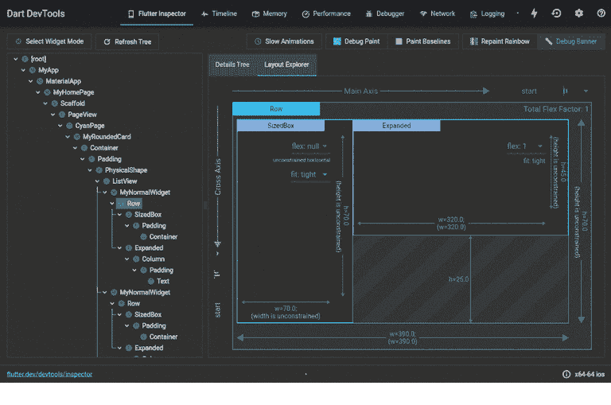
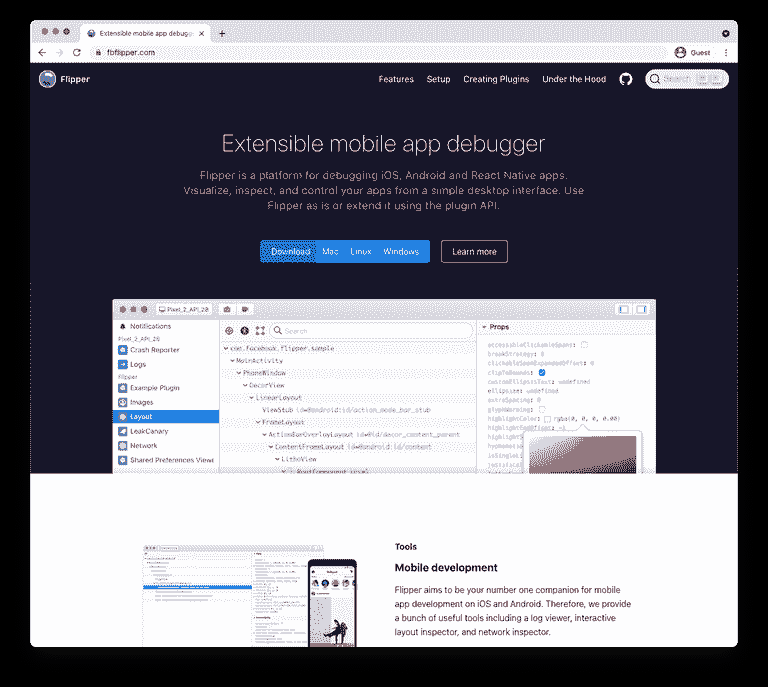
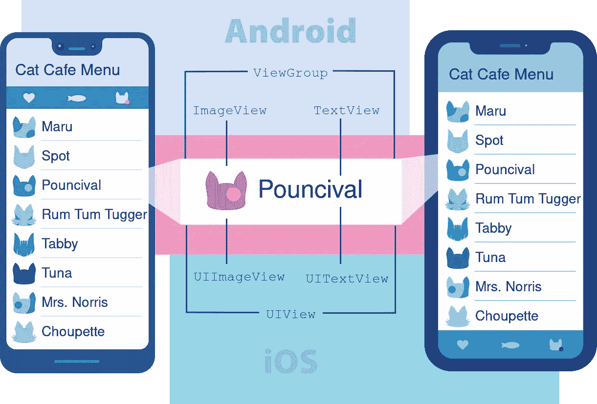
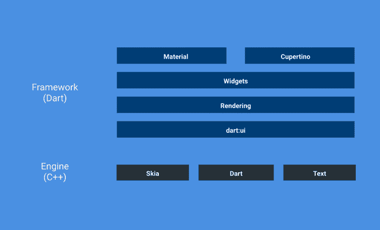
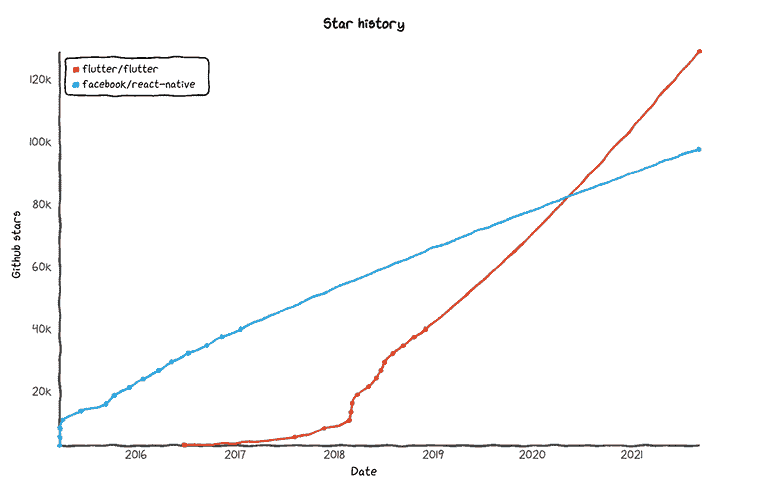
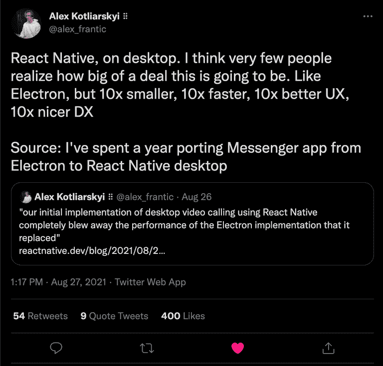

# Flutter vs. React Native:您下一个项目的终极比较

> 原文：<https://betterprogramming.pub/flutter-vs-react-native-the-ultimate-comparison-3b5f44e97945>

## 知道选择哪个框架

詹姆斯·哈里逊在 [Unsplash](https://unsplash.com?utm_source=medium&utm_medium=referral) 上拍摄的照片

多年来，开发人员比较 Flutter 和 React Native 已经变得很普遍。两者都是流行的多平台工具，用于快速、轻松地构建移动应用程序。

如果你走进一个开发者聚会，问这样一个问题，“我应该选择什么，摇摆或者自然反应？”你在为一场激烈的辩论做准备。

在这篇博文中，让我们试着公平而尊重地回答这个问题。最终，平台的选择只是应用程序成功的众多因素之一。

在我们开始之前，有必要提一下，白天，我是一名 Flutter 开发人员。虽然这篇博文已经被我们的 Flutter 和 React 本地工程团队审阅过，但我认为有必要澄清一下。

同样值得一提的是，在 [Stream](https://getstream.io/) ，我们有使用这两种框架的经验。事实上，我们已经为每个聊天消息 SDK 建立了专门的团队。这个
有利于更大的开发者社区，因为考虑 Stream 的团队不会被迫采用他们不想使用的框架，以便为他们的最终用户提供无缝的聊天体验。

也就是说，让我们讨论一下这些框架有什么不同，以及它们如何吸引不同的团队、开发人员和用例。

# 开发者体验

开发人员体验是有经验的开发人员和用户在使用库时的一般感觉。从文档到该库的实际 API 表面的一切都可能影响开发人员的体验，这通常是团队在为应用程序决定新的 SDK 时的首要考虑因素。

就 Flutter 而言，开发者和公司很容易通过定量数据来衡量社区对 SDK 的总体感觉和满意度:谷歌的团队向 Flutter 开发者发送季度调查，然后发布一份详细说明他们发现的详细报告。

颤振的 Q2 UX 报告

最新的 Q2 Flutter 报告中一个突出的统计数据是图书馆的满意率:在 Q2 年末，Flutter 在其用户群中拥有 92%的满意率。

满意率可归因于 Flutter 擅长的几件关键事情:

## **API 文件和样本**

开发人员关系团队和 Flutter 社区在记录框架的 API 和通用模式方面做得非常出色。他们最近鼓励开发者[“采用”一个小部件](https://twitter.com/timsneath/status/1291160303766581255)的活动不仅打开了外部贡献的大门，还产生了几十个通用 Flutter 小部件的代码样本。

## **开发者工具**

开发人员工具是 Flutter 体验的核心部分。该框架致力于开发和投资开发者工具。Flutter 的 [DevTools](https://flutter.dev/docs/development/tools/devtools/overview) 是一套交互式性能和调试工具，允许开发人员从 Chrome 直接与他们的 IDE 交互。使用 Flutter DevTools，开发人员可以轻松地调试常见的布局问题，交互式地调整布局，等等。

## **第三方包**

旋舞镖也有一个包管理系统，命名为 [Pub](https://pub.dev/) 。在 Pub 上，开发者可以上传、浏览和使用社区创建的包。Pub 上的包可以从 Flutter 小部件到纯 Dart 库，如 [http](https://pub.dev/packages/http) 和 [crypto](https://pub.dev/packages/crypto) 。Flutter 团队和社区一起在“Flutter Favorites”标签下审查流行的包。这使得新开发人员可以很容易地为他们的项目快速识别出高质量的(可信的)库。

就开发者体验而言，React Native 在某些方面与 Flutter 相似。脸书的团队在 React Native 的[入门](https://reactnative.dev/docs/getting-started)页面上展示信息方面做得非常好。在这个页面上，开发人员将在向导的带领下参观这个框架。

虽然我找不到 React Native 的任何官方用户研究，但值得注意的是 React Native 比 Flutter 存在的时间更长。因此，与 Flutter 相比，它拥有相当多的社区追随者。

React Native 的包和插件数量远远超过了 Flutter，因为开发者可以使用大多数 JS 库和 React 包。

关于工具，React 本地开发人员比他们的 Flutter 同行有更多的选择。考虑到框架的成熟度及其利用 JS 工具链的能力，React 本地开发人员可以从大量的 JS 工具中进行选择，以改进他们的工作流。其中一些包括 ide，比如 VSCode，还有像 ESLint 这样的 lint 包。

Flutter 的开发工具示例。使用 Flutter Web 构建。

Flutter 专门构建的 DevTools 确实有助于将该框架与 React Native 区分开来。它允许开发人员快速调试非常复杂的布局、性能和网络问题，而无需安装额外的工具。除了标准的 [React 开发者工具](https://chrome.google.com/webstore/detail/react-developer-tools/fmkadmapgofadopljbjfkapdkoienihi?hl=en)，React Native 现在还支持 [Flipper](https://fbflipper.com/) ，这是 React Native 应用的一个可扩展移动应用调试器。

【https://fbflipper.com/】React Native 的 *Flipper 调试器:*

*如果你想了解更多关于 React 原生工具的信息，请查看 Instabug 的帖子。*

*总之，这两个平台的开发者体验就是你所期待的 2021 年的现代开发框架。他们有优秀的文档(Flutter 在这里有一点优势)，有详细的指南和开发工具。*

# *开发人员生产力*

*开发人员的生产力才是真正有趣的地方。让我们在这一节开始之前先说明这里的一些观点完全取决于个人喜好。每个开发人员都是不同的，每个人都喜欢自己的工作流程和工具。如果你有这样或那样的想法，请告诉我们。反馈总是有帮助的。*

*当考虑开发人员的生产力时，我们将通过以下镜头来检查每个框架:*

*   *语言选择*
*   *开发者生态系统(包和插件)*

## *语言选择*

*让我们从最有争议的话题开始:语言选择。语言的选择会对整个框架产生连锁反应。除了开发人员的生产力，语言的选择直接影响框架的性能——我们将在后面深入讨论。*

## *反应自然*

*React Native 使用 JavaScript (JS)作为首选语言。该框架本身基于流行的 [ReactJS](https://reactjs.org/) 项目。因此，React Native 在开发者中具有较大优势。如果您曾经在 web 上使用 React 构建过应用程序，那么过渡到编写您的第一个 React 本机应用程序将会非常容易。*

*在大多数情况下，React 本机代码的结构与 React 代码的结构非常相似。事实上，甚至有可能在 React 本地项目中重用 React 项目中的逻辑。*

*虽然使用 JS 允许开发人员在其应用程序中利用开发人员为 web 构建的大量项目和库，但它也有一些严重的缺点:*

*首先，除非你选择使用 [Typescript](https://www.typescriptlang.org/) (它只增加了静态类型)，JS 是一种动态语言。这意味着在逻辑中没有健全的类型系统或零安全。*

*如果您从事过原生应用程序开发，并且正在评估将 React Native 作为您的第一个跨平台框架，那么缺少强类型和分析器警告可能会让您感到震惊。虽然 ESLint 等工具有助于减少代码中明显的 bug，但仍然有可能遇到只有在运行时才能检测到的意外情况。*

*由于 JS 不能编译成本机代码，所以所有作为 React 本机应用程序的一部分编写的代码都需要在用户的设备上用 JS 虚拟机进行编译。*

> **我并不是说动态语言很糟糕。一些开发人员喜欢使用 JS，因为它的灵活性和低门槛。然而，重要的是要注意，在处理较大的应用程序时，您将很容易出现在本机或强类型世界中极其罕见的错误**

## *摆动*

*作为一个框架，颤振处于一个独特的位置。Dart 是 Flutter 用来编写大部分堆栈的语言，也由 Google 和 Flutter 团队维护。(有趣的是，Dart 和 Flutter 团队共用同一个团队产品经理。)*

*这意味着团队可以优化框架(Flutter)和语言(Dart)来帮助改善开发人员的体验。一个很好的例子是最近添加的[条件文字和扩展操作符](https://medium.com/dartlang/exploring-collections-in-dart-f66b6a02d0b1)。两者都是对该语言的小小补充，对开发人员使用 Flutter 构建应用程序非常有用。*

*就语言本身而言，Dart 可以被描述为具有 C 风格的语法，这对于过去使用过 JS、C#或 Java 的开发人员来说应该非常熟悉。*

*与 JS 不同，Dart 是静态类型的，最近更新了[声音无效安全](https://dart.dev/null-safety)。默认情况下，现代 Dart 代码现在是不可空的，这意味着编译器可以在潜在的空引用错误发生之前警告您。*

*还值得一提的是，Dart 可以使用实时(JIT)和提前(AOT)模式进行编译，这意味着开发人员可以受益于使用 JIT 的快速迭代开发周期，但可以为最终用户生成使用 AOT 编译的小型高性能应用程序。该语言还可以在桌面和移动设备上编译成本机代码，因此在生产应用程序中不需要虚拟机。*

*虽然 Flutter 不像 JS 那样拥有大量的开源软件包，但它在性能上弥补了这一点。一个编写良好的 Flutter 应用程序在生产中可以轻松地以 60–120 fps 的速度运行。*

*此外，开发人员可以将大型计算任务(如 JSON 解码或排序)卸载到后台隔离(Flutter/Dart 的线程版本)，以帮助保持性能并避免阻塞 UI。*

## *开发者生态系统*

*任何 SDK 或框架的关键卖点都是围绕它的工具和生态系统。这两个 SDK 都有一个非常庞大和热情的开发者生态系统，为开源做出贡献。*

*React Native 有很大的好处，因为开发人员可以在他们的应用程序中利用大多数开源 JS 库。因此，开发人员可以继续使用他们最喜欢的包管理器( [npmjs](https://www.npmjs.com/) 浮现在脑海中)，搜索解决他们用例的 js 包，并轻松地将其添加到他们的应用程序中。*

*另一方面，Flutter 有一个健康的开源存在，但与本地开发者可以选择的大量软件包相比，它就相形见绌了。*

*例如，根据 [libraries.io](https://libraries.io/) 的数据，目前 Pub 上的包总数为 24952 个，而 npm 上的包数为 198 万个*

*在这两个平台的情况下，在 NPM 和 Pub.dev 上找到各种各样的项目并不罕见。为了帮助开发人员为他们的项目选择正确的包，并给予额外的信心，Flutter 团队已经启动了一个 [Flutter Favorites](https://pub.dev/flutter/favorites) 计划，该计划审查常用的包。*

> *虽然 NPM 是最受欢迎的 JS 包来源，但值得注意的是，并不是 NPM 上的所有包都支持 React Native。 [*React 原生目录*](https://reactnative.directory/) *，一个专门托管 React 原生库的网站，目前列出了 982 个库。**

# *表演*

**

*马克斯·维斯塔潘=性能:)*

*显而易见，在 Flutter 和 React Native 之间一直存在[明显的性能差距](https://medium.com/swlh/flutter-vs-react-native-vs-native-deep-performance-comparison-990b90c11433)。多年来，这种性能差距已经缩小。今天，虽然差距没有以前那么大，但 Flutter 仍然比 React Native 略胜一筹，但对于大多数应用程序来说，这可以忽略不计。*

*虽然这两个框架的广告会让你相信它们都是“真正的本地”应用程序，但这不一定是真的。*

## *反应本地性能*

*在 React Native 的情况下，UI 是由 Android 和 iOS 的原生组件组成的。这意味着您使用的是每个版本的操作系统附带的平台小部件。*

**

*【图片来源:[*https://reactnative.dev/docs/intro-react-native-components*](https://reactnative.dev/docs/intro-react-native-components)*

*当开发人员在他们的应用程序中使用文本显示信息时，React Native 会在 Android 上显示一个`TextView`，在 iOS 上显示一个`UITextView`。这种方法当然有它的优点，因为 UI 对于最终用户来说总是熟悉的，并且对于每个设备来说都是本地的。*

*另一方面，代码和业务逻辑用 JS 编写，然后在使用 JS 虚拟机和桥的设备上执行。当开发人员想到 React Native 的缺点时，通常会想到这种设置。*

*不涉及额外的细节，这种架构选择意味着，为了更新 UI 或更改应用程序的某些部分，编写的 JS 代码不仅需要被解释，还需要被添加到队列中，以便它可以跨越框架桥与本机模块进行交互。*

*对于 React Native 来说，这并不全是坏事；其实恰恰相反。脸书的团队一直在努力开发 React Native 的新架构，以解决上述主要问题。值得注意的是，桥的废弃和 [JSI](https://blog.notesnook.com/getting-started-react-native-jsi/) 的引入，这是一种允许 React Native 的 JS 线程和本机模块之间直接通信的机制。*

> **如果你很好奇，那就多读读* [*React Native 的“重新架构”*](https://litslink.com/blog/new-react-native-architecture) *。**

## *颤振性能*

*在 Flutter 的世界里，事情是非常不同的。与 React Native 不同，Flutter 不依赖于本机组件或视图。相反，Flutter 在屏幕上绘制每个像素，让开发人员完全控制绘制和布局周期。如果不是为了构建应用程序，可能更容易将 Flutter 视为一个游戏引擎。*

**

*该框架由五个不同的层组成:*

1.  ***Material 和 Cupertino**:Material 和 Cupertino 库提供了全面的控件集，这些控件使用小部件层的合成原语来实现 Material 或 iOS 设计语言。*
2.  ***Widgets**:Widgets 层是一个组合抽象。渲染层中的每个渲染对象在小部件层中都有一个对应的类。此外，widgets 层允许您定义可以重用的类的组合。这是引入反应式编程模型的层。*
3.  ***渲染**:渲染层提供了处理布局的抽象。有了这个层，你可以构建一个可渲染对象的树。您可以动态操作这些对象，树会自动更新布局以反映您的更改。*
4.  *Dart UI :基本的基础类和构建块服务，如动画、绘画和手势，它们在底层基础上提供常用的抽象。*

*使用积极的组合，开发人员可以使用这些层中的小部件来实现他们的应用程序。*

*这段代码的编译结果是一个快速响应的应用程序。因为 Flutter 使用 Dart 作为其语言，所以应用程序能够直接编译成本机代码，这意味着在生产中不需要虚拟机或桥。此外，Flutter 开发人员还可以从外部函数接口(FFI)中受益，在他们的应用程序中快速有效地与 C(或任何其他兼容语言)代码进行交互。*

> **Flutter 在生产中不需要一个桥梁来显示 UI，但是它需要一个桥梁来与底层平台和插件进行交互。谷歌地图插件就是一个很好的例子。**

*一般来说，编译的 Flutter app 比编译的 React Native app 更小更快；然而，根据应用程序的复杂性和您选择的依赖项，您的收益可能会有所不同。*

# *社区*

*选择框架的最后也是最重要的部分是社区。毕竟，您最终会遇到自己无法解决的问题，拥有一个解决了一些相同问题的开发人员社区是一个主要优势。*

*这两个平台自推出以来已经走过了漫长的道路，今天，这两个平台都可以被视为成熟的生态系统。*

*如果你是一个狂热的 Twitter 用户，那么你会很容易找到一群充满热情、渴望帮助这两个框架的新手的开发人员。 [Flutter 社区](https://twitter.com/FlutterComm)和 [React Native 社区](https://twitter.com/ReactNativeComm)都是优秀的 Twitter 账号分享资源帮助新开发者的例子。*

*除此之外， [Flutterista](https://twitter.com/flutteristas) 和 [ReactJSGirls](https://twitter.com/reactjsgirls?lang=en) 为女性提供了一个安全的空间，让她们分享自己的扑动体验，并对世界做出反应。*

*像 Stack Overflow 和 Medium 这样的网站也有大量的覆盖每个框架的各种技术和非技术方面的内容。*

**

**截至 2021 年 9 月 6 日，* [*媒体*](https://medium.com/tag/react-native) *上 React 原生故事数量。**

**

**截至 2021 年 9 月 6 日*在 [*媒体*](https://medium.com/tag/flutter) *上的颤振故事数**

# *未来*

*这两个平台的未来似乎都非常光明。随着 React Native 在建筑方面的变化以及在 JSI 的推出，脸书的团队正在为一个被认为在缓慢衰落的框架注入新的活力。*

**

**谷歌趋势数据显示去年对 Flutter 和 React Native 的兴趣。**

**

**一看* [*Github 星数*](https://star-history.t9t.io/#flutter/flutter&facebook/react-native) *对于旋舞的反应原生**

*最近，React Native 团队发表了一篇[博客文章](https://reactnative.dev/blog/2021/08/19/h2-202)，表明他们打算超越移动领域，进入桌面领域。就我个人而言，我对此感到非常兴奋。很高兴看到更多的框架扩展开来并尝试新事物。*

**

*[*https://Twitter . com/Alex _ 狂乱/status/1431304787488768001？*s = 20](https://twitter.com/alex_frantic/status/1431304787488768001?s=20)*

*对于 Flutter 来说，Google 的团队在倾听社区和引入真正增加 Flutter 开发体验的特性方面做得非常出色。最近在 Dart 中添加的空安全性和工作区数据类都是很好的例子。*

> *上周，Flutter 发布了 2.5 版本，这是一个主要的版本，解决了开发人员对该平台的一些常见错误和最近的性能问题。有关此版本的更多信息，请参见[*Flutter 2.5 中的新功能*](https://medium.com/flutter/whats-new-in-flutter-2-5-6f080c3f3dc) *。**

*现在是 2021 年，世界不是黑白分明的。在移动辩论中选择立场并争论一个框架比另一个更好是非常流行的，但事实并非如此。如果你希望这篇文章以一个明确的“赢家”结束，很抱歉让你失望了，但在现实世界中，它几乎从来没有那么明确。*

*作为一名希望开发移动应用的开发者或公司，问自己以下问题:*

*   *我的应用程序的用例是什么？*
*   *你现有开发团队的优势是什么？*
*   *你计划在不同的项目之间共享代码吗？*
*   *用手机客户端是先建 app 还是先建 web？*

*最终，这取决于您的项目和可用的资源。不是每个开发人员或团队都是平等的。*

*[告诉我们](https://twitter.com/Nash0x7E2)你正在使用的框架。*

**最初发布于*[*https://getstream . io*](https://getstream.io/blog/flutter-vs-react-native-the-ultimate-comparison/)*。**