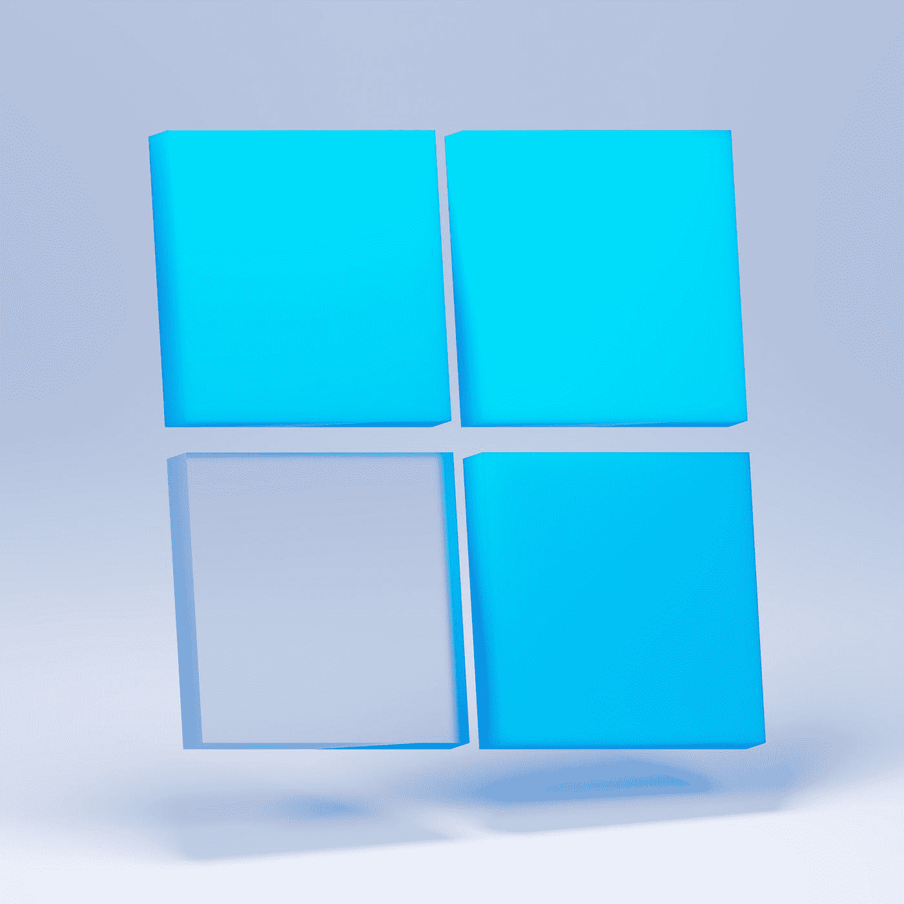

# Flutters 的稳定经验平价正在成为一个问题

> 原文：<https://betterprogramming.pub/flutters-stable-experience-parity-is-becoming-a-problem-931318b4cb7b>

## Windows 真的准备好了吗？

照片由 [Unsplash](https://unsplash.com?utm_source=medium&utm_medium=referral) 上的 [Sunder Muthukumaran](https://unsplash.com/@sunder_2k25?utm_source=medium&utm_medium=referral) 拍摄

我是 Flutter 的超级粉丝。我认为自己是颤振的狂热爱好者。实际上，我已经完成了大部分用其他语言编写的项目，只是在 Flutter 中解散它们并重写它们，因为我真的相信这是将我对应用程序的想法转化为实际应用程序的最简单的方法。我已经写了关于这个的[将你的应用与其他原生 C++库集成意味着你需要了解 C++和 CMake。](/why-flutter-is-going-to-be-a-pivotal-moment-for-app-development-d6382a3f1aab#/.NET。</li><li id=)

*   [本机库中抛出的异常经常会导致应用程序在桌面上崩溃，但这些本机异常似乎不会导致应用程序在移动设备上直接退出。](/why-flutter-is-going-to-be-a-pivotal-moment-for-app-development-d6382a3f1aab#/.NET。</li><li id=)*   [缺少关于这些是如何工作的文档，或者对 CMake 构建过程的任何解释(除了`CMakeLists.txt`中非常轻微的注释)](/why-flutter-is-going-to-be-a-pivotal-moment-for-app-development-d6382a3f1aab#/.NET。</li><li id=)*   [Android 和 iOS 版本为目标设备生成一个可安装文件。Windows 构建只是产生一堆你必须自己打包的文件。](/why-flutter-is-going-to-be-a-pivotal-moment-for-app-development-d6382a3f1aab#/.NET。</li><li id=)

[这是因为在 iOS 上使用 Flutter 或在 Windows 上使用 Flutter(这两个平台都被认为是“稳定的”平台)，你会有非常不同的体验。从我的经验来看，这让我觉得 Flutter 在移动设备上是“真正稳定的”，而在桌面上的体验则是…别的东西。](/why-flutter-is-going-to-be-a-pivotal-moment-for-app-development-d6382a3f1aab#/.NET。</li><li id=)

[让我们详细讨论其中的一些要点。](/why-flutter-is-going-to-be-a-pivotal-moment-for-app-development-d6382a3f1aab#/.NET。</li><li id=)

# [困难的平台框架](/why-flutter-is-going-to-be-a-pivotal-moment-for-app-development-d6382a3f1aab#/.NET。</li><li id=)

[您将创建的大多数 Flutter 应用程序既可以使用基础框架提供的功能，也可以使用适当插件提供的功能。如果你只是创建一个计算器，对你有好处，你不需要使用任何软件包。但是如果你正在创建一个可以在不同模式之间转换的计算器，并且你想保存用户的模式，你需要使用一个像`shared_preferences`这样的包。](/why-flutter-is-going-to-be-a-pivotal-moment-for-app-development-d6382a3f1aab#/.NET。</li><li id=)

[像这样的包带有一个“平台实现”，即特定的动作应该如何在底层平台上执行。“平台通道”负责将信息从您的多平台 Flutter 代码传送到这些特定于平台的实现。](/why-flutter-is-going-to-be-a-pivotal-moment-for-app-development-d6382a3f1aab#/.NET。</li><li id=)

[偶尔，你会有一个现有的插件或包不能满足的需求，你需要自己做一个。对于 Android 和 iOS 来说，这很棒，而且效果很好。iOS 可以用 Swift 或者 Objective-C，Android 可以用 Java 或者 Kotlin。您甚至可以](/why-flutter-is-going-to-be-a-pivotal-moment-for-app-development-d6382a3f1aab#/.NET。</li><li id=)[使用一个包来生成一些绑定位](https://pub.dev/packages/pigeon)，以受益于一些额外的类型安全。

就像 Java 或 Kotlin 是 Android 的显而易见的选择一样，。NET 是 Windows 的明显选择。这是有充分理由的——它在可用性和性能之间取得了良好的平衡，同时减少了开发人员实际制作应用程序所需的时间。

也有数以千计的 NuGet 软件包集成了几乎所有可用的功能和 windows 的外围设备——在我写这篇文章的时候大约有 281，952 个 T2 软件包。有了关于 C#和平台通道如何工作的基本信息，在 Windows 上为你的 Flutter 应用程序编写特定于平台的代码将会很容易。

这是一个非常吸引人的提议，但这不是我们生活的现实。

> 就像 Java 或 Kotlin 是 Android 的显而易见的选择一样，。NET 是 Windows 的明显选择。这是有充分理由的——它在可用性和性能之间取得了良好的平衡，同时减少了开发人员实际制作应用程序所需的时间。

针对 Windows 平台的 Flutter 应用实际上只是 Win32 应用。要编写特定于平台的代码，您必须用 C++编写代码。C++端的 NuGet 包要少得多，所以忘了使用我们刚刚谈到的那 281，952 个包吧。如果您想使用特定于平台的功能，您将花费相当多的时间在 Windows 上用 C++从头开始重新实现该功能。

## 为什么这是一个问题？

让我们假设你想在 Windows 上编写一个 Flutter 应用程序，但是你的应用程序将利用一个特定于平台的特定功能。没有现成的，所以你决定推出自己的。

你从哪里得到关于如何做的文档？在 Flutter 网站上有很多关于如何在 Android 和 iOS 上做到这一点的文档，所以可以推测，这也将扩展到部署到 Windows 上？嗯，如果你在这里阅读[页面，它提到在 Kotlin 为 Android 创建一个插件，在 Swift 为 iOS 创建一个插件，就这样。](https://docs.flutter.dev/development/packages-and-plugins/developing-packages#plugin-platforms)

在更多的搜索之后，你可能会遇到 2022 年 1 月的[谷歌代码实验室](https://codelabs.developers.google.com/codelabs/flutter-github-client?hl=en#5)(在 Flutter 在 Windows 上稳定之前)，它传达了你需要开始的基本步骤。按照这个指南，你应该有一个插件的外壳来做一些事情。

现在是时候在插件中实现你的功能了。这是一个令人沮丧且容易出错的过程，像 [pigeon](https://github.com/flutter/packages/tree/main/packages/pigeon) 这样的项目应该会使这个过程变得更容易，它(正如我们已经提到的)会在你的应用程序和你正在编写的插件之间生成类型安全的绑定。这对我们来说真是太好了，但它只支持 Android 和 iOS。

因此，我们从头开始编写我们的平台通道实现，并检查所有代码。但是现在，当我们的应用在原生代码中遇到问题时会发生什么？

嗯，在这一点上，我们深深地陷入了未知的水域。关于该怎么做，Flutter 网站上没有现成的文档。所以你只能靠你自己的设备，去猜测一下，看看你是否能找到对你有用的东西。

这样做的缺点是，如果你的插件抛出一个本机异常，以我的经验，它只会崩溃到桌面，Android Studio 会抛出一个“与设备失去连接”的消息。在从各种不和谐和松散的开发人员渠道搜寻了一些故障排除信息后，结果是您必须打开 Visual Studio，将其附加到您的进程，然后使崩溃发生。Visual Studio 会检测到崩溃，并显示代码中发生本机崩溃的位置。

> 关于该怎么做，Flutter 网站上没有现成的文档。

这意味着您的调试过程意味着从 Android Studio 运行应用程序，然后在崩溃发生之前疯狂地尝试重新连接调试器。最后，你为 Visual Studio 安装一个插件，比如[重附着](https://marketplace.visualstudio.com/items?itemName=ErlandR.ReAttach)，它等待你的进程产生，然后附加到它上面。同样，这实际上并没有在任何地方记录下来，所以虽然它对你有用，但它很麻烦，让你不安地怀疑你做得对不对。

但是我们的调试器现在已经连接上了，所以我们对正在发生的事情有了一些了解。现在，我们需要链接你的原生 Windows 插件所依赖的另一个库。但是 Visual Studio 有一个很酷的 GUI，所以您只需右键单击并添加引用，对吗？嗯，不。也没那么简单。

## 您还需要了解 CMake

正如我发现的那样，在 Visual Studio 中添加对我的插件的引用不会影响底层项目。我通过添加一个引用，然后检查 Git 中的更改来了解这一点。没有。

在对这个问题进行了大量的搜索之后，很明显我在 Windows 上的应用与其说是 Visual Studio 项目，不如说是 CMake 项目。Visual Studio 所操作的一切，如解决方案和项目文件，只是构建工件。我正在修改我运行`flutter build windows`时被覆盖的东西。

因此，我不能使用 Visual Studio 来配置我的项目、添加引用或做任何事情。相反，我必须找出如何让 CMake 做这些事情，以便对我的项目产生预期的效果。甚至不能通过 Visual Studio 安装 NuGet 包。您必须弄清楚如何告诉 CMake 安装那些 NuGet 包。

CMake 是一头野兽。我不太擅长它。它最初是在 22 年前问世的，看起来非常庞大和复杂。公平地说，鉴于 C++生态系统的长度和广度，以及有多少设备是从 C++工具链构建的，这可能是应该的。了解 CMake 如何与您的 Flutter Windows 项目交互是一项艰巨的任务，但是您必须了解它的一部分才能完成一些事情。

以及关于如何做到这一点的文档——所有这些都是如此缺乏，以至于它可能是不存在的。我不认为这些是深奥的任务。我认为任何发布产品应用的人都会遇到这样的问题。在我的例子中，我试图将 Sentry Native 集成到我的 Flutter 桌面应用程序中，所以当我的应用程序崩溃时，我会收到某种通知。无论您想集成什么库，您都必须确定使用什么包，然后将什么添加到您的`CMakeLists.txt`中。

> 关于如何做到这一点的文档——*任何这方面的*是如此缺乏，以至于它可能是不存在的。

C++只是比 Swift 或 Kotlin 更难的语言。当然，现代 C++比过去容易得多，但是您仍然必须跟踪您的指针和引用，这些东西在高性能应用程序中是相关的，但在桌面应用程序中可能不太相关，桌面应用程序可以容忍极慢的执行，以换取更好的开发环境。

事实上，你必须知道一些 C++和 CMake 来完成这些任务是非常不寻常的，在许多方面，降低了在 Windows 上使用 Flutter 的吸引力。它应该使跨平台开发更容易，我不反对学习每个平台的特质来部署到它(毕竟，我必须学习如何将我的东西放到 Play Store 和 iOS 应用程序商店)。

但是，当我想在我的应用程序中登录一些错误并疯狂地在谷歌上搜索“如何用 CMake 链接库”时，撕掉手套感觉太过分了。有人决定在 Win32 之外为 Windows 开发 Flutter 应用程序，并且必须首先配置 CMake 来完成这项工作，对吗？做这件事的团队没有写下怎么做吗？

还有其他一些小麻烦，比如你的`pubspec.yaml`版本没有印在可执行文件上，这使得部署更新很困难。这并不难修复，但这样做意味着你要定制更多的构建过程，随着 Flutter for Windows 的成熟，这肯定会回来咬你一口。目前，Flutter for Windows 被认为是“稳定的”，但几乎没有关于它如何工作，如何创建插件，甚至如何调试插件的文档。有点奇怪。

## 未来会怎样？

Flutter 仍然是软件开发中的一个革命性篇章，我相信随着时间的推移，它将成为首选工具(公平地说，我确实说过我在一开始是这种东西的狂热者)。但为 Android 或 iOS 制作应用程序和为 Windows 制作应用程序的体验相差甚远。

我不后悔在 Flutter for Windows 中制作我的应用程序。这是一次学习的经历。我花了几天时间想出了所有不使用 CMake 链接库的方法，并在我的插件中摆弄 C++代码，看看我是否能让它工作。有一次，我花了三天时间进行整合，结果只是用一个`git reset`就把它全扔了。我从这个过程中学到了很多，也从中受益匪浅。随着时间的推移，我计划记录它是如何工作的，并为此写文章和制作视频内容。

我只是担心人们会把 Flutter 用于 Windows，并认为它与制作手机应用程序一样，然后当他们发现事实并非如此时，他们会变得非常恼火。如果这听起来像你，要知道这不仅仅是你。如果你正在使用 Flutter 编写一个 Windows 应用程序，你并不清楚它是如何工作的，有时，它可能会让人眼花缭乱。

围绕这一点，我听到的一种观点是，Flutter 在 Android 上是“稳定的”，而 iOS 与今天的 Flutter 有很大不同，考虑到它的改进程度。Windows 也有类似的轨迹。假以时日，它会变得更容易使用。但在发布时，我们不必用 C++编写 Android 插件。相反，我们必须用 Java 来做，Java 是一种更容易使用的语言。考虑到 Win32 和 C++支撑了 Windows 上如此多的抖动，很难看出事情会如何改善到足以让 Windows 上的体验感觉与 Android 或 iOS 相同或相当。

> 如果这听起来像你，要知道这不仅仅是你。如果你正在使用 Flutter 编写一个 Windows 应用程序，你并不清楚它是如何工作的，有时，它可能会让人眼花缭乱。

目前，Windows 的 Flutter 可能确实是稳定的，因为核心产品没有崩溃太多，或者根本没有崩溃。但它仍然有一种真正的“二表哥”的感觉。写插件粗糙，调试粗糙，使用 CMake 困难。这样的例子不胜枚举。考虑到 Windows 需要改进多少才能和它的移动对手处于同一水平，它似乎应该有一个不同的标签，比如“发布候选”之类的。

考虑到现在 Linux 和 macOS 已经在 3.0 版本中达到了“稳定”，因此可以推测已经准备好生产了(尽管同样缺乏文档)，人们只能希望 Flutters 的“稳定”徽章没有被过度扩展。

理想情况下，如果有一个 Flutter 的 Windows 社区领导者(甚至是桌面社区领导者)可以记录所有这些方面，解释 CMake 构建过程如何工作，以及如何将本机库与 Flutter 应用程序链接起来，那就太好了。当然，它仍然比手机版更难使用，但至少我们会有一些关于它是如何工作的文档。

这并不意味着你不应该为使用 Flutter 的 Windows 开发应用。让我们面对现实吧:Windows 上的本地软件是一片名副其实的荒地，只有少数 WPF 应用，UWP 应用就更少了，电子或混合应用满足了开发者的需求。我确实相信，在未来几年中，Flutter 将成为这个领域的有力竞争者。

尽管现在，我仍然想热爱它。我只是不知道如何向马克表达。