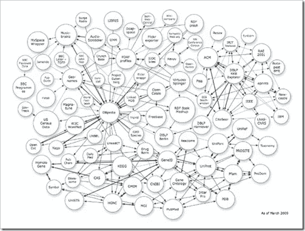

# 遵循德米特里的法律

> 原文：<https://betterprogramming.pub/follow-the-law-of-demeter-bf9a683bb5fd>

## 毕竟这是法律

塞巴斯蒂安·皮克勒在 [Unsplash](https://unsplash.com?utm_source=medium&utm_medium=referral) 上的照片

# 介绍

也许你听说过得墨忒耳定律(LoD)。但是到底是什么呢？严格定义是这样的:

> [**德米特里定律**](http://haacked.com/archive/2009/07/14/law-of-demeter-dot-counting.aspx)
> 
> 对象的方法只能调用以下方法:
> 
> 物体本身。
> 
> 方法的争论。
> 
> 方法中创建的任何对象。
> 
> 对象的任何直接属性/字段。

# 现实世界

这有点正式，所以这里有一个真实的例子:

假设你走进一家商店。你买了一堆东西，总共是 25 美元。当你去付款的时候，你会怎么做？如果你是 LoD 的信徒，那你就掏出钱包，把 25 美元交给店员——就这些钱，别无其他。

但是不，你是一个藐视法律的人，害怕你的钱包和其他人的深度耦合，因此你认为 LoD 是弱者的，所以你拿出你的钱包，把整个事情交给店员，让他决定如何付款。

当然，你打算用现金支付，但是，相反，店员拿走了你的钱包，用信用卡支付，把你的借书证扔在地板上，通过消磁机运行你的 [BuyMore](http://www.buy-more.net/) 忠诚卡，并且[在你配偶的照片上画了胡子](http://finercut.com/wp-content/uploads/2011/02/reeses-stache.jpg)。你付了钱，但是，哇，真是一团糟！

简而言之，这就是为什么您应该遵循 LoD。它的基本前提是你应该只交出(另一方面，只要求)你需要交出(或要求)的东西。东西应该用尽可能细的绳子连在一起。说明类之间的联系的文氏图应该有尽可能小的重叠。在这个例子中，你可能甚至不想让店员知道你*有*一个钱包，对吗？

或者在另一个例子中，你不会把你的钱包给报童，或者让他在你的房子里到处找零钱。

# 编码示例

例如，在代码中，你可能有一个`Transaction`类，它需要一种支付形式来完成。嘿，你看！`Customer`类有不同的支付形式，所以你传递一个`Customer`给`Transaction`。当然，一开始一切都很好，因为你非常小心，你所做的就是从顾客那里拿到付款方式并使用它。会出什么问题呢？

如果你不遵循 LoD 会发生什么

但是几个月过去了，那个(咳，咳)*没什么经验的*开发者走过来说，“嘿，看！这里有一个`Customer`对象！我想我会把他的地址改在这里，而不是那边！”一切都失控了。

很快，您就可以修复`Transaction`类中的一个错误，并且`Customer`数据会发生变化。您修复了一个`Customer` bug，当您试图向数据库提交事务时，访问冲突开始激增。

接下来你知道的是，改变一个`Customer`地址会给你的办公室清洁服务送去大笔现金奖励。不知不觉中，那个无辜地坐在`Transaction`类中的小`Customer`对象所造成的破坏永无止境。

当然，正确的做法是简单地传递`FormOfPayment`本身，或者更好的是，忘记`FormOfPayment`而只以某种形式传递钱本身。这个想法是你的班级应该要求尽可能少，拒绝接受超过他们需要的。如果你有这样的代码…

`Transaction.Customer.FormOfPayment.CreditCardNumber.ProcessCreditCard();`

…也就是说，代码似乎深入到了类的层次结构中，那么你可能会因为违反了 LoD 而被警察开罚单。你在兔子洞里搜寻你应该一开始就要求的东西。

经典名言是“只和你的朋友说话，不要和陌生人说话。”“管好你自己的事情”也浮现在脑海里。

# 更苛刻的条件

或者让我们用更直白的话来说:假设你写的每一门课都是一个干净整洁的房间，里面没有细菌、灰尘或任何其他令人作呕的东西——并且你打算保持这种状态。

你会让一个因为新冠肺炎病毒打喷嚏而走过马厩的送货员走进你的房间，递给你一个包裹吗？

见鬼不！你要让他在进入之前淋浴，擦洗，消毒，净化，或者除虱。见鬼，你也许应该让这个家伙在你让他进来之前穿上某种[生化服](http://3.bp.blogspot.com/_XNPD380IpBQ/THMbcjQrm4I/AAAAAAAALWA/ym3nWv6bFNc/s1600/P307_23.jpg)。或者更好的是，根本不要让他进来，只让他通过门上的安全槽进入他想给你的东西。

这就是你应该如何对待任何想要混进当前类的外部类。

# 关于 LoD 的提示和想法

LoD 可以成为你的好朋友。以下是一些对您的代码有帮助的提示:

*   限制您的`import`或`using`子句中的项目数量。如果你有一个很长的项目列表，这是一个很强的迹象，事情是紧密联系在一起的。
*   如果您的语言允许使用友元类，就不要利用这种违背 OOP 的特性
*   如上所述，只要在一行中有一系列点状属性，就应该检查是否违反了 LoD
*   每当您创建大量临时对象时，这可能意味着不必要的依赖
*   检查您的构造函数。如果他们创建了很多东西或者将很多其他类作为参数，那么同样的事情也适用:太多耦合的可能性。

# 结论

请注意，这些不是铁定的规则，而是供检查和考虑的建议。它不需要成为[一个点数练习](http://haacked.com/archive/2009/07/14/law-of-demeter-dot-counting.aspx)。这个想法是为了减少耦合，从而限制任何一个修改对整个系统的损害。

遵循 LoD 是创建干净、易于维护的代码的关键。