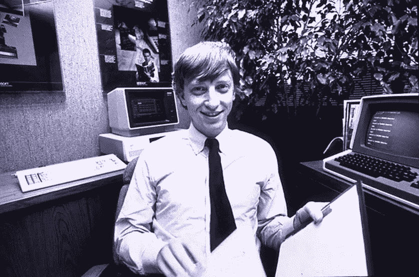
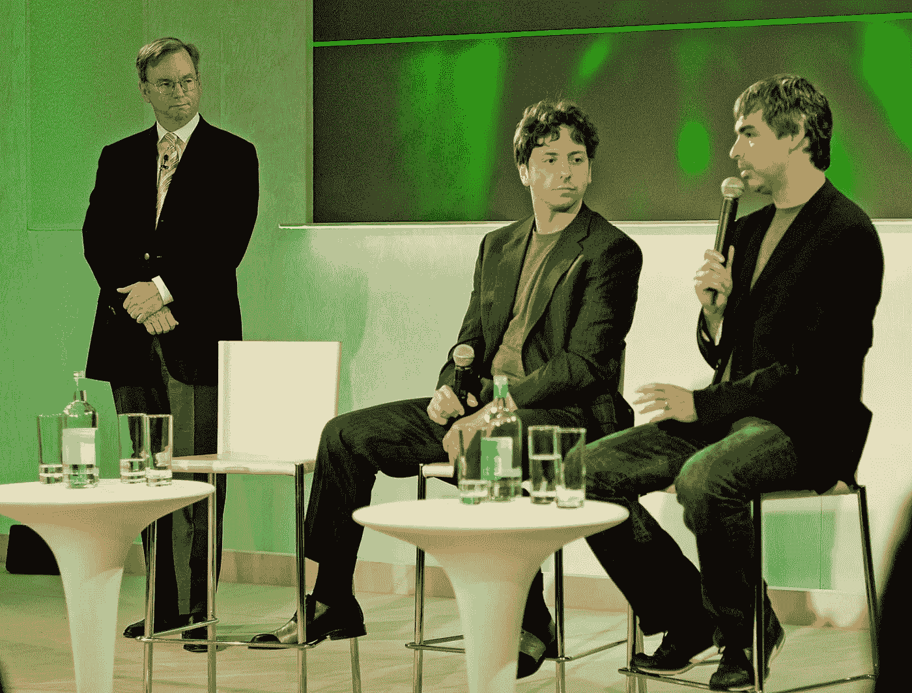
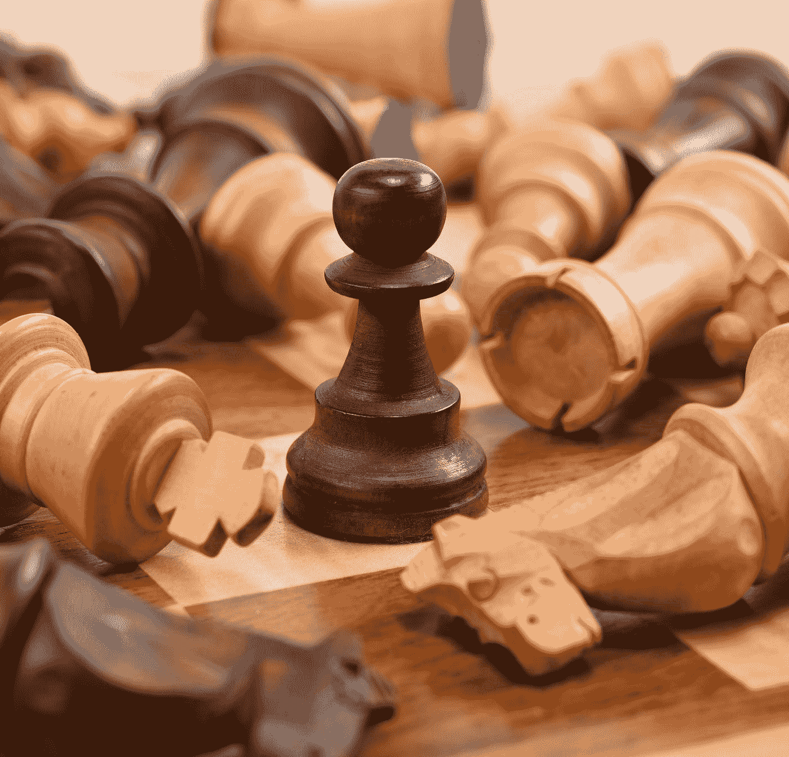
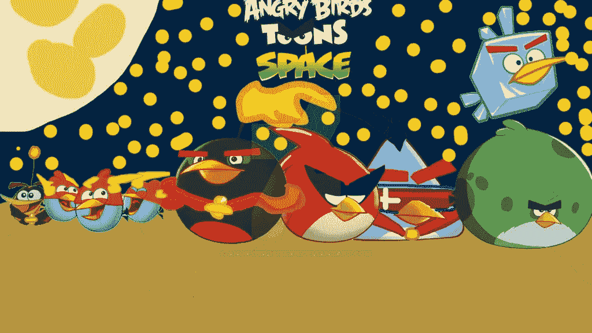

# 对于开发者来说，自我是敌人

> 原文：<https://betterprogramming.pub/for-developers-ego-is-the-enemy-77d1550a50af>

## 承认错误并从中吸取教训的能力对你的成功至关重要

照片由 [Unsplash](https://unsplash.com?utm_source=medium&utm_medium=referral) 上的 [Grzegorz Walczak](https://unsplash.com/@grzegorzwalczak?utm_source=medium&utm_medium=referral) 拍摄

我读了《T4》这本书，瑞安·哈乐黛的《自我是敌人》，提出了宝贵的建议，并决定写这篇文章。

当你听到*敌人*这个词时，你可能会想到正则表达式、bug、部署、会议和截止日期。事实上，在我们寻求达到我们的目标并成为我们想要成为的软件开发人员的过程中，我们通常是自己最大的敌人。自我是阻止我们寻求帮助、学习、合作和努力工作的原因。

所谓自我，我们指的是对自身重要性的不健康信念:我们的傲慢和以自我为中心的野心——每个人都有任性的孩子，总是选择以牺牲他人为代价来赢得胜利。

自我让我们认为我们很特别，我们知道的比我们实际知道的多得多，我们不需要与他人合作，因为我们是自给自足的。它阻碍了对编程的真正掌握。从良好的工作和与其他开发人员或其他人建立良好的关系。认识到机会，或者创造机会，仅仅是因为我们生活在自己对伟大的幻想中。

塞缪尔·泽勒在 [Unsplash](https://unsplash.com?utm_source=medium&utm_medium=referral) 上拍摄的照片

自我在我们生活的每时每刻都是一个持续的威胁。它阻止我们构建更好的产品，保持并朝着更高的目标前进，并从失败的项目中恢复。

如果我们真的想保护自己不受小我的伤害，我们应该在人生的每个阶段都意识到它的技巧。

> “知己知彼，百战不殆。如果你了解自己但不了解敌人，那么每一次胜利都会让你遭受失败。不知己知彼，百战不殆。”——孙子

# 无论你渴望什么，自我都是你的敌人

你可能有一个非常好的平均绩点，或者你的许多家庭成员和密友可能称你为神童。

在这些情况下，你的自我倾向于让你觉得这个世界欠你你想要的成功。你必须找到工作，在创纪录的时间内爬上公司的阶梯。你不需要通过正式的招聘程序就可以被雇佣。

你可能认为你不需要在 GitHub 上有任何知识库，因为你的 GPA 已经超过了同龄人。你的自我让你认为你不需要努力。

如果我们回顾历史，那些让我们惊讶于他们所做的工作的人都是非常努力的人。

WordPress 是世界上最著名的内容管理系统之一:它为超过 27%的网络提供能量。它的创始人马特·莫楞威格，[每天只睡四个小时](https://venturebeat.com/2015/02/11/how-sleeping-6-times-a-day-helped-the-founder-of-wordpress-build-a-billion-dollar-company/)，在开发 WordPress 的时候工作非常努力。

微软联合创始人、世界首富比尔·盖茨曾经天天上班。“我周末工作，我不太相信假期，”他[在一次采访中回忆道。](https://www.geekwire.com/2016/bill-gates-microsoft-license-plates/)

资料来源:time.com

回到马克·扎克伯格在脸书做开发者的时候，他不得不努力工作。“过去的六年是大量编码、专注和努力的工作。但也许把它作为派对和所有这些疯狂的戏剧来记忆会很有趣。”

贝宝的联合创始人埃隆·马斯克曾经是一名软件开发员，尽管被认为是一个天才，但他从清晨工作到深夜。他现在每周工作 100 个小时。

资料来源:flickr.com

你不应该高估自己的能力，陷入认为自己比实际情况好得多的困境。如果你真的想在编程方面出类拔萃，你应该非常投入，并投入大量的时间和精力。

你的自负甚至会阻止你与其他人合作。它可以让你觉得自己足够聪明，自己的技能也足够，这样你就不需要在项目中与其他同事合作了。事实上，已经取得突破并帮助了数百万用户的大项目通常是协作工作的结果。

拉里·佩奇和谢尔盖·布林在斯坦福大学计算机科学系相遇后，一起创立了谷歌。比尔·盖茨[和保罗·艾伦一起创办了](http://www.businessinsider.com/what-paul-allen-really-thinks-of-bill-gates-2011-3)微软，他想出了微软这个名字。埃隆·马斯克[和他的兄弟金巴尔一起创建了他的第一家 IT 公司 Zip2，该公司被 AltaVista 以 3.07 亿美元的现金和 3400 万美元的证券收购。布莱恩·阿克顿](https://astrumpeople.com/elon-musk-biography/)[与简·库姆](https://www.forbes.com/sites/ryanmac/2014/02/19/whatsapp-founders-become-billionaires-in-19-billion-deal-with-facebook/#5357a36932c3)合作，创立了 WhatsApp。

来源:维基媒体

你应该努力工作，保持谦逊，并与他人合作。你甚至不应该考虑独自开始和完成一件大规模的事情。你应该成为团队的一员。

# 无论你取得了什么样的成功，自我都是敌人

你可能会认为，既然你现在有了工作和几年的经验，你已经有了一个坚固的城堡，应该可以持续到你退休。你设法在几周内学会了 React，并在几个月内找到了工作，没有大学文凭。你受雇于一家顶级科技公司，或者成为许多其他有经验的开发人员的团队领导。你开发的应用程序在 iTunes 上的下载量达到了数千次。

你可能已经从硅谷的一家顶级科技公司得到了一份工作，并一直吹嘘它，忘记了这种态度不是让你走到这一步的原因。

Randy Fath 在 [Unsplash](https://unsplash.com?utm_source=medium&utm_medium=referral) 上拍摄的照片

达到一定程度的成功是必然的。这些类型的成功可能非常令人印象深刻，但对我们未来的自己也是毁灭性的。它们可能会提升我们的自我意识，阻止我们刻意地坚持那些让我们达到这种水平的原则、惯例和努力工作。我们忘记了为了走到这一步我们做了多少工作。

结果，我们无法继续前进，仅仅是因为我们只能看到我们已经做了什么。我们将注意力从成功的原因转移到结果上。我们忽略了磨练我们的编程技能和提高我们的性能，因为我们沉迷于我们以前成功的好处。正如行为艺术家玛丽娜·阿布拉莫维奇所说，“如果你开始相信自己的伟大，那就是你创造力的死亡。”

社会赞扬我们，并戏剧性地夸大我们的成就，这助长了我们的自我。我们不知道自己真正的成就。我们大大高估了他们。

本·怀特在 [Unsplash](https://unsplash.com?utm_source=medium&utm_medium=referral) 上的照片

计算机编程是一个不需要获得四年学位就能找到工作的职业。你可以通过学习编程语言找到工作，甚至有机会远程工作。如果你不变得更好，不去学习目前市场上的价值，你很可能会被一个来自世界另一端的年轻热情的人取代。你可能不像你的自我暗示的那么特别。

如果你想成为一名更好的程序员，并且仍然有机会开发真正酷的应用程序，那么你需要永远保持谦逊和学习。你需要进行[刻意练习](http://calnewport.com/blog/2010/01/06/the-grandmaster-in-the-corner-office-what-the-study-of-chess-experts-teaches-us-about-building-a-remarkable-life/)，不断挑战自己的极限。

照片由 [Tim Gouw](https://unsplash.com/@punttim?utm_source=medium&utm_medium=referral) 在 [Unsplash](https://unsplash.com?utm_source=medium&utm_medium=referral) 上拍摄

没有所谓的高原。在物理学中，有一种东西叫做熵。你要么往下走，要么往上走。就这些了。没有停滞。很容易成功一周或一个月，然后被自我的故事所困，很快失败。我相信真正的成功是可持续的。正如 49 人队教练比尔·沃尔什所说，“我曾经不得不做的最艰难的事情是让我的球队克服成功病。”

# 无论你面对什么样的失败和挑战，自我都是敌人

无论你多么努力，有些失败是不可避免的。你工作的那家想要改变世界的初创公司未能推出成功的产品。该公司的销售额大幅下降，不得不解雇大部分软件开发人员。这家企业负债累累，现在你需要找一份新工作。

本·怀特在 [Unsplash](https://unsplash.com?utm_source=medium&utm_medium=referral) 上的照片

这些和类似的失败可能超出你的控制。在其他情况下，您可能要对某些类型的故障负责。然而，在这两种情况下，这并不意味着你应该完全投降，永远不要试图改变你的处境。

> “这是因为人类倾向于同情我们的快乐比同情我们的悲伤，我们炫耀我们的财富，隐藏我们的贫穷。没有什么比不得不把我们的痛苦暴露在公众面前，并感觉到尽管我们的处境在全人类的眼中是公开的，但没有人能为我们设想我们所遭受的痛苦的一半更令人羞愧的了。”—亚当·斯密

你的自负可能会阻止你保持谦逊并从错误中学习。你不想学习一门新的编程语言或一个新的框架，因为你的自我告诉你已经足够熟练和有成就了。

你可能讨厌寻求帮助或尝试学习新的东西来克服失败。你开始责怪每个人。你不会停下来为自己的处境承担[的极端所有权](https://www.amazon.com/Extreme-Ownership-U-S-Navy-SEALs-ebook/dp/B00VE4Y0Z2)和责任。结果，你可能无法理解你实际上需要成为一个更好的软件开发者。

微软并不是比尔·盖茨和保罗·艾伦创办的第一家公司。他们在 20 世纪 70 年代早期有另一家名为 Traf-O-Data 的公司，由于亏损他们不得不关闭。他们从那次经历中学到的经验在微软发挥了至关重要的作用。

布莱恩·阿克顿没有被脸书接受。他也被推特总部否认了。他没有放弃，而是与他的合伙人简·库姆合作，开发了 WhatsApp。拒绝布莱恩的社交媒体公司之一在不到五年后以 190 亿美元收购了 WhatsApp。

在凭借《愤怒的小鸟》一夜成名之前，Rovio 开发了 51 款不成功的游戏。

资料来源:deviantart.com

你正在做的项目失败的可能性很高。然而，这不应该让你感到痛苦，只要你把这些失败作为学习的经验。

正如视频游戏设计师威尔·莱特[在《T3》中所说，“实际上，我更倾向于根据一个人经历了多少次失败来雇佣他。我认为这是最好的学习系统。”](http://www.gamasutra.com/features/20050520/cifaldi_pfv.htm)

谦逊而坚强的人不会只在成功的时候坚持到底。他们利用从失败中吸取的教训，设法克服并利用它们作为弹射的立足点。

正如瑞安·哈乐迪在他的书中提到的，“唯一真正的失败是放弃你的原则。”他进一步补充道，“如果你的名声经不起几次打击，它本来就一文不值。”

# 对于接下来的一切，自我是敌人

现在你已经读了这篇文章，你已经对你的自我进行了严重的打击，但这还不够。如果我们真的想成为最好的自己，我们需要采纳这个建议。正如德里克·西弗斯[关于拥有知识](https://tim.blog/2016/11/21/tools-of-titans-derek-sivers-distilled/)所说，“如果(更多)信息是答案，那么我们都会成为拥有完美腹肌的亿万富翁。”

我们应该从别人的自我经验中学习，而不是成为别人学习的受害者。我们应该对自己的抱负保持谦逊，对自己的成功保持优雅，对自己的失败保持坚韧。这并不意味着我们不独特，也不意味着我们没有有价值的东西可以贡献。它只是意味着我们不应该总是把自己作为故事的主题。相反，我们应该更加关注工作和整个过程。

我们需要在自我让我们养成坏习惯之前，识别自我在我们头脑中的无声对话，并尽早抑制它。当我们达到一定程度的成功时，我们必须用谦卑和自律来抑制它的诱惑。我们必须谦虚，随时准备向别人学习，在事情不顺心的时候培养力量和毅力。

> “第一条原则是，你不能欺骗自己——而你是最容易被欺骗的人。”—理查德·费曼