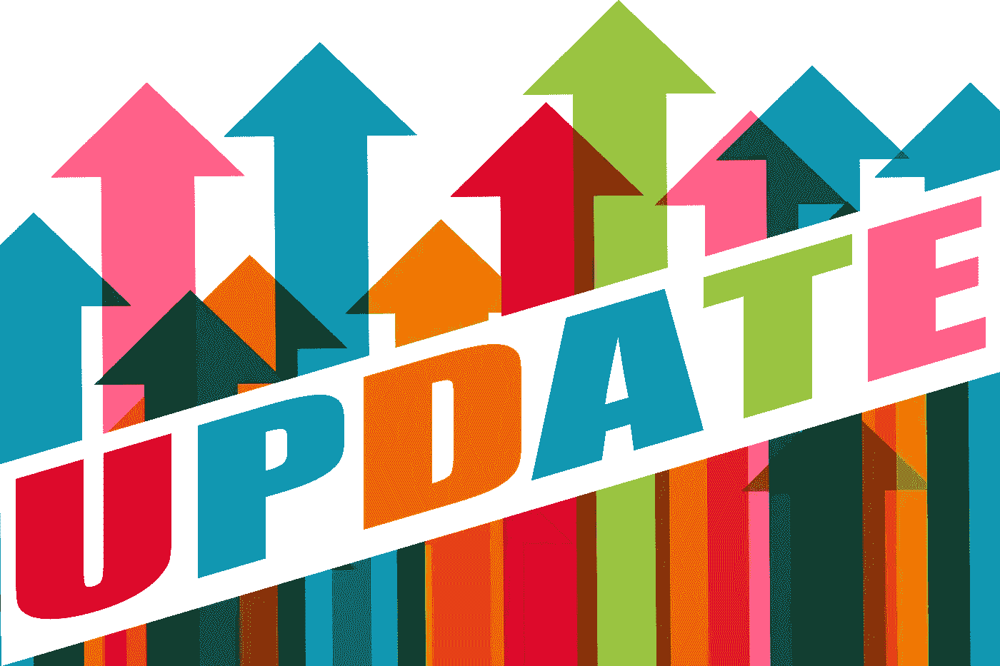
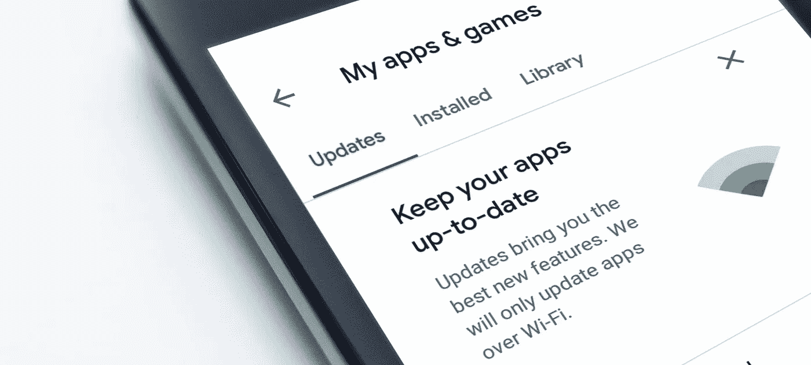
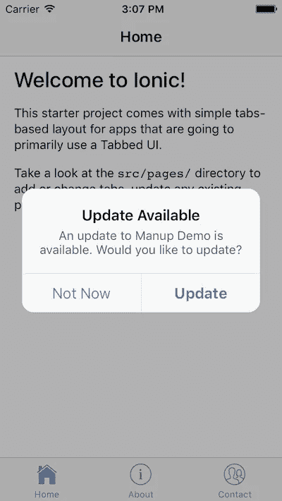
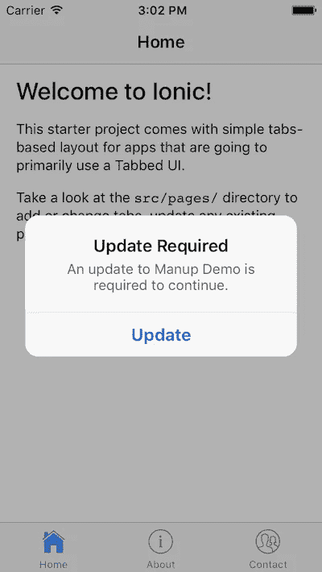

# 强制更新你的应用程序应该是行业标准

> 原文：<https://betterprogramming.pub/force-update-your-apps-74de57523650>

## 以及为什么不这样做是一种痛苦

由 [Gerd Altmann](https://pixabay.com/users/geralt-9301/?utm_source=link-attribution&utm_medium=referral&utm_campaign=image&utm_content=1672346) 在 [Pixabay](https://pixabay.com/?utm_source=link-attribution&utm_medium=referral&utm_campaign=image&utm_content=1672346) 上拍摄的照片。

作为一名后端和应用程序开发人员，我见过几个需要修复应用程序或后端的软件错误。在某些情况下，解决问题最干净的方法是更新应用程序。但由于我们没有办法强制更新我们的应用程序，我不得不在后端代码的端点上进行修复。这从来都不是最佳的，并且随着时间的推移会严重降低代码库的质量。

如果我必须第二次修复同一个端点，因为修复的应用程序版本有另一个 bug，该怎么办？我不能总是在补丁上打上补丁，然后希望下一个接触代码的开发者知道所有这些`if-elses`和检查是关于什么的。此外，创建越来越多标有“v1”、“v2”、“vN”的端点对我来说也不合适。它扩大了可用的端点数量和我们代码库中的代码行——这一切只是因为我必须确保旧应用程序仍然可以在我的后端正常工作。

我应该如何在这样一个丑陋补丁的丛林中实现一个新特性，并且感觉就像同一端点的 200 个不同版本？如果出现新问题，我应该调试哪个端点？

照片由 [Pixabay](https://pixabay.com/) 上的 [mohamed_hassan](https://pixabay.com/users/mohamed_hassan-5229782/) 拍摄。

# 梦想

从开发者的角度来看，每当我认为通过保留应用程序的当前版本无法实现问题的干净解决方案时，我都会强制更新我的应用程序。我可以强制修补应用程序，并在后端以干净的方式修复错误，不需要违反架构或在端点逻辑中流行`if-else`。

但是这对用户来说意味着什么呢？强制更新是否过于侵扰？

在我看来，要看情况。

*   如果你推出了一个应用程序更新，修复了之前“看起来不漂亮”的布局问题，那么我会说，这足以让用户意识到更新，但没有重要到迫使用户下载更新。
*   如果问题属于“由于 ID 混淆，用户订购了错误的产品”类别，那么尽快强制更新该应用程序。

[fancycrave1](https://pixabay.com/users/fancycrave1-1115284/?utm_source=link-attribution&utm_medium=referral&utm_campaign=image&utm_content=820275) 在 [Pixabay](https://pixabay.com/?utm_source=link-attribution&utm_medium=referral&utm_campaign=image&utm_content=820275) 上的照片。

# 实现示例

既然我们已经知道了什么时候强制更新，什么时候只通知用户更新，让我们看看*如何在后端和应用程序上实现这样的机制。*

为了让应用程序知道有更新，我们必须在后端有一个端点来返回最新的兼容应用程序版本号。应用程序在调用任何其他端点之前，总是必须在启动或唤醒时调用此端点。

下面是来自我们假设的版本控制端点的一个可能的示例响应:

正如你在上面的例子中看到的，当我们的 iOS 应用程序调用这个端点时，它将读取`min`版本`1.0.0`和`max`版本`1.1.0`。然后，它会将应用程序的本地版本与从我们后端接收的`min`和`max`版本进行比较。

处理将始终遵循以下情况之一:

*   `local version == max version` →没有可用的更新，不需要任何操作。
*   `local version < max version && local version > min version` →我们可以在应用程序中向用户显示一个*可取消的*弹出窗口，通知他们可以下载更新，但不必下载。
*   `local version < min version` →应用程序*与后端*不兼容，必须强制更新。我们将向用户显示一个模态的、不可撤销的弹出窗口，解释他们必须更新应用程序才能使用它。

*注意:Android 应用程序的逻辑是相似的。*

## 应用程序用户界面示例

有更新可供下载，用户可以选择使用当前应用程序或从 App Store 更新它:

有更新可供下载。用户必须更新应用程序，并且不能再使用当前安装的版本。我们强制更新应用程序:

照片由[在](https://pixabay.com/photos/?utm_source=link-attribution&utm_medium=referral&utm_campaign=image&utm_content=690192) [Pixabay](https://pixabay.com/?utm_source=link-attribution&utm_medium=referral&utm_campaign=image&utm_content=690192) 上的免费照片拍摄。

# 结论

当我从用户的角度来看这个特性时，总是被告知有新的更新可用是很烦人的。作为用户，我有时甚至没有使用应用程序的选择，并将被迫更新。

作为一个应用发行商，我必须小心不要让我的用户不知所措。强制更新经常只会惹恼我的用户，可能会让他们不再使用我的应用。我希望我的用户对我的应用程序有良好的体验，并经常使用它。因此，应该避免在用户每次启动应用程序时用更新弹出窗口打断他们。要减少弹出窗口的数量，只显示一次可选更新的弹出窗口。允许用户跳过一个版本。

有一种方法来保持应用程序中的代码库和后端的整洁是非常棒的。它节省时间和金钱，减少开发人员的挫折感，并使支持应用程序更容易。这也是我个人认为所有 app 都应该有这个机制的原因。更好的是，苹果和谷歌应该为我们提供一个内置的机制，让开发者和应用程序用户更容易地完成整个过程。