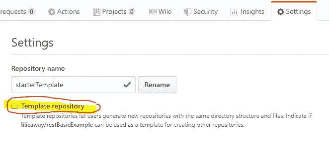
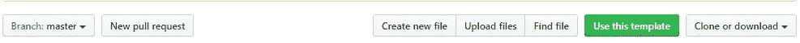
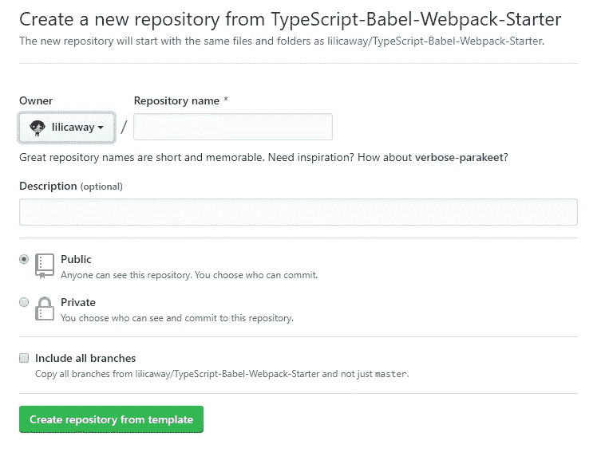

# 忘记样板文件，使用存储库模板！

> 原文：<https://betterprogramming.pub/forget-boilerplate-use-repository-templates-74efebbee8eb>

## 节省时间，专注于项目特定的任务

José Manuel Benito 在[维基百科](https://en.wikipedia.org)上的照片

开发人员通常花费大量时间使用他们喜欢的工具和库来引导他们的新项目。但是当他们经常原型化新的想法时，这种方法是不方便的。

幸运的是，有一个特性允许开发人员只处理一次样板代码，避免了每次他们想尝试新事物时的额外工作。

这个特性被称为“模板库”，可以在 GitHub 上获得。Gitlab 也为高级用户提供同样的[功能](https://docs.gitlab.com/ee/user/admin_area/settings/instance_template_repository.html)。

# 存储库模板

当一个存储库被**标记为**作为**模板**时，它可以在以后被重用为**基线**项目，这意味着开发人员只需要设置所有东西一次。

为了能够生成一个基线模板存储库，首先需要创建一个普通的存储库，然后开发人员需要将其转换成一个**模板**。

这个特性允许开发人员在下一次需要处理一个新项目时重用“**基本代码**”，只关注项目任务，很快将注意力集中在主要特性上。

# 如何重用模板作为新项目的基线

如果你在 GitHub 中看到一个库被标记为模板，你可以使用名为“使用这个模板”的选项。

按下按钮会将您带到一个配置页面，在那里您输入新项目的名称，允许您在几秒钟内使用该代码库引导您的应用程序。

# GitHub 上可用的模板

官方项目团队能够提供带有不同选项的适当模板，如 React/Redux 或 React/Mobx，以供开发社区使用。

对于开发者来说，扩展这些基础模板或者在现有的官方基础上构建他们自己的模板也是非常简单的。他们只需要为特定的代码库添加自己的个人库，甚至还需要将其转换为另一个新模板，并在以后重用。GitHub 上有很多非模板的入门库可以转换成模板库，标记为“模板”。

该功能于 2019 年 6 月在 GitHub 推出。

# 生成您自己的模板

在 [GitHub](https://github.com/) 网站上有[大量信息](https://github.blog/2019-06-06-generate-new-repositories-with-repository-templates/)关于:

*   如何[创建一个模板库](https://help.github.com/en/articles/creating-a-template-repository)(从头开始)。
*   如何[从模板](https://help.github.com/en/articles/creating-a-repository-from-a-template)创建存储库。

我已经使用 ES6、TypeScript 和基于另一个 TypeScript 模板的 Webpack 创建了自己的模板。我自己的 TypeScript-Babel-web pack-Starter 模板是[这里是](https://lilicaway.github.io/TypeScript-Babel-Webpack-Starter/)。

它基于微软的[TypeScript-Babel-Starter](https://github.com/microsoft/TypeScript-Babel-Starter)，Webpack 的想法基于 sweetcoco 的[web pack-Babel-boilerplate](https://github.com/sweetcoco/webpack-babel-boilerplate)。

它被用作我开发的名为 [movierama](https://github.com/lilicaway/movierama) 的应用程序的基础代码。

# 基线 JS 模板的库和配置示例

这些是我在模板项目中包含的一些库和配置:

*   ReactJS & TypeScript:运行 npx create-react-app my-app—TypeScript，然后将项目转换为模板。
*   埃斯林特
*   较美丽
*   Webpack 并拥有您想要运行的脚本的定义。
*   。gitignore
*   补充。编辑器配置

一旦你有了自己的完美设置，你就可以把它标记为模板。以后可以开始用它作为基点。

模板对于经常做原型的研究和创新团队来说非常有用。

感谢阅读！如果你有任何建议或想法，请告诉我。