# 忘记运气:优化的单词策略

> 原文：<https://betterprogramming.pub/forget-luck-optimized-wordle-strategy-using-bigquery-c676771e316f>

## 利用 Google BigQuery 找到让你主宰 Wordle 的三个词

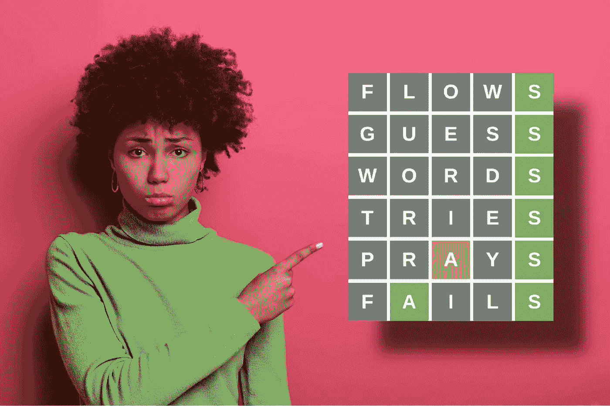

由 [wayhomestudio](https://www.freepik.com/wayhomestudio) 通过 [Freepik](https://www.freepik.com) 拍摄的令人敬畏的图像——由 [Wepik](https://wepik.com/) 编辑

Wordle 是一款令人惊讶地令人上瘾的文字游戏，由 Josh Wardle 设计，在互联网上掀起了一阵风暴。它已经[引发了](https://sweardle.glitch.me/) [众多](https://queerdle.com/) [跟风](http://foldr.moe/hello-wordl/)，[几个](https://qntm.org/files/wordle/index.html) [恶搞](https://edjefferson.com/letterle/)，用其他语言玩肯定是可以的:[西班牙语](https://wordle.danielfrg.com/)，[德语](https://wordlegame.org/wordle-in-german)，[葡萄牙语](https://term.ooo/)，[威尔士语](https://www.hiriaith.cymru/gairglo) …克林贡语有人吗？

> **趣闻**:这篇文章标题的首字母缩写是一个很好听的词:FLOWS。可惜它解决不了游戏。继续读下去就知道为什么了。

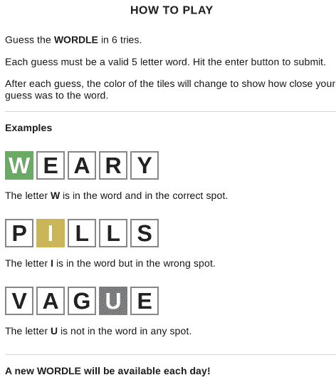

Wordle 无需介绍:规则就是这么简单

在我自己玩了一段时间(阅读:上瘾)并研究了多篇关于玩游戏的最佳策略或第一步用什么词最好的文章后，我决定调查一下，看看我是否能想出自己的东西。

我见过有人使用通用编程语言(JavaScript、Python、c++……)或电子表格(Google Sheets、Excel……)来阐述 Wordle，所以我想我会尝试一些不同的东西:我将使用数据库。我将进入完全无服务器模式，利用 [Google BigQuery](https://cloud.google.com/bigquery/) 来完成繁重的工作， [Google Cloud Shell](https://cloud.google.com/shell) 来完成所有的命令行工作，利用 [Google Data Studio](https://datastudio.google.com/) 来实现可视化。

免责声明:这个策略可能会毁了你的 Wordle 体验。请注意。

作为一般的经验法则，一旦🟨或🟩出现，最好不要重复那个字母，而是尽可能尝试新的字母来探索。这对于🟩's.在同样的🟩同样的位置上重复使用🟩's 的成绩来说尤其如此，这是意料之中的:没有学到什么新东西。

在每一轮中使用不同的字母可以使新信息的数量(信息论中称为**熵**)最大化。

两个玩家解决同一个单词:

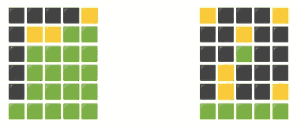

左:5 圈测试 13 个字母—右:5 圈测试 20 个不同的**字母**

因此，最好使用尽可能多的不同字母的单词，最好是全部 5 个，以最大化每回合获得的新信息。

根据这一想法，4 个单词从“最佳”(更多熵)到“最差”(最少熵)排列如下:

*   分组测试 5 个不同的字母:G、R、O、U 和 P
*   极限测试 4 个不同的字母:L，I，M 和 T
*   数组测试 3 个不同的字母:A、R 和 Y

但是有多个 5 个字母的单词具有独特的字母:BEGIN、BREAK、FALSE、FETCH、OUTER、RAISE、RANGE、RIGHT、TABLE、UNTIL、USING、WHILE…

有可能知道一个词是否比另一个词“更好”吗？让我们来了解一下！

Wordle 使用两组不同的单词:

*   **解决方法:**不得不猜的词，多为日常用语。
*   **猜测**:你可以用这些词来猜测这个词，但是这些词从来都不是答案，有些词很难理解。

为了找到答案和猜词，我求助于 GitHub 中游戏的打字稿源代码:

```
**wordlist.ts** ['cigar','rebut','sissy', … ,'artsy','rural','shave']**validGuesses.ts** ['aahed','aalii','aargh, … ,'zygon','zymes','zymic']
```

将它们提取并保存到 CSV 文件很容易:

使用谷歌云外壳提取单词

输出是:

```
First three solution words:
"cigar","solution"
"rebut","solution"
"sissy","solution"Last three guess words:
"zygon","guess"
"zymes","guess"
"zymic","guess"Number of words per type:
   2315 "solution"
  10657 "guess"
12972 wordle.csv
```

Wordle 的词典包括 12，972 个单词，你可以用来玩这个游戏:2，315 个答案和 10，657 个猜测。

我将创建一个名为 **wordle** 的新 Google BigQuery 数据集来保持整洁。然后我会将这些单词加载到一个表(`raw_words`)中开始探索。

Google BigQuery 之旅从这里开始

让我快速检查一下所有数据是否都正确上传到了 Google BigQuery:

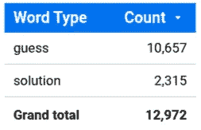

所有的事情都加在一起

由于 Wordle 全部使用大写字母，而且提取的单词都是小写的，所以我将快速创建一个所有单词都大写的新表(`normalized_words`)，以使事情看起来更漂亮。我会保留原来的词，因为在 Google BigQuery 中存储很便宜:

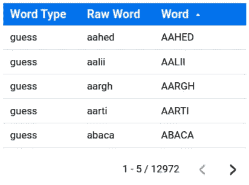

惊叹:惊讶地、高兴地或惊奇地大叫😱

下一步是创建一个查找表(`letters`)，其中包含所有单词中的所有不同字母(包括答案和猜测)。

我会为每个字母预先计算一个数字(`letter_bitmask`)。这将使我今后的生活更轻松。

让 Google BigQuery 的分析功能发挥作用

这张表看起来会像这样:

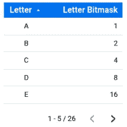

**字母**—2 FTW 的幂！

正如你在上面的图像中看到的，原始的 Wordle 使用了 26 个字母，所以把字母位掩码想象成一个由 25 个 0 和 1 组成的移动序列。

如果我将这些 0 和 1 视为二进制数，并将其转换为十进制数，我会得到字母位掩码:

```
A = 0000000000000000000000000000001 =          1
B = 0000000000000000000000000000010 =          2
C = 0000000000000000000000000000100 =          4
D = 0000000000000000000000000001000 =          8
E = 0000000000000000000000000010000 =         16
F = 0000000000000000000000000100000 =         32
................................................
X = 0010000000000000000000000000000 =  8,388,608
Y = 0100000000000000000000000000000 = 16,777,216
Z = 1000000000000000000000000000000 = 33,554,432
```

至此，我可以开始分析 Wordle 的词库了。我先算几件事:

*   **长度**:在原来的 Wordle 中，这将始终是 5。这里没有惊喜。
*   **单词位掩码**:这是一个编码单词使用的**唯一**字母的数字。
*   **唯一字母**:一个单词使用多少个不同的字母。

让我简单解释一下**字位掩码**是如何计算的。

我开始分离组成一个单词的 5 个字母，然后我移除任何重复的字母(`GROUP BY letter`为我做了这件事)，最后我添加剩下的字母的单独字母掩码。一些例子:

```
BITMASK(ADDED) → {A,D,D,E,D} → {A,D,E} → {1,8,16} → 25
BITMASK(FADED) → {F,A,D,E,D} → {A,D,E,F} → {1,8,16,32} → 57
BITMASK(FACED) → {F,A,C,E,D} → {A,C,D,E,F} → {1,4,8,16,32} → 61
BITMASK(DECAF) → {D,E,C,A,F} → {A,C,D,E,F} → {1,4,8,16,32} → 61
```

请注意，FACED 和 DECAF 具有相同的单词 bitmask，因为它们都使用相同的字母，尽管顺序不同。在 Wordle 的词典中，这是仅有的两个带有 A、C、D、E 和 F 的单词:

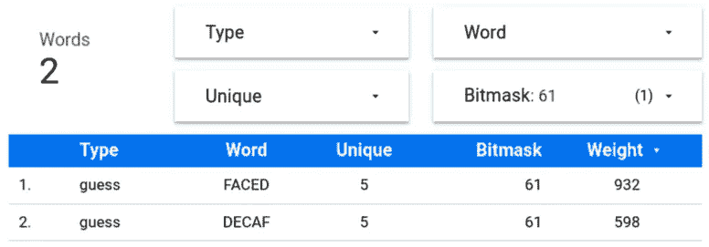

这太可怕了:如果你倒着读，你会得到无咖啡因咖啡。我想我应该做 666 位掩码…

> **趣闻** : Wordle 让你玩 14 个单词，这些单词可以由字母 A、D、E、r 组合重复而成，你知道几个？(完整列表在最后)

计算一个单词使用了多少个独特的字母非常简单:我只需要数一数单词 bitmask 中有多少个 1。

Google BigQuery 有一个`BIT_COUNT(expression)`功能，这个功能正如其名:计算`expresion`中有多少个 1。

让我们来看一些单词位掩码，它们的二进制等价物，并计算 1 的个数:

```
BIT_COUNT(BITMASK(ADDED) = BIT_COUNT(25) = BIT_COUNT(0b011001) = 3 
BIT_COUNT(BITMASK(FADED) = BIT_COUNT(57) = BIT_COUNT(0b111001) = 4 
BIT_COUNT(BITMASK(FACED) = BIT_COUNT(61) = BIT_COUNT(0b111101) = 5 
BIT_COUNT(BITMASK(DECAF) = BIT_COUNT(61) = BIT_COUNT(0b111101) = 5
```

让我们看看考虑到独特字母的数量，有多少个解决方案单词:

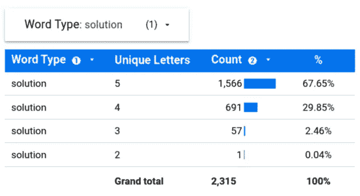

当有疑问时，选择一个有 5 个不同字母的单词，而不是一个有 4 个不同字母的单词

当你只剩下一次机会，而你无法决定到底是去做还是去做的时候，这个信息可能会很有用。

每 3 个单词中，2 个单词有 5 个字母，1 个单词有 4 个字母。因此，最有可能的答案是 do:有 5 个独特字母的单词。

也许只是我，但一个单词的独特字母越少，我就越难解决。

> **有趣的事实**:只有一个解决方案使用了两个不同的字母。别担心，我不会破坏惊喜的。

现在，我将借用密码分析中的一个技巧，我将执行一个快速字母频率分析，以确定字母在 Wordle 的词典中是如何使用的，但仅限于解决方案单词:

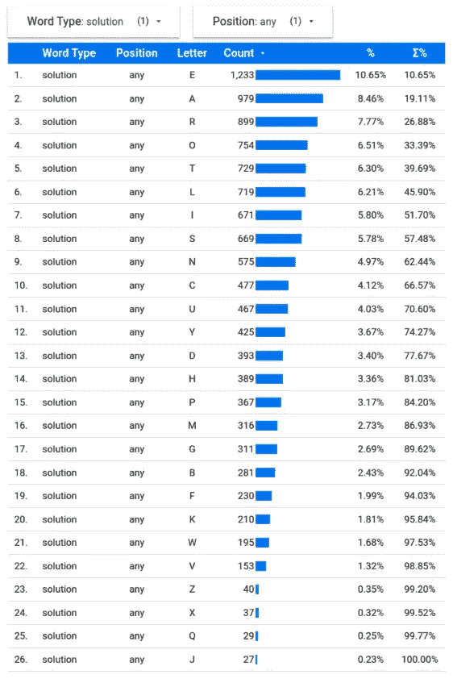

j 一点都不红，E 统治党！

Wordle 解决方案中最常见的字母是 E、A、R、O 和 T，所以一个好的起始单词**应该是包含所有这些字母的单词**。

最不常用的字母是 Z、X、Q 和 j。很可能，你不会遇到使用它们的单词。

> **有趣的事实**:在 2315 个答案中，只有 27 个单词使用了字母 J(最少使用的)，小了两个数量级。所以是的，非常罕见。

利用单词的位掩码，很容易找到前 5 个字母恰好出现一次的所有单词:

```
BITMASK(EAROT) → {E,A,R,O,T} → {A,E,O,R,T} → 671761
```

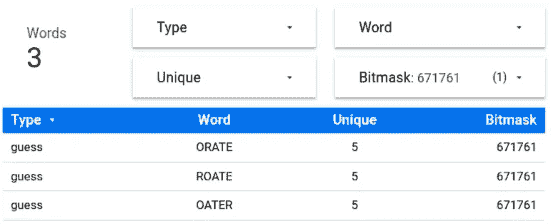

注意，我只是在过滤位掩码:这确实是仅有的三个单词，分别是 E，A，R，O 和 T

可悲的是，这些单词都不是一个解决方案，所以即使它们是优化的猜测，也不可能在第一轮就解决 Wordle。☝

这是很好的开始词，这三个词都有相同的概率在你的第一个回合揭开🟨's 的面纱。

但是…我们能做得更好吗？🤔

肯定！

得到🟨's 很好，但得到🟩's 更好！这些词中有哪个更有可能揭开🟩's 的面纱？

为了回答这个问题，我需要将字母频率分析扩展到每个字母在解决词中的位置:

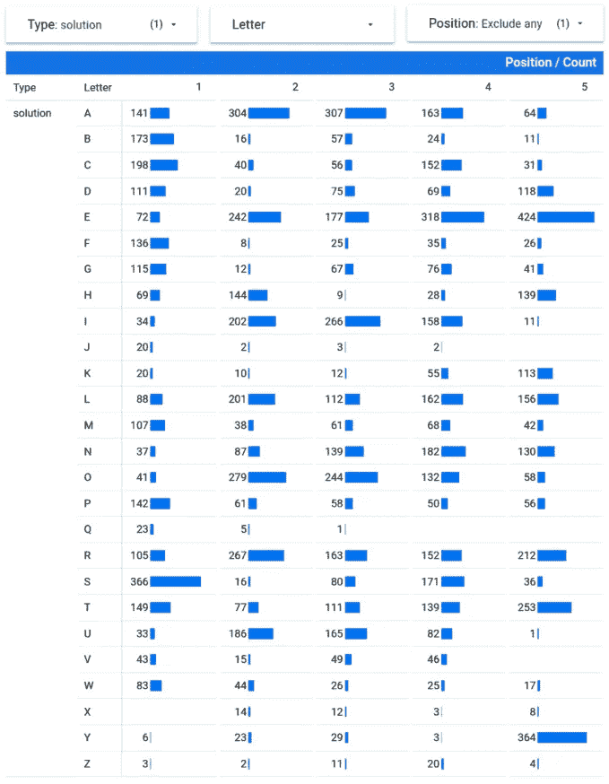

你一定会喜欢数据透视表的

回到 ORATE、OATER 和 ROATE，让我们找出每个字母在每个位置的出现频率:

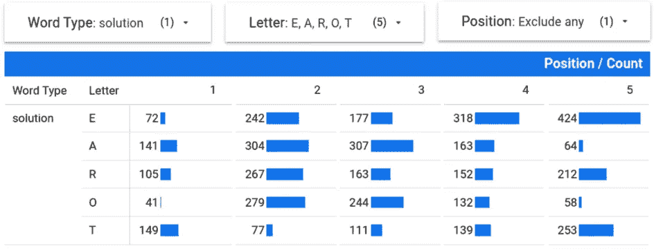

**O** 在第一或第五个字母中不太受欢迎，但仍设法排在前五个字母中

O**作为第一个字母不太受欢迎，所以看起来 ORATE 不是一个好的选择。然而， **A** 是表现最好的第三个字母，而 **E** 作为第五个字母的表现是该位置上 **R** 的两倍。**

为了了解一个单词在揭开🟩面纱时有多“好”，我需要想出一些公式来考虑所有这些频率，并输出一个数字，我可以用这个数字来以一种简单的方式比较两个单词的效率。

让我来定义一些事情。

首先，**位置字母权重** ( **PLW** 简称)是一个字母在某个位置出现的次数。我将把它表示为:

```
PLW(letter, position_in_word)
```

所以，`**PLW(O, 1) = 41**`因为 **O** 作为第一个字母出现了 41 次。同样，`**PLW(E, 5) = 424**`因为 **E** 作为第五个字母出现了 424 次。

接下来我要把**字权重**(简称 **WW** )定义为每个位置字母权重之和。 **WW** 可以根据 **PLW** 轻松定义为:

```
WW(word) = PLW(1st_letter, 1) + PLW(2nd_letter, 2) + PLW(3rd_letter, 3) + PLW(4th_letter, 4) + PLW(5th_letter, 5)
```

从理论上讲，WW 越高，一个单词就越有可能揭开一个或多个🟩.的面纱回到候选词:

```
WW(ROATE) = PLW(R,1) + PLW(O,2) + PLW(A,3) + PLW(T,4) + PLW(E,5)
WW(ROATE) = 105 + 279 + 307 + 139 + 424 = 1,254
WW(ORATE) = 41 + 267 + 307 + 139 + 424 = 1,178
WW(OATER) = 41 + 304 + 111 + 318 + 212 = 986
```

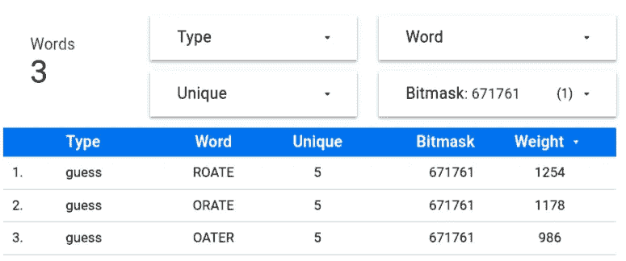

按位掩码过滤和按权重降序排序

看起来 ROATE 是“最重”的词，因此它有更多的机会揭开🟩's.的面纱

但是…我们能做得更好吗？🤔

我想是的！

选择 ROATE 纯粹是基于这样一个事实，即这些字母在任何位置的解决方案单词中使用最多。

现在我有了所有字母的位置字母频率，让我来计算所有 12，972 个单词的权重，并检查 ROATE 是否确实是最佳起始单词:

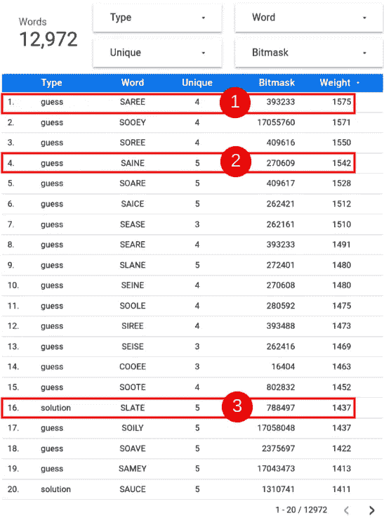

1.  最重的单词是 SAREE(1575)，有 4 个不同的字母
2.  具有 5 个唯一字母的最重的猜词是 SAINE (1，542)
3.  最重的解字是 SLATE(1437)

我会放弃纱丽，因为它只有 4 个唯一的字母(记住，我想使用 5 个不同的字母来最大化熵)，我更喜欢 SLATE 而不是 SAINE，因为它们的重量非常相似，SLATE 可能会给我带来令人满意的即时胜利！🎯

如果你想知道，罗特排名第 160🤦🏻‍♂在有 5 个独特字母的加权单词列表中。如果我们忘记整体字母频率，而是考虑位置字母频率和单词权重，这看起来并不好。

> **趣闻**:你可以用的“最坏”起始词是“IMSHI”(澳大利亚军事俚语:走开；关了)。它不仅权重最低(191)，而且是一个猜测词，因此它永远不会是日常难题的解决方案。这就像在德州扑克中玩不同花 2-7……你真的需要成为 Wordle 的道尔·布朗森才能成功。♥♠♦♣

太好了！我们有我们优化的第一个猜测:**石板。希望沃尔多能揭示一些🟨's 和🟩's.的故事**

但是…我们能做得更好吗？🤔

完全同意。

第一个转弯已经确定。沃尔多揭开了一些⬛'s，🟨's 和🟩's.现在呢？

优化第一个要用的词很棒。但是我不太可能(2，370 分之一)一步就解决 Wordle。我需要一个策略。而且越简单越好:我不想记住复杂的决策树、表格、百分比或者没完没了的单词列表。

使用第一步来测试字母(S，L，A，T 和 E)让我覆盖了 37.40%。这略低于前 5 个字母(见下图中的矩形①)所覆盖的 39.69%。

如果我用两个招式测试前 10 个字母(E，A，R，O，T，L，I，S，N，C)会怎么样？我将覆盖 66.57%(下图中的矩形②)，我还有 4 个转弯。干净利落。

按照这个逻辑，用三步棋来测试前 15 个字母(E、A、R、O、T、L、I、S、N、C、U、Y、D、H 和 P)将覆盖率提高到 84.20%(下图中的矩形③)，我还剩 3 次机会来完成游戏。我喜欢这种可能性。🎲

扩展这种逻辑来测试前 20 个字母(E，A，R，O，T，L，I，S，N，C，U，Y，D，H，P，M，B，G，F 和 K)并不是很有趣，因为当投资一个额外的移动时，回报会递减:覆盖率只跳到 95.84%(下图中的矩形④)，但我只剩下 2 次机会来完成游戏。风险极大。

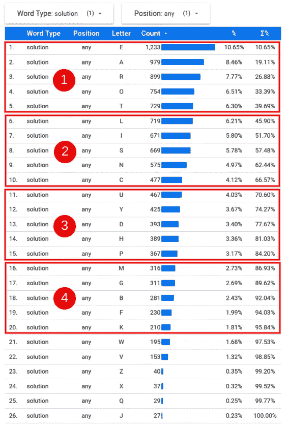

3 轮测试 15 个不同的字母看起来像甜蜜点

我打算用 3 个回合来解决。这意味着我将测试前 15 个字母。让我们找出有多少个包含 5 个独特字母的单词包含了前 15 个字母。再次充分利用`BIT_COUNT()`:

**words_1_gram** — BIT_COUNT()和分析函数总是被使用

Google BigQuery 轻松搅动数据，发现在 12，972 个单词中，有 2，760 个单词包含前 15 个字母中的 5 个独特字母:527 个答案和 2，233 个猜测。很好。

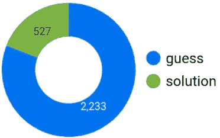

荷马批准了🍩图表

下一步是检查所有使用前 15 个字母的 3 个单词(三联体)的排列。比如:(成人，HYPER，SONIC)。计算和检查所有的排列可能是棘手的，因为**潜在地**谷歌大查询必须探索:

```
2,760 X 2,759 X 2,758 = 21,001,728,720 triplets
```

这是一个“很大”的数字，但绝对不是 Google BigQuery 不能处理的。

再次利用`BIT_COUNT()`函数，执行一些位运算并使用一些创造性的修剪，不到 4 秒钟就得出答案: **299，544 个**三元组。

这次我就不告诉你 SQL 查询的血腥细节了

这些三胞胎中的任何一个都是前三次尝试的好选择:

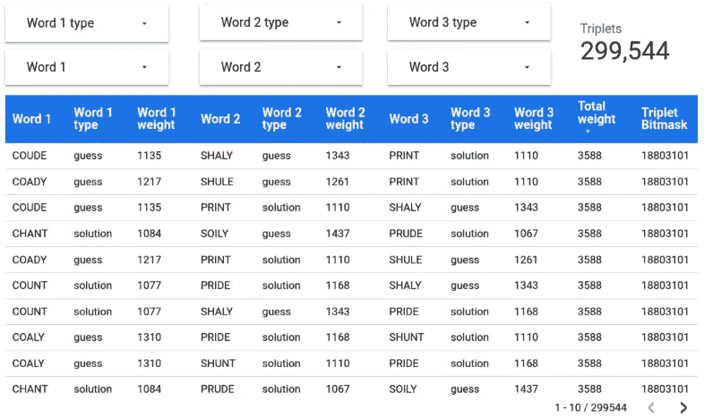

最大总重量为 3，588 的多种组合

但是…我们能做得更好吗？🤔

当然啦！

仍然可以做一些事情来进一步优化。

首先，我可以丢弃所有有猜测词的三元组，只保留那些有 3 个解决词的三元组。这从 299，544 个缩小到只有 2，730 个三胞胎。

其次，我可以选择总重量最高的三胞胎，因为这将使我有更大的机会尽早展示🟩's。原来只有 6 个组合权重为 3505 的三元组是由这 3 个词排列而成的:卷曲、点和阴影。

整体最佳三元组(COUDE，PRINT，SHALY)的组合权重为 3588，仅由解字(CURLY，POINT，SHADE)组成的最佳三元组**为 3505。他们的体重是如此的相似，以至于用猜词抛弃三胞胎并一杆进洞是值得的！⛳**

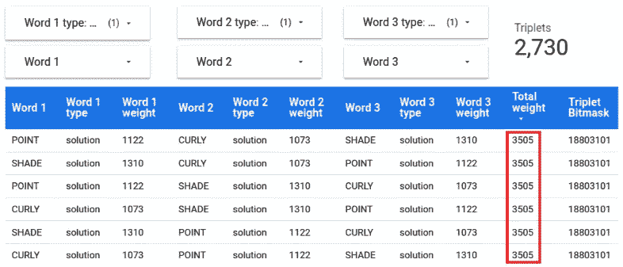

由 3 个解字组成的三元组按组合权重降序排列

第三，为了尽可能多地揭示信息，可以按重量降序播放这些单词:

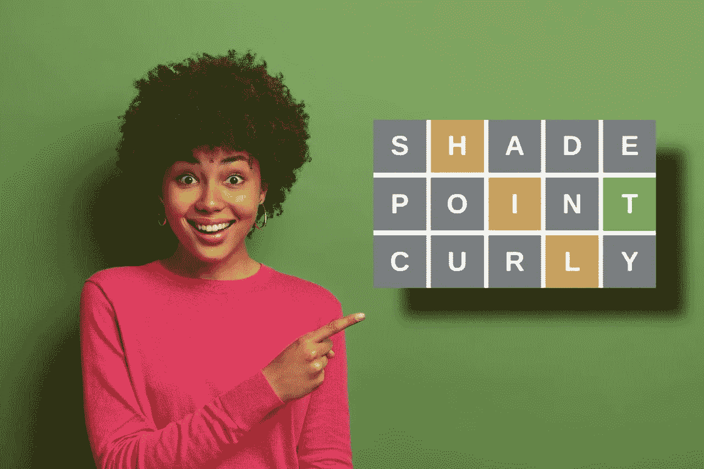

由 [wayhomestudio](https://www.freepik.com/wayhomestudio) 通过 [Freepik](https://www.freepik.com) 拍摄的令人敬畏的图像——用 [Wepik](https://wepik.com/) 编辑

你有它！

第一步是玩阴影游戏。

最有可能的是，你需要更多的信息:第二步棋的玩法。

机会是你仍然需要更多的🟨's 和🟩's.在你的第三步使用卷毛。

在前 3 步之后，在第四轮中，应该只是使用🟩's 和重新排列🟨's 来解决单词的问题。

如果我在第四步中没有足够的信息来解决，我将需要探索更多的字母。我有 3 个特定的单词，我喜欢在第 4 回合使用，包括字母 g、m 和 b(接下来的 3 个最受欢迎的字母)以及前 3 个动作中的任何🟨元音，试图将它们变成🟩's.。任何这些单词的覆盖率都达到 92.04%。

类似地，对于第五个移动有 5 个单词，涉及 f、k、w、v 中的两个，以及来自过去回合的任何🟨元音，以覆盖高达 95.84%。

我不会说太多细节，因为我确信我已经给你的游戏带来了太多的破坏…🤦🏻‍♂

但是…我们能做得更好吗？🤔

我很确定！

我不认为这个策略是最优的，因为它很可能不能用最少的步骤解决问题。相反，它很容易记住，而且在大多数情况下，可以解决游戏问题🤞。

你可以把它想象成类似于初学者解魔方的方法(例如一层一层的):需要记住的短算法很少**,但是**与 speedcubing 中使用的 Friedrich 方法相比非常慢。

当然，这个策略只是前 3 步的常规，但在第 6 步会把 Wordle 变成一个逻辑难题，而不是运气。

快乐的文字！

动态战略:

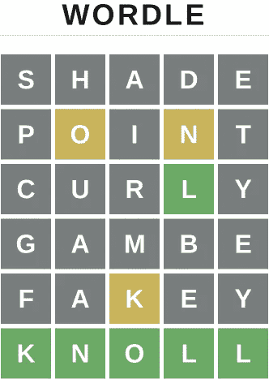

Wordle 219 —第 4 圈测试 **B、G、M** 。转动 5 次测试 **F，K** 。我花了一些时间在第 6 个弯，直到我想出一个单词，这个单词与迄今为止没有丢弃的任何字母和绿色的 L 有意义。超级辛苦但是过瘾！

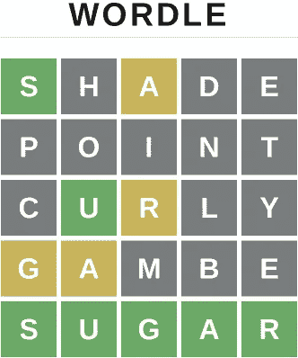

Wordle 220 —第 4 圈测试 **B，G，**， M 。第五回合重新安排🟨并解决

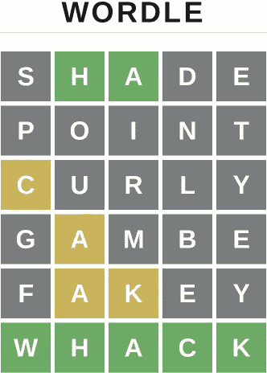

Wordle 221 —第四轮测试 **B，G，** **M** 。第五转测试 **F，K** 。第 6 回合重新安排🟨并解决。在所有尚未被丢弃的字母中，只有 **W** 有意义

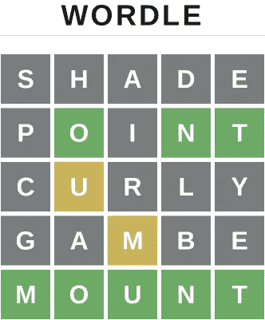

Wordle 222 —第 4 圈测试 **B，G，**， M 。第五回合重新安排🟨并解决

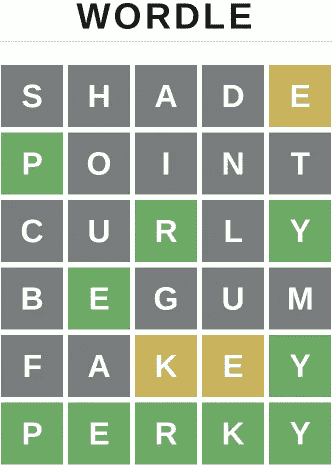

Wordle 223 —第 4 圈测试 **B** 、 **G** 、 **M** 和 **E** 的位置。转动 5 圈止回阀 **F，K** 。第 6 回合重新安排🟨并解决

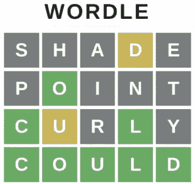

Wordle 224 —第 4 回合重新排列🟨并解决

> **有趣的事实解决了**:使用 A、D、E、R 的 14 个单词是:

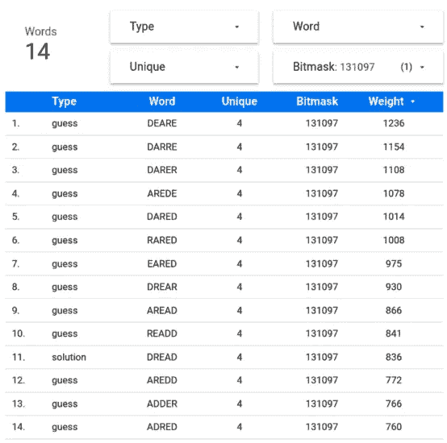

如果你设法来到这里:谢谢你！👍