# React 中的抽象形式

> 原文：<https://betterprogramming.pub/form-abstraction-d8b60eff773c>

## 创建更简洁的表单


作者照片。

在过去的一周里，我完成了 Mosh Hamedani 的一些课程，以巩固我在熨斗学校学到的技能。虽然 Mosh 没有任何 Ruby 课程，但我一直在显著提高我的 JavaScript 和 React 技能。我目前正在上的课程是 Mosh 的[精通 React](https://codewithmosh.com/p/mastering-react) 课程，我强烈推荐。这有点贵，但绝对物有所值。另一个选择是像我一样:每月订阅他的所有课程。

你会学到很多巧妙的技巧，比如在 JSX 文件中写下以下内容:

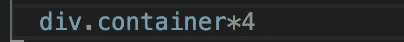

其结果是:

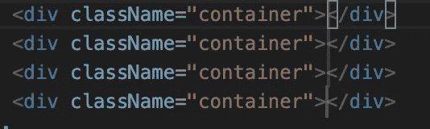

但是今天我想讲讲我们是如何在整个程序中抽象形式的。完成后，您应该能够让程序的表单看起来像这样:

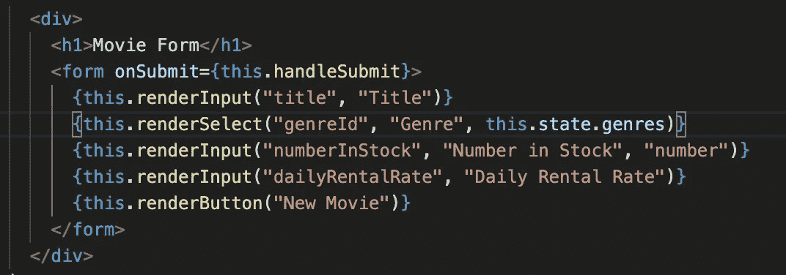

# 第一步

创建一个名为`form`的 JS 或 JSX 文件，创建一个 React `form`类，并移除 render 和 return，使该类为空。

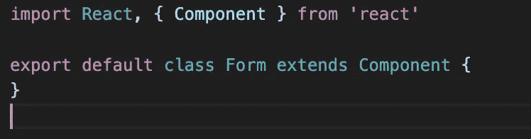

# 第二步

为数据创建类的状态，以跟踪各种输入的不同值。您可以在状态中添加额外的键值对，比如 errors。

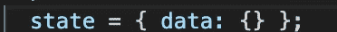

# 第三步

创建`handle change`和`submit`功能。您可以在这些函数中添加其他重要的东西，如错误处理，这将使函数变得更大。这将证明有两个不同的功能来处理`submit`是正确的。

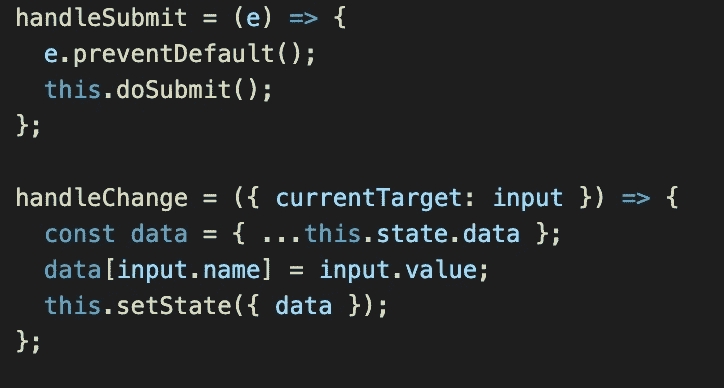

您的`handle submit`是所有表单都需要使用的表单提交的公共方面。`e.preventDefualt()`防止提交后刷新表单。`this.doSubmit()`是一个函数，由使用表单的组件发送，允许对提交进行独特的处理。

`handle change`将状态更新为输入字段中的当前值。首先，为了得到当前的目标(你的输入域被改变了),你正在析构 props，并把`currentTarget`的名字设置为 input 以使它更易读。

接下来，使用 spread 操作符设置一个接受所有当前状态的变量(`data`)。在下面一行中，将`data`设置为输入字段的名称，并将键的值设置为输入的值。例如，`data`可能是这样的:`{‘title’: “The Social Network”, numberInStock: 3}`。请记住，这将在输入字段的值发生每次更改时更新状态，如果输入字段尚未更改，则它不存在于状态中，而是在输入字段第一次更改时创建。最后，更新当前状态。

# 第四步

创建表单中使用的各种字段:

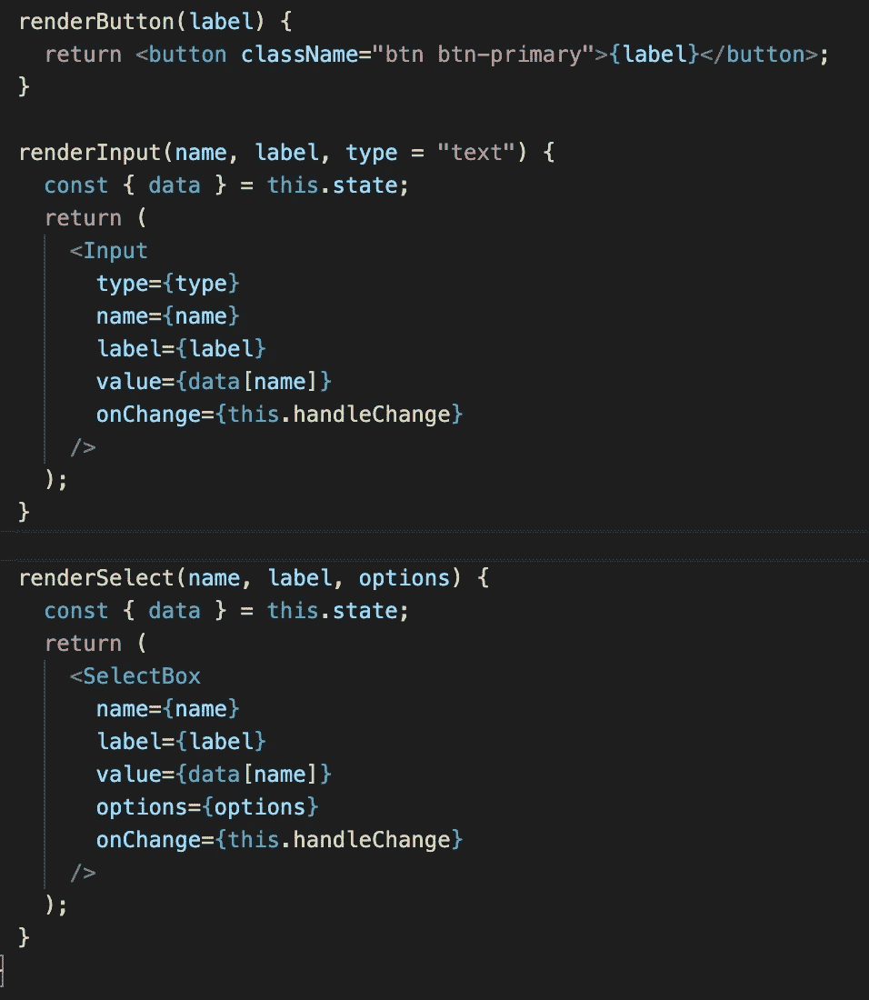

按钮是不言而喻的——它返回一个按钮，标签是发送过来的任何东西(例如`submit`)。

`renderInput`使用输入字段的输入抽象，因为输入经常通过程序使用，比如搜索框。你是通过类型发送的，自动是`text`。名称用作输入的标识符，标签是用户将看到的，值是保存在 state 中的输入框的当前值，最后`onChange`函数保持状态更新。

`renderSelect`是类似的，除了`options`(一个对象数组)是通过。在本例中，选项是电影类型的流派:

```
[{name: “horror”, _id: “123”}, {name: “comedy”, _id: 321}]
```

但是其他的都和输入一样。

让我们更仔细地看看输入和选择框:

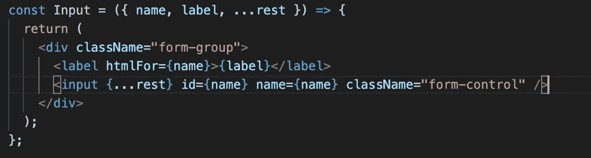

因为您在输入之外使用名称和标签，所以您需要显式声明您的输入，并且您可以如下设置输入的其余部分。

`…rest`是其他变量，像`value`和`type`。您不需要声明它们，因为您正在一起使用这些属性来声明输入。如下图所示:

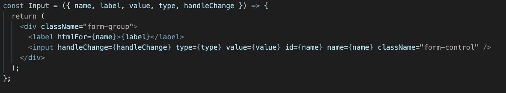

选择框更复杂，但是让我们来浏览一下:

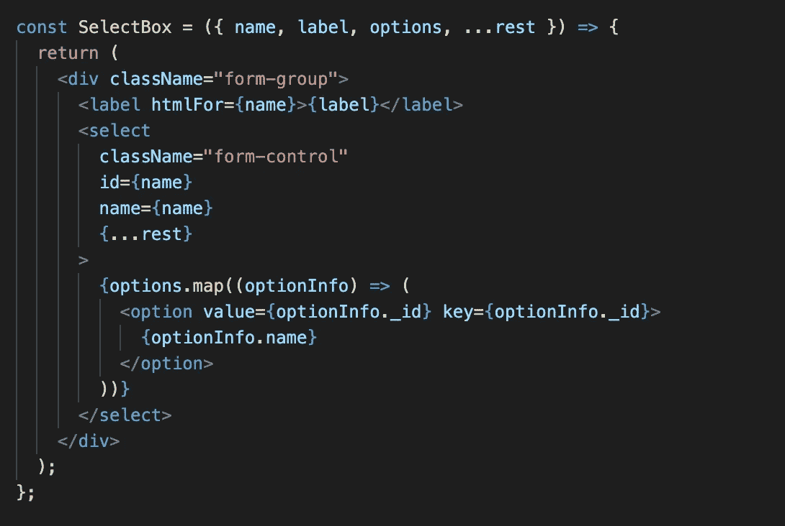

总之，您设置了一个标签和一个`select`标签，并遍历选项以显示每个`option`标签。

您可以在表单中添加其他字段，如单选按钮和文件选择器。这可以使用`renderRadioButton`或`renderFile`来完成。如果你认为代码太长(比如选择框)或者在程序中使用(比如输入)，考虑把它抽象成自己的类。

现在你已经设置好了我们的基本表单，让我们来学习如何使用它。

# 第五步

您的特定表单类将从您的表单类`Form`继承。这允许在特定的类中使用像`renderInput`这样的函数。它这样做的方式是通过扩展`form`而不是`component`。

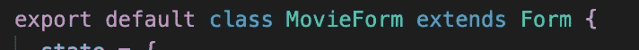

# 第六步

现在，您将设置状态，并在状态中为选择框添加不同的选项:

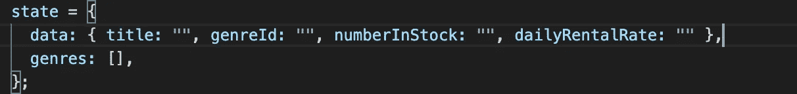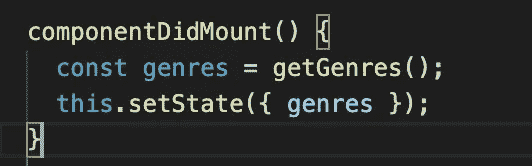

`getGenres()`是一个获取电影类型的函数，但我不会深入讨论。剩下的就很简单了。

# 第七步

还记得你在`handle submit`里用的`doSubmit()`吗？这就是了。它处理提交的所有独特之处。

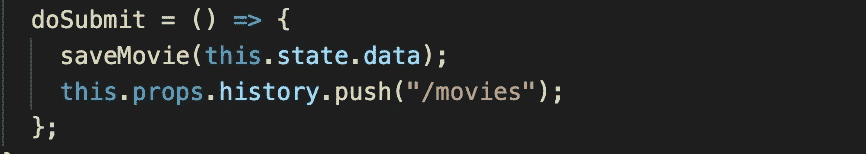

# 第八步

创建您的表单:


现在您可以使用`renderInput`、`renderButton`和`renderSelect`函数来创建您的表单。瞧，您已经完成了，可以通过应用程序使用表单(例如登录):

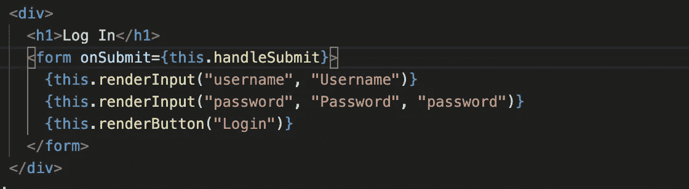

# 结论

这真的让我想起了我最近在约翰·奥特的书《软件设计哲学》中读到的一些东西，他在书中谈到了战略性编程而不是战术性编程。

战术方法可能只是像往常一样创建一个表单。这似乎是一种更快的方法，但它要求开发人员每次需要时都创建一个全新的表单，这非常耗时。本文中的策略方法可能需要更长的时间来实现，但是在创建新表单时，只需要 5 分钟，而不是 20 分钟，从长远来看，确实节省了时间。

所以下次你编程的时候，想想你在做什么，从战略上来说，这是不是你代码的最佳选择。