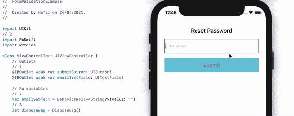
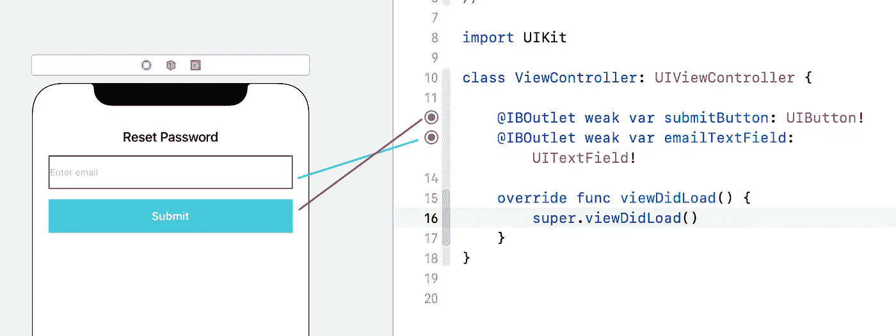
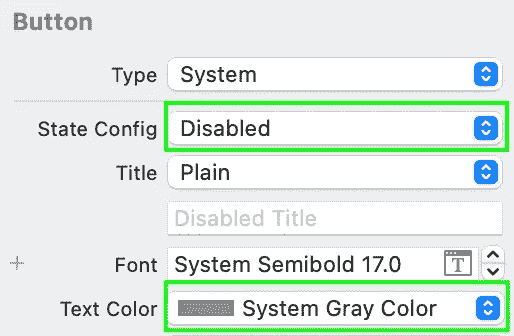
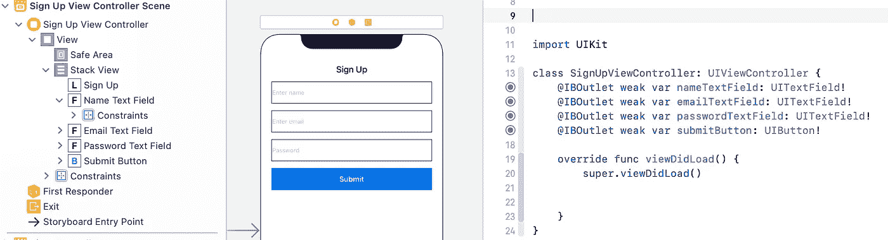

# RxSwift 简化了 iOS 应用中的表单验证

> 原文：<https://betterprogramming.pub/form-validation-in-ios-apps-made-easy-with-rxswift-266123042bb6>

## 用两个实例实现输入表单验证

杰里米·毕晓普在 [Unsplash](https://unsplash.com/?utm_source=unsplash&utm_medium=referral&utm_content=creditCopyText) 上拍摄的照片

我知道“RxSwift”本身听起来是一件很大很难的事情。当我开始工作时，我也有同样的感觉。我们都是学习者。最好的学习方法之一是在现有项目中采用该实现。在本文中，我们将重点介绍 RxSwift 中表单验证的实现。

RxSwift 是 Swift 语言的[反应扩展](http://reactivex.io/) (Rx)。它是一个著名的库，被 iOS 开发者广泛使用，尤其是在 MVVM 模式中。关于定义和概述的更多理解，你可以参考 [Hackernoon](https://hackernoon.com/mvvm-rxswift-on-ios-part-1-69608b7ed5cd) 和 [Raywenderlich](https://www.raywenderlich.com/books/rxswift-reactive-programming-with-swift/v4.0/chapters/1-hello-rxswift) 写的好文章。

# 观察对象、订户和受试者

首先，你应该知道 RxSwift 基本上是关于可观察性和订户的。两者都是 RxSwift 的重要元素。

1.  *可观察的*。正如这个词所描述的，它是任何可以被观察到并能够通知其观察者的变量或物体。所以，它会不断告诉观察者事件的变化。
2.  *订户*又名观察者。它订阅可观察对象以持续接收通知。
3.  *臣民。简单来说，它具有两种能力:被观察者和订阅者。*

## **数据绑定**

将数据绑定到预期动作或用户界面的过程。

例如，在“重置密码”表单中，要求用户输入有效的电子邮件，以便能够单击提交按钮。

在这种情况下，我们需要具备以下条件:

1.  一个变量，比如说，`isValidEmail`(一个布尔值)，其中的值是根据在文本字段中输入的电子邮件确定的(`isValidEmail`订阅文本字段的更改)。
2.  然后，`isValidEmail`的值被绑定到一个提交按钮。所以，每当`isValidEmail`为`true`时，按钮就会被激活。这是它的`.normal`状态。一旦变为假，按钮将变为其`.disable`状态。酷！

简而言之，值可以绑定到 UI，反之亦然。

## **处理袋子**

在 RxSwift 中，订阅不能自行处理。因此，我们需要创建一个包，用于收集所有的一次性订阅，以适当地避免内存泄漏。您将在代码中看到它的用法。

照片由[Kinga koodziejska](https://unsplash.com/@locked_in_the_lens?utm_source=unsplash&utm_medium=referral&utm_content=creditCopyText)在 [Unsplash](https://unsplash.com/?utm_source=unsplash&utm_medium=referral&utm_content=creditCopyText) 上拍摄

我们将处理两种情况:

1.  重置密码表单(单一文本字段验证)
2.  注册表单(多文本字段验证)

# **重置密码表单**

在本节中，我们将使用电子邮件文本字段的观察者。一旦该值成为一个有效的电子邮件，“提交”按钮将自动成为启用，反之亦然。哇！🤩

首先，创建一个新项目并添加一个`UITextField`和`UIButton`网点。然后，将插座连接到 ViewController:

将插座链接到 ViewController

用`.gray`文本颜色设置禁用状态的提交按钮属性，以区分`rx`发射事件期间的按钮状态(您可以通过编程设置`.disabled`的文本颜色)。

现在，我们需要更新我们的 ViewController。下面是代码，解释在后面:

1.  在顶部导入 RxSwift 和 RxCocoa 库。
2.  添加新的变量调用`emailSubject`。您会注意到我们使用`BehaviorRelay`作为 email 变量，它是类型`String`(可选)。它是一个`Subjects`类型，它可以从 TextField 接收一个值，并在每次值改变时(包括初始值)向 subscriber 发出事件。行尾的“值”是所需初始值的参数。
3.  如前所述添加`disposeBag`(释放内存)。
4.  设置 UI 绑定。添加一个新函数`setupBindings()`，并添加代码将 TextField 中的任何更改绑定到`emailSubject`。
5.  如果这些步骤发生，`emailSubject`将发出事件。检查流量。
    a .在`map()`中，一旦接收到事件，我们就将该值映射(转换)到`Bool`中，以检查电子邮件字符串是否正确(使用简单的字符串扩展`validateEmail()` —检查代码的底部)。
    b .然后，我们将结果绑定到`submitButton`中以改变`isEnabled`
    的`rx`状态 c .最后，将订阅处理到那个包中。
6.  一个字符串扩展，具有使用 RegEx 验证电子邮件格式的功能。
7.  一个字符串扩展，具有使用 RegEx 验证电子邮件格式的功能。

是的，我们完成了第一个验证表单。提交按钮现在是安全的，不能点击，除非电子邮件是有效的。

**额外提示💡**

实际上，可以通过添加一个新变量`isValidEmail`作为`Observable<Bool>`来捕捉`emailSubject`结果，从而简化数字 5。代码如下:

# 注册表单

在本节中，我们将对多个字段进行相同的验证。该表单有三个字段:姓名、电子邮件和密码。这些要求是:

1.  名称不能为空或`nil`
2.  检查电子邮件是否有效
3.  确保密码格式正确，超过六个字符(这只是一个示例，您可以使用 regex 或其他方法添加自己的规则)

为了使我们的代码更简洁，我们将把它分成 ViewController 和 ViewModel。ViewController 将处理 UI 设置和绑定，而 ViewModel 将处理验证逻辑。

## 视图模型

在我们开始更新控制器之前，让我们完成作为控制器依赖项的视图模型。添加一个名为“SignUpViewModel.swift”的新文件，并添加一个新类`SignUpViewModel`，如下所示:

前面代码的解释如下。

1.  添加必要的变量来监听文本字段上的事件变化，包括名称、电子邮件和密码。
2.  独特的部分是`isValidForm`。以前，我们只检查单个字段。现在，我们使用`combineLatest()`将所有可观察值组合在一起并作为一个结果返回。因此，在 ViewController 中，订阅者只需观察`isValidForm`来确保表单当前处于有效状态。

## 视图控制器

首先，创建一个名为`SignUpViewController`的新 UIViewController，并用 TextField 和 Button outlets 向 storyboards 添加一个新场景。然后，用 SignUpViewController 连接它们。

让我们来看看 SignUpViewController。当我们使用 viewModel 时，代码得到了简化:

从这个 ViewController 中，我们了解了以下内容:

1.  为文本字段和按钮添加出口(确保像我们之前做的那样将按钮标题颜色的`.disable`状态设置为灰色)
    `submitButton.setTitleColor(.gray, for: .disabled)`
2.  从类 SignUpViewModel 创建 viewModel 对象来处理验证
3.  将文本字段绑定到视图模型
4.  将`isValidForm`的值绑定到提交按钮来自动改变按钮状态。

太棒了。现在您已经掌握了使用 RxSwift 进行表单验证。试着在你现有的项目中逐步实现它们，也许会有更多的规则和变化。您还可以探索进行表单验证的其他方法。在这里下载我的完整源代码。

希望这篇文章能帮助你学习 RxSwift。感谢阅读。别忘了鼓掌👏并与您的朋友分享。非常欢迎反馈。

# 参考

[https://www . raywenderlich . com/books/rx swift-reactive-programming-with-swift/v 4.0/chapters/1-hello-rx swift](https://www.raywenderlich.com/books/rxswift-reactive-programming-with-swift/v4.0/chapters/1-hello-rxswift)

[https://hacker noon . com/mvvm-rx swift-on-IOs-part-1-69608 b 7 ed 5 CD](https://hackernoon.com/mvvm-rxswift-on-ios-part-1-69608b7ed5cd)

[https://www . raywenderlich . com/books/rx swift-reactive-programming-with-swift/v 4.0/chapters/3-subjects # TOC-chapter-007-anchor-001](https://www.raywenderlich.com/books/rxswift-reactive-programming-with-swift/v4.0/chapters/3-subjects#toc-chapter-007-anchor-001)

[https://github.com/ReactiveX/RxSwift](https://github.com/ReactiveX/RxSwift)