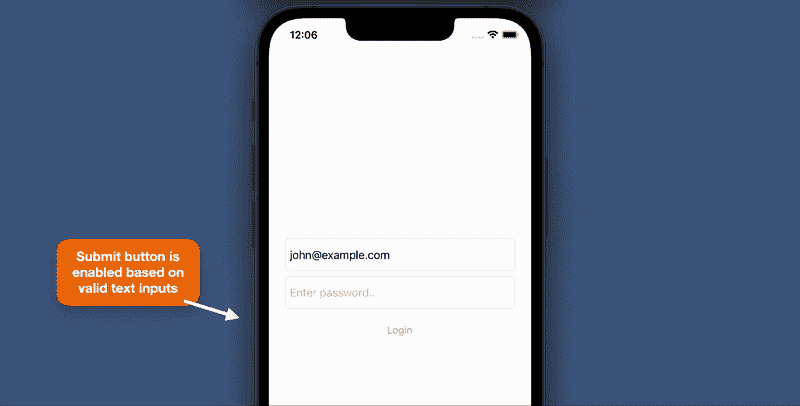
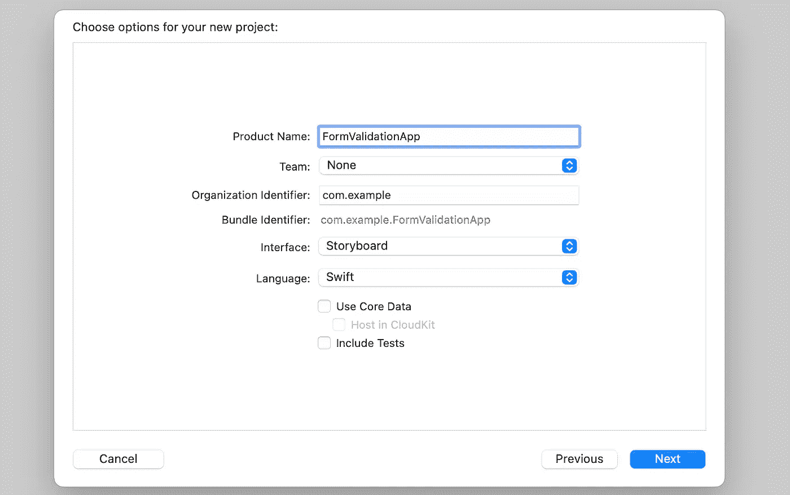
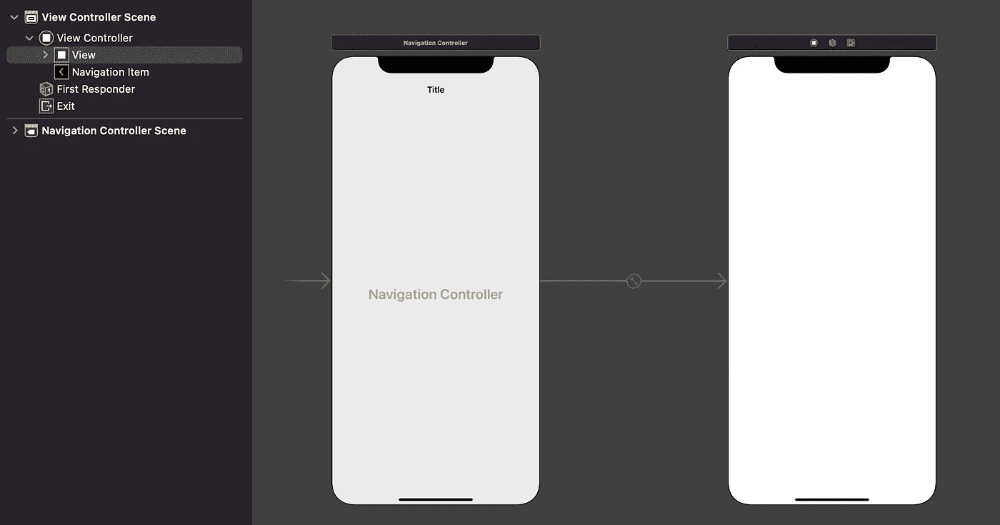

# UIKit 中的表单验证通过 Combine 变得简单

> 原文：<https://betterprogramming.pub/form-validation-in-uikit-made-easy-with-combine-dd8245bacb6c>

## 通过反应式方法简化

照片由[威森王](https://unsplash.com/@wesson?utm_source=unsplash&utm_medium=referral&utm_content=creditCopyText)在 [Unsplash](https://unsplash.com/?utm_source=unsplash&utm_medium=referral&utm_content=creditCopyText) 上拍摄

> Combine 框架提供了一个声明性的 Swift API，用于随时处理值。这些值可以表示多种异步事件。—苹果开发者文档

[联合收割机](https://developer.apple.com/documentation/combine)在 WWDC19 和 iOS13 中推出。在 Combine 中有两个重要的元素，发布者和订阅者。发布者仅用于公开可随时间变化的值，而订阅者用于从发布者接收值。

# 入门指南

在本文中，我们将学习如何:

1.  用 UITextField 和 UIButton 创建一个简单的登录表单
2.  使用 Combine 被动地验证用户输入
3.  根据用户输入启用或禁用提交按钮
4.  连续观察表单的多种状态——加载、成功和失败

请注意，这个项目是在 Swift 5 中用 iOS13+和 Xcode 13.4 开发的。

下面是我们将从本教程实现的应用程序的最终输出。

本教程的最终输出。图片作者。

# 1.创建新的 UIKit 项目

选择文件>新建>项目。选择一个应用程序，取消选中“包括测试”复选框(在本教程中不使用)。

使用故事板和 Swift 创建新的 UIKit 项目。图片作者。

# 2.在视图控制器中添加文本字段和按钮

我们将使用默认的`ViewController`作为主登录视图控制器。在此示例中，UI 对象是以编程方式添加的。如果你愿意，你可以使用故事板。我们将添加两个文本字段(电子邮件和密码)，以及一个提交按钮。

下面是上面代码的分解:

1.  使用通用样式和配置定义 UI 对象(堆栈视图、电子邮件文本字段、密码文本字段和提交按钮)。
2.  堆栈视图用作表单元素的主要容器。
3.  将堆栈视图的约束垂直设置在视图的中心，水平填充为`24px`。然后，将文本字段和按钮设置为相同的高度，`48px`。
4.  `onSubmit()`，点击`submitButton`时会调用的功能。

在下一节完成视图模型之后，我们将再次访问这个视图控制器来更新验证部分。

# 3.创建视图模型

在本节中，我们将创建登录表单使用的视图模型，其中包含发布者和一些逻辑。

创建一个名为`LoginViewModel.swift`的新 Swift 文件，并插入下面的代码。

以下是代码的解释:

1.  通过子类化`[ObservableObject](https://developer.apple.com/documentation/combine/observableobject)`，视图模型能够向订阅者发送其`@Published`属性的更改值。
2.  枚举来管理视图的不同状态。
3.  每次用户进行更改时将被更新的`Publishers`列表。此外，它还提供了通知订户更新值的能力。
4.  `isValidUsernamePublisher`和`isValidPasswordPublisher`包含验证用户输入的逻辑，这在`map`闭包中完成。`eraseToAnyPublisher()`用于将最终值返回给任何发布者(在本例中为`isSubmitEnabled`)。
5.  `isSubmitEnabled`结合将要订阅`submitButton`的`isValidUsernamePublisher`和`isValidPasswordPublisher`的值来启用或禁用。
6.  一个用简单的用户名和密码检查来模拟登录请求的功能。
7.  视图的`state`会在成功或失败时更新。
8.  验证电子邮件格式的计算属性。

很好，让我们更新我们的视图控制器，用我们的视图模型实现验证。

# 4.更新登录视图控制器

第一个要更新的部分是导入`Combine`框架。然后，初始化视图模型和`AnyCancellable`设置。 [AnyCancellable](https://developer.apple.com/documentation/combine/anycancellable) 使订阅者可以释放发布者。它将取消订阅并释放所有分配的资源。

添加一个错误标签，该标签将在登录无效时出现。然后，将标签添加到堆栈视图的底部。

接下来，我们将添加发布者处理程序和一些助手函数。

下面是上面代码中发生的情况:

1.  `NotificationCenter` publisher 用于观察文本字段的变化，并立即处理`map`中的值。然后，在`assign`中，该值被更新到视图模型变量中。
2.  `isSubmitEnabled`随着`Bool`值被检查一段时间，以启用该视图控制器中的`submitButton`。
3.  正在观察视图模型中`state`的值来更新表单 UI，如显示加载、启用按钮、显示错误。
4.  `onSubmit`函数更新为调用视图模型提交流程。
5.  `resetButton`主要是设置按钮成功后，加载或出错的状态。
6.  在此功能中，错误标签将被隐藏或显示。当错误标签消失时，我们使用`alpha`而不是`isHidden`来保持堆栈视图在相同的高度或大小。

# 5.显示成功屏幕

在最后一部分，我们将创建一个简单的屏幕，一旦表单提交成功，就会显示这个屏幕。

在上面的代码中，我们创建了一个带有标签的视图控制器，并使用`centerX`和`centerY`约束将它放置在屏幕中间。

确保向故事板添加一个导航控制器。

1.  打开`Main.storyboard`并选择视图控制器。
2.  在 Xcode 顶部菜单中，选择编辑器>嵌入>导航控制器。

嵌入导航控制器后查看控制器。图片作者。

最后更新`showResultScreen()`函数推`ResultViewController`。

# 项目已完成

恭喜你！我们已经完成了所有的步骤，项目现在可以运行了。

我们还了解了一些关于将 Combine 框架与其发布者和订阅者一起使用的知识。

完整的源代码可以从我的 GitHub [库](https://github.com/xmhafiz/medium-form-validation-uikit-combine)下载。你可以试着在你的项目中实现它，也许还可以改进我的代码。

感谢您的阅读，祝您编码愉快！

# 参考

*   苹果公司的[联合](https://developer.apple.com/documentation/combine)文档
*   [可观察对象](https://developer.apple.com/documentation/combine/observableobject)文档
*   [GitHub 项目](https://github.com/xmhafiz/medium-form-validation-uikit-combine)使用 Combine 和 UIKit 进行表单验证