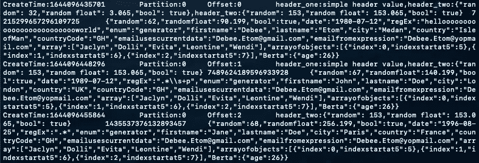
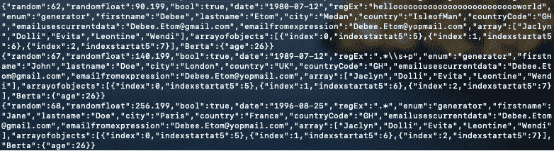
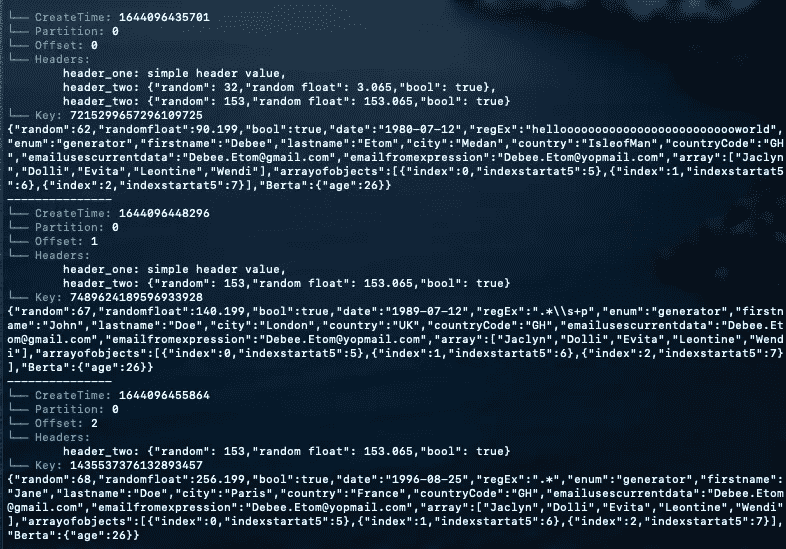

# 格式化 Apache Kafka 控制台消费者输出

> 原文：<https://betterprogramming.pub/formatting-apache-kafka-console-consumer-output-db481449d8b5>

## 消费所有信息


凯文·Ku 在 [Unsplash](https://unsplash.com?utm_source=medium&utm_medium=referral) 上的照片

任何曾经和 Kafka 一起工作过的人一定都有一些关于控制台消费者输出的想法。通常，不可避免地会出现至少两个问题:

*   *如何打印 X？—* X 可以是“key”、“partition”、“offset”、“timestamp”、“header”..所有可能非常有用但不属于默认输出的位。在 2.6 及更早的版本中，这是一个更大的问题，因为上面的一些属性根本不可用。
*   我该如何在这些乱七八糟的字符中找到我所需要的呢？ —一旦你看到自己想要的东西是什么样子，那种想出如何打印的快乐是短暂的。

如果你已经谷歌了所有这些，你知道你可以使用`**kafkacat**`，这是一个完全可行的选择。然而，我给你提供了一个更有创意、更灵活的替代方案。

如前所述，就完整性而言，Kafka 的最新版本确实提供了通过分别传递每个附加属性来打印记录的更多细节的方法。

```
kafka-console-consumer \
  --bootstrap-server localhost:9092 \
  --topic my_topic \
  --property print.offset=true \
  --property print.partition=true \
  --property print.headers=true \
  --property print.timestamp=true \
  --property print.key=true
```



然而，如果您被遗留代码所困，或者由于某种原因仍然在旧版本上工作，那么您的选择是非常有限的

```
kafka-console-consumer \
  --bootstrap-server localhost:9092 \
  --topic my_topic
```



如果您需要阅读 3 到 4 条以上的消息，并且不止一次，那么这两种方式都不太好。相信我，如果你转而盯着这样的东西看，你的眼睛会感谢你的:

```
kafka-console-consumer \
  --bootstrap-server localhost:9092 \
  --topic my_topic \
  --property print.offset=true \
  --property print.partition=true \
  --property print.headers=true \
  --property print.timestamp=true \
  --property print.key=true \
  --formatter my.custom.KafkaMetricsFormatter
```



我并不是说这种设计是你应该追求的，我想说的是，有一种方法可以以你想要的任何方式格式化输出——添加颜色和间距，为什么不疯狂地使用下划线或加粗。

此外，这非常简单，只需 15 分钟，从长远来看，可能会为你节省更多时间...或者至少让你对使用游戏机消费者感觉更好，或者只是我？

无论如何，让我们看看如何实现这一点:

首先，创建一个 scala 项目，并添加 Kafka 作为依赖项。

```
libraryDependencies += "org.apache.kafka" %% "kafka" % "3.1.0"
```

其次，创建一个新的 scala 类，扩展`DefaultMessageFormatter` 并覆盖`writeTo`方法，以你喜欢的任何方式进行格式化。

上述示例的代码如下所示:

```
import Console._override def writeTo(consumerRecord: ConsumerRecord[Array[Byte], Array[Byte]], output: PrintStream): Unit = {

  def deserialize(deserializer: Option[Deserializer[_]], sourceBytes: Array[Byte], topic: String) = {
    val nonNullBytes = *Option*(sourceBytes).getOrElse(*nullLiteral*)
    val convertedBytes = deserializer
      .map(d => utfBytes(d.deserialize(topic, consumerRecord.headers, nonNullBytes).toString))
      .getOrElse(nonNullBytes)
    convertedBytes
  }

  import consumerRecord._

  if (*printTimestamp* && timestampType != TimestampType.*NO_TIMESTAMP_TYPE*) {
    output.write(utfBytes(s"**$***CYAN*└── **$**timestampType:**$***RESET* **$**timestamp"))
    output.write(*lineSeparator*)
  }

  if (*printPartition*) {
    output.write(utfBytes(s"**$***CYAN*└── Partition:**$***RESET* **$**{partition().toString}"))
    output.write(*lineSeparator*)
  }

  if (*printOffset*) {
    output.write(utfBytes(s"**$***CYAN*└── Offset:**$***RESET* **$**{offset().toString}"))
    output.write(*lineSeparator*)
  }

  if (*printHeaders*) {
    if (!headers().toArray.isEmpty) {
      output.write(utfBytes(s"**$***CYAN*└── Headers:**$***RESET* "))
    }
    val headersIt = headers().iterator
    while (headersIt.hasNext) {
      val header = headersIt.next()
      output.write(utfBytes(s"\n\t**$**{header.key()}: "))
      output.write(deserialize(*headersDeserializer*, header.value(), topic))
      if (headersIt.hasNext) {
        output.write(*headersSeparator*)
      }
    }
    output.write(*lineSeparator*)
  }

  if (*printKey*) {
    output.write(utfBytes(s"**$***CYAN*└── Key:**$***RESET* "))
    output.write(deserialize(*keyDeserializer*, key, topic))
    output.write(*lineSeparator*)
  }

  if (*printValue*) {
    output.write(deserialize(*valueDeserializer*, value, topic))
    output.write(*lineSeparator*)
    output.write(utfBytes(s"---------------"))
    output.write(*lineSeparator*)
  }
}

private def utfBytes(str: String) = str.getBytes(StandardCharsets.*UTF_8*)
```

第三，通过运行以下命令创建 jar:

```
sbt assembly
```

第四，将生成的 jar 从`<project>/target/jars/**`复制或移动到本地 Kafka 安装的 libs 目录中(应该类似于`**/usr/local/Cellar/kafka/3.0.1/libexec/libs/**`)。

最后，只需将它传递给任何 Kafka-console-consumer 命令即可使用和享受:

```
--formatter my.custom.KafkaMessageFormatter
```

你可以在这里看到完整的参考代码[，或者克隆并按原样使用，或者根据你的喜好进行编辑。](https://github.com/IYordanova/KafkaMessageFormatter)

现在，有了这个很酷的控制台输出..消耗所有消息！！