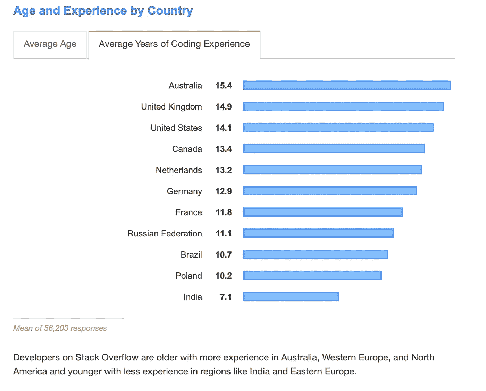
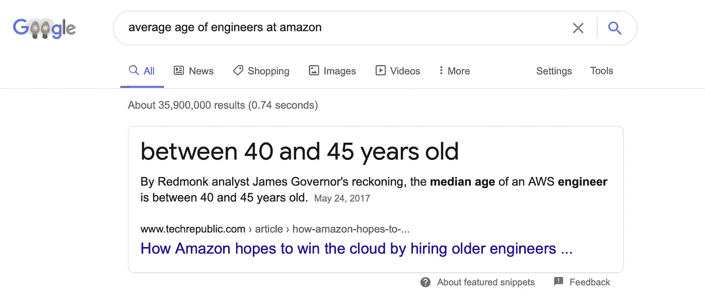
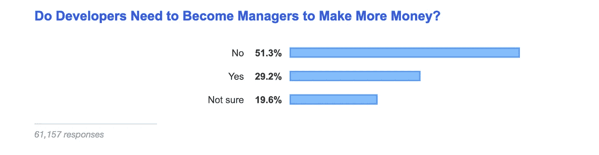

# 四十岁了还在做软件开发？

> 原文：<https://betterprogramming.pub/forty-and-still-a-software-developer-741167da15e4>

## 你如何能够茁壮成长，因为你仍然有很多可以提供

在 [Unsplash](https://unsplash.com?utm_source=medium&utm_medium=referral) 上由 [Adeolu Eletu](https://unsplash.com/@adeolueletu?utm_source=medium&utm_medium=referral) 拍摄的照片

如果你觉得 40 岁太老了，那你就错了。

想象一下:你提前到达办公室。你放下背包，走向厨房。在你花了半个晚上哄孩子睡觉后，你的孩子很早就把你叫醒了。你需要咖啡。

手里拿着咖啡杯，你注意到三个软件开发人员在厨房里交谈。现在是上午 9 点*这些年轻人来得很早*，你心里想。

你注意到他们穿着和昨天一样的衣服。天啊，他们整晚都在这里。废话！有什么失败了吗？现在怎么办？

首席执行官从你身边飞驰而过，满面笑容。她跳到人群中，和他们击掌，发出一声庆祝的嚎叫。

“你们杀了它，”她说。

你的第一个想法是昨晚你不可能留下来。生活发生了，孩子们有作业。你觉得自己成了笑柄。小团体不包括你，因为你不能熬通宵。

我们许多人都生活在这个可怕的噩梦中。恐惧被抛到了九霄云外。这个行业有没有把年轻人封为技术的管家？怀疑自己，怀疑自己还能不能再这样下去，这是很自然的。

管理层奖励英勇的深夜努力，但生产性产出呢？你带来的经验呢？

你想竞争，但不能以牺牲你的家庭为代价。你如何与睡在办公室的同事竞争？

有好消息。卓越的技能没有界限——包括你的年龄。

但这并没有减轻 40 多岁的工程师的担忧。这种情况我经历过很多次，再加上我做了一点调查。

# 软件开发个人贡献者职业在 40 岁时是一份没有前途的工作吗？

这是一个可笑的问题。

我知道一些个人捐助者一年挣 20 万美元以上。他们已经 40 多岁了，但是他们仍然继续与现代软件开发保持同步。公司喜欢代码印章，但他们需要经验、直觉和指导。

一个有经验的软件开发人员的贡献不同于他们年轻的同行。两者本身都很有价值，但它们合在一起是不可阻挡的。

40 岁的时候，你已经“经历过了”你的神奇 8 号球在事情发生之前就向你揭示了事情。当大便碰到风扇时，你可以卷起袖子做点什么。

我在这个等式的两边都经历过，不管年龄大小，个人贡献者都提供价值。没有他们就没有公司，如果他们效仿《蝇王》，他们也不会尝到成功的滋味。

同行压力和信息不足诱使有经验的工程师进入管理层。有一种看法认为他们必须这样做，因为他们落后于时代。事实上，有一个典型的模式:如果你觉得自己无法竞争，接受一个管理职位——这似乎是应该做的事情。

考虑一下这个:StackOverflow 在 2019 年进行的一项[调查](https://insights.stackoverflow.com/survey/2019)显示，美国编码经验的平均长度为 14.1 年。对于上过大学的受访者来说，他们的年龄在 36 至 37 岁之间。

作者截图(图片来源:来自[栈溢出开发者调查 2019](https://insights.stackoverflow.com/survey/2019) )

关键是有一群 40 岁的工程师在继续开发高质量的软件。

这是我谷歌过的另一个随机数据点:

作者截图

看起来科技巨头亚马逊对这个年龄段相当满意。

# 你应该把你的职业生涯引向管理角色吗？

除非你想。

管理是不同的技能组合。要想在领导力方面出类拔萃，你需要专家的辅导和指导。一个常见的误解是，一个人成为经理是因为他们做这份工作的时间够长了。

如果你选择了领导岗位，就把它当成一个新的职业或技能。接受训练，跟踪你尊敬的人。一个欧比万·克诺比是你最好的朋友。我建议由精通培训领导者的专业人士来完成课程。

管理不是狮子王中的[大象墓地，而是专业人士选择的一个令人兴奋的目的地。](https://www.youtube.com/watch?v=Ij-vIh3gBPw)

对于那些想继续把代码作为职业的人来说，还有希望——即使过了 40 岁。根据 stack overflow 2019 年的调查，51%的受访者认为进入管理层并不是赚更多钱的必要条件。

作者截图(图片来源:来自 [Stack Overflow 开发者调查 2019](https://insights.stackoverflow.com/survey/2019) )

任何年龄段都有很多选择。软件业年轻而庞大。几年前我在赛门铁克的时候，他们有一个卷土重来的概念:首席工程师。

校长是受人尊敬的工程师，与经理和副总裁排名相同，但他们的重点是纯工程。

无论是作为首席工程师、架构师，还是某种形式的研究员，作为软件工程师都有足够的空间继续做出贡献。

如果这些名称不是您公司的一部分，请给出建议。在 IMS，我为云迁移创建了一个名为“主要技术指南”的标题。

# 软件工程师可以工作几年？

只要有趣就工作，直到你累趴下。对工程人才的需求仍然很大。

生产力是关键。传统观点认为，你每四到六年就要重新训练自己。

没有具体的年龄限制，但这取决于个人。在我 30 多岁的时候，我和一个 67 岁的工程师一起工作，他比任何人都优秀得多。他是子系统中最令人发指的问题的关键人物。

比尔很聪明，知道如何传递价值。他自己踱步。他帮助解决生产问题，但他把大部分时间都放在让我们远离那些情况上，觉得太多的工程师因为熬夜解决他们创造的问题而得到了回报。他会说，“想象一下，如果我在你面前打碎了这扇窗户，然后因为修好它而得到加薪。”

# 40 多岁的工程师应该怎么做？

## 基础永远不会消失——保持强大

技巧和天赋永远是赢家。任何优秀的领导团队都会继续使用他们能找到的最优秀的人才。尽管是轶事，我不知道有哪个软件工程师不工作——不管他们的年龄。

投资基本面可以让你在需要的时候钻研技术。我学会了运用基本原则来精通任何技术。我疯狂地阅读。我一直在尝试。

编码是我的猎矛。如果我有任何可取的专业素质，我总是可以编码。

## 不要让趋势科技与你擦肩而过

如果你不知道最新最伟大的技术，业内同行会认为你“老了”。你的出生日期不重要，但你的相关性很重要。

我记得几年前和一个年轻工程师关于容器的对话。他给我上了一堂码头课。他不知道的是，自从科技出现以来，我就和[集装箱](https://www.docker.com/resources/what-container)一起工作。

我本能的反应是变得科学，给他上一堂历史课。然后我想到:我需要跟上时代，不管我个人对任何技术栈的看法如何。我是说，作为一名技术专家，我还能做些什么呢？

我的建议是紧跟潮流。重点是要有“足够深”的理解，以便在必要的时候能够精通。

## 学习特定技能

许多雇主要求特定的技能。我观察到，专注于 *n* 年的 Angular，或者任何与此相关的技术栈，收获甚微。

这与年龄无关；这是关于当前的。有一种看法认为，40 岁的工程师跟不上最新的技术。

这令人困惑，因为 83%的网络应用都是 REST。这些应用程序中的绝大多数都在调用一些 CRUD 接口。CRUD APIs 远不能让火箭登陆月球。

关键是没有巨大的技能差距。在很大程度上，这归结于感知。

我的建议是保持现在和活跃。确保你的直接关系网知道你仍然是相关的。

# 外卖食品

合格的工程师会陷入一个陷阱，认为无形的年龄障碍限制了他们的价值。有些人确实对 40 岁的你能做什么有先入为主的想法，但那是他们的局限，不是你的。规划、网络和纯粹的愿望将让你克服基于年龄的错误观念，并作为一名贡献者继续茁壮成长。