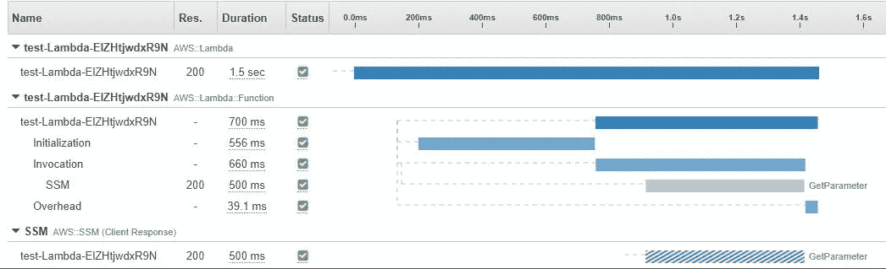
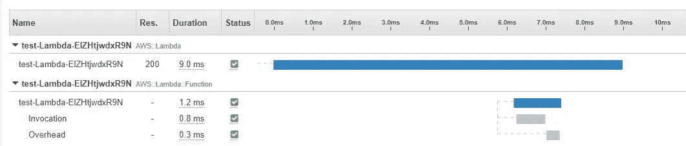
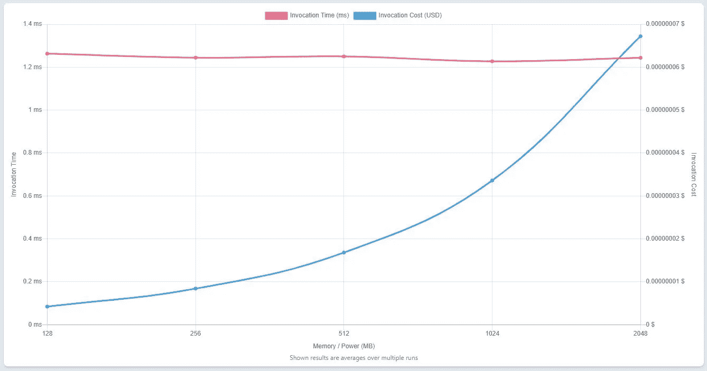

# 提高 AWS Lambda 的四种方法

> 原文：<https://betterprogramming.pub/four-ways-to-improve-your-aws-lambda-1cfd3a3115d6>

## 如何打磨你的 Lambda 函数

照片由[áRPád Czapp](https://unsplash.com/@czapp_arpad?utm_source=medium&utm_medium=referral)在 [Unsplash](https://unsplash.com?utm_source=medium&utm_medium=referral) 上拍摄

你好，今天我想谈谈如何通过抛光来提升 Lambda 的性能。让我们深入研究四种方法来改进 Lambda 函数的 init 阶段，平衡成本和性能，用 X 射线跟踪代码，最终得到一个更快更可伸缩的函数。

# 将变量放在处理程序之外

如果你有一个对象需要为每个 Lambda 请求初始化和重用，你可以把它放在处理函数之外。

如果没有请求，Lambda 的执行环境会保持活动 2 到 10 分钟。

第一次启动后，Node.js 中的 AWS 客户机将在下一次执行中重用同一个连接，从而加快后续请求的速度。

另一个例子是重用包含一个值的变量，如在参数存储中，为了不达到限制，而您可以存储该值并在下一次执行中使用它。

Lambda 中的 INIT 阶段执行外部代码:如果您需要启动一个数据库连接，这是一个很好的时机。

> 记住:如果你使用提供的并发性，处理程序之外的代码将被执行。

带有外部代码的 Lambda 处理程序示例

# 了解层的力量

您知道可以在一个层中包含所有依赖项吗？在部署包中避免使用它们将会优化性能，因为在初始化阶段使用小包的 Lambda 函数会更快。

记住 **AWS SDK v2** 已经在标准运行时中，所以你不需要包含为依赖项。

> 注意:如果您计划将 **AWS SDK v3** 用于 Javascript，那么最好将其添加到层中。

不仅仅是依赖！您还可以添加您的代码，以便在包含该层的所有函数中使用它。

# 用 X 射线检查你的代码

您在代码中包含了多个 AWS 资源。你担心整体表现吗？您可以在代码中添加 X-Ray 客户端，它将允许您使用自定义段跟踪所有非 AWS 请求。通过这种方式，您可以测量代码的全局性能。

这是该函数的第一次执行。如您所见，初始化阶段持续约 556 毫秒，包括执行层和处理程序之外的代码。

还有，我们看到 GetParameter 需要 500ms，唉。

相反，这是第二次执行的持续时间。不再有 Lambda 函数的初始化和对 SSM 值的调用。

> 请记住:使用 X 射线，您可以检查所有服务的性能，或者只检查一段代码的性能。

# 相应地平衡你的内存

如果你想提高 Lambda 的速度，你也可以增加 Lambda 函数的内存。最小 128mb，最大 10240mb。

执行的成本会增加，从而减少执行时间。为此，我们可以使用 Casalboni 的工具来查看每次执行的成本比率(您可以在这里了解更多[)。](https://github.com/alexcasalboni/aws-lambda-power-tuning)

您可以看到，所有 RAM 层的调用时间都是相同的，而每层的调用成本都有所增加。我们可以看到，在 128 mb 时，函数的每次调用时间成本最低，所以最好选择它。

您可以在下面的资源库 GitHub 中找到所有这些示例的源代码。

 [## GitHub-SalvoCozzubo/AWS-Lambda-性能-提示

github.com](https://github.com/SalvoCozzubo/AWS-Lambda-Performance-Tips) 

如果你有更多关于如何改进 AWS Lambda 功能的建议，请随时尝试并告诉我。查看我的[以前关于 AWS S3 选择](https://blog.salvatorecozzubo.com/aws-s3-select-and-node-js-a33aeeef9838)的文章。

回头见！