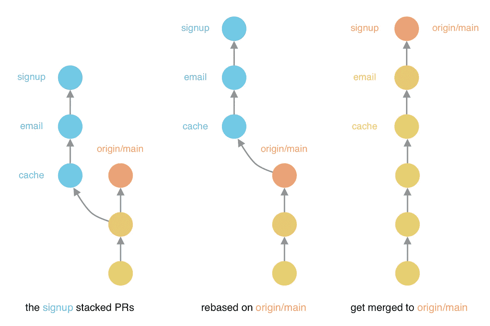
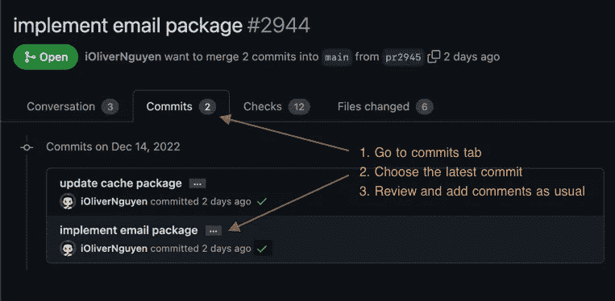

# 我对 Sapling 的第一印象——Meta 的新 Git 客户端

> 原文：<https://betterprogramming.pub/four-ways-you-can-experiment-with-sapling-709eec0ffcb1>

## 尝试堆叠拉取请求


[Sapling](https://sapling-scm.com/docs/introduction/) 是 Meta 开发的新源码控制系统。最近，它获得了与 GitHub 合作的能力。我很好奇它是如何工作的，所以我决定尝试一下，并最终在我公司的仓库中每天使用它。如果你想尝试一下，请点击查看他们的文档。



注册功能的堆叠 PRs 示例

# 堆叠式 PRs

开发时，我通常为每个 PR 创建一个单独的提交，并将它们堆叠在一起。

例如，假设我们正在开发注册功能:用户输入他们的电子邮件地址和密码，然后我们给他们发送一封欢迎邮件。从后端角度来看，我们需要创建一个新用户，验证该用户不存在，然后发送电子邮件。我们需要接触缓存包的实现，添加一个电子邮件包，然后最后实现注册逻辑。这可以表示为一堆 PRs:

1.  更新缓存包以添加新方法。
2.  添加电子邮件发送系统。它使用缓存包来防止发送重复的电子邮件。
3.  实现注册逻辑。就看上面两个变化了。

好处:这有助于评审人员分离关注点。较小的、孤立的变更更容易被审查。他们可以逐个检查 PR，每个 PR 包含独立的逻辑。当然，邮件系统仍然需要更新缓存包，但我们仍然可以孤立地审查邮件系统。

当原点得到更新时，我们将提取变更，并在原点的基础上重新构建 PRs，推送变更，进行审核，并进行合并。

缺点:它需要纪律来保持 PRs 的小型和孤立。通常，在制定上层 PRs 时，我们需要对下层 PRs 进行一些更改。这可能很烦人，因为我们必须跟踪哪些 PR 发生了什么变化，或者不断地在 PR 之间切换以进行更改，然后重新调整上面的 PR。

```
git checkout mybranch/signup   # checkout sign up branch
vim features/signup/signup.go  # make changes to signup
vim lib/email/email.go         # make changes to email package

git add features/signup        # commit the signup changes        
git commit --amend             
git stash                      # stash the email changes
git checkout mybranch/email    # checkout email branch
git stash pop                  # apply the email changes
git add lib/email              # commit the email changes
git commit --amend
git checkout mybranch/signup   # checkout sign up branch again
git rebase mybranch/email      # rebase the signup branch on top of email branch
```

太多的切换和太多的命令需要输入。一点都不好玩。

# 输入树苗

Sapling 是一个新的 git 客户端。它鼓励使用堆叠公关。它会自动地将 PRs 一个接一个地放在一起，所以我们不需要手动操作。

给定下面的提交结构，通过调用`sl`命令来表示，下面是它的样子:

```
sl
  @  00f1749f6  30 minutes ago  oliver
  │  implement user signup
  │
  @  e0dbbc80e  50 minutes ago  oliver
  │  implement email package
  │
  o  4f6928029  Yesterday at   oliver
╭─╯  update cache package
│
o  876f46044  Today at 07:45  remote/main
```

树苗的工作流程如下:

```
sl goto 00f1749f6              # checkout the sign up code
vim features/signup/signup.go  # make changes to signup
vim lib/email/email.go         # make changes to email package

sl absorb                      # magic 👻
```

只需一个简单的命令`sl absorb`，sapphire 就会:

*   修改对电子邮件提交的`email.go`更改。
*   修改`signup.go`对注册提交的更改。
*   将注册提交置于电子邮件提交之上。

您的更改将被吸收到 PRs 中，并且 PRs 将在彼此之上重新建立基础。不用像以前那样手动操作了。只有一个命令。干得好！

# 我对树苗的体验

我已经用了几个星期了。这是一个新工具，所以有一些问题，但整体体验很好。

## 常用命令

查看存储库状态:

*   `sl`:显示提交图(或智能日志)
*   `sl status`:显示当前分支的状态

在提交之间移动:

*   `sl goto <commit>`:签出提交
*   `sl next`、`sl prev`:检查下一个/上一个提交

使用提交:

*   `sl add`、`sl remove`、`sl forget`:添加/删除/取消跟踪文件
*   `sl commit`:提交更改作为新的提交
*   `sl metaedit`:编辑提交消息
*   `sl absorb`:将变化吸收到 PRs 中，并在 PRs 的顶部重新设定基础
*   `sl rebase`:将钻杆排放系统重新置于彼此之上

当`git add`将所有更改添加到暂存区时，包括新文件和删除的文件，相应的命令`sl add`将只将新文件添加到暂存区。要删除文件，我们必须使用`sl remove`。这在提交供应商文件时会有点烦人，因为我们必须列出所有删除的文件来删除它们。我不确定是否有更好的方法，但是代码看起来是这样的:

```
$ sl status

? vendor/github.com/sample/cache/v2/caching.go
? vendor/github.com/sample/cache/v2/stripe.go
! vendor/github.com/sample/cache/v2/deprecated.go
! vendor/github.com/sample/cache/v2/formatter.go
```

```
$ sl add vendor

A vendor/github.com/sample/cache/v2/caching.go
A vendor/github.com/sample/cache/v2/stripe.go
! vendor/github.com/sample/cache/v2/deprecated.go
! vendor/github.com/sample/cache/v2/formatter.go
```

```
# Have to list all deleted files to remove, is there a better way? 😞
$ sl remove vendor/github.com/sample/cache/v2/deprecated.go \
            vendor/github.com/sample/cache/v2/formatter.go

A vendor/github.com/sample/cache/v2/caching.go
A vendor/github.com/sample/cache/v2/stripe.go
R vendor/github.com/sample/cache/v2/deprecated.go
R vendor/github.com/sample/cache/v2/formatter.go 
```

我们不能在这里使用`sl remove vendor/github.com/sample/cache/v2`,因为它也将很乐意删除所有新的/改变的文件。我必须列出所有删除的文件，从树苗中删除它们。

## 将 PRs 推送到 GitHub

Sapling 提供了两种将 PRs 推送到 GitHub 的方式:`sl pr`和`sl ghstack`。每种都有不同的权衡。我更喜欢使用`sl pr`命令，因为它提供了以下功能:

*   它为每次提交创建一个 PR。
*   它按照提交的顺序将 PRs 推送到 GitHub。
*   这很容易理解，因为提交相互之间很好地堆叠在一起。
*   它运行良好，可以用 GitHub 的 UI 进行查看。
*   如果您正在执行一个 fork，它不需要对存储库的写权限。

`sl ghstack`命令创建一个更复杂的钻杆排放系统网络。很多时候，它未能推动减贫战略。再试一次，还是不行。没有可用的修复程序。不得不再次复制这些 PRs，并冒着向我的公司仓库发送垃圾邮件的风险。不推荐。



使用 GitHub 的用户界面查看树苗 PRs

## 审查 PRs

Sapling 建议使用 [reviewstack](https://reviewstack.dev) 进行审查。但是我发现它速度慢，响应慢，有时会给出错误的文件更改。我更喜欢用 GitHub 的 UI。当用`sl pr`推 PRs 时，它为每个 PR 创建一个提交。这样审查者就可以打开最近的提交并审查变更。与通常的审核流程相比，只需多点击一次。以下是如何做到这一点:

*   转到提交选项卡。
*   选择最新提交。
*   查看并添加评论。这些评论将照常出现在 PR 上。

## 其他事情

它需要克隆一个新的存储库，所以您不能使用您熟悉的 git 命令。它不能与您现有的工具、IDE 等一起工作。您必须使用`sl web` UI 来查看更改。

小树苗很棒。虽然有一些麻烦，并且需要一个小的学习曲线，但最终还是有回报的。堆叠、推送和审查 PRs 要容易得多。试试看！

【OliverNguyen.io/w/sapling】亦发表于[](https://olivernguyen.io/w/sapling/)**。**

```
*Want to Connect?

Connect with me [twitter.com/@_OliverNguyen](https://twitter.com/@_OliverNguyen). I share information about software development, 
JavaScript, Go, and other interesting things I learn.*
```