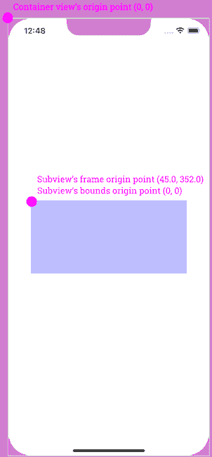
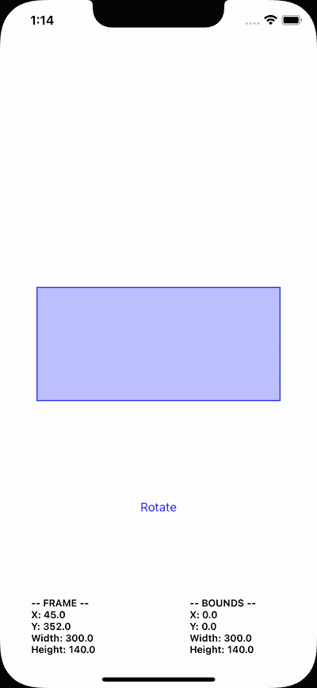

# iOS 中的框架与边界:实现可视化演示

> 原文：<https://betterprogramming.pub/frame-vs-bounds-in-ios-implementing-a-visual-demonstration-1534a143ed1e>

## 通过直观实用的方式找出 iOS 编程中框架和边界的区别

由[杰西卡·鲁斯切洛](https://unsplash.com/@jruscello?utm_source=unsplash&utm_medium=referral&utm_content=creditCopyText)在 [Unsplash](https://unsplash.com/s/photos/frames?utm_source=unsplash&utm_medium=referral&utm_content=creditCopyText) 上拍摄的照片

在 iOS 中有一个空前流行和常见的采访相关话题，而且不仅仅是开发者；*帧*和*的区别限定了一个视图的*！尽管所有开发人员迟早都会知道这一点，但对于真正的初学者来说，这听起来可能是一样的。不去深究这种差异，几乎可以肯定的是，麻烦和困惑总会在某个时候到来。因此，对每个开发人员来说，尽快解决这个问题是最有利的。

我在这篇文章中的目的是谈论这种差异。然而，除了说几句话解释框架和界限是什么，我还将进行一个额外的步骤；逐步实现一个小的 iOS 应用程序，直观地展示这两个概念。这样的话，它们都是关于什么的就绝对清楚了，让任何种类的混乱都消失了。

# 了解基础知识

首先，让我们从几个解释开始。框架和边界*描述了视图中的两件事*:

*   视图的原点为一个`CGPoint`值(横轴和纵轴上的 x 和 y 值)，
*   视图的大小作为一个`CGSize`值(宽度和高度)。

但是，如果它们都提供类似的信息，那么它们真正的区别在哪里呢？

嗯，区别在于**参考坐标系**。具体来说:

*   框架是指视图容器(父视图)的坐标系。
*   边界指的是视图自身的坐标系。

例如，假设一个视图控制器除了它自己的视图之外，只包含一个视图(子视图)。该子视图的框架在视图控制器的视图的坐标中描述了它的原点和大小，因为后者在这种情况下是容器(父)视图。容器的零原点(x=0 和 y=0)在左上角，子视图的原点是两个轴上离该点的距离。关于子视图的大小，即在任何给定时刻围绕子视图的虚拟矩形的宽度和高度。

当谈到边界时，原点是子视图本身的左上角，在它自己的坐标系中总是等于零(0，0)。宽度和高度表示视图的实际大小，无论对视图应用了什么样的变换，它总是保持不变。一会儿再详细讲。

接下来我们会把这一切说清楚。在我们到达那里之前，下图说明了如上所述的父视图和子视图的原点:

👉**注意**:原点在 iOS 中是左上角，但在 macOS 中不是这样；原点是左下角。

基于以上所述，我认为很明显，原点值是框架和边界之间的第一个区别。但这不是唯一的一个。大小也可以不一样！

默认情况下，视图的大小在框架和边界中是相同的。然而，如果我们以某种方式转换视图，这个陈述就不再有效；旋转、平移(移动)和缩放，它们都影响帧；原点和大小都有！

这通常是真正的问题开始的地方。如果有基于一个或多个视图的框架的 UI 相关计算，并且这些视图中的任何一个被转换，计算将是错误的，因为大小被改变了。当然，除非这是故意的。如果不是这样，将会有令人尴尬的视觉效果，这反过来又会导致在试图找出为什么界面不像最初设想的那样运行时感到头痛。

也就是说，是时候实现一个快速的实现来澄清前面提到的框架和边界之间的区别了。

# 实现演示

在 Xcode 和一个全新的基于 UIKit 的 iOS 应用中，我们将实现以下内容:

*   一个简单的视图，我们将用来作为演示，以展示其框架和界限。
*   另一个视图将围绕第一个视图，目的是在任何给定的时刻直观地显示演示视图的实际框架。
*   反映演示视图边界的第三个视图。
*   每次将第一个视图旋转几度的按钮。
*   将显示第一个视图的框架和边界值的两个标签。

所有的 UI 实现都将以编程方式完成；没有使用故事板。因此，让我们从每个新 UIKit 项目包含的默认视图控制器开始，在这里我们将声明我们将需要的几个属性:

除此之外，我们还需要一个属性来保持演示视图的当前旋转角度:

接下来，我们将在`ViewController`类中定义一些方法。他们中的大多数将配置我们刚刚在上面声明的控件。

我们将关注的第一种方法是关于演示视图的初始化和配置。正如你接下来将看到的，我们给它一个背景和边框颜色，以使它在视觉上可区分，在屏幕上突出。

之后，我们将初始化并配置演示视图周围的`frameView`。这里会有两个不同点；框架视图将只有一个彩色的边框，最重要的是，我们将*不对它设置任何布局约束*！相反，我们将在每次演示视图的框架改变时动态设置它的框架:

同样，我们将初始化并配置`boundsView`。我们使用这个视图的目标是可视化地表示演示视图的边界，我们将通过将演示视图的边界设置为`boundsView`的框架来实现。同样，我们也不会为这个视图设置任何自动布局约束。

在完成以上所有操作后，我们将添加一个按钮。它存在的目的很简单；每次我们点击它的时候，我们都会通过旋转它几度来改变演示视图的变换。

这个方法没有什么特别难的，下面是它的实现:

我们将很快定义按钮的动作闭包中调用的`transform()`方法；目前不要为此烦恼。

👉**注**:如果你想了解更多带有动作闭合的按钮，看看[这篇文章](https://gabth.medium.com/using-action-closures-with-uikit-controls-22ee54c70a10)。

最后需要配置的视图是两个标签，它们将报告演示视图的框架和边界值。它们的初始化和配置发生在两种不同的方法中，但是正如您接下来将看到的，还定义了另外两种方法。

第一个实现两个标签之间的公共属性，另一个实现公共的自动布局约束。这样做有助于避免重复相同的代码两次:

# 最后的润色

至此，我们已经完成了这个小演示应用程序中所有视图的配置，现在是时候添加三个缺少的方法了。我们将从两个类似的方法开始，这两个方法负责将演示视图的框架和边界值设置为两个标签的文本。然而，为了您自己的方便，我们也将让他们在控制台上打印这些值:

接下来，我们将实现之前第一次遇到的`transform()`方法，每次点击旋转按钮时都会调用该方法。其中发生了三件重要的事情:

*   演示视图每次旋转 15 度，
*   `frameView`得到一个新的帧；*演示视图的框架*，
*   `boundsView`也获得一个新的帧；*演示视图的边界*。

此外，我们还将调用`printFrame()`和`printBounds()`方法来更新两个标签的内容。

这些都在这里:

最后，让我们把所有东西都显示在屏幕上，让我们显示两个标签的第一个内容；我们将在`viewWillAppear(_:)`方法中完成所有这些:

# 见证框架和界限的差异

这个教程的小 app 已经准备好了，是时候试用一下了。运行它在一个真实的设备，或在模拟器中，当准备好开始点击旋转按钮旋转演示视图。

以下是您将看到的情况:

当演示视图旋转时，请注意:

*   `frameView`的边界被“画”在演示视图的虚拟矩形周围。*你看到的是旋转后的演示视图的真实画面*！
*   `boundsView`出现在它的框架指定的地方，这等于演示视图的边界。我们清楚地意识到*在旋转演示视图时，边界视图始终保持不变*。

屏幕底部的两个标签也说明了这一点。随着每次旋转，原点以及演示视图框架的大小都会得到反映视图位置和尺寸的新值。然而，各自的边界值保持不变，我们可以在右侧的第二个标签上看到！

当看到屏幕左上角带有绿色边框的`borderView`时，不要感到惊讶。这是我们应该预料到的，因为它的帧的原点值与`demoView`边界的原点匹配，等于(0，0)。

虽然在这篇文章中，我们只是通过旋转来改变演示视图的变换，但结果与其他变换类似，如缩放或平移。在所有情况下，演示视图的原始帧都会根据所应用的变换而改变。

# 结论

了解一个视图的框架和边界之间的区别确实有助于避免我们正在构建的用户界面出现问题。有时，可能需要根据应用于视图框架的更改来更改其他视图，但这通常是不希望的效果。当访问视图的原点或尺寸时，请考虑您刚刚在这里读到的内容，如果您要通过框架或边界来访问，请明智地选择。

感谢您的阅读，享受编码！🧑🏻‍💻

*最初发布于*[*https://serial coder . dev*](https://serialcoder.dev/text-tutorials/ios-tutorials/frame-vs-bounds-in-ios-implementing-a-visual-demonstration/)