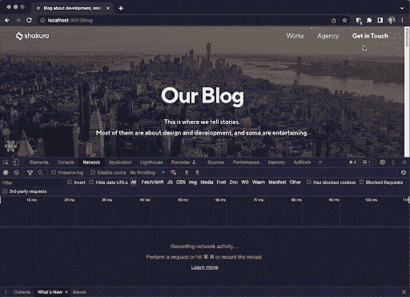
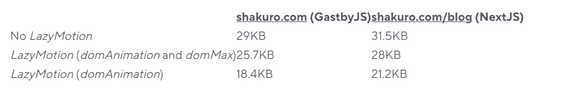

# 帧运动:新的和被低估的功能

> 原文：<https://betterprogramming.pub/framer-motion-new-and-underestimated-features-364a6fdfcb57>

## 动画有趣又刺激


作者声明:Reijo Palmiste，

# 介绍

**Framer-motion** 是一个 motion 库，允许你创建声明性动画、布局转换和手势，同时保持 HTML 和 SVG 元素语义。

⚛️注意了，framer-motion 是一个 React-only 库。

*如果这对你来说是个问题，请查看一下*[*green sock(框架不可知动画库)教程。*](https://shakuro.com/blog/greensock-tutorial-for-beginners-web-animation-library)

你可能熟悉我们之前关于这个主题的文章([帧运动教程:制作更高级的动画](https://shakuro.com/blog/framer-motion-tutorials-make-more-advanced-animations))。它在这个库的几个版本之前首次出现，所以在本文中我们想:

*   介绍以前被忽视的和最近的功能。
*   移除样式化组件，使演示变得简单一些，并降低入门门槛
*   涵盖如何使用[框架-运动](https://www.framer.com/docs/)，并考虑可及性(首选-减少运动)和捆尺寸。

# **内容**

*   设置
*   关键帧
*   手势动画
*   易接近
*   运动配置和简化运动
*   useReducedMotion
*   如何在普通 CSS 和 JavaScript 中使用偏好减少动作
*   滚动触发动画(whileInView)
*   滚动链接动画(useViewportScroll，useTransform)
*   非定制方法
*   自定义 useElementViewportPosition 挂钩
*   使用 LazyMotion 减小包的大小
*   同步加载
*   异步加载
*   束尺寸测试
*   布局动画
*   共享布局动画
*   结论

# 设置

您可以通过两个简单的步骤从帧运动开始:

*   将包添加到项目中:运行`npm install framer-motion`或`yarn add framer-motion`。
*   进口`motion`组件。
*   用`motion`组件开始动画制作(用`motion`前缀重命名任何 HTML 标签，例如`motion.div`、`motion.p`、`motion.rect`)，并用非常简单的`animate`道具配置动画。

魔法已经触手可及！

```
import { motion } from 'framer-motion';

export const MotionBox = ({ isAnimating }: { isAnimating: boolean }) => {
 return (
  <motion.div animate={{ opacity: isAnimating ? 1 : 0 }} />;
};
```

# 关键帧

`animate`中的值不仅可以接受单个值(查看前面的例子⬆️),还可以接受一个值数组，这与 CSS 关键帧非常相似。

默认情况下，[关键帧](https://www.framer.com/docs/animation/%23%2523keyframes)动画将从数组的第一个值开始。可以使用`null`占位符设置当前值，以便在值已经动画化的情况下创建无缝过渡。

```
<motion.div 
 style={{ transform: 'scale(1.2)' }} 
 animate={{ scale: [null, 0.5, 1, 0] }}
/>
```

默认情况下，关键帧数组中的每个值在整个动画中均匀分布。要覆盖它并为每个关键帧步骤定义定时，请通过*乘以*(一个介于 0 和 1 之间的值数组。它应该具有与关键帧动画数组相同的长度)到`[transition](https://www.framer.com/docs/transition/)`道具。

```
<motion.div
     animate={{ opacity: [0, 0.2, 0.8, 1] }}
     transition={{ ease: 'easeInOut', duration: 3, times: [0, 0.5, 0.6, 1] }}
   />
```

让我们制作一些 SVG 动画。要创建一个基本的旋转装载机，我们需要:

1.  `rotate`:360°动画和根 svg 元素上的`transform-origin: center` ( `originX`和`originY`)。
2.  CSS 属性的关键帧数组:
3.  `[stroke-dasharray](https://developer.mozilla.org/en-US/docs/Web/SVG/Attribute/stroke-dasharray)`(形状轮廓的虚线和间隙图案)。
4.  `[stroke-dashoffset](https://developer.mozilla.org/en-US/docs/Web/SVG/Attribute/stroke-dashoffset)`(虚线数组渲染上的偏移)。

```
<motion.svg
     {...irrelevantStyleProps}
     animate={{ rotate: 360 }}
     transition={{ ease: 'linear', repeat: Infinity, duration: 4 }}
     style={{ originX: 'center', originY: 'center' }}
   >
     <circle    {...irrelevantProps} />
     <motion.circle
       {...irrelevantStyleProps}
       animate={{
         strokeDasharray: ['1, 150', '90, 150', '90, 150'],
         strokeDashoffset: [0, -35, -125],
       }}
       transition={{ ease: 'easeInOut', repeat: Infinity, duration: 2 }}
     />
   </motion.svg>
```

您可以在下面的演示中将 CSS 关键帧与`framer-motion`关键帧动画进行比较。

我个人认为这两种实现的难度没有区别。

大概是个人喜好或者项目特殊性的问题吧。在任何情况下，我觉得 CSS 关键帧应该是这种类型动画的首选解决方案，特别是如果不需要任何复杂的计算或性能问题(交付较少的 JavaScript 通常更好)，并且如果 project 还没有将 **framer-motion** 用于其他明显的事情。

# 手势动画

*运动*组件允许我们用`whileHover`、`whileTap`、`whileDrag`和`whileFocus`道具来制作交互元素的动画。

就像任何其他类型的动画一样，我们可以将动画直接传递到道具中:

```
<motion.button whileHover={{ scale: 1.2 }}>Submit</motion.button>
```

或者使用`[variants](https://www.framer.com/docs/examples/%23variants)`进行更复杂的定制:

```
import { motion, Variants } from 'framer-motion';

const variants: Variants = { variants: { tap: { scale: 0.9 } } };

export const Component = () => {
 return (
   <motion.button variants={variants} whileTap="tap">
     Send
   </motion.button>
 );
};
```

与`[keyframes](https://www.notion.so/Framer-motion-overlooked-and-new-features-better-title-4cd6798ded494b51ac0905ee7db037b8)`类似，在不需要复杂计算或过渡的情况下，那些道具(除了`whileDrag`之外)大部分都可以轻松替换成 CSS 动画。

# 易接近

# 运动配置和简化运动

网页上的动画可以用来吸引对某些元素的注意，或者使用户界面/UX 体验更加流畅和愉快。但是视差效果、淡入淡出弹出窗口或者基本上任何移动或闪烁的元素可能会导致晕动病，或者以任何其他方式对用户来说可能不方便或不舒服。

因此，为了[可访问性](https://www.framer.com/docs/guide-accessibility/)和性能原因，我们需要给出一个[选项来限制甚至禁用页面上的任何动作](https://developer.mozilla.org/en-US/docs/Web/CSS/@media/prefers-reduced-motion%23user_preferences)，并且，作为开发人员，要尊重这个选择并确保它被实现。

`[prefers-reduced-motion](https://developer.mozilla.org/en-US/docs/Web/CSS/@media/prefers-reduced-motion)`是一个 CSS 媒体功能，用于检测用户是否在其系统设置中被指示减少不必要的动作。

**关于该主题的更多信息:**

*   [**【约简运动】媒体查询**](https://css-tricks.com/introduction-reduced-motion-media-query/) 作者 [*埃里克·贝利*](https://ericwbailey.design/)T22、*2017 年 2 月 10 日*
*   [**尊重用户的运动偏好**](https://www.smashingmagazine.com/2021/10/respecting-users-motion-preferences/) 作者 [*米歇尔巴克*](https://css-irl.info/)**2021 年 10 月 21 日**

*为了用`framer-motion`**正确实现`prefers-reduced-motion`，我们可以使用`MotionConfig`——一个允许我们为所有子*运动*组件设置默认选项的组件。***

***目前 in 只带 2 个道具:`transition`和`reducedMotion`。***

***`[reducedMotion](https://www.framer.com/docs/motion-config/%23reducedmotion)`让我们设定一个处理减速运动的策略:***

*   ***`user` —尊重用户的设备设置；***
*   ***`always` —强制减少运动；***
*   ***`never` —不要减少运动。***

***在减少运动的情况下，`transform`和`layout`动画将被禁用，而不透明度或`backgroundColor`等动画将保持启用。***

***在这个特别的演示中，我在动态改变`reduceMotion`值时遇到了麻烦。不是换内`Context.Provider`道具，除非我过了`key={reducedMotion}`。这是一个非常有问题的临时解决方案，只是为了让它工作，但同时它会触发重新渲染，这离完美的解决方案还很远，而且肯定不是生产就绪的解决方案。***

# ***useReducedMotion***

***对于更加定制和复杂的解决方案，或者对于库范围之外的任何任务(例如，禁用视频自动播放)，我们可以使用`[useReducedMotion](https://www.framer.com/docs/utilities/%23usereducedmotion)`钩子:***

```
***import { useReducedMotion, motion } from 'framer-motion';export const Component = () => {
 const shouldReduceMotion = useReducedMotion();
 return(
   <motion.div
    animate={shouldReduceMotion ? { opacity: 1 } : { x: 100 }} 
    />
);
}***
```

***无论作为用户还是开发者，我都很高兴看到 **framer-motion** 非常认真地对待[可访问性](https://www.framer.com/docs/guide-accessibility/)，并为我们提供适当的工具来满足任何用户的需求。即使我们有合适的 JavaScript 和 CSS 解决方案来做同样的事情。***

# ***如何在普通 CSS 和 JavaScript 中使用偏好减少动作***

***您也可以通过使用[*prefers-reduced-motion*media-query with CSS](https://web.dev/prefers-reduced-motion/%23working-with-the-media-query)来实现相同的目的:***

```
***@media (prefers-reduced-motion: reduce) {
 button {
   animation: none;
 }
}

@media (prefers-reduced-motion: no-preference) {
 button {
   /* `scale-up-and-down` keyframes are defined elsewhere */
   animation: scale-up-and-down 0.3s ease-in-out infinite both;
 }
}***
```

***或者[*window . match media()*带 JavaScript](https://web.dev/prefers-reduced-motion/%23:~:text=motion:%2520no-preference)%2522%253E-,To%2520illustrate%2520how%2520to%2520work%2520with%2520prefers-reduced-motion%2520with,window.matchMedia('(prefers-reduced-motion:%2520reduce)'),-Demo%2520%2523) :***

```
***const mediaQuery = window.matchMedia('(prefers-reduced-motion: reduce)');

mediaQuery.addEventListener('change', () => {
 const isPrefersReducedMotion = mediaQuery.matches;
 console.log({ isPrefersReducedMotion });

 if (isPrefersReducedMotion === true) {
   // disable animation
 }
});***
```

# ***滚动触发动画(whileInView)***

***滚动触发动画是一种很好的方式来吸引用户的注意力，并使元素更加动态。***

***为了创建带有帧运动的[滚动触发动画](https://www.framer.com/docs/examples/%23scroll-triggered-animations)，让我们使用`[whileInView](https://www.framer.com/docs/gestures/%23%2523%2523whileinview)`道具。***

```
***<motion.div
 initial={{ opacity: 0, y: -100 }} 
 whileInView={{ opacity: 1, y: 0 }} 
/>***
```

***我们也可以使用返回`[IntersectionObserverEntry](https://developer.mozilla.org/en-US/docs/Web/API/IntersectionObserverEntry)`的`[onViewportEnter](https://www.framer.com/docs/gestures/%23%2523%2523onviewportenter)`和`[onViewportLeave](https://www.framer.com/docs/gestures/%23%2523%2523onviewportleave)`回调。***

***让我们使用*变体* ⬇️，这使得定义更复杂的动画变得容易一些。***

***还有一种方法是用 [*视口*](https://www.framer.com/docs/gestures/%23%2523viewport-options) 设置配置道具，有些选项我们可以使用:***

*   ***`once` *:布尔型* —如果为真，`whileInView`动画仅触发一次。***
*   ***`amount` *:'部分' | '全部' |号* —默认:`some`。描述元素为了在视图中被考虑而必须与视口相交的量；`number`值可以是 0 到 1 之间的任何值。***

```
***import { motion, Variants } from 'framer-motion';

const variants: Variants = {
 hidden: { opacity: 0 },
 visible: { opacity: 1 },
 slideStart: { clipPath: 'inset(0 100% 0 0 round 8px)' },
 slideEnd: { clipPath: 'inset(0 0% 0 0 round 8px)' },
};

export const Component = () => {
 return (
   <motion.div
     variants={variants}
     initial={['hidden', 'slideStart']}
     whileInView={['visible', 'slideEnd']}
     exit={['hidden', 'slideStart']}
     viewport={{ amount: 0.4, once: true }}
   />
 );
};***
```

***一个不幸的限制是*while view*不能和`transition: { repeat: Infinity }`一起工作。因此，没有简单的方法来无限重复动画，只在用户视口中播放。`[onViewportEnter](https://www.framer.com/docs/gestures/%23%2523%2523onviewportenter)`和`[onViewportLeave](https://www.framer.com/docs/gestures/%23%2523%2523onviewportleave)`回调(用⚛️ React 的钩子`useState`和`useCallback`)大概是最好的办法。***

# ***滚动链接动画(useViewportScroll， [useTransform](https://www.framer.com/docs/motionvalue/%23%2523usetransform)***

***为了更进一步，我们来谈谈[滚动链接动画](https://www.framer.com/docs/examples/%23scroll-linked-animations)，它有点类似于滚动触发动画，但更有趣！✨***

***`[useViewportScroll](https://www.framer.com/docs/motionvalue/%23%2523useviewportscroll)`和`[useTransform](https://www.framer.com/docs/motionvalue/%23%2523usetransform)`是绑定到滚动和滚动位置的动画。滚动触发动画给用户带来了更刺激的浏览体验。它可以用来抓住用户的注意力，是一个很好的创造性讲故事的工具。***

***大概滚动链接动画最流行的选择是[格林斯托克的 ScrollTrigger](https://greensock.com/scrolltrigger/) (就像我们演示的)。***

***不幸的是，与 GreenSock 相比，带有`framer-motion`的滚动链接动画将需要更多的自定义解决方案，并且需要更多的时间来实现。让我们找出原因，一步步想出办法。***

# ***非定制方法***

***对于带有**帧运动的滚动链接动画，**我们需要:***

1.  ***`useViewportScroll`钩子，返回 4 个不同的`[MotionValues](https://www.framer.com/docs/motionvalue/%23%2523%2523useviewportscroll)`，我们将只使用其中的一个——`scrollYProgress`(在 *0* 和 *1* 之间垂直滚动进度)。***
2.  ***`useTransform` — hook，它创建一个`[MotionValue](https://www.framer.com/docs/motionvalue/)`，通过将另一个`MotionValue`的输出从一个值范围映射到另一个值范围来转换它。在本演示中，我们将使用下一组道具传递给挂钩:***

***a) `scrollYProgress`将垂直页面滚动与动画同步；***

***b) `[0, 1]` —动画播放时`scrollYProggress`的范围；***

***c) `[“0%”, “-100%”]` —垂直滚动变化时 x 的变换范围。***

***长话短说，钩子变换*运动*组件的 *x* (水平变换值)，而`scrollYProgress`在从 *0%* 到–*100%*的 0 和 1(从页面开始到最底部)之间的范围内。***

***它并没有完全解释钩子是如何工作的，以及它可以使用什么样的道具。查看 useTransform 的完整文档。***

***3.为了以某种方式复制 GreenSock 的`ScrollTrigger`——在制作动画时将*运动*组件固定在视口中，我们需要将其包装到两个包装器中，外层包装器必须具有*高度* >视口高度，内层包装器必须具有`position: sticky`和`top: 0`；`position: fixed`，根据动画的不同，或许也能奏效。***

***在⬇️下面或者在[沙盒演示](https://codesandbox.io/s/framer-motion-scroll-linked-animation-useviewportscroll-usetransform-yfdo29?from-embed=&file=/src/styles.css:490-508)中查看完整的造型。***

```
***import { motion, useTransform, useViewportScroll } from 'framer-motion';

export const Component = () => {
 const { scrollYProgress } = useViewportScroll();

 const x = useTransform(scrollYProgress, [0, 1], ['0%', '-100%']);

 return (
   <div style={{ height: '300vh' }}>
     <div
       style={{
         position: 'sticky',
         top: 0,
         height: '100vh',
         width: '100%',
         overflow: 'hidden',
       }}
     >
       <motion.p style={{ x }}>
         Rainbow Rainbow Rainbow
       </motion.p>
     </div>
   </div>
 );
};***
```

***你可能已经注意到了这种滚动触发动画的主要问题。首先，动画通过整个页面的滚动播放，而不是它的一部分。第二个问题是，动画化 *x* 从 *0%* 到 *-100%* 使得*运动*组件在页面滚动结束前从视窗中滚动出来(部分或全部，取决于视窗宽度)。***

***让我们在下一章⬇️中通过使用自定义钩子来解决这些问题。***

# ***自定义 useElementViewportPosition 挂钩***

***为了解决上一章⬆️中描述的问题，让我们创建一个自定义钩子，它将允许我们计算元素可见的视口范围。***

***自定义`useElementViewportPosition`返回`position`—`useTransform`钩子的第二个属性的值——范围在 0 和 1 之间(例如，`position = [0.2, 0.95]`表示该范围在视口的 20%到 95%之间)。***

```
***// * based on: [https://gist.github.com/coleturner/34396fb826c12fbd88d6591173d178c2](https://gist.github.com/coleturner/34396fb826c12fbd88d6591173d178c2)
function useElementViewportPosition(ref: React.RefObject<HTMLElement>) {
 const [position, setPosition] = useState<[number, number]>([0, 0]);

 useEffect(() => {
   if (!ref || !ref.current) return;

   const pageHeight = document.body.scrollHeight;
   const start = ref.current.offsetTop;
   const end = start + ref.current.offsetHeight;

   setPosition([start / pageHeight, end / pageHeight]);
   // eslint-disable-next-line react-hooks/exhaustive-deps
 }, []);

 return { position };
}***
```

***为了找出`useTransform`的第三个支柱，我们需要计算`carouselEndPosition` —要转换到的最终值。它基本上是用`motion`组件的宽度减去窗口的宽度。查看[沙盒演示](https://codesandbox.io/s/framer-motion-scroll-linked-animation-useviewportscroll-usetransform-and-custom-useelementviewportposition-hook-p25mx9?file=/src/App.tsx:1442-2226)中的详细计算。***

```
***import { motion, useTransform, useViewportScroll } from 'framer-motion';

export const Component = () => {
 const ref = useRef<HTMLDivElement>(null);
 const carouselRef = useRef<HTMLDivElement>(null);
 const { position } = useElementViewportPosition(ref);
 const [carouselEndPosition, setCarouselEndPosition] = useState(0);
 const { scrollYProgress } = useViewportScroll();
 const x = useTransform(scrollYProgress, position, [0, carouselEndPosition]);

  useEffect(() => {
   // calculate carouselEndPosition
 }, []);

 return (
   <div>
     {/* content */}
     <section ref={ref}>
       <div className="container" style={{ height: "300vh" }}>
         <div className="sticky-wrapper">
           <motion.div ref={carouselRef} className="carousel" style={{ x }}>
             {[0, 1, 2, 3, 4].map((i) => (
               <div key={i} className="carousel__slide">
                 {i + 1}
               </div>
             ))}
           </motion.div>
         </div>
       </div>
     </section>
     {/* content */}
   </div>
 );
};***
```

***现在动画的开始和结束点，以及转换值，使演示看起来更有意图和深思熟虑。***

***我不完全确定这是处理这种动画的最好方法，但这是我目前能想到的最好方法。我很好奇别人是怎么解决这个的。例如，CodeSandbox 项目非常有趣[滚动链接动画登陆](https://projects.codesandbox.io/)，看起来它可能是用 framer-motion 构建的。***

# ***使用 LazyMotion 减小包的大小***

***可能每个 React ⚛️开发人员在他们职业生涯的某个时候都不得不面对膨胀的包大小问题。少发布一些 JavaScript 可能会解决这个问题。***

***为了弄清楚您的项目的包大小以及哪些可以改进，我推荐 [webpack-bundle-analyzer](https://www.npmjs.com/package/webpack-bundle-analyzer) 。在分析你的包之后，你会发现你有一个巨大的包，它的唯一目的是做一些无关紧要的改变，这些改变可以很容易地被某种普通的解决方案所取代。***

***同样的担心可能与动画库有关，它通常有相当大的尺寸。如果您的项目不严重依赖复杂的动画和/或有包大小或性能问题，您可以考虑部分或全部转移到 CSS 动画，甚至完全摆脱动画。弄清楚你的优先事项:真的值得使用沉重的令人瞠目结舌的动画，使大多数低泪和中泪设备滞后，过载或过热吗？它可能会也可能不会，这取决于项目、它的目的和受众。***

***幸运的是，framer-motion 覆盖了我们！***

***[*LazyMotion*](https://www.framer.com/docs/lazy-motion/) 是一个非常方便的组件，可以帮助我们[减少包的大小](https://www.framer.com/docs/lazy-motion/)。它同步或异步加载部分或全部*运动*组件的特征。***

***文档指出，默认情况下使用 *motion* 组件会增加大约 25kb 的包大小，而对于 *LazyMotion* 和 *m* 组件则不到 5kb。***

# ***同步加载***

***我们如何才能实现高达 5 倍的捆绑包尺寸缩减？与[同步加载](https://www.framer.com/docs/guide-reduce-bundle-size/%23synchronous-loading)。通过用`LazyMotion`包装动画组件并将需要的特性(`domAnimation`或`domMax`)传递给特性道具。最后一步是将常规运动分量替换为其较小的孪生分量— *m* 。***

```
***import { LazyMotion, domAnimation, m } from 'framer-motion';

export const MotionBox = ({ isAnimating }: { isAnimating: booolean }) => (
 <LazyMotion features={domAnimation}>
   <m.div animate={isAnimating ? { x: 100 } : { x: 0 }} />
 </LazyMotion>
);***
```

# ***异步加载***

***我们可以通过使用 *LazyMotion* *特性*的[异步加载](https://www.framer.com/docs/guide-reduce-bundle-size/%23async-loading)来为用户节省几个 KB。***

******

```
***// dom-max.ts

export { domMax } from 'framer-motion';

// modal.tsx

import { LazyMotion, m } from 'framer-motion';

const loadDomMaxFeatures = () =>
 import('./dom-max').then(res => res.domMax);

export const Modal = ({ isOpen }: { isOpen: booolean}) => (
 <AnimatePresence exitBeforeEnter initial={false}>
   {isOpen && (
     <LazyMotion features={loadDomMaxFeatures} strict>
       <m.div
         variants={ { open: { opacity: 1 }, collapsed: { opacity: 0 } } }
         initial="collapsed"
         animate="open"
         exit="collapse"
       >
         // modal content
       <m.div>
     </LazyMotion>
   }
 </AnimatePresence>
);***
```

***`[AnimatePresence](https://www.framer.com/docs/animate-presence/)`在这种情况下，组件不是必需的，但是对于组件卸载时的任何动画来说，它是必不可少的。[你可以在这里](https://shakuro.com/blog/framer-motion-tutorials-make-more-advanced-animations)了解更多 `[AnimatePresence](https://shakuro.com/blog/framer-motion-tutorials-make-more-advanced-animations)` [。](https://shakuro.com/blog/framer-motion-tutorials-make-more-advanced-animations)***

***模态、手风琴、旋转木马和几乎所有其他需要用户交互的动画都可以从中受益。***

# ***束尺寸测试***

***我测试了 LazyMotion 可以在多大程度上减少我们的实时项目的包大小(同步加载特性):***

******

***虽然不多，但我对结果很满意。考虑到实现起来如此轻松，包大小减少 5-10KB 是非常重要的。***

# ***布局动画***

***通过*布局*道具自动制作运动组件`layout`的动画。***

```
***<motion.div layout />***
```

***哪个 CSS 属性会导致布局变化(宽度、高度、伸缩方向等)并不重要 **framer-motion** 将使用 transform 对其进行动画处理，以确保最佳性能。***

```
***import { useCallback, useState } from 'react';
import { motion } from 'framer-motion';

const flexDirectionValues = ['column', 'row'];

export const LayoutAnimationComponent = () => {
 const [flexDirection, setFlexDirection] = useState(flexDirectionValues[0]);

 const handleFlexDirection = useCallback(({ target }) => {
   setFlexDirection(target.value);
 },[]);

 return (
   <div>
     {flexDirectionValues.map((value) => (
       <button
         key={value}
         value={value}
         onClick={handleFlexDirection}
       >
         {value}
       </button>
     ))}
     <div style={{ display: 'flex', flexDirection }}>
       {[1, 2, 3].map((item) => (
         <motion.div layout key={item} transition={{ type: 'spring' }} />
       ))}
     </div>
   </div>
 );
};***
```

***起初，我并没有意识到 [*布局*](https://www.framer.com/docs/examples/%23layout-animations) 动画是多么容易、有用和多功能，但这真的很少见！***

# ***共享布局动画***

***类似于布局动画，[共享布局动画](http://framer.com/docs/examples/%23shared-layout-animations)让我们有机会在彼此之间自动制作*运动*组件的动画。为此，只需给多个*运动*组件相同的`layoutId`道具。***

```
***import { motion } from 'framer-motion';

const bullets = [1, 2, 3];

export const Bullets = ({ currentIndex }: { currentIndex: number }) => {
 return (
   <div className="bullets">
     {bullets.map((bullet, index) => (
       <div key={index} className="bullet">
         <button>{bullet}</button>
         {index === currentIndex && <motion.div layoutId="indicator" className="indicator" />
          )}
       </div>
     ))}
   </div>
 );
};***
```

***看一看滑块的导航/项目符号按钮下的蓝绿色圆点，并尝试导航。当一个点从一个项目符号平滑地移动到另一个项目符号时，它看起来像是同一个元素，但实际上不是！***

***考虑到我们感兴趣的只是一个小点，这个特别的演示可能看起来有点过分。但是它也使用[*animate presence*](https://www.framer.com/docs/animate-presence/)组件在组件卸载之前执行退出动画，这在许多不同的用例中可能非常有用。[查看沙盒演示，了解如何使用 AnimatePresence](https://codesandbox.io/s/framer-motion-shared-layout-animations-sw9huv) 。***

# ***结论***

***自从我第一次使用 framer-motion(2019 年 12 月)以来，它一直在增长和发展，现在这个库让我们有机会轻松地将几乎任何动画带入生活。***

***我觉得动画很容易把好的用户界面/UX 体验弄糟，如果不是所有方面的话。但是**成帧运动**前来救援:***

*   ***维护 HTML 和 SVG 语义***
*   ***声明性动画和关键帧动画***
*   ***对可访问性的考虑(`MotionConfig` + `reducedMotion`)***
*   ***束尺寸减小(`LazyMotion` + *m* )***
*   ***布局转换(`layout`和`layoutId`)***
*   ***滚动触发(`whileInView`)和滚动链接动画(`useViewportScroll`)。***

***从一个 web 开发者的角度来看，使用 framer-motion 是非常愉快和有趣的。对你来说可能是，也可能是一样的，你自己试试看，幸运的是，这很容易开始。***

***在这篇文章的最后，我想给你最后一个友好的提醒:动画是有趣和令人兴奋的，但它不是一个伟大的用户体验的关键元素，而且——如果不是有意和适度地使用——可能会使它变得更糟。您可以使用简单的 CSS 过渡或关键帧，但仍然可以获得出色的效果，而不会对最终产品造成太大影响。***

****茱莉亚·史卡诺娃和玛丽·摩尔撰写****

***【https://shakuro.com】最初发表于[](https://shakuro.com/blog/framer-motion-new-and-underestimated-features)**。*****