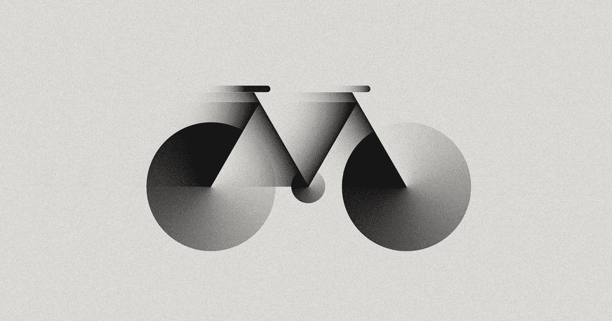

# 帧运动教程:制作更高级的动画

> 原文：<https://betterprogramming.pub/framer-motion-tutorials-make-more-advanced-animations-4344b686ea0a>

[*由*](https://medium.com/@kateshokurova) [朱丽娅](https://shakuro.com/blog/author/julia-shikanova) [*，开发者*](https://medium.com/@kateshokurova) [*三郎*](https://shakuro.com/)

## 向 React 应用程序添加动画



m 代表安德鲁·庞斯的动作

Framer Motion 是一个相对较新且受欢迎的开源 React 动画库，旨在创建生产就绪的动画。帧运动是姿势的动画库的下一步。它拥有一个低级的声明式 API，可以在任何平台上使用，既可以用于网络，也可以用于移动应用。它的另一个被软件开发者看重的优势是，它也可以作为一个单独的包在 React 应用程序中使用。

Framer 的文档提供了足够的[教程](https://www.framer.com/api/motion/)关于如何做最简单的手势和动作。然而，如果你在处理更复杂的案件，网上这方面的信息太少了。所以钻研最简单的例子没有意义，可以根据文档来做。网上也有关于这个主题的文章(尽管不是很多)。让我们来修补更复杂的帧动画。

如果你曾经想知道如何制作这种或那种黄油般光滑的效果，例如，在[Dribbble Global Design Survey 2019 page](https://dribbble.com/global-design-survey-2019)上，那么请继续阅读并学习这篇成帧器运动教程！

# 何时使用帧运动，为什么

Framer Motion 能够为 Framer X 中的动画提供动力，Framer X 是一种原型工具，这使得移交极其方便。大多数设计师都遇到过这样的情况，他们花了很长时间来完善设计的每个细节，结果却在开发过程中丢失了。Framer Motion 允许您在原型制作和生产中使用相同的动画库。这样你就不需要担心你的反应动画和你想要的不一样。

至于使用动画作为工具的最佳方式，主要是保持它有意义并且与主题相关。你可以在这篇文章中掌握主要思想和十几个有用的技巧，现在，让我们直接进入 React 动画教程。

# 成帧器运动教程

帧运动对于动画来说是很棒的。让我们试着做一些！如果此时您正处于 JavaScript 之旅的起点，那么您最好先从简单的东西开始。

每个成帧器运动教程由 1-3 个组件和一个道具列表组成(大多数是可选的和/或有默认值)。所有的例子都是交互式的，所以刷新和点击，拖动，翻转。

## [视差框教程](https://codesandbox.io/s/framer-motion-parallax-box-ekqoe)

ParallaxBox 组件动画通过滚动来设置，模仿视差效果。滚动`triggers`组件，根据`yOffset`属性中指定的值(px，> 0，默认= 100)向上/向下移动(取决于滚动方向)。

`MotionValues`用于跟踪一个动画值的状态和速度。

通常自动计算的`MotionValues`在大多数情况下绰绰有余。但是对于更高级的，你可以[手动创建](https://www.framer.com/api/motion/motionvalue/)然后注入到组件中。我们会这么做的。

为`ParallaxBox`组件制作动画，使用`MotionValues`的链，通过`useTransform` *钩子* ( `useTransform` *)传递给`ParallaxBox`*；*父，从，到，选项)。*

```
*const y = useTransform(
  scrollY,
  yRange, 
  [0, -yOffset], 
  easing
);*
```

*`useTransform`创建一个`MotionValue`，通过将另一个`MotionValue`的输出从一个数值范围[映射到另一个](https://www.framer.com/api/motion/motionvalue/#usetransform)来转换它。*

*第一个参数 parent:要转换其输出的`MotionValue`。*

*我们将使用另一个钩子作为它的值:*

```
*const { scrollY } = useViewportScroll();*
```

*`useViewportScroll(): ScrollMotionValues` —提供当视口滚动时更新的`MotionValues`。`[scrollY](https://www.framer.com/api/motion/motionvalue/#useviewportscroll)` —以像素为单位的垂直滚动距离。*

*输入值-from:number[]-一系列线性数字(全部递增或递减)。*

```
*const yRange = [transformInitialValue, transformFinalValue];*
```

*`yRange`接受由`transformInitialValue`——元素的初始位置和`*transformFinalValue*` ——它在动画结尾的位置组成的数组。*

*输出值-to:*T[]*-一系列数字、颜色或字符串。必须和`inputRange`一样长。*

*在该示例中，输出值采用一个数组:*

```
*[0, -yOffset]*
```

*其中 0 —初始位置，`–yOffset` —元素偏移(该值为负值，因为组件相对于其初始位置向上移动)。*

*`useTransform`取的最后一个值，`options` *，*可以取几个值，但是在这个例子中，对我们最有意义的是 ease: `EasingFunction []`。*

```
*easing = [0.42, 0, 0.58, 1],*
```

*[缓动功能](https://easings.net/en)是让你控制动画速度的算法，让它们产生想要的效果，如弹跳、减速等。*

*也就是说，在现实生活中，事物不会以线性方式突然开始和停止运动。动量和其他物理方面发挥了作用。例如，当你打球时，你要记住它不是匀速运动，而是弹跳。汽车转弯时减速等。缓动功能有助于使效果看起来更自然、更逼真。*

*缓动可以采用四个数字的数组[n，n，n，n]作为三次贝塞尔函数，也可以内置命名函数，如`linear`、`easeInOut`、[等](https://www.framer.com/api/motion/types/#tween.ease)。*

*现在剩下的就是将`*y*`值传递给组件:*

```
*return (
   <MotionBox ref={ref} initial={{ y: 0 }} style={{ y, opacity }}>
     {children}
   </MotionBox>
 );*
```

*任务完成了。现在组件将在滚动时平滑上移，模仿视差效果。*

*您还可以将道具传递到组件中:*

*   *`yOffset` —偏移值*
*   *`easing` —动画类型*
*   *`triggerPoint` —一个介于 0 和 1 之间的值，根据该元素在页面上的位置确定其动画开始的时间，其中 0 表示页面的顶部，1 表示页面的底部。*
*   *`fadeOut` 是一个布尔值，决定元素的淡出是否会影响其不透明度级别。*

*所有列出的属性都是可选的，并且已经在组件中指定了默认值。*

*很简单，不是吗？*

## *[路口观测器|比例箱教程](https://codesandbox.io/s/framer-motion-intersection-observer-scale-qmtyb)*

*这个教程比上一个简单多了。唯一的困难是使用第三方库的钩子[React——使用](https://github.com/streamich/react-use) — `useIntersection` — [React 传感器钩子](https://github.com/streamich/react-use/blob/master/docs/useIntersection.md)来跟踪目标元素的交集的变化。*

*在这个钩子的帮助下，我们可以创建`IntersectionObserver`组件，当运动组件出现在它的作用域中并开始动画时，它会进行感知。*

*这个组件可以用`default = false`进行布尔道具重置，负责当元素再次出现在视口时是否触发动画。*

*现在我们可以用`IntersectionObserver`组件包装一个或多个运动组件:*

```
*<IntersectionObserver>
  <ScaleBox />
</IntersectionObserver>*
```

*并将`inView`值从`IntersectionObserver`组件的上下文传递给运动组件:*

```
*const { inView } = useContext(IntersectionContext);*
```

*让我们继续讨论运动组件— `ScaleBox` *。**

*比例值允许您减小或增大元素的大小。也就是说，当`ScaleBox`落入浏览器窗口的可视部分时，`IntersectionObserver` 将 inView 上下文的值改为`true`，这将触发动画:*

```
*animate={inView ? "show" : "hidden"}*
```

*`ScaleBox`可以在`IntersectionObserver`组件之外使用，但是动画会在页面加载后开始，并且不管它是否在可见区域都会被处理。通常，这不是我们希望运动组件采取的方式，这就是我们需要`IntersectionObserver`的原因。*

*为了描述`ScaleBox`动画，我们使用`variants`，预定义的目标对象集:*

```
*const variants = {
   hidden: {
     scale: 0,
     opacity: 0,
     transition
   },
   show: {
     scale: 1,
     opacity: 1,
     transition
   }
 };*
```

*`variants`对象包含键-值对，其中键(标签)是动画属性的名称(在我们的例子中，是`hidden`和`show`，尽管名称可以是任何东西；主要是让他们有意义)。*

*唯一剩下的事情就是将`variants`对象传递给`variants` *属性*:*

```
*return (
   <MotionBox
     initial="hidden"
     animate={inView ? "show" : "hidden"}
     exit="hidden"
     variants={variants}
   >
     {children}
   </MotionBox>
 );*
```

*变体可以设置由其标签指示的动画目标(例如，initial="hidden ")。*

*更详细地考虑一下`transition`属性也是值得的，用它可以设置动画执行参数，比如`duration`(s)`delay`(s)`[ease](https://www.framer.com/api/motion/types/#tween.ease)`。*

```
*const transition = {
  duration: 0.4,
  delay: 0.2,
  ease: "easeInOut"
 };*
```

*还有其他参数可以传递给`transition`，比如`loop`，动画的迭代次数(接受一个数字或者`infinity`)。*

*结果，我们得到了两个组件。第一个，`Intersection Observer` 检测屏幕上运动元素的存在。第二个，`ScaleBox`，*，*改变元素的大小。这两个组件都很简单。一起使用它们允许当内容在用户的视窗中显示时，动画显示页面上出现的内容。*

## *[淡入淡出框|错开教程](https://codesandbox.io/s/framer-motion-stagger-fade-in-up-9gky2)*

*`FadeInOutBox` —动画显示元素外观、其从底部到顶部的移动(`yOffset`)及其不透明度的组件。*

*与`ScaleBox`一样，该组件使用`variants`:*

```
*const variants = {
   hidden: { 
y: yOffset, 
opacity: 0, 
transition 
   },
   show: {
     y: 0,
     opacity: 1,
     transition   
   }
 };*
```

*只有在这种情况下，`*y*`属性(沿 y 轴变换元素的位置)才是动画，而不是缩放。*

*本例的第二个组件是`StaggerWrap`以一定的延迟(`staggerChildren`)连续动画显示嵌套的运动组件。*

```
*const variants = {
   hidden: { opacity: 0 },
   show: {
     opacity: 1,
     transition: {
       when: "beforeChildren",
       staggerChildren: 0.5
     }
   }
 };*
```

*当属性有助于详细描述父对象与其子对象之间的关联时(默认为 false)。如果父动画必须在子动画之前执行，也可以取`beforeChildren`值，反之则取`afterChildren`值。*

*在这种情况下，动画参数被传送到父组件，即`StaggerWrap`组件本身:*

```
*return (
   <**StaggerContext.Provider** value={{ stagger: true }}>
     <**MotionBox**
       initial="hidden"
       animate="show"
       exit="hidden"
       variants={variants}
     >
       {children}
     </**MotionBox**>
   </**StaggerContext.Provider**>
 );
};*
```

*剩下的唯一一件事就是将`variants`对象传递到子元素的道具选项中:*

```
*return stagger ? (
   <**MotionBox** variants={variants}>
     {children}
   </**MotionBox**>
 ) : [...]*
```

*将`StaggerWrap`和`FadeInUpBox`一起使用，你可以通过移动`y` ( `yOffset`)和不透明度的改变来连续动画显示多个元素的外观。*

## *[动画演示|路由教程](https://codesandbox.io/s/framer-motion-animatepresence-react-router-dom-9dhyn?file=/src/App.js:2205-2220)*

*使用 Framer-motion 的组件 [*AnimatePresence*](https://www.framer.com/api/motion/animate-presence/) 和 [*React-Router*](https://reactrouter.com/web/guides/quick-start) ，我们可以在页面之间设置漂亮无缝的过渡，以提升您的项目的外观✨*

*Framer-motion 已经有了一个带有路由的[演示，但是它有点不均衡，并且在文档中没有解释可能很难理解。所以我们决定用我们自己的小演示和教程来解决这个问题。](https://codesandbox.io/s/framer-motion-x-react-router-n7qhp?file=/src/Gallery.jsx)*

*基本上，这个演示由主博客页面( *Blog* 组件)和博客文章列表( *PostPreview* )以及单独的文章页面( *Post* )组成。您可以通过点击*了解更多信息*链接导航到帖子，并通过点击*返回主页*链接返回。在页面间导航会触发 *AnimatePresence* 内组件的进入和退出动画。*

*首先，我们需要设置路由，如果你不熟悉这个主题，请查阅文档:[基本路由(react-router-dom)](https://reactrouter.com/web/guides/quick-start/1st-example-basic-routing) 。*

```
*<Router><Routerender={({ location }) => (<AnimatePresence exitBeforeEnter initial={false}><Switch location={location} key={location.pathname}><Route exact path=”/” component={Blog} /><Route exact path=”/post/:id” component={Post} /></Switch></AnimatePresence>)}/></Router>*
```

*简而言之，*路由器*的工作原理是这样的:根据*的位置，*值*开关*渲染匹配当前位置的第一个子*路由*。如果它的主页位置是“/”，如果它是一篇文章，它就是“/post/:id”(“/post/0”，“/post/1”，等等)。*

*为了在*路由器*中实际渲染一个组件，我们需要将它作为道具传递给*路由器*:*

```
*<Route {...} component={Component} />*
```

*或者像这样用它包装一个组件:*

```
*<Route {...} ><Component /></Route>*
```

*此外，我们需要用 Framer-motion 的 *AnimatePresence* 包装*开关*，以启用动画，即使我们的组件已从 React 树中删除。*

*让我们仔细看看我们需要传递给 *AnimatePresence* 的道具:*

*   **exitBeforeEnter* 确保组件一次只渲染一个，因此退出组件将在进入组件渲染之前完成其退出动画；*
*   **initial={false}* 在组件第一次呈现时(即页面第一次加载时)禁用初始动画。*

*下一步是创建我们的组件。我们从*博客*开始:*

```
*const blogVariants = {enter: { transition: { staggerChildren: 0.1 } },exit: { transition: { staggerChildren: 0.1 } }}const Blog = () => (<motion.divinitial="initial"animate="enter"exit="exit"variants={blogVariants}>{content.map((post) => (<PostPreview key={post.id} {...post} />))}</motion.div>);*
```

**staggerChildren* 帮助我们创建[交错编排的动画](https://www.framer.com/api/motion/animation/#orchestration)(这意味着列表中的每个下一个项目都比前一个项目有 0.1 的延迟)，但是如果您不需要的话，可以删除*variants = { blog variants }*。*

*接下来，让我们看看我们在*博客*中映射的*后查看*组件。我们用 *motion.div* 包装内容，并传递带有动画值的变量。*

*此外，我们需要添加*链接*来导航到我们的帖子页面，让我们将获取路由路径的*传递给*属性，确保添加我们帖子的 *id* (to={/post/${id}})以确保路由正常工作。*

```
*const transition = { duration: 0.5, ease: "easeInOut" };const postPreviewVariants = {initial: { x: "100%", opacity: 0 },enter: { x: 0, opacity: 1, transition },exit: { x: "-100%", opacity: 0, transition }};const PostPreview = ({ id, {...} }) => (<motion.div variants={postPreviewVariants}>{...}<Link to={`/post/${id}`}>Learn more</Link></motion.div>);*
```

*最后但同样重要的是——后组件:*

```
*const transition = { duration: 0.5, ease: "easeInOut" };const postVariants = {initial: { y: 100, opacity: 0 },enter: { y: 0, opacity: 1, transition },exit: { y: -100, opacity: 0, transition }};const Post = ({ match }) => {const id = Number(match.params.id);const { title, ... } = content[id];return (<motion.divinitial="exit"animate="enter"exit="exit"variants={postVariants}><Link to="/">Back to Home page</Link>{...}</motion.div>);};*
```

*一个[匹配](https://reactrouter.com/web/api/match)对象包含关于我们的路由路径如何匹配 URL 的信息。使用 *match* ，我们可以访问许多有用的属性，但是唯一与我们的情况相关的是 post*id(match . params . id)*，我们需要它来访问当前帖子的内容。*

*我们还定义我们的动画(*后置变量*)并将其传递给 *motion.div.* 的变量*

*最后一步是添加*链接*，以便能够导航回主页。*

*仅此而已！现在，每当我们在页面之间导航时，退出动画就会被触发，使这个过程变得流畅。*

## *[拖动滑块](https://codesandbox.io/s/framer-motion-drag-slider-3mggu)*

*该组件使用`useMotionValue`钩子将`x`的值(即滑块翻转)更改为拖动手势(drag = "x ")。*

*使用我们已经知道的*`IntersectionObserver`*`FadeInOutBox`和`ScaleBox`组件，可以将`scale` *\* `fadeIn`值传递给`slideApperance`道具，为幻灯片的外观添加动画。***

**这个滑块远非完美:滑块包装器上的`overflow-x: hidden` 使得它不可能实现鼠标滚轮运动上的滚动。**

**此外，由于某种未知的原因，它经常在最后一张幻灯片上被重置到原始位置。**

## **[运动滑块](https://codesandbox.io/s/framer-motion-slider-os3kr)**

**另一个滑块，不仅可以拖动，也可以控制(箭头和项目符号)。**

**为了在卸载时制作幻灯片状态的动画，我们需要使用`AnimationPresence` 组件并通过`exitBeforeEnter` prop 在下一个组件渲染之前正确完成其退出动画。**

**这不是一个完美的例子。特别是子弹动画只在一个方向上起作用，并且使用了[第三方库](https://popmotion.io/popcorn/)。**

## **[进度条](https://codesandbox.io/s/framer-motion-progress-circle-sqy8i)和[进度条](https://codesandbox.io/s/framer-motion-progress-bar-beu3h)**

**这些只是在 [Dribbble 的全球设计调查页面](https://dribbble.com/global-design-survey-2019)上摆弄一些动画，并试图做出类似的东西。**

**一些显示统计信息的组件最好与`IntersectionObserver`结合使用。**

## **[渐强框|比例框](https://codesandbox.io/s/framer-motion-fade-in-up-scale-k1crp)**

**对 Dribbble 的又一次尝试。**

**在这个例子中已经有熟悉的`StaggerWrap`组件，用于动画文本的`FadeInUpBox`，以及用于动画图像的`ScaleBox`。总的来说，动画相当简单，但看起来令人印象深刻，很有趣。**

# **总结**

**总的来说，Framer Motion 是一个多功能、灵活、现代的 React 动画库。Motion 是一个灵活的工具，对于非常平滑和简单的 React 动画以及更高级的序列都非常有用。所有这些都使用尽可能少的代码。它的主要问题是其功能的重要部分要么在文档中描述得很差而且很不完整，要么根本没有描述。正因为如此，你可能会花时间去学习，而不是去实现它们。**

**很高兴如果这个帧运动教程能帮助你弄清楚如何建立自己的运动组件与惊人的动画，并使你的工作至少轻松一点。**

# ****code sandbox 中的所有示例****

**[视差框](https://codesandbox.io/s/framer-motion-parallax-box-ekqoe)
[交点观察者|比例框](https://codesandbox.io/s/framer-motion-intersection-observer-scale-qmtyb)
[淡入框|错开](https://codesandbox.io/s/framer-motion-stagger-fade-in-up-9gky2)
[动画效果|路由](https://codesandbox.io/s/framer-motion-animatepresence-react-router-dom-9dhyn?file=/src/App.js:2205-2220)
[拖动滑块](https://codesandbox.io/s/framer-motion-drag-slider-3mggu)
[运动滑块](https://codesandbox.io/s/framer-motion-slider-os3kr)
[进度条](https://codesandbox.io/s/framer-motion-progress-circle-sqy8i)
[进度条](https://codesandbox.io/s/framer-motion-progress-bar-beu3h)
[淡入框|比例框](https://codesandbox.io/s/framer-motion-fade-in-up-scale-k1crp)**

***本成帧器运动教程最初发布于 2020 年 1 月，2020 年 12 月进行了更新，以使其更加相关和全面。***