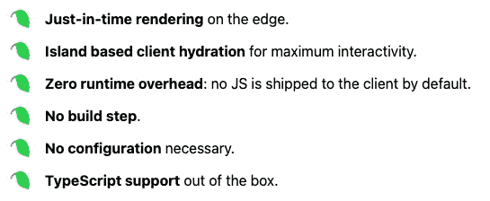
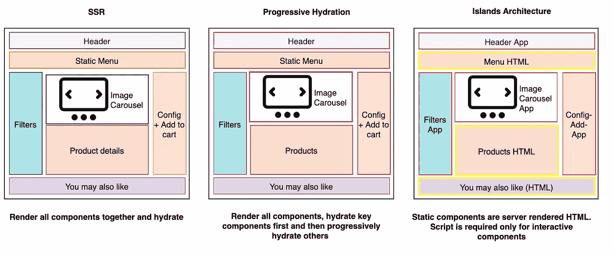

# fre $ h——Web 开发人员的下一代框架

> 原文：<https://betterprogramming.pub/fre-h-the-next-gen-framework-for-web-developers-794d3f1a54a6>

## 它向浏览器发送 0 JavaScript

在一个每个人都吹嘘构建时间更短的世界里，一个新的更自由的框架实现了零构建步骤。

"天啊，又一个 JavaScript 框架？"—但是听我说完。不过，这个很酷。就是 [Fre$h](https://fresh.deno.dev/) ，连 logo 都滴。

如果这还不足以说服您，也许“孤岛架构”和一流的类型脚本用法可以。

# 什么是 Fre$h？

它是一个基于 SSR(服务器端渲染)的全栈框架。

您可以将其与 Ruby on Rails 进行比较。转折:你用 TypeScript 写你的应用程序。这是可能的，因为 Fre$h 是建立在 [Deno](https://deno.land/) 之上的。

## 什么是德诺？

Deno 是“基于 V8 JavaScript 引擎和 Rust 编程语言的 JavaScript、TypeScript 和 WebAssembly 的运行时。Deno 是由**瑞安·达尔**共同创造的，他也创造了 Node。js。”— [来源](https://www.google.com/search?q=wo+created+deno&rlz=1C5CHFA_enDE911DE911&oq=wo+created+deno&aqs=chrome..69i57j0i13j0i10i22i30l3j0i22i30l2j0i22i30i457j0i15i22i30j0i390.1905j0j7&sourceid=chrome&ie=UTF-8)

## 为什么创造了德诺？

“Deno 是专门为修复 Dahl 认为的 Node 的关键弱点而创建的**。”** — [来源](https://thenewstack.io/how-node-js-is-addressing-the-challenge-of-ryan-dahls-deno/)

这种设置允许您零构建步骤和类型脚本作为支持的语言。

# 岛屿建筑

减少通过交互“孤岛”发布的 JavaScript 数量。

这些岛是基于组件的，并且建议页面的有组织的视图。整个视图通过静态和动态的岛结合在一起。

静态部分是纯 HTML，不需要“水合”。动态区域结合了 HTML 和呈现后选择的脚本。

SSR 渐进式水合作用与岛屿建筑的比较— [图片来源](https://res.cloudinary.com/ddxwdqwkr/image/upload/v1633284886/patterns.dev/theislandsarch--avuxy9rrkk8.png)

*框架*[*Astro*](https://astro.build/)*和*[*Marko*](https://markojs.com/)*也采用了岛式架构。*

综上所述，Island Architecture 用普通的 HTML 创建了你的网站的静态部分。启用快速加载 web 应用程序。当需要交互性时，特定的组件只需要注入 JavaScript。

但是有些事情会变得棘手:身份验证和有状态路由。

# Fre$h 的基本概念

## 架构目标:

通过应用以下原则，可以轻松构建快速、可伸缩且可靠的应用程序:

*   将页面加载时间降至最低
*   最小化客户端工作量。
*   产生具有小爆炸半径的误差。

## **路线:**

路由描述了如何处理给定路径的请求。

路线有两个主要部分:一个路由可以有一个或两个，但不能都没有。

1.  Handler —为特定路由的每个请求调用。
2.  组件—获得 SSR 的页面的模板。

## 互动岛:

孤岛允许 Fre$h 中的客户端交互。

孤岛是孤立的[预动作](https://preactjs.com/)组件。与其他组件相比，它们呈现在客户端。

孤岛是通过在 Fre$h 项目的`islands/`文件夹中创建一个文件来定义的。

## 静态文件:

静态资产被放在项目根目录下的一个`static/`目录中。这些资产在网络服务器的根目录下提供服务。

## 路由中间件:

中间件会拦截任何想要的请求。

然后，您可以在路由处理程序之前或之后执行自定义逻辑。因此，它允许您修改或检查请求和响应。需要拦截器的常见操作有日志记录、身份验证和性能监控。

## 错误页面:

Fre$h 允许你定制默认的错误页面。

例如，通过在`routes/`文件夹中创建一个`_404.tsx`文件来定制 404 页面。

## 路由:

Fre$h 根据 URL 路径路由请求。

通常，任何路由都会指定它们被调用的路径。通过使用文件名来完成。Routes 还可以定义一个定制的 [URL 模式](https://developer.mozilla.org/en-US/docs/Web/API/URL_Pattern_API)来匹配更高级的用例。

*这种基于文件的路由已经在 Next.js 中实现了*

## 数据提取:

异步处理函数用于服务器端数据获取。

使用处理函数调用呈现函数，将要呈现的数据作为参数。将它返回给客户机以检索作为呈现组件的数据。

[***用我的“所有代码的味道就像一条线”——备忘单，很容易记住每个代码的味道。***](https://arnoldcodeacademy.ck.page/code-smells-cheat-sheet)

# 抢先一步

要开始您的第一个示例项目，请打开他们的[入门](https://fresh.deno.dev/#getting-started)并投入其中🚀

更像个读者？首先阅读他们的[文档](https://fresh.deno.dev/docs/introduction)📖