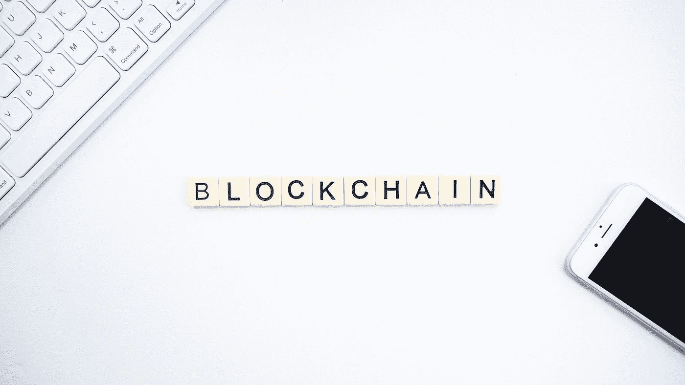
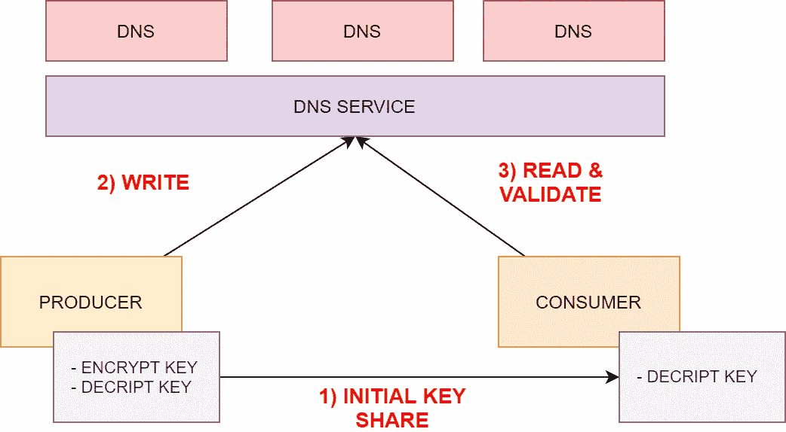
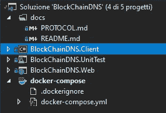

# 我如何使用 DNS 构建一个无成本的区块链数据库

> 原文：<https://betterprogramming.pub/free-dns-blockchain-database-c98fce975134>

## 了解如何利用 DNS 服务器作为分布式区块链数据库


Pierre Borthiry 在 [Unsplash](https://unsplash.com?utm_source=medium&utm_medium=referral) 上拍摄的照片

区块链不仅仅是一个流行语。也不仅限于加密货币和比特币。凭借其创造透明度和公平性的能力，这项技术正在给许多行业带来革命性的变化。应用范围从跟踪系统到保护数据，再到实施在线投票系统。它可以帮助实施反洗钱跟踪系统，或者简单地跟踪您在商店购买的产品的来源。

正如信息科学中经常发生的那样，许多区块链平台管理所有的复杂性，并使我们能够简单地保存数据，就像我们在引擎盖后面有一个简单的数据库一样。

在本文中，我想实现一个区块链数据库，以便了解这些解决方案的关键要素。此外，为了使它更具挑战性，我将在不使用任何数据库或服务器的情况下这样做。

这个解决方案可以很容易地让您拥有可以验证并安全存储的不可变数据。

这篇文章的结构如下:

*   什么是区块链数据库以及如何使用它
*   这个想法
*   如何仅使用 DNS 服务实现区块链

让我们开始旅程吧！



照片由 [Launchpresso](https://unsplash.com/@launchpresso?utm_source=medium&utm_medium=referral) 在 [Unsplash](https://unsplash.com?utm_source=medium&utm_medium=referral) 拍摄

# 什么是区块链数据库，如何使用它

像往常一样，我们可以从维基百科的定义开始:

> “一个**区块链**，[，](https://en.wikipedia.org/wiki/Blockchain#cite_note-te20151031-1)..]，是一个不断增长的[记录](https://en.wikipedia.org/wiki/Record_(computer_science))列表，称为块，使用[密码术](https://en.wikipedia.org/wiki/Cryptography)进行链接。每个块包含前一个块的[密码散列](https://en.wikipedia.org/wiki/Cryptographic_hash_function)，一个[时间戳](https://en.wikipedia.org/wiki/Trusted_timestamping)..].根据设计，区块链可以抵抗对其数据的修改。这是因为一旦记录，任何给定块中的数据都不能在不改变所有后续块的情况下被追溯性地改变。
> 
> 为了用作分布式分类帐，区块链通常由一个[对等](https://en.wikipedia.org/wiki/Peer-to-peer)网络管理，该网络共同遵守一个[协议](https://en.wikipedia.org/wiki/Protocol_(communication))，用于节点间通信和验证新数据块——【https://en.wikipedia.org/wiki/Blockchain 

换句话说，区块链的主要特点是:

*   通过将一条记录连接到前一条记录来存储数据
*   使得你不能改变一个记录而不使所有的数据序列不一致
*   将数据存储在分布式数据库中

那么，如何从零开始创建呢？

我认为一个节点链或多或少是一个链表，其中每个块都有一个不可变的散列。完成这些后，您只需要一个安全的分布式数据库来存储数据。什么是古代的分布式数据库？嗯，有一个分布式数据库，每个人都有，但没有人知道！我说的是 DNS。是的，它是分布式的，它存储数据。每个人都有一个 DNS 服务。我意识到这不是它的预期用途，但是让我们玩玩它吧。

# 这个想法

该协议的工作流程是可信机构将数据写入 DNS。每个记录都有一个唯一的键，它是内容的散列。这意味着通过改变数据，你改变了 ID，所有指向它的子节点将会不一致。此外，DNS 协议是分布式的，因此数据的许多副本在服务器之间共享，这意味着您的一个 DNS 将离线，而另一个将继续提供数据。还要考虑到 DNS 被广泛缓存，这使得您的通信性能良好(使用不可变数据缓存从来都不是问题)。

该系统使用 DNS 作为存储，所有公司都已经拥有，所以它没有任何额外的成本。DNS 本身是一个分布式数据库。

既然我们已经定义了在哪里存储数据，我们只需要理解如何存储。下一步是定义一个通信协议，使各方都能发挥各自的作用。下图显示了流程。



DNS 区块链工作流程。作者和❤️一起做的

在上图中，我们有:

*   在 DNS 上发布的**推力实体**。它掌握着写作的关键——其他人可以写记录，但他们不会被理解。
*   一个**消费者，**推动生产者并读取数据
*   **数据，**其中可以是任何 JSON 数据。你可以选择公开或保密。

我还写了一个完整详细的文档，您可以在本文末尾找到，它允许任何人用任何编程语言集成它或实现客户机。

在下一节中，我们将看到如何实现该解决方案。

# 如何实施

既然我们知道要做什么，并且有了开始的工具，我们只需要摆弄源代码。

为了使用 DNS 实现区块链，我们必须面对一些重要的问题:

*   **DNS 限制** — DNS 不用于存储大量数据。我们想使用 TXT 记录，但这些记录只有 254 个字符长。如果我们的目标是存储一个大的 JSON 对象，这是一个非常大的限制。
*   **安全**——即使我们想公开我们的数据，DNS 使用的 UDP 协议也有问题。它没有加密，也没有像 HTTPS 协议中那样的证书机制来强制授权。
*   **数据按照设计是公开的** —这可能是一个问题。

所有这些问题都有一个解决方案，正如您将看到的，它非常容易实现。事实上，使用密码术和独创性，我们将为上面列出的所有问题找到一个聪明的解决方案。

让我们看看它是如何工作的。

## 创建沙盒环境

第一步是创建一个我们想玩的沙盒环境。我们需要启动这项工作是一个本地的 API 系统的 DNS 服务器。我们通过创建托管它的 docker-compose 文件来实现这一点。我使用了一个 [Visual Studio](https://code.visualstudio.com/docs) 项目，在那里我创建了一个我们将用于验证数据的 web 应用程序、一个将成为我们核心的库和一个测试项目。结果如下:



DNS 区块链项目

通过运行`docker-compose up`，所有启动并准备测试。对于 DNS 部分，我使用了非常轻量级并且有 HTTP APIs 可用的[萨满 DNS](https://github.com/nanopack/shaman) 。它使用以下配置运行:

```
version: '3.4'services:
  blockchaindns.web:
    image: ${DOCKER_REGISTRY-}blockchaindnsweb
    build:
      context: .
      dockerfile: BlockChainDNS.Web/Dockerfile
  dns:
    image: tgpfeiffer/shaman-dns  
    command: shaman --server --token xxx --api-listen 0.0.0.0:1632 --dns-listen 0.0.0.0:53 -l trace --insecure  
    ports:
      - 1632:1632
      - 53:53/udp
```

这里，xxx 是您要用于身份验证的令牌，DNS 被配置为接受来自所有主机的请求(0.0.0.0:port)。

在使用`docker-compose up`运行它之后，您可以使用控制台来测试它:

```
#create a record in Shaman DNS
curl --location --request POST 'localhost:1632/records' \
--header 'Content-Type: application/json' \
--data-raw '{
  "domain": "test.myfakedomain.it.",
  "records": [
    {
      "ttl": 60,
      "class": "IN",
      "type": "A",
      "address": "127.0.0.1"
    }
  ]
}'#test the record
nslookup test.myfakedomain.it 127.0.0.1#output
# Server:  UnKnown
# Address:  127.0.0.1# Response from server:
# Nome:    test.myfakedomain.it
# Address:  127.0.0.1
```

现在我们有了一个工作的本地 DNS，我们可以创建一个可以通过 API 管理 DNS 记录的客户机。

## DNS 客户端

第二步是包装要在应用程序中使用的 DNS 客户端功能。我在这里想做的是在将来有能力改变 DNS 服务，所以我创建了一个接口和一个类实现。以下代码片段显示了该界面:

```
public interface IDNSClient
{
  Task<DNSEntry> GetRecord(string host, string zone); Task<bool> AddRecord(DNSEntry entry); Action Init { get; set; }
}
```

可以想象，客户机实现执行 HTTP 调用来存储记录。您可以在本文结尾所附的 GitHub 项目中找到完整的类实现。我们只为 Shaman 实现了本地提供者，但是很容易扩展它来支持大多数现代主机提供者上的任何商业 DNS。

## 区块链服务

现在我们有了操作部分，是时候实现业务逻辑了。所有工作都在客户端完成，客户端计算要存储的数据，并调用 DNS 客户端方法来保存记录。服务层由两部分组成:

*   `BlockChainNode`:节点的表示
*   `BlockChainService`:实现逻辑的服务

让我们详细看看这些类是如何工作的。

**区块链节点**

这是一个带有`JObject`属性的简单类，用户可以在其中存储任何数据。它计算密钥散列数据。数据包含历史记录，历史记录是指向父项的链接。仅改变数据的一个字节将改变密钥，这将使随后的节点不一致。下面这段代码展示了这个类最重要的部分。

准则中最相关的部分是:

*   数据对象:一个 JSON 对象，用户可以在其中存储数据
*   历史:与数据同步的可观察列表(历史中的任何变化都会改变`_history`节点，反之亦然。)
*   Hash:从数据的文本表示的 MD5 计算出的散列。结果以 Base32 算法编码，类似于 Base 64，但只使用四个字节，并且只有小写字符。这是因为 DNS 不区分大小写，并且使用广泛使用的 Base64 编码会产生不一致的数据。

现在我们有了模型，我们必须进入下一步:由服务实现的业务逻辑。

**区块链服务**

区块链服务实现了保存、读取和验证记录的方法。困难的部分是解决 DNS 服务器记录长度 255 个字符的限制。解决方案是用 Base64 对内容进行编码，然后按照命名约定分割成块保存在不同的记录中。该密钥用作 URL 的一部分。所以，对于`mykey.domain.dom`这个物品，我们会有`0.mykey.domain.dom`、`1.mykey.domain.dom`等。下一段代码展示了保存方法。

从前面调用`WriteDNSFragmentedText`的代码片段中可以看到，输入文本被拆分，数据保存在许多 DNS 条目中。

看数据，是相反的。我尝试获取子记录 0、1、2 等等，直到有数据为止。一旦我收集了所有的 Base64 块，程序就是将它们连接起来，解码，并得到普通的 JSON。

客户端可以很容易地验证所获得的数据是否产生了密钥并且是有效的，因为它可以获取数据、散列和比较结果。此外，客户端可以递归验证，以检查是否所有的父节点都是可信的。这就是验证过程的作用。它由下一段代码表示:

正如您在前面的代码片段中看到的，记录被验证，然后所有的层次结构被下载并检查数据一致性。

既然我们已经了解了如何从 DNS 读写数据，下一步就是如何保证它们的安全。

## 密码术和密钥

我们的系统可以向 DNS 读写数据，现在是时候考虑安全性了。我们假设向我们的 DNS 写入数据的人是可信的，但是我们不能保证恶意的 DNS 服务器不会给我们假数据或者有人不会读取它(记住，DNS 数据是公开的)。

我在这里所做的是对协议进行如下改进:存储的数据使用非对称算法加密存储。这确保了只有数据的生产者才能生成消费者可以理解的数据。任何人都可以创建一个假的 DNS 服务器，但他们将无法对待你的假数据。此外，数据现在是加密的，没有人可以读取。

不对称算法是完美的，因为它只允许一定数量的读者理解消息，但只有源可以产生它们。为此，客户端生成一对密钥。公钥用于加密数据，因此它由生产者保管。用于解密的私钥与消费者共享。它可以手动共享，例如通过加密存档的电子邮件发送，或者发布在 HTTPS 网站上，在那里证书可以向用户证明其权威。

顺便说一下，这个概念很简单:现在数据被加密了，没有人能代表我们写数据。但是还有一个问题。对称算法处理少量数据(1024–4096 字节)，但是我们必须处理巨大的 JSON 负载。我们有两种方法:

*   将整个消息分成小字节块，并逐个加密\解密。
*   创建一个对称密钥，用生成的密钥加密数据，然后用非对称密钥对加密生成的密钥。这样，每个记录都有不同的对称密钥用于加密数据。这个密钥是公开共享的，但只能由拥有私钥的人使用。

考虑到编码所有字节块的计算工作量，我使用了第二种解决方案。这将我们带到下一个有效载荷:

```
{
   "data":"json object encrypted with the symm key", "key":"symm key encripted with the aymm alghorithm"
}
```

在上面的代码片段中，我们可以看到加密的数据和加密的解密密钥存储在 JSON 有效负载中。读取器将使用私钥来解密对称密钥，然后使用它来解密数据。

代码中的变化很小:需要的只是包装/解包数据的额外步骤。

在下一个片段中，我展示了生成数据的步骤:

```
#generate a one time password
var password = SHA512.Create().ComputeHash(Guid.NewGuid().ToByteArray());#encrypt the password
var decriptkey = this.cryptoService.EncodeKey(password, publicKey);#encrypt data with the password
 var dataEnrypted = this.cryptoService.EncryptData(dataToEncode, password);#json object is stored with decriptkey and dataEnrypted
```

在下一个片段中，我们有一个阅读过程:

```
var decriptKeyEncoded = .. from json
var dataEncrypted = ... from json var decriptKey = this.cryptoService.DecodeKey(decriptKeyEncoded, privateKey); 

var decodedData = this.cryptoService.DecodeData(dataEncrypted, decriptKey);#decodedData is the plain data.
```

既然我们已经完成了关于区块链实现的解释，我们就有了在 DNS 区块链中存储数据的所有细节！

# 结论

即使使用 DNS 服务器作为数据库看起来很聪明，但事实并非如此。DNS 不是用来存储数据的，不是以这种方式。

如果我们必须处理安全的不可变数据，解决方案是使用标准的区块链平台——我指的是真正的区块链系统。

无论如何，尝试实现一个无服务器的区块链是非常有趣的，我希望它教会了我们区块链平台背后的原则。

我敢肯定，现在你会有足够的好奇心去尝试在你的下一个项目中包含一个区块链的解决方案。

你可以在 GitHub 上找到[源代码](https://github.com/zeppaman/BlockChainDNS)和[完整的协议规范](https://github.com/zeppaman/BlockChainDNS/blob/master/PROTOCOL.md)。