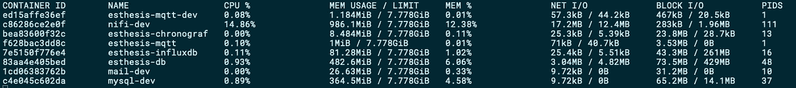
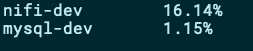
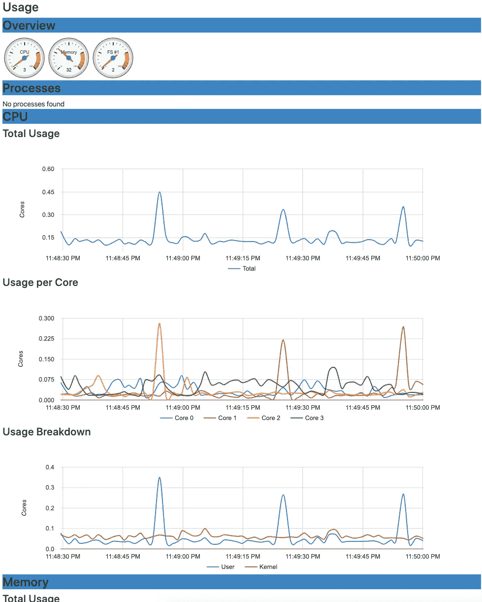
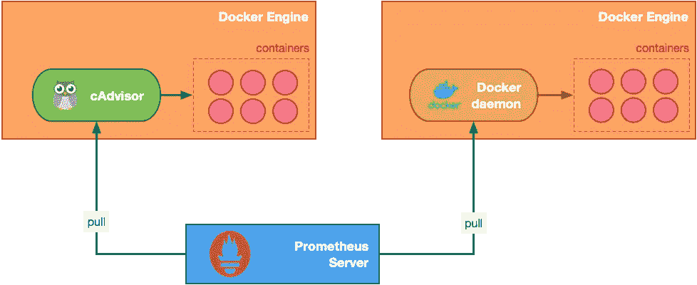
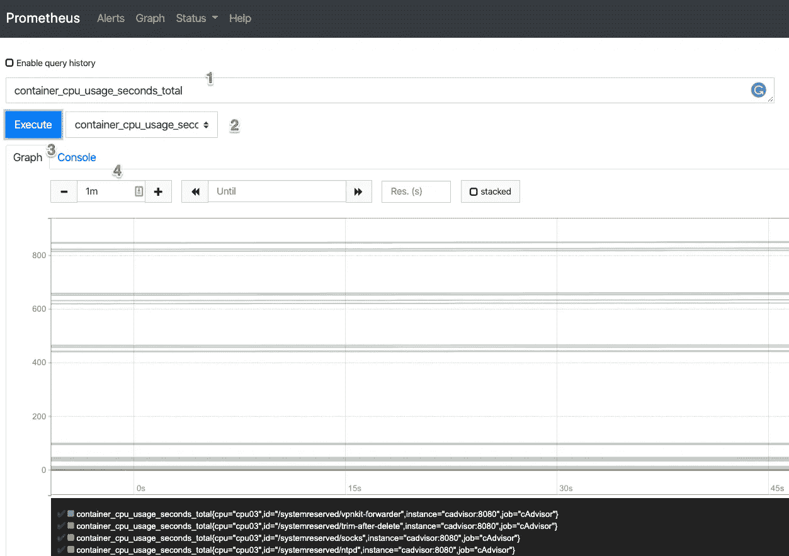

# 获取实时码头绩效指标

> 原文：<https://betterprogramming.pub/free-docker-monitoring-tools-realtime-450852b61cbc>

## 如何使用免费的开源工具监控容器的健康状况


由[西蒙·康纳兰](https://unsplash.com/@simoncon?utm_source=medium&utm_medium=referral)在 [Unsplash](https://unsplash.com?utm_source=medium&utm_medium=referral) 上拍摄。

无论您是在开发机器上运行少量容器，还是在生产机器上运行数百个容器，了解幕后发生的事情都是非常宝贵的。您是否看到过多的磁盘活动，但不知道是哪个容器导致的？高内存或网络使用率会对剩余的容器产生负面影响，怎么办？

在本文中，我们将探索三种最著名、最广泛使用的 Docker 性能监控工具。我特意只选择了免费的开源工具。还有更多的商业软件——其中一些非常好，非常受欢迎——提供了强大的分析功能和良好的用户界面。

# 码头统计

这是一个内置于 Docker 引擎和客户端的监控工具。它是通过带有`docker stats`的`docker`命令行客户端调用的，除了直接在您的 shell 中显示的内容之外，没有其他用户界面:



docker stats 的默认输出(图片由作者提供)。

默认列包含关于 CPU、内存、网络、磁盘和容器创建的线程数量的信息。您可以通过传递容器的 id 或名称来快速过滤显示的容器，并使用`--format`选项来选择显示的列。例如:

```
docker stats — format “{{.Name}}\t{{.CPUPerc}}” nifi-dev mysql-dev
```



过滤 docker 统计数据(图片由作者提供)。

你可以称之为`docker stats`穷人的度量。然而，如果没有其他可用的，它提供了大量的细节让你开始调查一个问题。

# 管理员

container Advisor([CAD visor](https://github.com/google/cadvisor))是 Google 的一个容器监控工具。这是最古老的可用工具之一，它通过运行一个守护进程来收集几种不同的统计数据。这里有趣的是，cAdvisor 并不是一个只用于 Docker 监控的工具。它适用于任何其他类型的容器。但是，它对 Docker 有原生支持。这实际上意味着您也可以将 cAdvisor(这是一个静态的 Go 二进制文件)作为一个独立的程序来运行。当然，为了便于使用，它也以 Docker 图像的形式出现。cAdvisor 的 Docker 映像需要安装相当多的卷，以便能够正确访问底层 Docker 引擎和操作系统指标，如下所示:

运行 cAdvisor Docker 映像。

运行之后，可以通过基于 REST 的 [API](https://github.com/google/cadvisor/blob/master/docs/api.md) 或者通过 [http://localhost:8080](http://localhost:8080) 上的图形用户界面来访问 cAdvisor(根据您在实例化容器时指定的
`-p`选项)。下面是 cAdvisor 提供的用户界面:



用 cAdvisor 监控 Docker 容器(图片由作者提供)。

cAdvisor 的图形用户界面非常友好，信息丰富，以各种格式呈现，如数字、仪表和图表。

如上所述，cAdvisor 不仅用于 Docker 监控。因此，当你打开它的主页时，你会看到一个资源或子容器的层次结构——这是谷歌的 [lmctfy](https://github.com/google/lmctfy) 提供的，其中之一就是你的 Docker 引擎。要深入了解 Docker 容器的统计数据，请选择页面顶部的`/docker`链接或`Docker Containers`链接。然后，您可以选择您感兴趣的确切容器，以获得附加信息和指标。

# 普罗米修斯

当您只有一个 Docker 引擎需要监控时，上面两个用于获取实时指标的工具可以很好地工作。但是，对于较大的基础设施，您需要一个能够从多个 Docker 引擎接收指标的解决方案，使您能够生成单独或合并的统计数据。

这就是普罗米修斯的用武之地:


普罗米修斯建筑(图片由普罗米修斯作者提供)。

下面是官方的概述:

> Prometheus 是一个开源的监控和警报工具包，建于 2012 年。普罗米修斯可以很好地记录任何纯数字时间序列。它既适合以机器为中心的监控，也适合高度动态的面向服务的架构的监控。在微服务的世界里，它对多维数据收集和查询的支持是一个特别的优势。

Prometheus 可以通过多种方式收集指标，包括数据推送网关、导出器，或者通过您自己的应用程序使用一个受支持的客户端库。不可否认，[支持的提取器](https://prometheus.io/docs/instrumenting/exporters/)列表令人印象深刻。

将 Docker 引擎的实时指标导出到 Prometheus 非常简单，因为 Docker 守护程序本身能够以 Prometheus 期望的格式导出指标。或者，您可以利用我们之前部署的 cAdvisor 容器，让 Prometheus 从 cAdvisor 获取指标。每种方法都会产生一组独特的指标(略有重叠)，所以我建议您对两种方法都进行试验，看看哪一种适合您的需求。

接下来让我们探索这两个选项。

## 通过 Docker 守护程序导出指标

您的 Docker 引擎没有预配置为导出指标，但是您可以通过在它的`daemon.json`配置中添加一行来快速启用它:

```
{
  "metrics-addr" : "0.0.0.0:9323",
  "experimental" : true
}
```

注意:要知道根据你看这篇文章的时间，你也许可以跳过`“experimental”: true`。此外，还要考虑到`0.0.0.0`表示任何主机都可以访问这些指标。如果你想只允许你自己的主机，你也可以试试`127.0.0.1`。

## 通过 cAdvisor 导出指标

要使 cAdvisor 能够导出其指标，不需要特殊的配置，因为这是在运行 cAdvisor Docker 映像时默认配置和启用的。如果您已经使用上面显示的`docker run`命令启动了 cAdvisor 容器，那么可以在端口`8080`上访问这些指标。

## 运行和连接普罗米修斯

在此步骤中，我们将实例化一个 Prometheus Docker 映像，并将其连接到 Docker 守护程序和 cAdvisor 的导出指标:



将普罗米修斯连接到 Docker metrics(图片由作者提供)。

在《普罗米修斯》开拍之前，我们先来快速看一下上图。如你所见，普罗米修斯正在从 Docker 引擎提取数据。并不是 Docker 引擎在推动指标。因此，需要对 Prometheus 进行适当的配置，以便它知道从哪里获取数据。这种配置通过我们接下来定义的`prometheus.yml`文件进行:

`prometheus.yml`配置文件

注意:当 Prometheus 配置了上述 YAML 配置时，它将尝试联系运行 Docker 引擎的主机，以便与服务于指标的 Docker 守护进程通信。您应该使用的主机名取决于您的操作系统。在这里使用的示例文件中，我使用的是在 Mac 中工作的主机名，即`docker.for.mac.host.internal`。如果您使用的是 Windows 或 Linux，您可以将其替换为您的主机的 IP 地址。

那么，是时候在码头上运行普罗米修斯了。在这个快速演示中，我们将使用相同的底层 Docker 引擎，通过 cAdvisor 和 Docker 守护进程并行导出指标。使用上述内容创建一个`prometheus.yml`文件，针对您的操作系统进行修改，然后执行:

创建 Prometheus Docker 实例。

几秒钟后，您应该能够访问位于 [http://localhost:9090](http://localhost:9090) 的 Prometheus web 界面。默认页面希望您定义要执行的查询，以便您可以看到您的实时指标。这里有一个例子:



在普罗米修斯中查看指标(图片由作者提供)。

Prometheus 的 web 界面为搜索定制提供了相当多的选项，例如:

1.  定义用于筛选数据的查询。Prometheus 支持一种丰富的[查询语言](https://prometheus.io/docs/prometheus/latest/querying/basics/)，允许你准确地看到你想要的数据。
2.  所有收集的指标类别都可以从该下拉列表中快速选择。
3.  您可以选择以图表或表格的形式查看结果。
4.  定义显示指标的时间段。

现在，您已经配置了 Prometheus，并从两个不同的数据源(尽管来自同一个 Docker 引擎)获取数据。通过扩展所使用的配置文件，您可以定义所有额外的数据源，并监控 Docker 引擎的整个车队。如果您想创建比 Prometheus 现成提供的更高级的图形，Grafana 可以很好地与 Prometheus 集成，并提供大量额外的可视化选项。

# 结论

能够获得容器的实时指标对于计划和调试来说是一个很有价值的工具。

为了快速了解您的 Docker 引擎，内置的`docker stats`是一个起点。cAdvisor 可以很容易地集成到您的环境中，它提供了一个包含多种不同图表和仪表的 web 界面。最后，如果您想要监控多个 Docker 引擎，Prometheus 提供了一个强大的基础设施来收集和可视化大量数据源的指标。

感谢您阅读这篇文章。希望下一部能见到你。