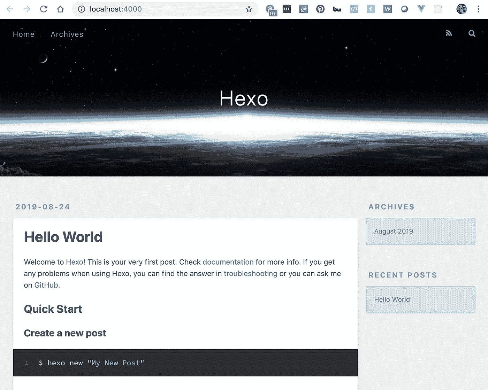
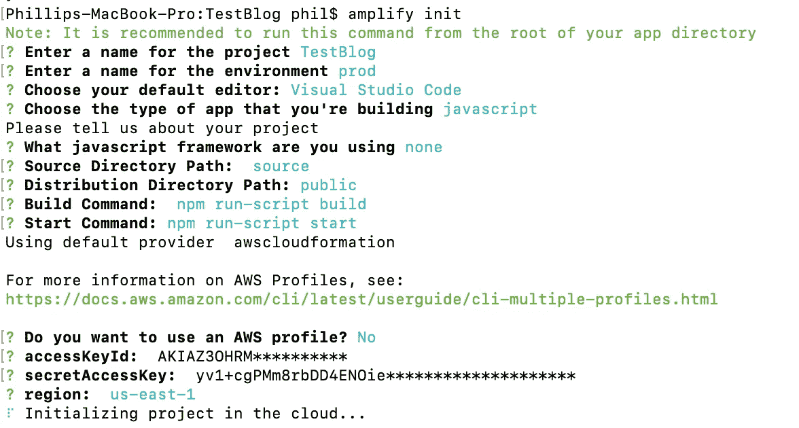
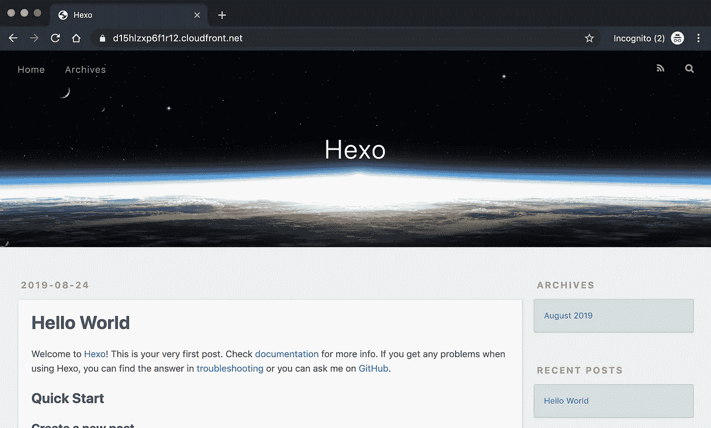
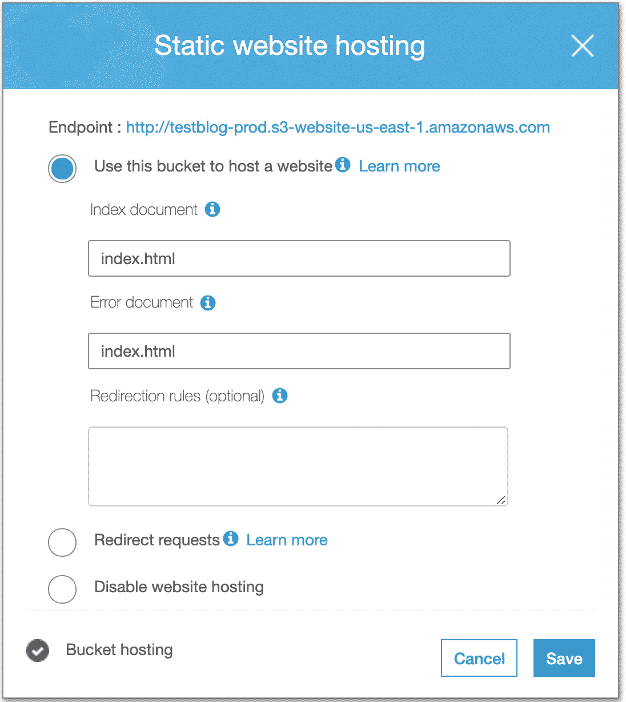
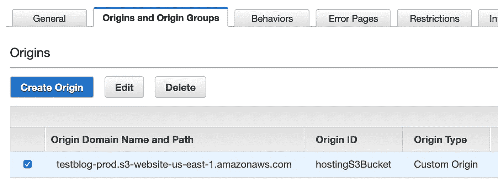

# 通过 AWS Amplify 和 Hexo 的免费无服务器博客

> 原文：<https://betterprogramming.pub/free-serverless-blogging-via-aws-amplify-and-hexo-32ada39f7af3>

## 一个几乎免费托管的著名 node.js 包

在这篇文章中，我将展示如何基于一个著名的免费(几乎免费)托管的 node.js 包快速创建一个新博客。听起来好得难以置信？不是的！请继续阅读…

运行一个关于 AWS 的博客意味着，根据假设规则，我应该在 AWS(【https://www.awsadvocate.com】T2)上运行那个博客*。有什么比无服务器运行博客更好的方式呢？有了 12 个月的免费 AWS 帐户，我可以获得一年的 100%免费托管。根据我的估计，即使过了这段时间，我每个月也只需要花 0.5 美元就可以拥有我的博客。相比之下，托管大多数其他博客，如 Wix、Wordpress.com 或 Webflow，平均需要 10-20 美元。此外，当我在 AWS 上托管时，我还获得了以下好处:*

*   通过 AWS CloudFront 的全球 CDN 实现疯狂的页面响应速度
*   通过一个很棒的 node.js 博客框架(Hexo)100%控制我的内容和主题
*   使用 AWS CodeCommit 轻松访问私有 git 进行源代码控制
*   AWS 证书管理器提供的免费 SSL/HTTPS 证书(每年价值 100 美元)
*   真是*路*更好玩！

Hexo 是一个伟大的开源博客框架，它基于 node.js，是从头开始写博客的完美方式。查看我的 [Hello World](https://d3mvqf4qoyno5o.cloudfront.net/2019/08/23/hello-world/) 帖子，了解更多关于 Hexo 的细节和其他一些有用的链接！

我们建立和运行博客的基本步骤如下:

1.  安装 Hexo
2.  为 AWS 发布安装 AWS 放大器
3.  发布到 AWS
4.  解决 index.html 路由问题

# 安装 Hexo 博客框架

建立我们博客的第一步是安装我们的博客框架 Hexo。运行下面的 node.js 命令来安装 Hexo(如果您还没有安装 node，请先安装它)。

> $ npm 安装 hexo-cli -g

安装 Hexo CLI 后，您接下来想要创建一个新站点:

> $ hexo init <folder>$ cd <文件夹>
> $ npm 安装</folder>

生成站点后，您可以使用以下命令运行站点:

> $ hexo 服务器

您的站点应该是这样的，运行在 [http://localhost:4000](http://localhost:4000/) 上:

# 添加 AWS Amplify，以便轻松部署到云

显然，在你的博客反映出你独特的人物和风格之前，还有很多事情要做(比如选择和安装一个主题)，但是现在，让我们把我们的博客发布到 AWS 吧。

AWS Amplify 是 AWS 中的一个新框架，帮助开发人员快速轻松地部署他们的项目。您只需安装 CLI，用您的凭证和一些其他设置初始化它，然后从 CLI 发布——所有复杂的 AWS 配置都由框架为您完成！

首先，安装 AWS Amplify CLI(如果您尚未安装):

> $ NPM install @ AWS-amplify/API @ AWS-amplify/pubsub

安装 AWS Amplify CLI 后，您需要在项目的根目录下对其进行初始化:

> $放大初始化

该初始化将提示您进行几项设置。你可以在下面找到我的选择。

> *“Source”和“public”是支持 Hexo 的源目录和分发目录路径所必需的*

合乎逻辑的下一步是发布，但首先，我们需要添加一些额外的主机配置和后端依赖。运行以下命令开始，并在下面记录我的设置:

> $ amplify 添加主机

出版前的最后一步——我保证这是最后一步。我们需要做一些配置更改来支持一些 Hexo 特性。将以下内容添加到项目根目录下的 package.json 文件中:

> "脚本":{
> "开始":" hexo 服务器"，
> "构建":" hexo 清理& & hexo 部署"
> }

这些配置告知 Amplify 部署如何启动和构建我们的 Hexo 包。

有了这最后一步，你现在可以使用标准的“npm start”在本地运行你的博客——相当于“hexo 服务器”。我们现在也准备出版:

> $ amplify publish -c
> 
> *关键是“-c”。由于 AWS CloudFront(CDN)缓存文件，所以有必要使用-c 来清除该缓存，否则您的发布将不会生效，直到该缓存失效。显然，对于我们的第一次出版，这是没有必要的。*

发布完成后，您应该可以立即查看您的网站。请注意全球托管在 AWS CloudFront CDN 上的 URL:

请随意查看我的[开箱即用的无服务器 Hexo 部署](https://d15hlzxp6f1r12.cloudfront.net/)，然而，正如您所猜测的，[https://www.awsadvocate.com](https://www.awsadvocate.com)本质上是一样的:)

# 解决 CloudFront Index.HTML 子文件夹问题

您可能会注意到，只有您的 root 假定使用 index.html。所有其他页面和博客文章都不会，而是将您重定向到根目录/主目录。要解决这个问题:

1.  编辑 CloudFront 发行版、常规设置，并从默认根对象中删除“index.html”值
2.  在“Origins and Origins Groups”选项卡上，单击由 Amplify 创建的 origin，并将路径更改为托管您的网站的 S3 存储桶的全球可访问 URL(您可以获得如下截图所示的 URL)。

# 后续步骤

那不是很容易吗？这一切都要归功于 AWS Amplify，它让无服务器 S3 应用部署变得轻而易举。然而，你的努力站起来你的博客才刚刚开始。您接下来的一些步骤可能如下:

*   将您的代码提交到源代码控制(我使用的是 AWS code commit)——但这可能是您的第一步，对吗？
*   使用 AWS 证书管理器创建一个免费的 SSL/HTTPS 证书，以获得安全托管和 SEO 好处
*   配置 AWS CloudFront 以使用您的自定义域
*   如果你不喜欢开箱即用的主题，安装一个 Hexo 主题
*   定制您的网站！
*   写你的第一篇博文！

谢谢！

~菲尔