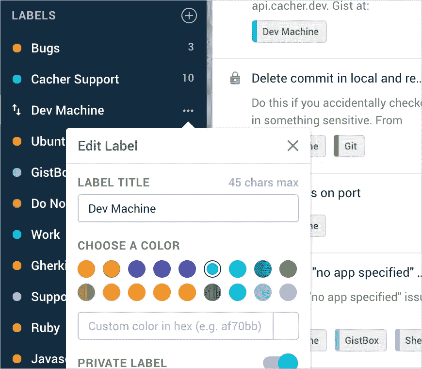
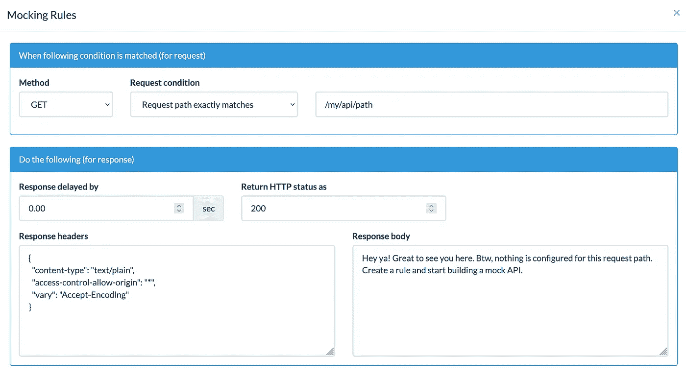
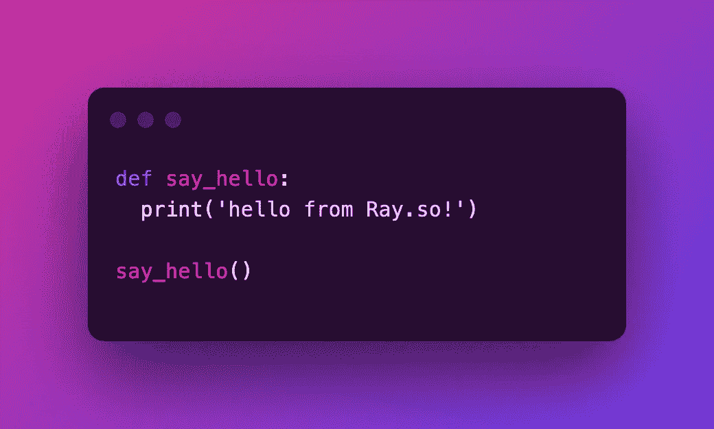
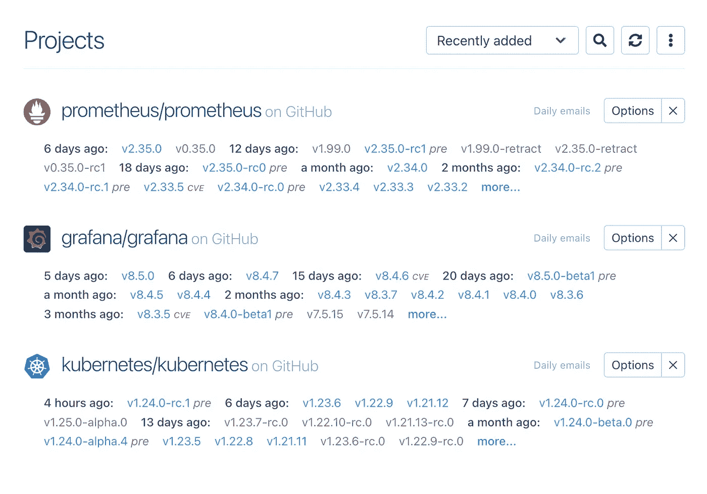

# 6 项提高开发者效率的免费服务

> 原文：<https://betterprogramming.pub/free-services-for-boosting-developer-efficiency-ab7c691fd3a4>

## 更少的重复任务，更少的调试时间，更快乐的开发人员

琼·加梅尔在 [Unsplash](https://unsplash.com/s/photos/saas?utm_source=unsplash&utm_medium=referral&utm_content=creditCopyText) 上的照片

有大量不同的服务面向改进开发人员的工作流程。每一个都旨在解决每天困扰我们的无数问题。有时他们专注于改进现有的开源产品，有时他们为编写或测试代码提供新的范例。筛选对大多数日常开发人员真正有帮助的内容可能是一个挑战。

在本文中，我们将探索一些简化开发人员日常操作的最佳服务。无论是为以后节省代码，跟踪开发时间，还是仅仅构建新的环境。

这些产品通过提供一种便捷的方式来完成常见任务、跟踪生产力和构建更好的软件，从而减少了整体开发时间。

让我们来看看。

## [卡希尔](https://www.cacher.io/)

[来源](https://www.cacher.io/)。

你是否曾经有过一点代码太小而无法签入 Git，但比简单的一行代码还要大？您将这些方便的代码片段放在哪里？

有时它们最终会被闲置，如果你幸运的话，它们会被固定在一个有逻辑意义的频道上。其他时候，它们被保存在某个不可避免地被遗忘的文档中。

在缓存器中标记片段。[来源](https://www.cacher.io/)。

Cacher 旨在解决这个问题。缓存器提供了一种非常灵活的方法来跟踪小代码。您可以将标签应用到片段，添加文档，并与团队的其他成员就不同部分进行协作。最好的部分是，Cacher 不仅是一个 web 应用程序，它还可以在几个现代 ide 中工作，也可以作为一个独立的应用程序。

## [b 接收器](https://beeceptor.com)

[来源](https://beeceptor.com/images/logo-beeceptor.png)。

如果您构建或维护任何类型的 API，Beeceptor 可能是自切片面包以来最酷的东西之一。这个 web 应用程序允许您创建一个中间 API，可以拦截、显示和模拟来自现有应用程序的请求。

Beeceptor 让中间人成为一件好事。

在 Beeceptor 中创建嘲讽规则。

假设您有一个利用新的或现有 API 的应用程序。您可以在 Beeceptor 中创建一个端点，并将所有请求发送给它，这样您就可以用模拟来响应，或者转发给真正的 API。如果您正在构建的 API 仍在进行中，但是前端已经完成，这可以节省时间。

Beeceptor 的另一个巨大好处是能够详细检查所有传入的请求。你可以检查头部，查看有效载荷，并准确地看到事情的走向。如果你正在处理一个特别讨厌的 API bug，这可能会对这个问题有所启发。

Beeceptor 的免费端点可以公开访问，但他们确实为私有端点提供了付费版本。

## [Ray.so](https://ray.so/)

在 Ray.so 中生成漂亮的代码片段。

你有没有想过人们从哪里得到那些看起来很棒的代码截图？如果你认为它们是自己产生的，那你就想得太多了。他们可能用雷。

[Ray.so](https://ray.so/) 网站提供了一种超级简单的方法来创建优雅的代码片段，用于文档、文章中，或者只是为了让共享片段更漂亮。

使用 Ray 真的很简单。你所要做的就是打开网站，选择你的语言和喜欢的格式参数，然后粘贴你的代码。不再有无聊的复制粘贴文本！

## [Gitpod](https://www.gitpod.io/)

[来源](https://www.gitpod.io/media-kit)。

GitPod 消除了建立新开发环境的痛苦。有了 GitPod，您可以拥有按需开发环境，只需点击一个按钮，就可以轻松启动、共享和删除这些环境。您可以在 GitPod 中构建分支，并准备好所有的依赖项。

你不再需要坐着等待软件包下载或者复杂的安装出错。

GitPod 有一个非常棒的基于 web 的 IDE 和完整的浏览器开发环境。您也可以将 GitPod 直接添加到 GitHub，并直接从 GitHub 界面“启动”分支。

工作空间运行后，您可以直接与同事共享，以便他们可以实时协作。这可以大大减少与其他开发人员一起标记团队功能或错误所花费的时间。

## [WakaTime](https://wakatime.com/)

[来源](https://wakatime.com/)。

在我们的工作中，所有东西都有仪表盘。服务器统计、客户销售、数据库使用。为什么没有一个用于个人编程统计的仪表板？一组独特的度量标准，显示您自己的特殊开发风格。

想象一下，如果你能像分析一个程序或一件硬件一样分析你是如何工作的。

WakaTime 正是这样做的。WakaTime 可以直接插入到您使用的任何代码编辑器中，并允许您查看一组有用的指标。你可以看到像你花了多长时间在一个特定的文件上，每天平均和总的编码时间。

起初，这听起来像是另一组需要强调的事情，但是 WakaTime 使你能够做的不仅仅是检查你自己的效率。它允许您识别可能影响团队其他成员的瓶颈。

## [新发布](https://newreleases.io/)

[来源](https://newreleases.io/)。

用一卡车的第三方库来跟上大量不同项目的多语言版本并不容易。如果你曾经收到过来自 GitHub 的关于一个被否决的包的安全通知，你应该很清楚我在说什么。

如果有某种神奇的方法可以跟踪一堆软件包，并在有新版本发布时得到通知，那会怎么样？

现在你可以用新版本！如果您转到 [newreleases.io](https://newreleases.io/) ，您可以从各种来源添加您的项目和包，然后设置详细的通知，并在包获得更新时发出警报。

跟踪一些新发布的热门项目。

对通知频率和特定版本排除等事项有精细控制。你可以把它想象成一个版本号的仪表板——它会一直监视着你，所以你不需要这么做。

感谢阅读！如果你喜欢这篇文章，请随时关注并查看我下面的其他帖子:

*   [*6 个针对 JavaScript 的强大 Ramda 函数*](/6-powerful-ramda-functions-for-javascript-7b0326c3f1d1)
*   [*获取最新编程的资源&科技新闻*](https://tateg.medium.com/resources-for-getting-the-latest-programming-tech-news-8d24458cdd01)
*   [*6 个完全用 JavaScript 编写的操作系统模拟器*](/6-operating-system-emulators-written-entirely-in-javascript-5506a4df2d04)