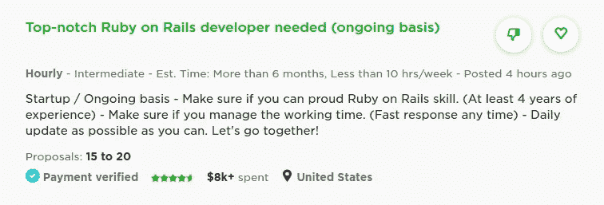
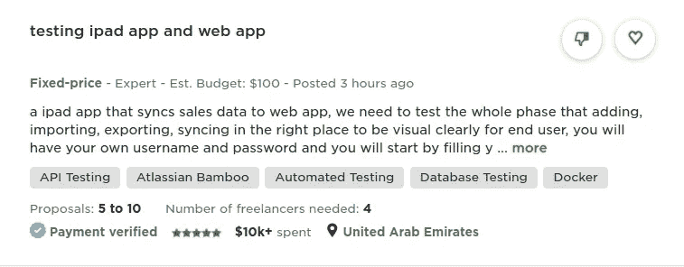

# 自由开发者:为什么小时工资合同对你更好

> 原文：<https://betterprogramming.pub/freelance-developers-why-hourly-rate-contracts-are-better-for-you-7b0716bac55b>

## 为什么我更喜欢小时合同而不是固定价格合同

由[阿格巴洛斯](https://unsplash.com/@agebarros?utm_source=medium&utm_medium=referral)在 [Unsplash](https://unsplash.com?utm_source=medium&utm_medium=referral) 上拍摄的照片

自 2014 年以来，我一直是 Upwork 的自由职业者。如果你也决定开始做自由职业者，你将会看到一些工作被贴上固定价格的标签，而另一些工作则是按小时计酬的。在这篇文章中，我将简要地解释两者的区别，以及为什么我更喜欢开发人员的计时工作。我所有的例子都来自 Upwork，但这个话题可能适用于其他自由职业者网站。

# Upwork 上的职位是什么样的

有两种类型的工作职位:每小时或固定价格。您可以从 Upwork feeds 的截图中看到不同之处。

## 每小时地

## 固定价格

重要的是要注意第一个区别。小时工有一个估计时间，而固定价格的工作有一个估计预算。

# 这些合同之间的主要区别是什么？

## 一般

**每小时—** 您的联系方式将包括每周允许的最大小时数和您的小时费率。

**固定价格—** 您的合同将包括里程碑和每个里程碑的预定预算。

## 你如何得到报酬？

**每小时—** 您使用工作时间跟踪器。你在工作的时候开始记录时间，不工作的时候就停下来。该追踪器可以截屏和统计你工作时做的事情，并自动提交你的工作时间。只要不超过合同规定的每周工作时间，客户会自动根据你的工作时间付给你报酬。

**固定价格—** 工作被分成几个里程碑。当您完成一个里程碑时，您请求它的付款并等待客户接受。

## 项目定价

**每小时—** 项目定价等于你工作的小时数乘以你的小时工资。即使你还没有完成，付费也是自动的。

**固定价格—** 定价是为整个项目或各个里程碑预先确定的。只有当你完成时，你才能得到报酬。

## 添加到合同中

如果客户对你有新的要求，需要对合同进行哪些修改？

**每小时—** 无需更改。客户可以增加每周允许的小时数。

**固定价格—** 客户需要添加一个新的里程碑。

## 客户如何跟踪你的进度？

当你处理任何合同时，客户通常需要跟踪你的进度。一般来说，这是通过消息、共享文件和双向调用来实现的。然而每种方法都有另外的方式。

**每小时—** 客户每周会收到一份你工作了多少小时的报告。他们可能会调查你的工作时间的截图和统计。

**固定价格—** 只有当一个里程碑完成时，客户才会收到付款请求。所以你的小里程碑越多，客户就越容易跟踪你的进展。

# 为什么小时合同更好

这些是每小时和固定价格方法之间的客观差异。然而，当涉及到个人偏好时，我们总是有一个主观的观点。所以接下来，我将向那些打算成为全职自由职业者的人展示为什么我更喜欢小时合同而不是固定价格合同。

## 1.信任

通常，选择小时合同的客户会很容易信任你，因为他们愿意在你提交完整的结果之前付钱。他们也相信你不会在工作时间上作假。我认为相互信任在任何交流中都是至关重要的。

## 2.客户类型

说到自由职业，你可能会遇到各种类型的客户。那些刚刚有了一个想法并想尝试一下的人，那些刚刚创业并想远程办公的人，那些想快速轻松完成工作的人，以及许多其他类型的人。我可能会写一个关于这个主题的完整故事。如果你想成为软件领域的全职自由职业者，你最好选择那些愿意成为专业人士的客户，即使他们不是。寻找合适的客户将有助于你在做自由职业者时保持专业性。

## 3.长期合同

说到自由职业，没有什么比找一份新合同更无聊的了。我认识的许多人决定不做自由职业者，因为他们认为这是一系列短期项目。固定价格项目也是如此。然而，对于小时合同，长期合同的大门总是敞开的。

简单地基于我对客户类型的观点:愿意作为专业人士工作的客户是那些如果他们还不是创业公司，可能会把他们的项目变成创业公司的客户。所以总有更多的事情要做。

即使要花更多的时间和工作来获得小时合同，你也会在更长的时间里享受到他们的好处。就我个人而言，我的大多数合同都超过一年。

此外，为长期合同工作意味着工作更有深度，所以你会通过这个项目提升自己的水平，学到更多东西。

## 4.这是过程，而不是产出

作为一名软件开发人员，如果我只按里程碑交付，可能会有更快完成的动机。这对客户来说可能听起来不错，但事实并非如此。更快的完成可能意味着更少的头脑风暴，更少的计划，更少的测试，以及更少的专业工作。

但是我只说自由职业者，让我告诉你，这对你也不好。你需要在编码时应用正确的实践，就像你在为一家公司工作一样，来提升你的水平。一份固定价格的工作假设你已经知道项目如何完成，而一份计时合同雇佣你作为一名软件开发人员，他将钻研这个问题几个月。

## 5.尽可能加入团队

当你的工作价格固定时，你通常是独自工作或者和自己的团队一起工作。如果一个来自客户方的团队与你合作，这主要是一种客户-自由职业者的关系，你只需要讨论和交付里程碑。在计时合同中，如果客户有一个团队，你就加入了一个类似于远程工作者的团队。和一个团队一起工作对你的长期经验是有利的。

作为一名开发人员，在团队中工作对于帮助你了解最佳软件实践和专注于你的职业而不是做许多其他任务是至关重要的。

## 6.敏捷与瀑布模型

固定价格项目通常有一个瀑布模型，以便更容易决定里程碑、你能做什么和预算。所以你错过了以敏捷的方式工作，你的工作随着时间和升级而发展。有了小时工合同，就像给公司打工一样。他们正在雇用一名软件开发人员。他们相信你要么能完成要求，要么学会去做。你不必从第一天开始就把项目限制在几个需求上。

## 7.合同预算

如果你是一个新的自由职业者，你会一直有这个问题，决定这个项目值多少钱。那很难。你开始过度思考到底要花多长时间去做，而且你永远也不会知道。想象一下，每个新合同都要经历这一过程。

在按小时计算的合同中，你决定你的时间价值，并坚持下去。如果项目需要更多的时间，你会得到更多的报酬。如果花的少，你拿的也少。你觉得你的工作在两方面都有价值，因为你的报酬是根据你实际工作了多少小时来计算的。

## 8.获得更多报酬

像客户一样思考才能明白这一点。客户需要一个 Android 开发人员来开发一个应用程序，可能需要大约两个月才能完成。如果是小时合同，他们会给开发商多少钱？如果是固定价格合同，他们会给开发商多少钱？

即使客户可能会觉得如果开发商只接受每小时 20 美元是一笔好交易，但如果你说你想要 6400 美元来做这个项目，他们也会觉得非常昂贵。不过价格是一样的(每小时 20 美元乘以每周 40 小时乘以 8 周)。

因此，以小时为单位的合同更容易说服客户项目所需的预算。

## 9.获得与工作相关的一切报酬

在固定价格项目中，你的产出会得到报酬。如果你的客户在会议上很健谈，你会有什么感觉？这些会议有报酬吗？小时合同，不用担心，一切都包含在你的工作时间里。所以你不必每周工作比你想象的更多的时间，或者拿不到报酬。

## 10.每一个新变化的谈判

当客户需要修复或改变时，你会怎么做？在一些项目中，客户可能会要求你做一些他们认为非常简单的变更，这些变更应该包含在固定价格合同的预算中。

你可能会不同意，并看到它会比你计划的花费更多，你认为你应该为额外的工作得到更多的报酬。就算用户同意了，你又该多拿多少钱？会有很多谈判和不清楚的沟通。同样，在小时工合同中，你只会工作更多的时间。

## 11.我只是喜欢时间追踪器

很多人不喜欢时间追踪器，但我喜欢。它帮助我集中注意力，只在该工作的时候工作。这也有助于我知道自己工作了多长时间，这样我就不会把时间浪费在这些计算上。

## 12.你不必尽快完成这个项目

在固定价格合同中，你希望很快达到一个里程碑，然后得到报酬。这通常也是客户想要的。在计时项目中，你工作多少小时是目标。你可能在一个项目上一周只工作 10 个小时，而不是几个月。这个功能让你即使在时间有限的情况下也能轻松自由写作。就我个人而言，我以前有过每周三小时的合同。

## 13.反映获得晋升

如果你决定只做一个在线自由职业者，没有人能让你在工作中得到提升。提高你的时薪将是你的晋升。此外，与初创公司签订长期合同，你可能会得到晋升。

## 14.生活平衡

从事固定价格项目的自由职业者通常抱怨他们每天工作很长时间来满足最后期限。你很容易变成工作狂，因为你所有的注意力都集中在完成一个里程碑上。有了小时工合同，我很容易把精力集中在我能给工作的时间上。由于合同有每周最大小时数，你可以很容易地选择一个适合你每周工作多少小时的合同。通过使用时间追踪器，当你在工作的时候，你会被推动着只专注于工作。

这些是我更喜欢计时合同的主要原因，基于我的职业——作为一名软件开发人员——以及基于我想如何将自由职业融入我的生活。不过，在其他一些情况下，我知道固定价格会更好。

我希望这篇文章能帮助你找到合适的合同，这样你就可以同时成为专业开发人员和自由职业者。