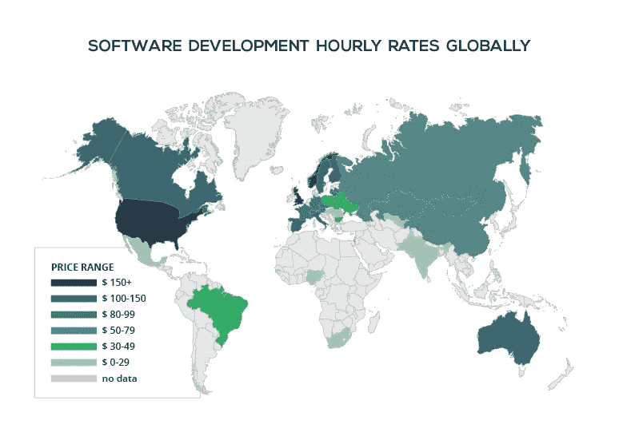

# 自由开发者:你应该得到更多的报酬

> 原文：<https://betterprogramming.pub/freelance-developers-you-should-be-paid-more-be1d4c3934d3>

## 是什么决定了你的自由开发者比率？

内森·达席尔瓦在 [Unsplash](https://unsplash.com?utm_source=medium&utm_medium=referral) 上的照片

冠状病毒疫情已经在全球范围内改变了人们的工作方式和对工作场所的信任。大多数开发人员现在都尝试过远程工作，他们中的许多人发现了他们以前不知道自己可以拥有的新自由。谁需要办公室呢？疫情已经证明远程工作和自由职业对于大多数开发工作来说已经足够好了。

作为一个在疫情开始之前很久就已经是自由职业者的人，我想分享我的经验来帮助新的自由职业者。

# 如何不设定你的时薪

作为自由职业者，许多开发人员无法为自己选择正确的时薪。然后他们觉得自由职业对他们来说不是正确的方向，只是因为这个错误的选择。

例如，他们可能会进行以下计算——工资/时薪:1200 美元工资/每月 160 小时=每小时 7.5 美元。

仅仅计算你的办公室时薪并以此作为你自由职业的报酬是一个*巨大的*错误。你作为员工的时薪不是那么简单的。作为全职员工，你的时薪比你想象的要高。

# 全职工作能给你什么自由职业者不能给你的？

## 假期和其他休息日

作为雇员，你每年都有带薪休假。作为一名自由职业者，你的工资只有工作时间的。

## 健康保险

大多数公司支付你的健康保险。当自由职业者生病时，他们没有钱或任何形式的保险。

## **退休计划**

许多公司都有很好的退休计划，让你感觉更安全——你不可能永远工作下去。作为一名自由职业者，退休计划是不包括在内的。

## 产假

大多数公司都有产假计划，不仅仅针对母亲，也针对父亲。自由职业者必须为他们生活中需要更多钱和更多空闲时间的新事件提前计划。

## 赋税

我们通常会根据一家公司扣除税款后的净工资来决定是否接受该公司。公司也为你做大部分的文书工作。作为一名自由职业者，你需要自己做税务文件，根据你所在的地方，税收可能适用于你的时薪。

## 工作保障和稳定的收入

知道即使你不能完美地工作，月底你仍会有收入来付房租，这是一件幸事。但是自由职业者没有这种安全感——如果你的客户突然消失了会发生什么？此外，自由职业者花更多的时间管理客户，寻找新工作，处理账单问题。

## 工作生活平衡

自由职业可以帮助你很好地平衡工作和生活，但是如果运用不当，它会让你变成一周工作 80 小时甚至更多的人！在大多数公司，八个小时后你就可以下班了。

## 提升你的职业生涯

公司通常会在你的职业道路上帮助你——他们付钱让你学习新东西，并与他人分享知识。作为一名自由职业者，在大多数工作中，你都需要规划好自己的学习时间，并为此付出代价。

## 工作日的非工作时间

在一家公司，你的午餐时间、与队友的社交时间、头疼无法工作的时间、娱乐室时间，甚至上厕所的时间都是有报酬的。自由职业者不会给你任何报酬！

## 隐性支付

公司支付办公室的租金，员工在工作中帮助你，以及你工作中需要的软件和硬件工具。作为一名自由职业者，你在笔记本电脑上工作，你需要购买自己的软件工具。

那么，当你是自由职业者时，你还想每小时只收 7.5 美元吗？作为一名自由职业者，你需要确保你的时薪包括所有提到的要点和管理所有这些的时间。这意味着你可能需要将你的利率提高三倍，甚至更多。

# 1.地域工资差异

[东峰](https://easternpeak.com/blog/global-software-development-prices-overview/)分享的信息图

开发人员的报酬因居住地不同而不同。因此，即使你在你的国家可能只能得到每小时 7.5 美元的报酬，在美国的另一个开发人员做同样的工作却能得到超过 150 美元的报酬！因此，选择你的客户的所在地将有助于你设定更高的时薪。这是一份双赢的合同，客户支付的价格比他们在自己国家支付的价格要低，而你得到的也要多得多。

# 2.专业客户了解成本

专业客户知道开发人员的真实成本高于他们的数字工资，所以当一份工作需要自由职业者时，他知道他们的真实成本。

# 3.低时薪并不会有更高的机会得到这份工作

许多自由职业者认为他们的时薪越低，被雇佣的机会就越大，但这是不正确的。一个专业的客户正在寻找一个专业的开发人员。因此，如果他们发布一份工作，而大多数自由职业者要价 30-50 美元，而你只要价 5 美元，这不会鼓励他们与你合作——这只会让他们怀疑你甚至不是一名开发人员。时薪反映了你在自由职业界的专业程度，即使是每小时收费 100 美元的自由职业者也能获得很多合同。

# 4.有一种方法可以知道平均速率

许多人通过探索发布在自由职业者网站上的工作来探索自由职业。通过搜索自由职业者来了解自由职业者的世界会更有效——打开他们的个人资料，检查他们的过去历史，他们每小时挣多少钱，以及他们找到工作的频率。花些精力去发现像你这样的开发人员是如何从事自由职业的。当你不确定你应该得到多少报酬时，只要搜索你的头衔，看看平均水平是多少。

# 5.你不必去找全职合同

当从一名雇员转变为自由职业者时，许多人专注于与一个客户签订一份全职合同。事实是，你甚至不需要工作 40 个小时，一个客户也不需要支付你每月的总收入。假设你在这些机会中进行选择。

许多每小时 15-20 美元的机会:

*   每周工作 40 小时，每小时 15 美元(600 美元/周)

一些 30 美元以上的机会:

*   30 美元/小时，每周 15 小时(450 美元/周)
*   每周 5 小时每小时 50 美元(每周 250 美元)

许多自由职业者选择工作不到 20 美元，以获得更多的机会，并拥有全职自由职业者的工作，忘记了你不必成为全职自由职业者。支付与 40 小时合同同等报酬的 20 小时合同是成功的！

在这篇文章中，我试图向你展示为什么自由职业者的时薪应该高于办公室职员，并给你一些如何确定你的时薪的想法。