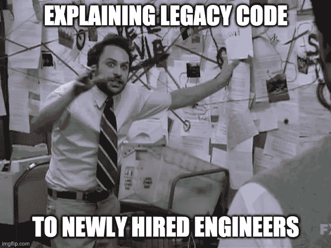
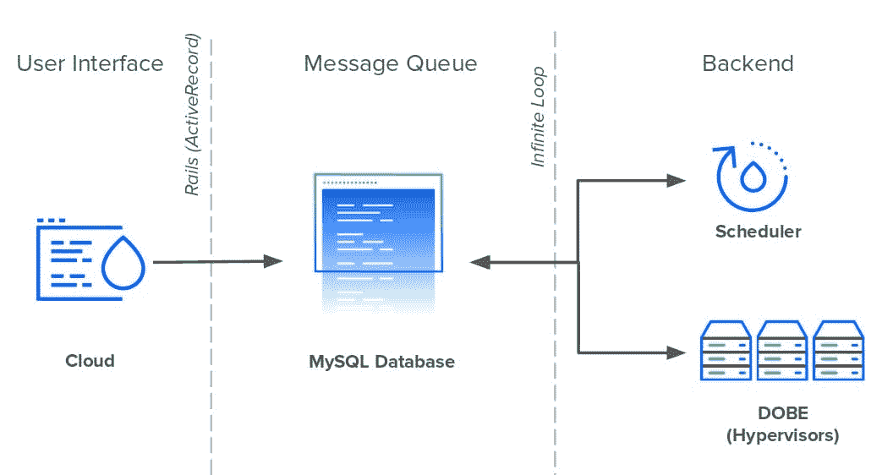
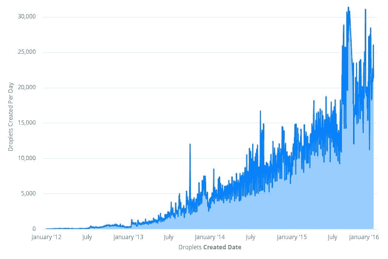
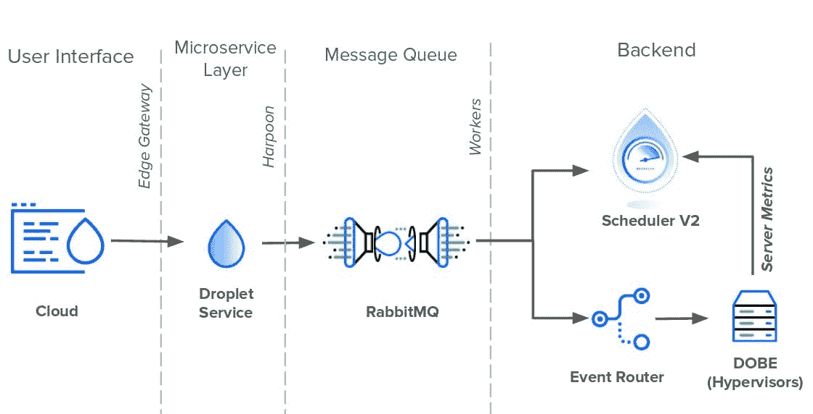

# 从 15，000 个数据库连接到不到 100 个

> 原文：<https://betterprogramming.pub/from-15-000-database-connections-to-under-100-dfd34062da4c>

## 一家公司与科技债务的斗争

伊恩·巴塔格利亚在 [Unsplash](https://unsplash.com?utm_source=medium&utm_medium=referral) 上拍摄的照片

一位新员工最近在午餐时问我，“T4 数字海洋公司的科技债务看起来怎么样？"

当我听到这个问题时，我忍不住笑了。软件工程师询问一家公司的技术债务相当于询问信用评分。这是他们衡量一家公司可疑的过去和他们背负的包袱的方式。我们对技术包袱并不陌生。

作为一家管理我们自己的服务器和硬件的云提供商，我们面临着许多其他初创公司在这个云计算新时代没有遇到的复杂问题。这些艰难的情况最终导致我们不得不在生存的早期做出权衡。正如任何快速成长的公司都知道的那样，你在早期做出的技术决策往往会在后期影响到你。

看着桌子对面的新员工，我深吸了一口气，开始说。“让我告诉你一次，我们有 15，000 个直接连接到我们的数据库……”

图片来源:作者

我给我们新员工讲的故事是 DigitalOcean 迄今为止最大的技术重组的故事。这是整个公司的努力，持续了多年，给我们上了很多课。我希望告诉它将有助于其他开发者发现自己在一个棘手的技术债务难题。

# 一切开始的地方

从一开始，DigitalOcean 就执着于简单。这是我们的核心价值观之一:*争取简单优雅的解决方案*。这不仅适用于我们的产品，也适用于我们的技术决策。这一点在我们最初的系统设计中表现得最为明显。

像 GitHub、Shopify 和 Airbnb 一样，DigitalOcean 在 2011 年开始作为 Rails 应用程序。Rails 应用程序，内部称为 Cloud，管理 UI 和公共 API 中的所有用户交互。帮助 Rails 服务的是两个 Perl 服务:Scheduler 和 DOBE (DigitalOcean BackEnd)。调度程序调度 Droplet 并将其分配给虚拟机管理程序，而 DOBE 负责创建实际的 Droplet 虚拟机。虽然云和调度程序作为独立的服务运行，但 DOBE 运行在机群中的每台服务器上。

云、调度程序和 DOBE 都没有直接相互通信。他们通过 MySQL 数据库进行交流。这个数据库有两个作用:存储数据和代理通信。这三个服务都使用一个数据库表作为消息队列来传递信息。

每当用户创建一个新的 Droplet，Cloud 都会在队列中插入一个新的事件记录。调度程序每秒钟持续轮询数据库中的新 Droplet 事件，并计划在可用的虚拟机管理程序上创建这些事件。最后，每个 DOBE 实例将等待新的调度 drop 被创建并完成任务。为了让这些服务器检测到任何新的变化，它们都需要轮询数据库以获取表中的新记录。

图片来源:作者

就系统设计而言，无限循环和让每台服务器直接连接到数据库可能是不成熟的，但它很简单，而且很有效——特别是对于面临紧迫的最后期限和快速增长的用户群的人手不足的技术团队。

四年来，数据库消息队列构成了 DigitalOcean 技术栈的主干。在此期间，我们采用了微服务架构，用 gRPC 代替 HTTPS 处理内部流量，用 Golang 取代 Perl 处理后端服务。然而，所有的道路仍然通向那个 MySQL 数据库。

重要的是要注意，仅仅因为某些东西是遗留的，并不意味着它是不正常的，应该被取代。彭博和 IBM 拥有用 Fortran 和 COBOL 编写的遗留服务，这些服务产生的收入超过了整个公司。另一方面，每个系统都有扩展限制。我们就要撞上我们的了。

从 2012 年到 2016 年，数字海洋的用户流量增长超过 10000%。我们在目录中增加了更多产品，在基础设施中增加了更多服务。这增加了数据库消息队列中事件的进入。对液滴的更多需求意味着调度人员加班加点地将它们分配给服务器。不幸的是，对于 Scheduler 来说，可用服务器的数量不是静态的。

图片来源:作者

为了跟上不断增长的水滴需求，我们增加了越来越多的服务器来处理流量。每个新的虚拟机管理程序都意味着到数据库的另一个持久连接。截至 2016 年初，该数据库有超过 15，000 个直接连接，每个连接每一到五秒钟查询一次新事件。如果这还不够糟糕的话，每个虚拟机管理程序用来获取新的 Droplet 事件的 SQL 查询也变得越来越复杂。它已经变成了一个超过 150 行的庞然大物，横跨 18 张桌子。这是令人印象深刻的，因为它是不稳定的，难以维持。

不出所料，正是在这一时期，裂痕开始显现。数以千计的依赖者争夺共享资源时，单点故障不可避免地会导致混乱。表锁和查询积压导致停机和性能下降。

由于系统中的紧密耦合，没有明确或简单的解决方案来解决这些问题。云、调度器和 DOBE 都是瓶颈。只修补一两个组件只会将负载转移到剩余的瓶颈上。所以经过深思熟虑，工程人员想出了一个三管齐下的计划来纠正这种情况:

1.  减少数据库上的直接连接数。
2.  重构调度程序的排序算法以提高可用性。
3.  解除数据库的消息队列责任。

# 重构开始了

为了解决数据库依赖性，DigitalOcean 工程师创建了事件路由器。事件路由器充当区域代理，代表每个数据中心的每个 DOBE 实例轮询数据库。不是数千个服务器每个都查询数据库，而是只有少数几个代理进行查询。每个事件路由器代理将获取特定区域中的所有活动事件，并将每个事件委托给适当的管理程序。Event Router 还将庞大的轮询查询分解成更小、更易于维护的查询。

图片来源:作者

当 Event Router 上线时，它将数据库连接的数量从 15，000 多个削减到不到 100 个。

接下来，工程师们将目光投向了下一个目标:调度器。如前所述，Scheduler 是一个 Perl 脚本，它决定哪个管理程序将托管一个已创建的 Droplet。它通过使用一系列查询对服务器进行排名和排序来做到这一点。每当用户创建一个 Droplet，Scheduler 就用最好的机器更新表格行。

虽然听起来很简单，但 Scheduler 有一些缺陷。它的逻辑很复杂，很难处理。它是单线程的，在流量高峰时性能会受到影响。最后，只有一个 Scheduler 实例——它必须为整个车队服务。这是一个不可避免的瓶颈。为了解决这些问题，工程团队创建了调度 V2。

更新的时间表完全修改了排名系统。它不是从数据库中查询服务器指标，而是从虚拟机管理程序中聚合这些指标，并将其存储在自己的数据库中。此外，调度团队使用并发和复制来使他们的新服务在负载下具有高性能。

事件路由器和调度程序 v2 都是巨大的成就，解决了许多架构上的弱点。即便如此，还是有一个明显的障碍。到 2017 年初，集中式 MySQL 消息队列仍在使用中——甚至很繁忙。它每天处理多达 400，000 条新记录，每秒钟更新 20 次。

不幸的是，删除数据库的消息队列并不容易。第一步是阻止服务直接访问它。数据库需要一个抽象层。它还需要一个 API 来聚合请求并代表它执行查询。如果任何服务想要创建一个新事件，它需要通过 API 来完成。就这样，鱼叉诞生了。

# 获得认同所需的时间比你想象的要长

由 [Unsplash](https://unsplash.com?utm_source=medium&utm_medium=referral) 上的[天线](https://unsplash.com/@antenna?utm_source=medium&utm_medium=referral)拍摄

然而，为事件队列构建接口是容易的部分。事实证明，获得其他团队的认同更加困难。与 Harpoon 集成意味着团队将不得不放弃他们的数据库访问，重写部分代码库，并最终改变他们一贯的做事方式。这可不是一件容易的事。

一个团队接一个团队，一个服务接一个服务，Harpoon 工程师能够将整个代码库移植到他们的新平台上。这花了大半年的时间，但到 2017 年底，Harpoon 成为数据库消息队列的唯一发布者。

现在真正的工作开始了。对事件系统的完全控制意味着 Harpoon 可以自由地重新发明 Droplet 工作流程。

Harpoon 的第一个任务是将数据库中的消息队列职责提取出来。为此，Harpoon 创建了自己的内部消息队列，由 RabbitMQ 和异步工作器组成。当 Harpoon 将新事件推到队列的一边时，工人们从另一边把它们拉出来。由于 RabbitMQ 取代了数据库的队列，工作人员可以自由地与调度程序和事件路由器直接通信。因此，Harpoon 没有让调度程序 V2 和事件路由器轮询数据库中的新变化，而是直接将更新推送给它们。截至 2019 年撰写本文时，这是 Droplet 事件架构所处的位置。

图片来源:作者

# 向前

在过去的七年里，DigitalOcean 已经从一个车库乐队成长为今天的老牌云提供商。像其他转型中的科技公司一样，DigitalOcean 定期处理遗留代码和科技债务。无论是打破铁板一块，创建多区域服务，还是消除单点故障，我们数字海洋工程师始终致力于打造优雅而简单的解决方案。

[*订阅我的个人资料*](https://medium.com/subscribe/@SunnyB) *如果你想在我上传新故事时得到通知。*

*原载于* [*数字海洋工程博客*](https://www.digitalocean.com/blog/from-15-000-database-connections-to-under-100-digitaloceans-tale-of-tech-debt/)