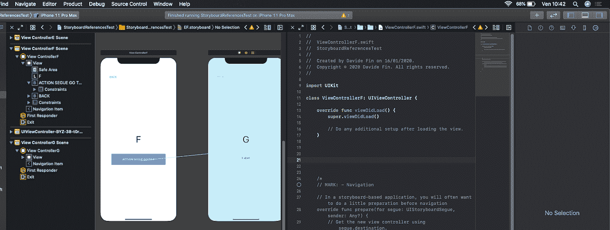
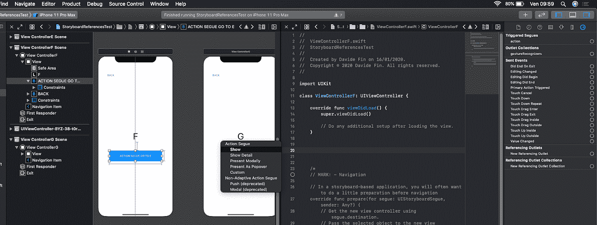
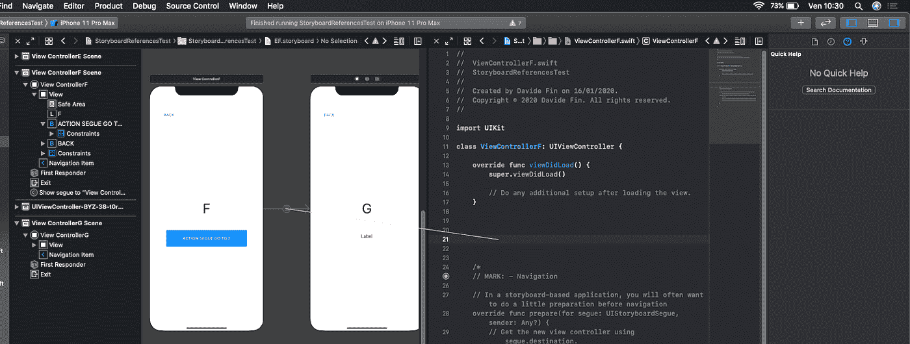
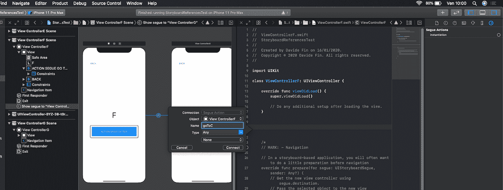
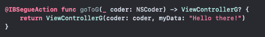

# 从一个巨大的故事板到多个更小更易管理的对象的重构

> 原文：<https://betterprogramming.pub/from-a-huge-storyboard-to-multiple-smaller-and-manageable-objects-3c165fd7022a>

## 处理故事板引用


卡斯帕·卡米尔·鲁宾在 [Unsplash](https://unsplash.com?utm_source=medium&utm_medium=referral) 上的照片

# 这一天已经到来

我最近开发了一款已经上市一段时间的 iOS 应用。这是一个在苹果发布其新的 wonder 框架 SwiftUI 之前发布的应用程序，使用单个故事板来实现整个 UI。

正如经常发生的那样，一个应用程序是以一种方式构思、设计和最终创建的，随着时间的推移，会在流程和演进中进行修正、改进和更改。

简而言之，新的场景被添加到原始的故事板中，随着时间的推移，这些场景变得越来越多。

最终的结果是，正如我们许多人所经历的那样，Xcode 现在费力而缓慢地打开了一个大故事板。

不仅仅是在场景之间移动，例如，检查它们是如何相互连接的，或者选择一个视图控制器来编辑它或纠正图形缺陷，现在都不再非常容易。

所以，这一天对我来说也到了。我的工作是通过将场景分成多个故事板来消除这个包含所有 UI 的巨大对象。

我们的目标是拥有更小、更易管理的故事板，加快 Xcode 的开放时间，并且为了有一天有更多的开发人员开发该应用，限制合并的问题以及在版本控制下工作时通常会遇到的实际冲突。

# **多重故事板**

我之前参与过其他使用多重故事板的项目。然而，这些从一开始就被构思和设计，然后被创造出来。因此，一切都很简单。

我知道哪些视图控制器与分布在不同场景中的其他控制器相连接。在不同故事板中实现的场景之间的转换通常以下列方式进行:

```
let storyboard = UIStoryboard(name: “SecondStoryboard”, bundle: nil)let secondVC = storyboard.instantiateViewController(identifier:”SecondViewController”)show(secondVC, sender: self)
```

同一个故事板中场景之间的转换是通过界面构建器设置的 segues 来管理的。

我不得不面对与我相关的新问题:

*   以某种方式将现有的场景组合在一起。
*   将不同故事板上的组分开。
*   确保场景之间的导航(分布在不同的故事板中)继续工作。

分组视图控制器显然是最简单的活动。在某种程度上，它已经完成了。负责登录、密码恢复等的视图控制器。基本上都被紧密地放在故事板上，一切都很简单。

由于场景的分离和它们的导航分布在几个故事板上，我不得不在网上寻找一些贡献来找到一个舒适的方法。

这让我能够深入研究我只听说过的东西，并解决两种不同的方法，每种方法都有自己的有趣之处。

# **一种完全的界面构建方法**

听说过故事板参考吗？苹果在 iOS 9 和 macOS 10.11 中引入了它们。他们做的正是我需要的。

它们允许你将一个故事板分成多个更小的故事板。故事板参考将多个故事板联系在一起，创建一个大型的复合故事板。

我对它们的使用如此简单感到非常惊讶。我们只需要:

*   打开我们巨大的故事板。
*   选择我们想要提取的场景并放在一个单独的文件中。
*   使用 Xcode *编辑器*菜单中的*重构到故事板……*选项。

我们最喜欢的 IDE 只是询问我们新故事板的名称，我们最终可以决定将新文件放在一个新的文件夹或一个现有的文件夹中。完成了。

使用现有片段在场景之间导航，无需做任何更改。用于设置视图控制器的“准备”功能，例如将数据传输到目标场景，按原样工作。

# **手动编程方式**

这种方法迫使手动生成较小的故事板。

在我的具体案例中，一旦我确定了注定要收集场景的一般组，我就复制独特的大故事板以获得一些完全相同的文件。因此，我将特定的名称归属于各个重复项，如“登录”、“内容”、“设置”。

我把这些新的故事板导入到解决方案中，然后一个接一个地清理它们，只留下对每个组有用的场景。

在工作结束时，登录故事板只包含登录场景。其他人根据他们的专业各自包含自己的场景。

这种方法还迫使您编写一些代码来正确调用在不同故事板上实现的视图控制器。这是本文开头已经提到的方法，请参见下面的代码示例。

```
**let** storyboard = UIStoryboard(name: "SecondStoryboard", bundle: **nil**)**let** secondVC = storyboard.instantiateViewController(identifier: "SecondViewController")show(secondVC, sender: **self**)
```

它易于编写和阅读，并且可以快速修改以替换现有代码，如下所示:

```
**self**.performSegue(withIdentifier: "goThere", sender: **self**)
```

最终，如果目标场景需要来自调用视图控制器的值，则准备函数中的代码不再有用:

并且可以简单地替换为:

话虽如此，如果我们不需要在每次需要从一个场景“跳到”另一个场景时都显式地实例化故事板和视图控制器，那会更方便。

# **可选择路线**

“可传递”允许你以一种非常简单的方式显示故事板中的一个场景，正如在这个`ViewController`类的例子中的三个方法中很容易看到的:

如您所见，每次我们需要将用户带到特定屏幕时，没有必要显式地实例化目标故事板和视图控制器。

从源控制器和目标控制器发送信息简单明了。参见本文末尾的`Routable`组件的完整代码。

# **Xcode 11 和 iOS 13 推出的最新更新**

令我惊讶的是，在我的研究过程中，我发现 Xcode 11 和 iOS 13 为故事板引入了一些新功能。我指的是`SegueActions`和自定义初始化器。

## **后续行动**

我们已经看到，如果我们使用 segues 在场景之间导航，我们必须实现`prepare`函数来将数据从起始视图控制器传输到另一个。

我们必须编写一个 switch 语句来检查 segue 标识符名称，然后准备我们要发送到目的地控制器的值。在此之前，我们必须检查标识符是否为零，并最终从函数中退出。

我们可以避免实现这个函数，而是使用一个`SegueAction`，这是我们的视图控制器中的一个方法，UIKit 在后续过程中调用它。

下面的例子展示了一个简单的`SegueAction`:

如果不需要所有的输入参数，我们可以选择更简洁的形式:

目标视图控制器应该用自定义初始值设定项来实现，如下例所示:

创建`SegueAction`的过程非常简单。我们像在 IB 中一样创建 segue，在我的例子中，我将我的蓝色按钮连接到一个目的地视图控制器:



我们选择这样的段落:



然后，我们创建`SegueAction`,就像通过从 segue 和`viewController`的代码中拖动连接来创建`IBAction`一样:



我们给这个新函数起了个名字:



最后，创建了`SegueAction`。


在我的例子中，我在最后添加了`myData`参数，以将其传输到目标`ViewController`:



不再需要准备功能。

## **自定义初始值设定项**

在上面讨论的示例中创建的定制初始化器也可以以不同的方式使用。我已经提到过视图控制器之间的转换可以不使用 segues 来完成。

例如，我们可以创建一个普通的`IBAction`，如下所示:

iOS 13 提供了一个接受创建块的`instantiateViewController`版本，允许我们调用自定义初始化器:

# **结论**

我们仍将不得不在很长一段时间内处理故事板。我们在市场上都有需要维护和发展的应用程序。

不仅如此，许多开发人员仍然不愿意采用 SwiftUI 来创建新项目，因为他们认为这是一项尚未成熟的技术(真的吗？).

其他人将有目前正在开发的项目，这些项目在 SwiftUI 发布之前就开始了，可能在很长一段时间内都不会出现。

因此，我们仍将不得不处理一个非常有用的工具，它将我们置于我们都熟知的问题之前，我在文章中提到了这些问题。

当我们被迫将一个大的故事板分割成更小、更易管理的对象时，故事板引用或一种编码方法是两种舒适的解决方案。

此外，苹果仍然在故事板中发布新功能，这很好，证明了它意识到市场上有许多应用程序的用户界面是使用这样的工具创建的，这肯定需要几年的维护和发展。

# 可传递组件的完整代码

《可传递的路线》和它的故事板扩展都是由 [Osvaldo Pirrello](https://medium.com/@ooosv) 写的，他是 [OverApp](https://medium.com/@overapp) 的创始人兼首席执行官，我要感谢他。

`Routable.swift`

`Extension+UIStoryboard.swift`