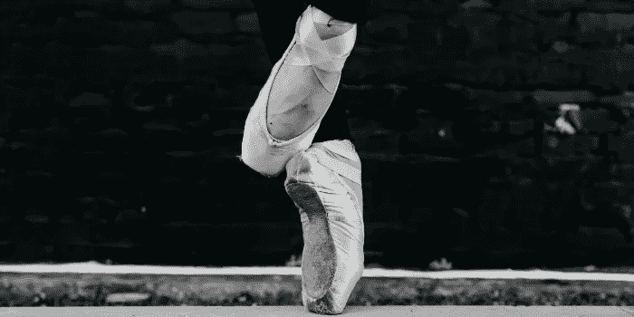
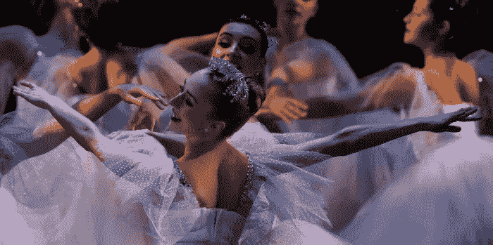
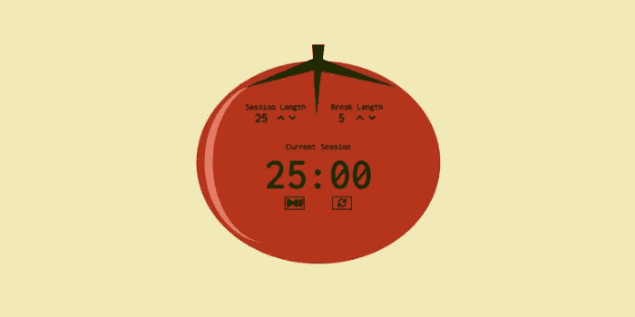

# 从芭蕾舞到布尔语

> 原文：<https://betterprogramming.pub/from-ballet-to-booleans-9a5e910cc58e>

## 为什么我选择学习软件工程

http://www.jgwynphotography.com/的葛温·何晓乐拍摄的照片

“你现在在做什么？”

在今年早些时候结束了我的职业芭蕾舞生涯后，我把我的尖头鞋换成了键盘，开始了我的下一个篇章。令我以前的同事惊讶的是，我现在正在成为一名软件工程师。将我的芭蕾舞裙换成三元运算符似乎是一个巨大的飞跃，但这一直是我的计划。

# 入门指南

我的高中开设了一系列网页设计课程，我喜欢每一门课程。我花了两年时间学习 HTML、CSS、Flash 和 Photoshop 的基础知识。我喜欢它给我的创造力，还有开放式的任务，比如:“做一个关于你最喜欢的超级英雄的网站。”我花了几个小时寻找合适的调色板和字体，让我的项目流行起来。我们可以使用一些所见即所得的工具，比如 Dreamweaver，来简化这个过程，但是我更喜欢在一个普通的记事本文件中手动编码，然后自己将这个简单的文本变成现实。从零开始创建网站是令人兴奋的，我被吸引住了！

我的另一大爱好是古典芭蕾，我梦想着职业生涯。当我展望未来时，我意识到我只有很短的时间来实现这个目标，所以我全身心地投入到芭蕾舞训练中，暂时把编码放在一边。我转到了邻近城市的一个中学项目，把我的课程整合成几天，以便腾出时间进行更高强度的训练。我提前一个学期毕业了，随着我花更多的时间来练习，我的芭蕾技巧突飞猛进。我知道自己想要什么，不达目的誓不罢休。

迈克·比蒂摄影——https://www.flickr.com/people/mcbeaty/

# 我的第一幕

在获得第一份合同之前，我花了三年时间在专业芭蕾舞公司接受训练，以磨练我的技术。我活在梦里！在华丽的剧院里为热情的观众表演是一种享受。当观众分享芭蕾舞如何照亮了他们的生活时，所有这些年的辛勤工作和奉献从来没有感觉更有价值。

虽然它很少在舞台上体现，但芭蕾舞的领域在幕后是混乱和不可预测的。资金、伤病和选角决定的反复无常意味着“明天”永远无法保证。即使知道这一点，我也无法想象我的世界会改变得如此之快。2020 年 3 月的一天，我为学校的孩子们表演了一个拓展项目，四个小时后，我醒来时得知剧院将无限期关闭的消息。

汤姆·巴瑞特在 [Unsplash](https://unsplash.com/@wistomsin?utm_source=unsplash&utm_medium=referral&utm_content=creditCopyText) 上的照片

# 转折点

突然，我忙碌的生活戛然而止。我的芭蕾舞团中断了，我就有了无尽的空闲时间。我总是努力提高效率，并决心利用这个意外的休息时间。我将焦虑的精力重新投入到编程中，以确定这是否仍然是正确的道路。我开始通过 [Flatiron 的 Bootcamp Prep](https://flatironschool.com/free-courses/coding-bootcamp-prep) 项目学习 JavaScript 和 Ruby 的基础知识。我喜欢用这些更复杂的语言工作的挑战，并很快通过了课程。当我利用新的、强大的概念来构建比我以前更复杂、更动态的程序时，我在高中设计网站时感受到的那种兴奋感又回来了，而且更加强烈。

我寻找了更多的资源，并发现了免费代码营项目。这个项目给了我更大的自由，让我在创建项目组合时探索不同的途径。我最喜欢的挑战是编程一个番茄定时器。当我得知 *pomodoro* 翻译成番茄时，我决定设计一个纯 CSS 番茄图形作为我的 React 应用程序的基础。即使当我的代码行为不端时，那个可爱的小番茄也让我保持动力，直到我完成这个项目。整个夏天，我完成了响应式 web 设计、JavaScript 算法和数据结构以及前端库的认证。我已经写了大约 900 个小时的代码，我渴望更多。

番茄定时器—[https://codepen.io/rebeccahickson/full/wvWvpmW](https://codepen.io/rebeccahickson/full/wvWvpmW)

# 走向

此时——剧院关闭五个月后——我的芭蕾舞团正在返回工作室。亲自跳舞很不舒服，我在 Zoom 上排练并表演了我们的第一场虚拟表演。我最喜欢芭蕾的一点是人与人之间的联系，包括与观众和我的同伴。怀着沉重的心情，我悲哀地意识到，这不再是一种选择，在可预见的未来也是不可能的。我决定是我最后鞠躬的时候了。

退出芭蕾是一个艰难的决定，但我不后悔。不再被不确定性所拖累，我可以自由大胆地走向未来。突然我看到面前有这么多的可能性，我迫不及待地潜入软件工程的世界。

[张杰](https://unsplash.com/@jay_zhang?utm_source=unsplash&utm_medium=referral&utm_content=creditCopyText)在 [Unsplash](https://unsplash.com/?utm_source=unsplash&utm_medium=referral&utm_content=creditCopyText) 上的照片

# 我的第二幕

在我自己建立了一个坚实的工作基础后，我想从编码训练营中获得额外的深度。我的目标不仅是编写可工作的代码，而且要知道它为什么能工作，这样我就能设计出更健壮的应用程序。我搜索了一个只在网上进行的项目，有严格的课程和灵活的时间。熨斗是完美的选择！

10 月，我开始了 Flatiron 的软件工程训练营。我很喜欢每天参加现场讲座，课堂的协作性质让我受益匪浅。与我的同事一起工作让我看到了许多解决问题的不同方法。此外，帮助其他学生加强了我自己对课程的理解。软件工程师不会在孤独的气泡中工作，就像大多数舞者不会只作为独奏者表演一样。当每个舞者为了一个共同的目标协同工作时，T4 芭蕾舞团是最好的，工程团队也是如此；我认为学会与他人密切合作和提高我的编码能力一样重要。

我曾遇到一种误解，认为芭蕾和软件工程没有任何共同之处，但我相信它们在一些基本领域是重叠的。在这两个学科中，更好的细节可以成就你的成功，也可以毁掉你的成功。就像一只生病的脚会打断一个芭蕾舞演员的台词一样，一个放错位置的逗号会毁掉一个软件工程师的作品。然而，仅仅精确是不够的。每一行代码都必须适合一个更大的框架，每一个芭蕾步骤都必须与下一步相连。技术至关重要，但与愿景和对更大目标的理解相结合也至关重要。作为一名芭蕾舞演员，我磨练的所有心理技能为我成为一名软件工程师做好了准备，我迫不及待地想看到首演之夜！