# 从代码源到执行——以下是编程语言的工作原理

> 原文：<https://betterprogramming.pub/from-code-source-to-execution-heres-how-programming-languages-work-ee7d114a2f1e>

## 编程语言是如何工作的


安吉尔·孟山都三世在 [Unsplash](https://unsplash.com?utm_source=medium&utm_medium=referral) 拍摄的照片

你有没有想过在编程语言下它是如何工作的？编译器如何正确理解我们的代码？机器(计算机)是如何正确无误地执行我们的代码的？

“适当地，正确地，准确地”暗示没有错误，没有损失，没有修改。

为了回答这些问题，我们将尝试制作一个名为`H#`的小型编程语言，并经历编译器通常会做的所有步骤。

但在此之前，我们先从故事的结尾说起:机器(计算机)能理解什么样的代码？

# 机器说什么语言？

机器意味着硬件，硬件意味着电路。计算机内部的电路只有两种状态:开和关。

那么如何才能把软件和硬件联系起来呢？
这很容易，因为有两个神奇的数字(位)‘1’和‘0’，这两个数字是计算机电路开关状态的同义词([布尔代数](https://en.wikipedia.org/wiki/Boolean_algebra))。

> [机器码](https://icarus.cs.weber.edu/~dab/cs1410/textbook/1.Basics/machine.html)由一系列简单的计算机指令组成，每条指令用一串二进制数字或比特表示(即 1 和 0)。

> 值得注意的是，该机器可以是您的计算机，也可以是在您的计算机上运行的虚拟机，如 Java 虚拟机，因为虚拟机使用主机的资源并在其中执行。

然而，现在很少有人用数字机器代码编程，因为很难使用它。

因此，为了使开发人员的工作更容易，在这个最低级别的表示之上，编程语言提供了不同的高级抽象层。

作为第一级抽象，我们可以引用汇编代码:

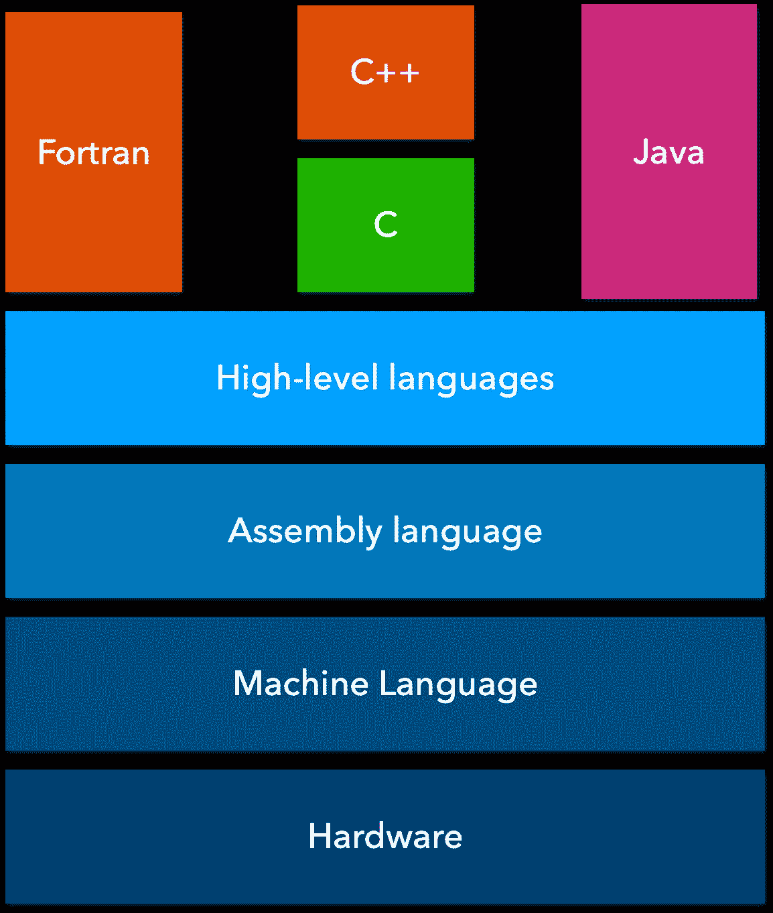

编程语言抽象层次(图片由作者提供)

在这个层次上，我们理解了机器(计算机)所理解的东西，我认为编译器要做什么是很明显的，你不这样认为吗？

编译器的作用是让人类世界和机器世界兼容。让机器理解人类的指令(愿望)。完美！

在进入编译器之前，让我们从定义和展示我们将要开发的编程语言开始！

# 语言定义

我们将开发一种叫做`H#`的小型编程语言:

*   像人类语言一样，编程语言由一个`dictionary`和一个`grammar`组成。
*   `dictionary`定义了组成语言的一组单词(记号)。
*   `grammar`检查单词的组合是否正确。

目前，我们当前的语言只允许:

*   定义类型化变量
*   执行简单的算术运算
*   定义和使用函数
*   在控制台中显示消息

其他规格:

*   单词分隔符将是`space`
*   语句分隔符将是分号`;`
*   每条语句都应该另起一行
*   区分大小写
*   评论以`//`开头
*   缩进并不重要

下面是一个用`H#`编写的程序的例子:

```
**int** value1 **=** 5**;**
int value2 = 2;**// calculate the sum of two integers**
**int function sum(x: int, y: int)** {
   **return** x + y;
}**int** result = **sum**(value1, value2);
**print**('The result is : ', result);
```

`H#`将在`C`语言之上设计，最终输出将是一个汇编代码:

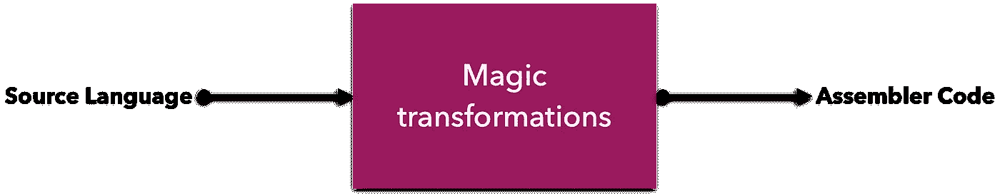

H#黑匣子(图片由作者提供)

## 字典定义(标记)

代币是我们公认的词汇词典。

一个实际的代表可以是`a map or a dictionary`:

## 语法定义

规则 1:变量声明


变量声明语法(图片作者提供)

规则 2:函数声明

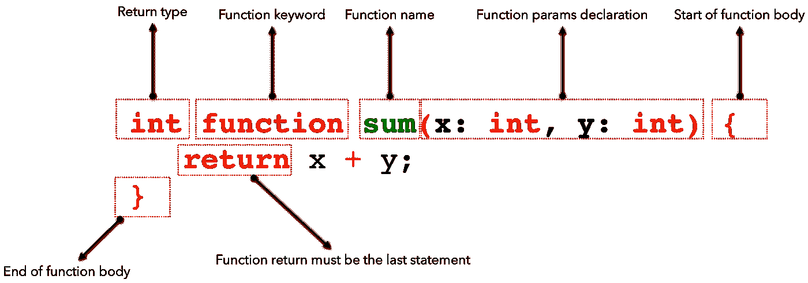

函数声明语法(图片由作者提供)

规则 3:函数调用

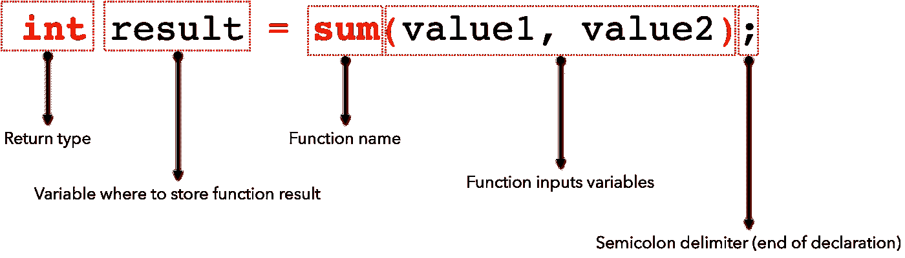

函数调用语法(图片由作者提供)

## 错误定义

词汇错误:

错误 1:未知的标识符。

错误 2:保留的关键字。

**语法错误:**

错误 1:声明不匹配。

错误 2:缺少左/右括号。

我们已经准备好了解编译器内部发生了什么！

# 什么是编译器？

编译器是一种工具，它将以面向人类的语言编写的软件翻译成面向机器的语言。

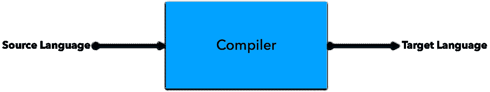

编译器黑盒(图片由作者提供)

典型的“源”语言可能是 C、C++、Fortran、Java 或 ML。“目标”语言通常是某个处理器的指令集。

编译器的基本特征:

*   它必须保持正在编译的程序的含义。
*   它必须改进输入(exp:删除死代码)。
*   它必须在可接受的性能阈值内完成工作:速度、能量、压缩和输出大小。

在工作过程中，编译器会经历以下步骤:

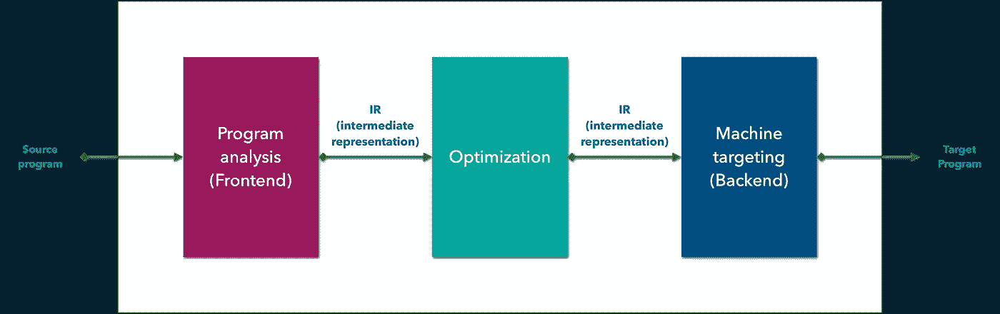

编译器步骤(图片由作者提供)

*   程序分析(前端):产生一个中间表示(IR)。
*   优化:将 IR 转换成运行效率更高的等价 IR。
*   机器定位(后端):将 IR 转换成本机代码(机器代码)。

让我们潜得更深！

# 程序分析阶段(前端)

在开始技术部分之前，我想请你把这句话翻译给你的法国朋友听:“编译器是一种魔法，是一种神奇的工具。”你打算如何进行？

因此，有些人会建议采取以下步骤:

*   把这个句子分成单词。
*   断字符可以是任何一种标点符号。
*   在字典中找到每个单词的对应词。
*   把这些单词放在一起组成句子。
*   检查语法和意思是否正确。
*   复习句子，必要时重新措辞。
*   读这个短语。

编译器将执行相同的步骤来理解输入语言:

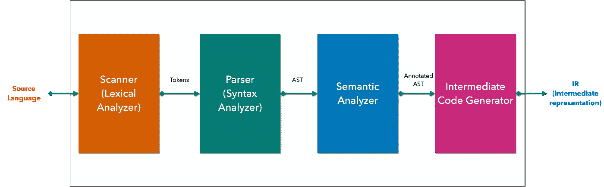

编译器前端步骤(图片由作者提供)

步骤看起来像我们如何翻译上面的句子，不是吗？

让我们一起深入了解每一步！

## 扫描仪

扫描仪将分析源程序的字符流，并将其转换为令牌流。就像在字典里一个字一个字地找单词。它还删除空白和注释。

扫描过程中可能出现的错误称为词汇错误:

*   扫描仪将检测所有未知单词并抛出`an unknown identifier error`。
*   如果一个关键字被误用，扫描器将`a reserved keywords error`。

扫描仪最简单的识别算法可以是逐字符分析器。

例如，假设我们有这样的输入源代码:

```
**int** value1 **=** 5**;**
int value2 = 2;

**// calculate the sum of two integers**
**int function sum(x: int, y: int)** {
   **return** x + y;
}
```

在扫描阶段之后，输出将是:

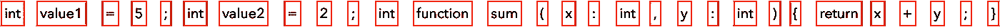

分割输入的源代码标记(图片由作者提供)

这些情况会产生词汇错误:

```
**integer** value1 **=** 5**; // unknown token integer 
int** **function** **=** 5**; // function is a reserved keyword
INT** value1 **=** 5**; // unknown token INT, H# is case sensitive
println() // unknown token println**
```

完美。在这个层次上，编译器知道我们在源代码中使用的所有单词，并且我们确信所有使用的单词都存在于令牌字典中！

💡**提示** : [Lex](https://en.wikipedia.org/wiki/Lex_(software)) 和 [Flex](https://en.wikipedia.org/wiki/Flex_(lexical_analyser_generator)) 是生成扫描仪的工具。

然而，这还不够，我们需要确保令牌的组装是正确的。这就像确保一个句子的组合在语法上是正确的(例如:主语+动词)。这将是解析器的作用。我们来看看吧！

## 句法分析程序

扫描器检查词汇的正确性，分析器检查语法的正确性。

也就是扫描器把符号组合成记号，解析器把记号组合成句子。

解析器的主要职责是识别语法，确定正在编译的程序在编程语言的语法模型中是否是一个有效的句子。

但是解析器是如何做到这一点的呢？为了理解这一点，我要问你，如果你在学校，我让你计算这个运算`(17 + 19) * (8 + 96)`，你会怎么做？

一种更简单的计算方法是这样做:

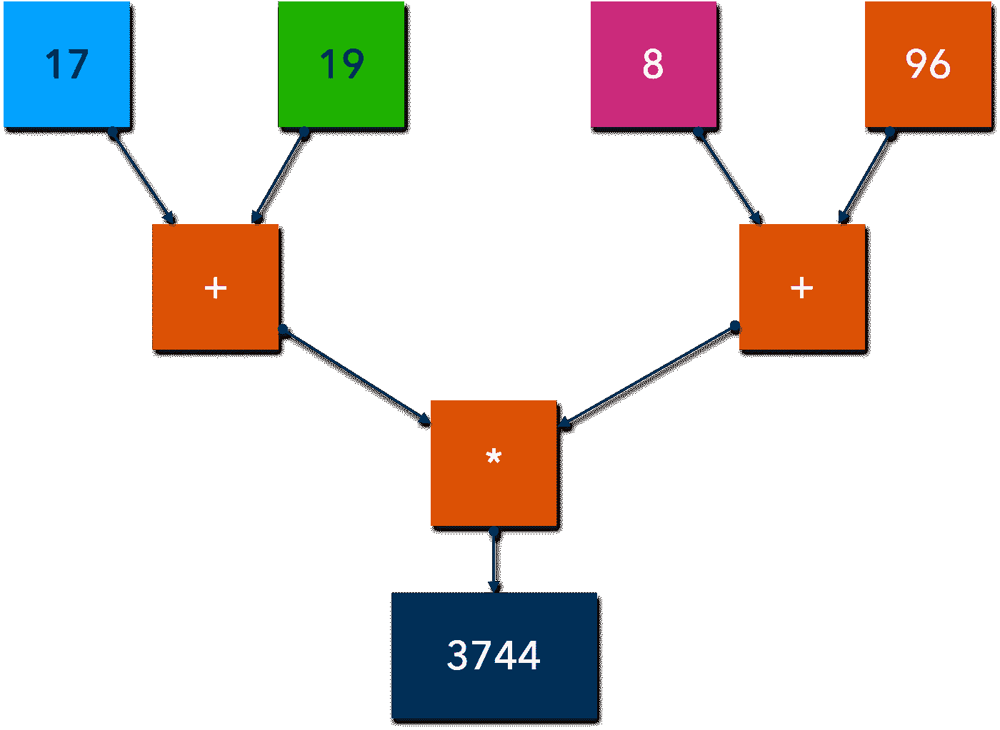

计算树(图片作者提供)

您已经像编译器一样间接地解析了表达式:您已经确定了标记(操作数和运算符)及其关系！

解析器将做同样的事情:它将我们的令牌转换成一棵表示代码实际结构的树。

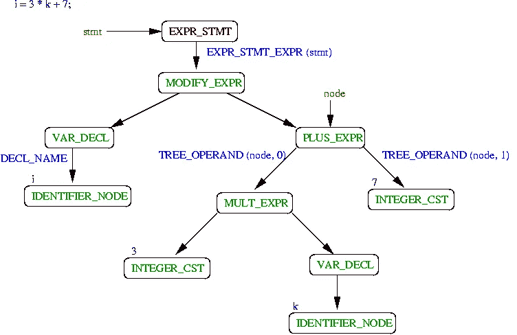

在 GCC 的 AST 代表[http://icps.u-strasbg.fr/~pop/gcc-ast.html](http://icps.u-strasbg.fr/~pop/gcc-ast.html)

实际上，AST 中的每个节点都存储为一个带有命名字段的对象，其中许多值本身就是树中的节点。

解析过程中可能出现的错误称为语法错误。

这些情况会产生词汇错误:

```
int j = 4 * (6 − x; // missing a closing parenthesis
int i = /5; // missing the first value
int 42 = x * 3 // missing a semicolon, 42 can't be a variable name
int value1 = 1, value2 = 1; // the language definition state that we must have a declaration per ligne
```

🔵注意:一些 Javascript 工具，如 [Babel](https://babeljs.io/docs/en/babel-parser) 和 [ESLint](https://eslint.org/docs/developer-guide/working-with-custom-parsers) 可以操纵 AST。您还可以使用 [AST Explorer](https://astexplorer.net/) 可视化任何 Javascript 代码的 AST。

💡**提示** : [Yacc](https://en.wikipedia.org/wiki/Yacc) 和 [Bison](https://perso.esiee.fr/~najmanl/compil/Bison/bison_7.html#SEC59) 是生成解析器的工具。

## 语义分析程序

在语义解析期间，我们需要检查合法性规则，这样做时，我们链接语法树的各个部分(通过解析标识符引用、插入隐式强制转换操作等。)形成语义图。

我们可以在此阶段验证的规则:

*   一个范围内变量的多重声明。
*   在声明变量之前引用变量。
*   引用没有声明的标识符。
*   方法调用中的参数太多。
*   方法调用中没有足够的参数。
*   类型不匹配。

类型检查器检查每个 AST 节点的静态语义:

*   它验证构造是合法的和有意义的(所有涉及的标识符都已声明，类型是正确的，等等)。
*   如果构造在语义上是正确的，类型检查器就会“修饰”AST 节点，向它添加类型或符号表信息。
*   如果发现语义错误，就会发出适当的错误消息。
*   类型检查完全依赖于源语言的语义规则。它独立于编译器的目标机器。

在这个阶段发生的错误被称为静态语义错误。

大家总结一下！

✅ **扫描仪:**

*   输入:源代码。
*   输出:令牌。
*   目的:词汇验证。
*   词法错误:未知标记，保留关键字，…

✅ **解析器:**

*   输入:令牌。
*   输出:AST。
*   目的:语法验证(句子公式化)。
*   语法错误:缺少右括号，缺少分号，不正确的变量名，…

✅ **语义分析器:**

*   输入:AST。
*   输出:带注释的 AST。
*   目的:语义验证(意思)。
*   语义错误:类型错误、声明错误、参数错误、引用错误等

## 中间表示

中间表示是原始源代码的独立于机器和语言的版本。

中间表示的使用在增加抽象性、前端和后端之间更清晰的分离方面提供了优势，并且增加了重定目标/交叉编译的可能性。

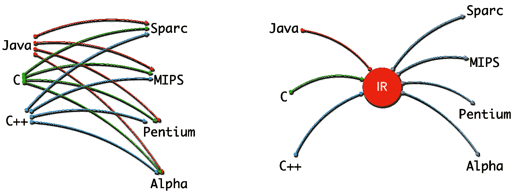

IR:独立于机器和语言(图片由作者提供)

中间表示也有助于支持高级编译器优化，大多数优化都是在这种形式的代码上执行的。

# 机器定位阶段(后端)

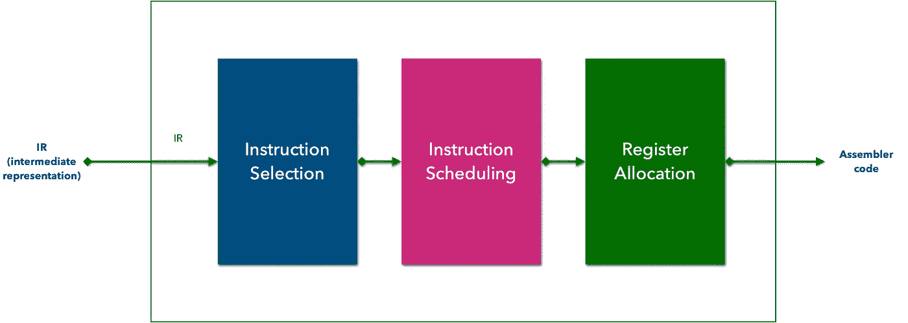

编译器后端步骤(图片由作者提供)

后端阶段的目的是生成机器代码:

*   **指令选择**是一个编译器阶段，它将编译器的程序中间表示翻译成一系列目标相关的机器指令，这些指令针对各种编译器目标(例如，速度和空间)进行优化。
*   **指令调度**:为了产生快速运行的代码，代码生成器可能需要重新安排操作，以反映目标机器及其特定的性能约束。
*   **寄存器分配**:选择指令时，编译器忽略了目标机器的寄存器集合有限的事实。编译可能会产生比“真实”硬件支持更多的“虚拟”寄存器需求。寄存器分配器必须将“虚拟”寄存器映射到目标机器的“真实”寄存器。它决定了在程序的每一点，哪些值将驻留在寄存器中，哪个寄存器将保存这些值。如果分配器不能在其整个生命周期内将一个值保留在寄存器中，那么该值必须在其部分或全部生命周期内存储在内存中。

# 结论

在本文中，我们概述了编程语言从语言定义到运行时是如何工作的。

编程语言由词汇、语法和语义决定。

编译器的作用是确保机器将执行的代码尊重语言的定义和硬件特征。

编译器内部的代码经过几个阶段:词法分析、语法分析，然后是语义分析。正确性是编译器的强制性特征和行为。

除了正确性之外，编译器必须保证性能并执行优化，以减少和提高运行时代码的执行。

感谢您阅读我的文章。

```
**Want to Connect?**You can find me at GitHub: [https://github.com/helabenkhalfallah](https://github.com/helabenkhalfallah)
```