# 从以太坊到极光

> 原文：<https://betterprogramming.pub/from-ethereum-to-aurora-with-infura-a20af791fb29>

## 简化您的入职流程


[regularguy.eth](https://unsplash.com/@moneyphotos?utm_source=medium&utm_medium=referral) 在 [Unsplash](https://unsplash.com?utm_source=medium&utm_medium=referral) 上的照片

Web3 的前景非常诱人。

摆脱科技巨头的束缚，将权力还给创造者，是崇高而有价值的目标。以太坊是世界上最大和最常用的公共区块链，自 2015 年推出以来一直支持着 Web3 的发展。成为第一个和最受欢迎的不是没有挑战，尤其是当网络需求很高的时候。

缓慢而昂贵的交易并不能带来最好的开发者体验，而 L2 的兴起确保了以太坊的可伸缩性，这仍然令人惊讶。对于想尝试其他第一层链的开发人员来说，还有其他选择。

NEAR 协议是一个创新的区块链生态系统。他们的网络速度快如闪电，交易成本低，而其桥梁正在帮助创造我们一直希望的多链未来。但是大多数 Web3 开发者都是从以太坊和 Solidity 开始的。由于 NEAR 主要将 Rust 用于其智能合约，这对大多数人来说可能是一个艰难的过渡。

幸运的是，NEAR 认识到了这一挑战，并在他们的网络上发布了 Aurora，这是他们自己的以太坊兼容性版本。这使得以太坊开发人员可以很容易地开始构建或转移现有的项目，而不需要改变他们的实体代码。更好的是，节点提供商 [Infura](https://infura.io/) 通过他们的 RPC URLs 提供 Aurora 兼容性。

在这篇文章中，我们将探索 NEAR 协议，它的 Aurora 环境，以及为什么一个以太坊开发者想要进行这种转换。然后，我们将使用 Infura RPC URL 在 Aurora 上部署一个简单的智能契约，看看它有多容易上手。

# 什么是近？

NEAR 是第一层区块链网络，也是进入 Web3 领域的最激动人心的新协议之一。它们通过提供极其快速和廉价的交易来提供出色的用户和开发人员体验。NEAR 没有使用复杂难读的钱包地址，而是使用人类可读的地址，使得与网络的交互更加用户友好。此外，他们创新的[茄片切割](https://near.org/papers/nightshade/)机制实现了目前其他区块链无法与之竞争的可扩展性。

凭借其[彩虹桥](https://rainbowbridge.app/transfer)和[章鱼网络](https://oct.network/)，NEAR 可以与其他区块链环境互操作，包括比特币、以太坊、波尔卡和宇宙。与此同时，诸如利害关系证明共识机制、对绿色项目的关注以及对发展中国家二氧化碳补偿项目的贡献等因素使得 NEAR protocol 被授予南极气候中立产品标签[。](https://near.org/blog/near-climate-neutral-product/)

此外，他们的[免费教育平台](https://near.org/education/)确保任何寻求在 NEAR 上建立的人都有可用的资源。总的来说，NEAR 是一个非常超前的、关注地球的生态系统，吸引了许多志同道合的参与者。

# 极光是什么？

Aurora 是一个本质上类似于以太坊的协议，但是是针对近生态系统的。它是作为智能合约部署的以太坊虚拟机(EVM ),在 NEAR 协议之上提供类似以太坊的开发人员体验。EVM 的兼容性确保了任何建立在以太坊上的项目都可以很容易地移植到 Aurora，而不需要修改任何一行代码。

由于 Aurora 实现是一个智能合同，它获得了与使用近 L1 协议相同的好处。这些额外好处包括显著提高的交易吞吐量、高达 1000 倍的交易费用降低、更快的交易终结以及通过 NEAR 的茄影切分机制实现的横向 EVM 扩展等。

Aurora 还通过彩虹桥维护 NEAR 的互操作性，这有助于 Aurora、NEAR 和以太坊之间令牌和数据的无许可传输。在其核心部分，Aurora 解决了以太坊主网面临的挑战，同时为以太坊开发者和用户提供了更轻松的 NEAR 生态系统入门体验。

# 为什么以太坊应该在奥罗拉开始建造？

正如引言中提到的，Rust 是接近智能合约的主要编码语言。Rust 是一种众所周知的难学语言，大多数开发人员都是通过用 Solidity 或 Vyper 语言编写以太坊智能合约开始学习 Web3 的。Aurora 提供了一个兼容 Solidity 和 Vyper 的 EVM 环境，使得开发者在 NEAR 上构建更加容易。但是开发者为什么要离开以太坊呢？

Aurora 的美妙之处在于，开发者实际上不必离开以太坊网络就可以在附近建立。以太坊上运行的任何东西都可以毫不费力地通过彩虹桥传输到 NEAR。因此 devs 可以同时部署到两个网络。此外，Aurora 上的基础货币是 ETH，因此没有必要获取额外的网络令牌来部署智能合约并与之交互。

此外，以太坊开发者已经知道的所有工具都可以在 Aurora 上开箱即用。例如，Truffle 仍然兼容制作智能合约项目，而 MetaMask 可以处理所有事务。现在，Infura 提供了与 Aurora 的兼容性，开发人员可以使用定制的 RPC URLs 构建具有更好的可观察性和安全性的项目。

# 我们来建吧！

对于本文的项目部分，我们将使用 Truffle 创建一个简单的 ERC-20 合同，使用我们自己的 Infura RPC URL 将 Aurora Testnet 添加到 MetaMask，使用 Truffle 仪表板部署到 Aurora Testnet，在 Aurora Testnet block explorer 上验证部署，然后将我们的一些 ERC-20 令牌转移到另一个钱包。

# 你会学到什么

*   如何使用 Infura RPC URL 在元掩码上设置 Aurora
*   如何使用 Truffle Dashboard 将 ERC-20 合同部署到 Aurora 测试网
*   如何在 Aurora Testnet 块资源管理器上查看事务

# 你需要什么

*   [一个不真实的账户](https://infura.io/)
*   [一个 MetaMask 钱包](https://metamask.io/)
*   [最新版本的松露](https://trufflesuite.com/docs/truffle/getting-started/installation/)
*   [某极光测试网 ETH](https://aurora.dev/faucet)

# 额外资源

*   [信息文档](https://docs.infura.io/infura/networks/aurora)
*   [极光文档](https://doc.aurora.dev/)

# 步骤 1-设置元掩码

在我们可以部署任何东西之前，我们需要建立这样做的通道。为此，我们需要在浏览器上添加一个 MetaMask wallet 扩展和一个 Infura 项目 ID。所以先说 Infura。

## 1a。Infura 项目 ID

前往 [infura.io](https://infura.io/) 注册账户或登录。接下来，使用屏幕右上角的按钮创建一个新项目。对于产品，选择以太坊，然后为您的项目命名:

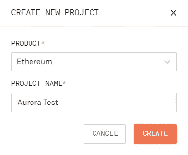

随着我们新项目的创建，我们现在需要从 Infura 获得的只是我们的 RPC URL。这在我们项目的常规设置中的 Keys 部分下。将端点下拉菜单切换到 Aurora Testnet 并复制 URL。

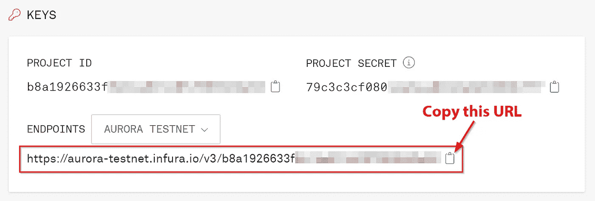

现在我们有了 RPC URL，我们需要一个地方来使用它！这就是元掩码的用武之地。

## 1b。配置元掩码

前往 [metamask.io](https://metamask.io/) 和[为你的特定浏览器下载扩展](https://metamask.io/download/)。安装完成后，打开扩展，我们将添加 Aurora Testnet。

首先，选择网络下拉菜单，然后按添加网络按钮。这将打开一个窗口，我们可以在其中输入正确的信息，以便将 Aurora 网络添加到我们的 MetaMask wallet 中。在表格中填写以下信息:

*   网络名称:极光测试网(Infura)
*   新的 RPC 网址:【https://aurora-testnet.infura.io/v3/YOUR-INFURA-PROJECT-ID 
*   连锁编号:1313161555
*   货币符号:ETH
*   区块浏览器网址:[https://testnet.aurorascan.dev/](https://testnet.aurorascan.dev/)

让我们花点时间来分析一下。首先，对于网络名称，我们在末尾添加了 Infura，以表示我们使用的是 Infura RPC URL，而不是公开可用的 Aurora Testnet URL(https://Testnet . Aurora . dev/)。这在我们粘贴 RPC URL 的下一个要点中很明显。这个 URL 将为我们提供更多的选项来部署和保护对我们项目的访问。

接下来，链 ID 是签名事务所必需的，这个数字指定了 Aurora Testnet。对于货币符号，极光的基础货币是以太，而不是 NEAR 的原生令牌。最后，我们输入 Aurora Testnet block explorer URL，这样我们就可以在事务发生时轻松查看它们。

配置 MetaMask 的最后一步是确保我们可以使用高级气体控制。导航到“设置”->“高级”,将高级气体控制切换到“打开”(如果尚未打开)。这将允许我们在部署智能合同时设置必要的气体限制。

## 1c。Aurora Testnet ETH

这一步的最后一个任务是获取一些 Aurora Testnet ETH，以便我们可以部署我们的合同。因此，前往 [Aurora Testnet 水龙头](https://aurora.dev/faucet)，按下标题下的 Testnet 按钮以切换网络，连接您的钱包，并请求一些 Testnet ETH。

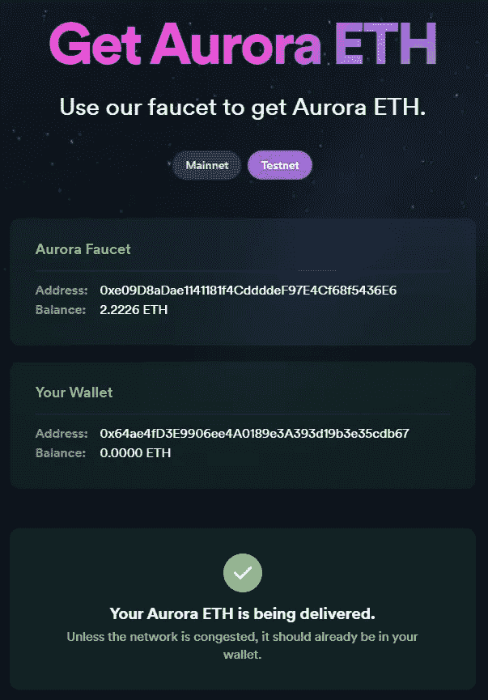

切换到 MetaMask 中的 Aurora Testnet，查看您新获得的 ETH:

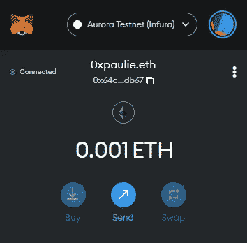

现在我们已经做好了将合同发布到 Aurora Testnet 的一切准备，让我们开始构建项目吧！

# 步骤 2 —构建项目

## 2a。安装松露

为了构建和部署我们的项目，我们将使用 Truffle，因为新版本附带了一个超级方便的工具，名为 [Truffle Dashboard](https://trufflesuite.com/docs/truffle/getting-started/using-the-truffle-dashboard/) 。这个工具允许我们部署智能合约，而不会暴露我们钱包的私钥或助记短语。在安装了[NPM](https://docs.npmjs.com/downloading-and-installing-node-js-and-npm)的情况下，在您的终端中运行以下命令:

```
npm install -g truffle
```

接下来，我们将创建并初始化一个新的 Truffle 项目:

```
mkdir AuroraTest && cd AuroraTest
truffle init
```

这创建了一个具有适当文件结构的基本启动项目，我们可以在其上构建以满足我们的需求。

因为我们将使用 OpenZeppelin 的 ERC-20 合同来创建令牌，所以我们需要安装最后一个依赖项:

```
npm install @openzeppelin/contracts
```

接下来，打开您最喜欢的代码编辑器，让我们开始构建吧！

## 2b。配置松露仪表板

为了将 Truffle 连接到仪表板进行部署，我们需要将其添加为网络选项。打开`truffle-config.js`文件，在网络对象中添加 Truffle 仪表板。除了所有被注释掉的样板文件，我们的对象现在应该是这样的:

```
networks: {
  dashboard: {
    port: 24012,
  }
}
```

默认情况下，Truffle Dashboard 在端口 24012 上运行，但是如果我们愿意，我们可以更改这一点。我们只需要在运行仪表板时指定端口。

当我们仍然在`truffle-config.js`文件中时，向下滚动到编译器并仔细检查 Truffle 正在使用的版本。这是我们将在智能合同中指定的版本号。我的是 0.8.13。

## 2c。智能合同

接下来是智能合约。在合同文件夹中，我们可以删除已经存在的迁移合同，并创建一个名为`AuroraToken.sol`的新文件。我们的 ERC-20 令牌码将如下所示:

```
// SPDX-License-Identifier: UNLICENSED
pragma solidity 0.8.13;

import '@openzeppelin/contracts/token/ERC20/ERC20.sol';

contract AuroraToken is ERC20 {
    constructor (string memory name, string memory symbol) ERC20(name, symbol){
        // Mint 1000 tokens to msg.sender
        _mint(msg.sender, 1000 * 10 ** uint(decimals()));
    }
}
```

## 2d。部署代码

下一步是创建 JavaScript 代码，我们将使用它将我们的文件部署到 Aurora Testnet。在`migrations`文件夹下，我们将改变`1_initial_migration.js`的内容，使其看起来像这样:

```
const AuroraToken = artifacts.require("AuroraToken");

module.exports = function (deployer) {
  deployer.deploy(AuroraToken, 'AToken', 'ATKN');
};
```

**注意:** AToken 和 ATKN 分别是令牌名称和符号。你可以随意设置。

现在我们都准备好部署了！

# 步骤 3 —部署智能合同

现在，我们已经具备了将智能合同部署到 Aurora Testnet 所需的一切。我们需要做的第一件事是启动松露仪表板。

## 3a。设置松露仪表板

在新的终端窗口中，运行以下命令:

```
truffle dashboard
```

这应该会弹出一个新窗口，但如果没有弹出，请在浏览器中导航到 localhost:24012。

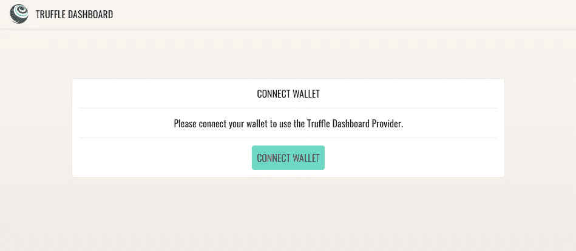

点击“连接钱包”按钮，将您的元掩码钱包连接到 Truffle 仪表板。一旦连接，它会问我们是否希望连接到我们的钱包当前分配的网络。这里，如果还没有连接到 Aurora Testnet，我们将切换到它。

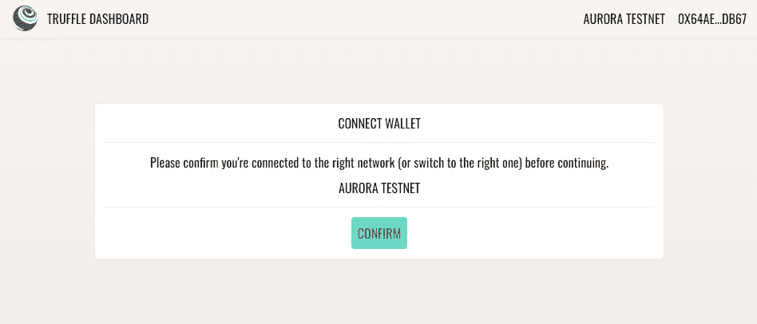

现在我们已经通过 Truffle 仪表板将 MetaMask 钱包连接到 Aurora Testnet，所有传入的请求都将从 Truffle 路由到仪表板。所以让我们把它付诸实践吧！

## 3b。部署智能合同

回到我们原来的终端窗口，导航到项目的根文件夹，并运行命令来部署我们的智能合约:

```
truffle migrate --network dashboard
```

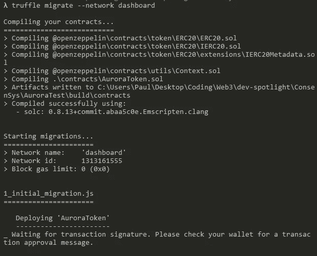

这将向 Truffle 仪表板发送一个“传入请求”。

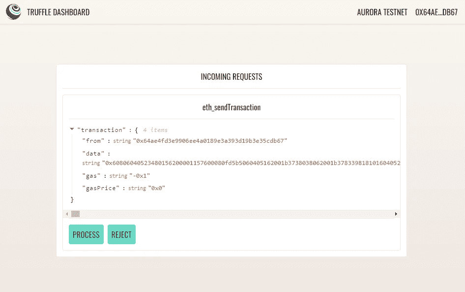

按下 Process 按钮后，MetaMask 应该会弹出我们需要签名的事务。然而，首先我们需要调整气体限制。单击编辑链接，并选择编辑建议的燃气费，以输入燃气限额和燃气价格。我们将这些分别设置为`672190`和`0.00001`。

**注意:**气体限值来自运行 migrate 命令并检查终端响应中的气体发送值。如果您的部署因为气体耗尽而失败，请检查该值并相应地调整 MetaMask。至于天然气价格，这个数字是任意的，因为您正在部署到一个测试网。

无论价格如何，您的交易都会得到处理，因此您可以将其设置为您能承受的任何数字。如果部署到 Aurora mainnet，您需要将此价格设置为有竞争力的价格，以便处理您的交易。

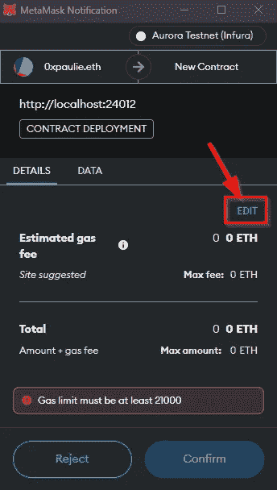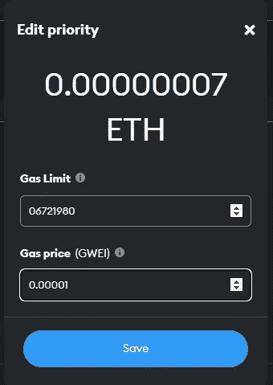

保存这些新值后，单击确认按钮继续交易。几秒钟后，我们应该在终端中看到一个成功的响应，MetaMask 应该显示一条“transaction approved”消息。我们的合同现在存在于极光测试网上！

记下终端上打印的合同地址。我们将使用它在 block explorer 上验证我们的合同，并将令牌导入我们的钱包。

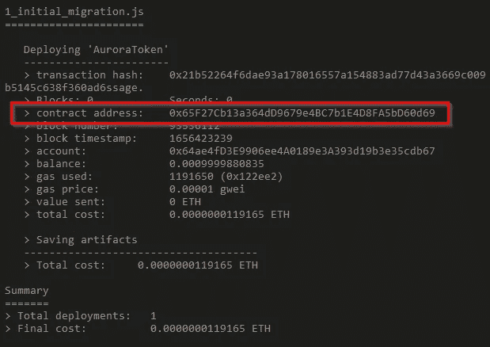

# 步骤 4 —验证成功部署

现在让我们确保一切正常。我们将首先在 Aurora Testnet 块浏览器上检查我们的事务，然后将我们的新令牌导入到我们的元掩码中。

## 4a。Aurora Testnet 块资源管理器

对于这一步，我们可以遵循来自 MetaMask 的“交易批准”消息(因为我们在设置网络连接时配置了 block explorer URL ),或者前往 https://testnet.aurorascan.dev/的[并从我们的控制台输入合同地址。](https://testnet.aurorascan.dev/)

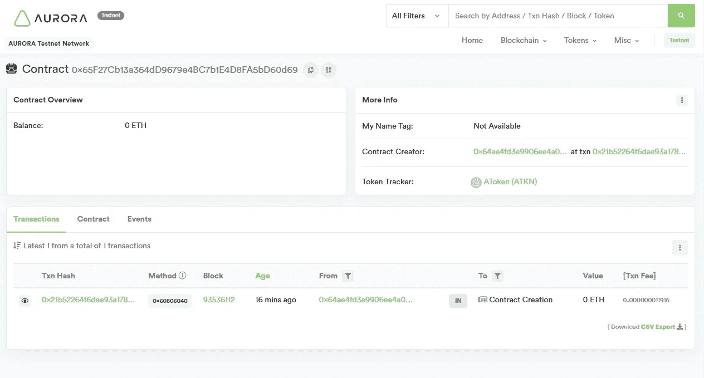

太棒了。我们已经确认我们的智能合同存在于 Aurora Testnet 上。现在让我们将新令牌导入元掩码。

## 4b。将令牌导入元掩码

MetaMask 不会自动检测我们的新令牌，所以我们必须自己导入它们。打开钱包，选择资产，然后导入令牌。


粘贴我们在终端响应中收到的合同地址，其他字段应该会自动填充。

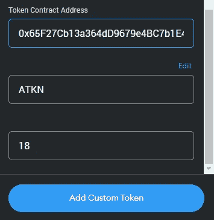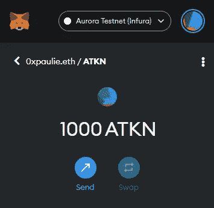

厉害！现在，我们的令牌在元掩码钱包中可见，我们可以将它们发送到另一个地址。

# 步骤 5 —发送令牌

因此，我们所需要做的就是输入我们想要发送的地址来发送令牌到另一个地址！如果我们没有具体的地址，我们可以很容易地在我们的 MetaMask 钱包中创建一个新帐户，并将它们发送到那里。只需转到我的帐户并创建一个新帐户。

在 MetaMask 仪表板上，单击发送按钮，然后粘贴地址或选择在我的帐户之间转移。

接下来，选择我们的 ATKN 资产并输入要发送的金额。

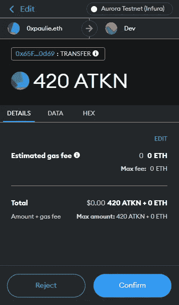

几秒钟后，我们应该会收到另一个成功的交易消息。同样，我们可以遵循此消息或检查 block explorer 上的合同页面来证明转移成功。

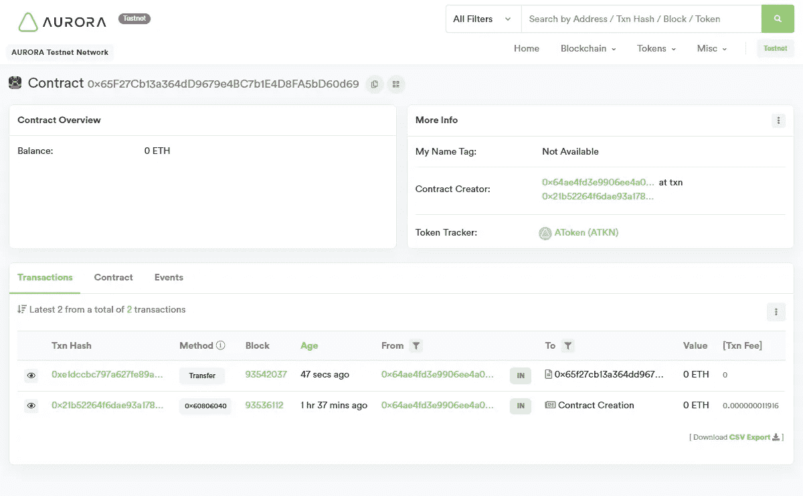

如果 ATKNs 被发送到一个我们控制的地址，我们可以检查我们钱包里的新余额。然后，我们只需要使用与之前相同的方法再次导入令牌。粘贴合同地址并导入资产后，我们的钱包中现在有了一个可见的余额。不错！

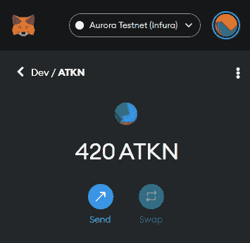

此外，我们可以检查我们的 Infura 项目并查看请求活动。


# 结论

Aurora 协议是作为智能合同部署的网络，存在于区块链附近。这是一种 EVM 的等效体验，继承了 NEAR 的所有优点，同时为开发人员和用户提供了一种简单的入门体验。交易更快、更便宜，项目的可扩展性也显著提高。

在本文中，您了解了如何在 Aurora Testnet 上部署智能契约并与之交互。您使用 Infura 在 MetaMask 中创建了一个定制的 RPC URL 连接，将附加的可观察性和安全性选项添加到您的项目中，使用 Truffle Dashboard 启动了您自己的 ERC-20 令牌，并将一些令牌转移到另一个地址。

希望这次经历已经向你展示了用 Aurora 将你现有的坚固性和以太坊技能转移到 NEAR 网络是多么容易。查看 [NEAR Education Platform](https://near.org/education/) 和 [Aurora 文档](https://doc.aurora.dev/)以了解关于该协议的更多信息。

祝你今天过得愉快！