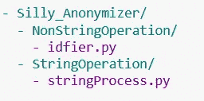
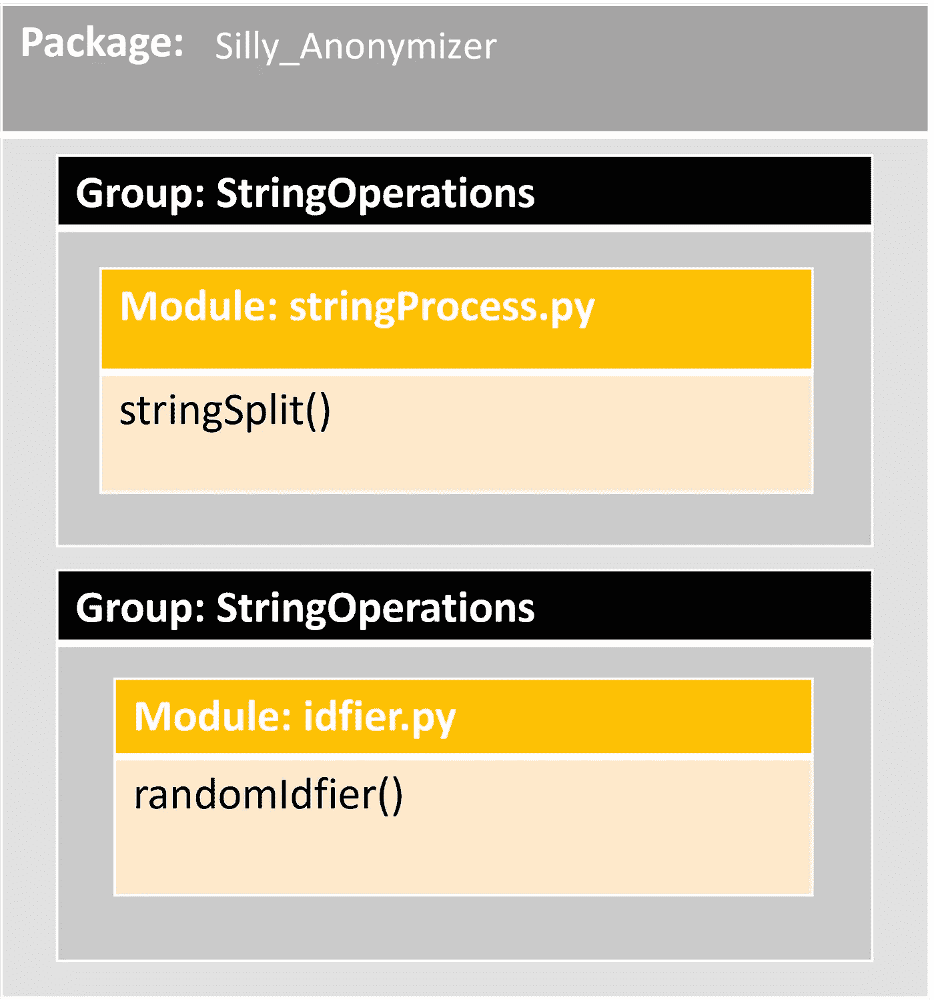
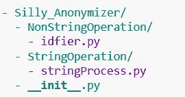
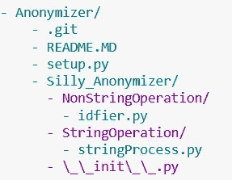

# 从函数到 Python 包

> 原文：<https://betterprogramming.pub/from-functions-to-python-package-f8a3bba8bb6b>

## 从头开始学习如何将函数转换成包并分发


在 [Unsplash](https://unsplash.com?utm_source=medium&utm_medium=referral) 上 [Leone Venter](https://unsplash.com/@fempreneurstyledstock?utm_source=medium&utm_medium=referral) 拍摄的照片

用 Python 编码很有趣，但更有趣的是适用于不同目的的*包*的可用性。例如，科学计算和机器学习包的可用性使 Python 成为数据科学和分析领域最受欢迎的语言。在这篇文章中，我们将介绍 Python 包的世界，并看看我们如何构建自己的包。

在我上一篇关于 Python 模块的文章中，[使用模块更好地组织你的 Python 代码](https://levelup.gitconnected.com/use-modules-to-better-organize-your-python-code-75690ba6b6e)，我讨论了我们如何使用 Python *模块*更好地组织我们的代码。在这篇文章中，我们将采取下一步，学习如何使用*包*更好地组织我们的 Python 模块。

# 什么和为什么？

Python 包是模块的集合。如果 Python 模块被认为是函数和变量的家，那么包就是模块的家。

## ❓:但是如果我们可以用模块来组织我们的代码，那为什么还要用包呢？

正如我们已经知道的，代码库倾向于增长。随着代码库的不断增长，您很可能会根据功能执行的任务类型将它们分成多个模块。随着模块数量的增长，一个自然的过程是找到一种方法，根据它们所属的公共组来组织模块。以目录形式组织的一组模块可以很容易地转换成 Python 包，以简化模块的使用和维护。

> 包是通过使用“带点的模块名”来构造 Python 的模块名称空间的一种方式。—来源: [Python 教程](https://docs.python.org/3/tutorial/modules.html)

一旦安装了一个包，我们就可以使用点符号轻松地访问存储在不同目录级别的模块。

# 一个示例场景

在开始讨论包之前，让我们考虑一个场景，以便更容易地将我们的学习放入上下文中。让我们假设我们正在进行一个项目，在这个项目中，我们得到由一个长字符串中存储的特定字符分隔的用户名。我们需要将它们分解，并为它们分配唯一的数字 id，以便将来可以将它们存储在数据库中。因此，我们的任务是:

1.  将输入字符串分成一组名称列表，
2.  然后为这些名称分配唯一的 id。

为了执行这些任务，我们将构建几个函数，将它们存储在几个模块中，并最终将它们封装在一个 Python 包中。为这样一个微不足道的项目构建一个包无疑是大材小用，但出于我们的学习目的，让我们假设这是一个好主意。

# 两个模块

让我们创建几个模块:`stringProcess`、`idfier`。

*   `stringProcess`:一个帮助我们处理字符串的模块。目前，它只包含一个名为`stringSplit()`的函数，该函数接受一个字符串，然后根据选择的分隔符将其拆分。
*   `idfier`:帮助我们创建唯一 id 的模块。目前，它只包含一个名为`randomIdfier()`的函数，该函数获取一个名称列表，为它们分配随机生成的惟一 id，并将它们保存为一个字典。

用下面的代码创建两个单独的`.py`文件，并用模块名命名这些文件。此外，确保将它们保存在运行脚本或笔记本的同一目录中。

# 对包构建有用的模块属性

我们已经在上一篇文章中讨论了通用模块属性。在这里，我们将讨论一些附加属性，这些属性在我们讨论包开发时会很方便。

## 模块初始化

一旦导入了一个模块，Python 就会隐式地执行该模块，并让它初始化它的某些方面。需要注意的一个重要方面是:

> *模块初始化在一个项目中只发生一次。*

如果一个模块被多次导入，这是不必要的，但即使它发生在一个模块内部，对于后续的导入，Python 会记住前一次的导入，并忽略后面的初始化。在下面的例子中，您可以看到这个特性的实际应用。我们看到，当我们两次导入`idfier`和`stringProcess`模块时，它们只在第一次初始化时打印出一次消息，并且在随后的导入中不产生任何消息。

```
import idfierimport idfierimport stringProcessimport stringProcessidfier is used as a module
stringProcess is used as a module
```

## 模块中的私有属性

您可能希望在模块中包含仅供内部使用的变量。本质上，这些被认为是`private`属性。您可以通过一个或两个下划线(`__`)来声明这样的属性，即变量或函数。

> 但是添加下划线仅仅是一种约定，本身并不强加任何保护。

⚠️与 Java 等其他语言不同，Python 对访问这种私有属性没有任何严格的限制。添加下划线可以让其他开发人员注意到这些属性仅供内部使用。

## `__name__`变量

模块本质上是 Python 脚本。当 Python 脚本作为模块导入时，Python 会创建一个名为`__name__`的变量，并在其中存储模块的名称，例如，当我们导入我们的`idfier`模块时，`__name__`变量中包含值- `idfier`。相反，当脚本被直接执行时，`__name__`变量包含`__main__`作为值。

为了演示，让我们在`stringProcess.py`文件中添加以下简单的`if-else`条件，并检查我们如何使用`__name__`属性。

```
name = "stringProcess"if __name__ == "__main__":print(name, "is used as a script")else:print(name, "is used as a module")
```

在下面的代码单元中，我们将`stringProcess`模块作为脚本和模块来调用。看看两种方法如何产生两种不同的消息。

🛑记住，在运行下面的代码块之前，要重启你的 Jupyter 笔记本或者重新运行你的脚本，否则你不会看到正确的结果。还记得 Python 只初始化一个模块一次的规则吗？

```
%run -i stringProcess.pyimport stringProcessstringProcess is used as a script
stringProcess is used as a module
```

## **💡那么这个** `**__name__**` **变量会有什么帮助呢？**

`__name__`变量是一个非常有用的特性，可以对模块脚本中的代码进行一些基本测试。使用此变量的存储值，您可以在开发模式下主动使用脚本时要求 Python 运行一些测试，并在项目中将它们用作模块时忽略它们。稍后我们将看到这个功能的演示。

# 改进`idfier`

现在基于我们新知道的模块的性质，让我们改进模块— `idfier`。

*   **改进** `**randomIdfier()**`:目前这个函数生成一个 1000 到 9999 之间的随机整数并赋值。但是因为这个数字是随机产生的，所以不能保证这个数字是唯一的。但是出于我们的目的，我们需要它来创建唯一的数字作为 id。为了确保唯一性，我们添加一个`while`循环来检查重复项，并重新生成随机数，除非它找到一个唯一的随机数。
*   **使用** `**__name__**` **进行自动化测试**:我们将添加一个测试代码块，并将其包装在一个`if-else`条件中，这样它将只在`**__name__ == "__main__"**` 的值时运行测试，换句话说就是直接运行模块脚本。这个简单的测试将检查当我们使用包含两个名字的字符串输入运行`randomIdfier()`时，唯一 ID 值的长度是否等于 2。
*   **添加简短描述**:我们已经使用`""" """` (docstring)为代码块添加简短描述。

```
import idfier as idfidf.randomIdfier(['name1', 'name2'])idfier is used as a module{'name1': 6571, 'name2': 7469}
```

*   作为脚本执行`idfier.py`。你能猜出产量吗？
*   尝试更改内部代码，以便测试失败。他们再次执行。

# Python 的搜索模块

到目前为止，我们将模块与项目脚本放在同一个目录中。但是在实际的项目中，我们希望将我们的模块和包保存在一个单独的位置。因此，为了模拟这种情况，让我们将两个模块复制到一个不同的文件夹中，并将该文件夹命名为`Silly_Anonymizer`。

## ❓ **那么我们如何将这个位置添加到我们的 Python 项目中呢？**

> Python 在`sys`模块的`path`变量中维护一个位置或文件夹列表，Python 在其中搜索模块。

它按照存储在列表中的顺序搜索`sys.path`中的位置，从脚本执行的位置开始。

```
import syssys.path['C:\\Users\\ahfah\\Desktop\\Curious-Joe\\content\\post\\2202-04-02-oop-python-package',
 'C:\\Users\\ahfah\\AppData\\Local\\Programs\\Python\\Python39\\python39.zip',
 'C:\\Users\\ahfah\\AppData\\Local\\Programs\\Python\\Python39\\DLLs',
 'C:\\Users\\ahfah\\AppData\\Local\\Programs\\Python\\Python39\\lib',
 'C:\\Users\\ahfah\\AppData\\Local\\Programs\\Python\\Python39',
 'c:\\Python_Envs\\pcap02',
 '',
 'c:\\Python_Envs\\pcap02\\lib\\site-packages',
 'c:\\Python_Envs\\pcap02\\lib\\site-packages\\win32',
 'c:\\Python_Envs\\pcap02\\lib\\site-packages\\win32\\lib',
 'c:\\Python_Envs\\pcap02\\lib\\site-packages\\Pythonwin']
```

我们可以将自定义模块位置添加到这个列表中，并确保 Python 知道在哪里可以找到该模块。`Silly_Anonymizer`模块目录位于我的工作站上:`C:\Users\ahfah\Desktop\Anonymizer\Silly_Anonymizer`。让我们添加并检查一下。

```
sys.path.append('C:\\Users\\ahfah\\Desktop\\Anonymizer\\Silly_Anonymizer\\')sys.path[len(sys.path)-1]'C:\\Users\\ahfah\\Desktop\\Anonymizer\\Silly_Anonymizer\\'
```

🛑注意双反斜杠。反斜杠是用来转义其他字符的，所以我们需要使用双反斜杠来让 Python 明白我们在寻找一个字面上的反斜杠。

# 构建包

将我们的模块放入傻瓜式匿名器是制作包的第一步。让我们在`Silly_Anonymizer` — `NonStringOperation`和`StringOperation`中创建两个子目录，这样将来如果我们有更多的模块，我们就可以根据它们的任务类型来存储它们——操纵字符串，或者操纵非字符串操作。现在，让我们将两个模块移到这两个子目录中:`NonStringOperation`中的`idfier.py`和`stringProcess.py`中的`StringOperation`。因此，文件夹结构应该如下所示:



作者形象

在我们的包中查看傻瓜式匿名器目录，可以看到 Python 包的目录结构！

我们的傻 _ 匿名器包的功能、模块和包关系的具体视图如下:



作者形象

## 初始化包

像模块一样，Python 包也需要初始值设定项。为此，我们需要在`Silly_Anonymizer`的根目录中包含一个名为`__init__.py`的文件。但是由于包不是一个文件，我们不能将它作为函数的一部分，因此这个单独的文件用于初始化。它可以保留为空，但它需要出现在要视为包的模块目录的根目录下。

所以添加`__init__.py`后，匿名文件夹应该是这样的:



作者形象

🛑注意，你也可以把`__init__.py`放在其他子文件夹中，这取决于你是否需要对它们进行任何特殊的初始化，或者只是想把它们当作一个子包。这也是我们以后要做的。

## 从包导入模块

一旦我们的模块主目录中有了`__init__.py`文件，我们就可以将它作为一个包使用。要从 Python 包中导入模块，我们需要使用从包根开始的完全限定路径。在我们的案例中，对于模块- `stringProcess`导入将如下所示:

```
import Anonymizer.StringOperation.stringProcess as sp> stringProcess is used as a module sp.stringSplit(string="Arafath, Samuel, Tiara, Nathan, Moez", separator=",")> ['Arafath', ' Samuel', ' Tiara', ' Nathan', ' Moez']
```

**💡Python 也可以从压缩的位置读取包。**

Python 包也可以从 zip 文件夹导入。如果您注意到`sys.path`的输出，您可能已经在列表中找到了一些 zip 文件夹。这是因为 Python 将压缩文件夹视为常规文件夹。

🛑尝试将`Simmy_Anonymizer`压缩到一个压缩文件夹`Silly_Anonymizer.zip`中，并尝试导入它。

# 发布包

我们已经构建了自己的包，可以在本地使用了。现在让我们简单地谈谈如何让其他人也能使用它。为此，我们将使用 PyPi。Python 打包索引(PyPi)是托管 Python 包最常用的存储库。

## **⚠️提醒一句**

这里解释的包发布步骤是发布包的最低要求。使用它作为踏脚石，然后研究官方文档以理解包发布的本质。我将添加一些参考资料。

## 准备

为了使我们的包准备好上传，让我们将以下文件添加到我们的模块目录所在的目录中:

**为** `**Silly_Anonymizer**`添加一个 Git 库

在 GitHub 或任何其他分布式版本控制解决方案中创建一个远程存储库，并将`Silly_Anonymizer`包添加到存储库中。你可以在这里查看我的。

**添加一个** `**readme.md**` **文件**

自述文件为用户提供了项目的描述。在我们的例子中，它将描述用户、`Silly_Anonymizer`包是关于什么的、如何使用等等。查看 GitHub repo 获取一个示例自述文件。

**添加一个** `**setup.py**` **文件**

这是成功准备 PyPi 上传包所需的主要文件。这个文件包含一些基本的说明，确保这个本地目录为上传到 PyPI 做好了适当的准备。查看 GitHub repo 中的示例文件。

安装文件中的信息有助于包的开发、托管和维护。三个绝对最少的必需属性是名称、版本和包。有关这些和所有参数的详细信息，请查阅官方文档。

包含这些文件后，文件目录应该如下所示:



作者图片

## **构建分发包**

PyPi 分发包装在分发包中的 Python 包源代码。两个常用的分发包是源文档和 Python wheels。为了创建源文件和我们的包，我们将使用一个名为`twine`的包并运行`python setup.py sdist bdist_wheel`。

这将在新创建的名为`dist`的目录中创建两个文件——一个源归档文件(`.tar.gz`文件)和一个车轮文件(`.whl`文件)。签出源归档文件，以确保所有源代码都填充在其中。

## 快速检查

我们准备向 PyPi 推出我们的产品包。在将它推送到 PyPi 之前，让我们运行`twine check dist/*`来快速检查这个包是否能在 PyPi 中正确呈现。如果一切正常，你应该在运行检查后看到屏幕上打印的`PASSED`。

## 上传

PyPi 有一个测试版本，我们可以用它来学习和测试。我们将使用 PyPi 测试来托管我们的包。在此之前，请确保您在 [PyPi 测试](https://test.pypi.org/)中注册。

注册后，运行`twine upload --repository-url https://test.pypi.org/legacy/ dist/*`。出现提示时，输入您的用户名和密码。

🛑:如果你一直关注这篇文章，你可能无法上传与我已经上传的包同名的包。给它一个不同的名称并重新构建包。

🛑使用测试 PyPi 搜索来找出您的软件包名称是否可用。

就是这样！您应该在控制台上看到新创建的 Python 包的位置。结账地雷[这里](https://test.pypi.org/project/Silly-Anonymizer/1.0.0/#history)。

# 下一步是什么？

在这篇文章中，我试图让一个对编写 Python 函数有函数理解的人来构建他/她的第一个 Python 包。在结束之前，重申一下前面的内容，这篇文章绝不是一篇关于如何构建生产包的详细教程。在产品代码中，必须添加严格的测试。此外，不太可能构建一个没有任何依赖关系的包！这两个我都没有涉及到，所以一定要了解它们。

如前所述，这里有一些资源可以用来补充你的理解:

*   [马克·史密斯在 EuroPython 2019 的演讲](https://www.youtube.com/watch?v=GIF3LaRqgXo)
*   [来自 RealPython 的教程](https://realpython.com/pypi-publish-python-package/)

我喜欢写数据科学和 DS 中使用的工具。这里有几个你可能会喜欢的故事:

[](https://towardsdatascience.com/python-exceptions-what-why-and-how-44661cad3cd4) [## Python 异常——什么、为什么和如何？

### 理解 Python 中异常的工作方式以及如何正确使用它们。

towardsdatascience.com](https://towardsdatascience.com/python-exceptions-what-why-and-how-44661cad3cd4) [](https://towardsdatascience.com/object-oriented-programming-in-python-what-and-why-d966e9e0fd03) [## Python 中的面向对象编程——什么和为什么？

### 学习 Python 中的面向对象编程。

towardsdatascience.com](https://towardsdatascience.com/object-oriented-programming-in-python-what-and-why-d966e9e0fd03)