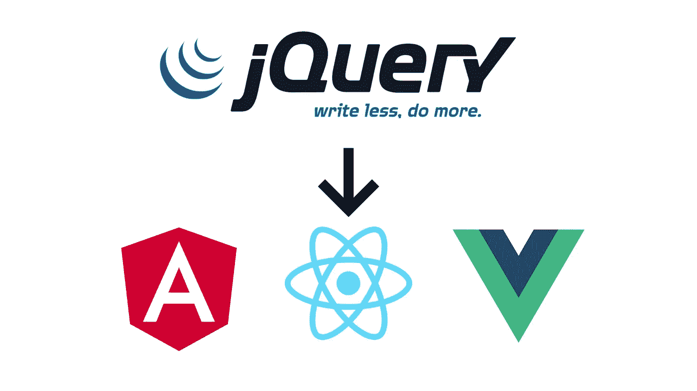
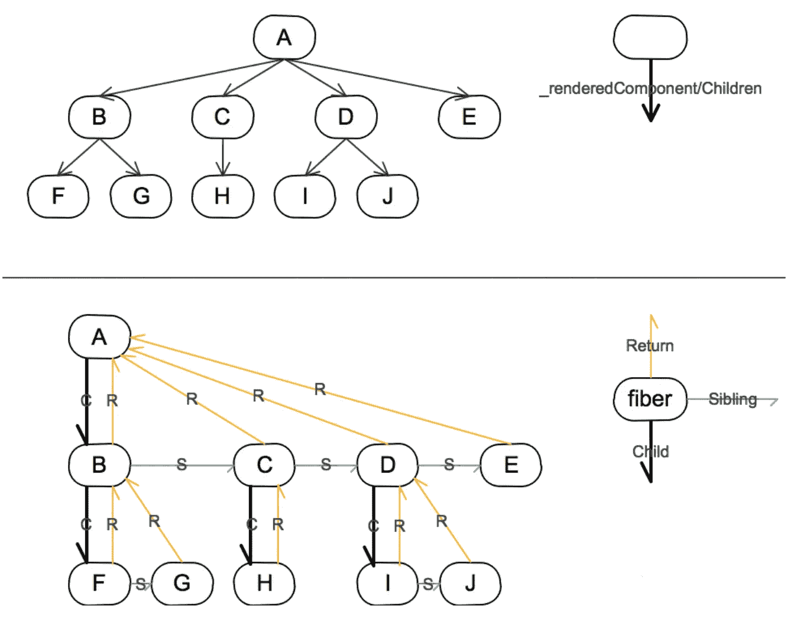

# 从 JQuery 到 React、Vue、Angular——前端框架的演变及其差异

> 原文：<https://betterprogramming.pub/from-jquery-to-react-vue-angular-the-evolution-of-frontend-frameworks-and-there-difference-3e6b6fcc6200>

## 这是前端面试中必然要问的问题



这些年来，前端开发一直在不断改进。从简单的静态页面到现在复杂的单页应用，我们的工具变得越来越强大。现在，三种前端框架统治着前端开发，那么你知道这三种框架的区别吗？为什么一直保持着三足鼎立的局面，而没有一个确定的框架来统一其他的呢？让我们在本文中讨论这些问题。

# 前端开发的演变

## PHP && JSP

早些年，网页的动态内容是在服务器端渲染的，主要使用 PHP、JSP 等技术。

此时，服务器通过模板引擎填充数据，然后生成 HTML，并将 HTML 返回给浏览器进行渲染。

```
<!DOCTYPE html>
<html>
<body><h1>My first PHP page</h1><?php
echo "Hello World!";
?></body>
</html>
```

## 创建交互式、快速动态网页应用的网页开发技术

后来有了 AJAX 技术，JavaScript 可以直接在浏览器中发送异步 HTTP 请求，从服务器动态获取数据，而不是把所有数据都放在 HTML 中。

```
<body>
  <h2>Hello world</h2>
  <div id="demo"></div>
  <script>
    var xhttp = new XMLHttpRequest();
    xhttp.onreadystatechange = function () {
      if (this.readyState == 4 && this.status == 200) {
        // Typical action to be performed when the document is ready:
        document.getElementById("demo").innerHTML = xhttp.responseText;
      }
    };
    xhttp.open("GET", "/api/data", true);
    xhttp.send();
  </script>
</body>
```

最早的 AJAX 是基于 XML 的，所以我们现在用 JavaScript 发送 HTTP 请求的时候，用到的函数叫做`**XML**HttpRequest`。但是 XML 中有很多不必要的标签，浪费了服务器带宽，所以 JSON 格式的数据占据了主流地位。

## DOM API 和 jQuery

以前开发网页的时候，主要是通过浏览器提供的 DOM API 来操作 DOM。

但是 DOM API 比较繁琐，在不同浏览器中存在兼容性问题。为了简化 dom 操作，兼容不同的浏览器，jQuery 开始流行。在当时，jQuery 可以说是前端开发人员必须学习的技术。

```
$( "button.continue" ).html( "Next Step..." )
```

## 前端框架

然后在开发网页的时候，我们发现一个网页需要做的就是先从服务器获取数据，然后根据数据更新 DOM。

而且这个过程是固定的。为了简化 DOM 操作，人们发明了 MVVM 框架来自动将数据更改映射到 DOM 更新，而不需要手动操作 DOM。前端框架 Angular，React，Vue 就是这么做的。

```
import { useState } from 'react'function Counter() {

  const [count, setCount] = useState(0) return (
    <div>
      <p>you clicked {count} times</p>
      <button onClick={() => setCount(count + 1)}>increase</button>
      <button onClick={() => setCount(count - 1)}>decrease</button>
  </div>)
}export default Counter
```

同时，前端框架也支持 DOM 的逻辑划分。我们可以将 DOM 的一部分封装成组件，将组件相互组合起来形成整个应用。

这种思路可以让我们把一个复杂的页面拆分成不同的组件，方便我们开发项目。

# 反应、Vue、角度之间的差异

这些前端框架主要使用以下思想:

> UI = f(状态)

我们只需要声明组件的状态、视图以及组件之间的依赖关系，然后组件的 UI 就会自动生成。

虽然它们的核心思想是相同的，但是这些框架的实现细节是不同的。下面我们来分析一下。

## 反应 JSX 与 Vue 模板

在描述视图层时，React 和 Vue 给出了不同的解决方案。React 选择扩展 JavaScript 并引入 JSX。而 Vue 创建了独立的模板语法。

JSX 反应过来:

```
export default function TodoList() {
  let list = ['JavaScript', 'React', 'Vue']
  return <div>
    {
      list.map(item => <li>{ item }</li>)
    }
  </div>
}
```

Vue 模板:

```
<ul id="array-rendering">
  <li v-for="item in items">
    {{ item.message }}
  </li>
</ul>
```

JSX 的优势:

*   在编写 JSX 时，开发人员可以使用他们现有的 JavaScript 知识，而不需要太多额外的学习成本。
*   JSX 可以利用 JavaScript 本身的特性，所以更强大。
*   JSX 代码和普通的 JavaScript 代码将在相同的执行上下文中执行，因此 JSX 可以很容易地与 TypeScript 结合。Vue 模板和 JavaScript 执行上下文是分离的，所以在 Vuejs 中引入 TypeScript 比较困难。你需要分别为`prop`、`method`和`data`声明类型。

当然，Vue 模板也有自己的优势。由于 Vue 模板只能使用有限的语法，Vue 可以更容易地对其进行静态分析和性能优化，这在 JSX 是很难做到的。

## 检查数据更新的不同方法

这三个前端框架都需要观察数据变化来决定 UI 是否需要更新，但是它们选择了完全不同的方式来做这件事。

Angular 采取的方式是脏检查。在每个可能修改数据的语句执行后，Angular 会比较前后的数据，以确定是否有数据更改。

Vue 直接使用 JavaScript 的原生特性来监控数据变化。Vue2 使用了`Object.defineProperty`，Vue3 使用了`Proxy`。

另一方面，React 采取了不同的策略。React 不直接监视数据变化，而是在数据和 UI 之间添加一个虚拟 DOM。每次组件更新后都会重新生成一个虚拟 DOM，并获取新的虚拟 DOM 和旧的虚拟 DOM 之间的差异。然后 React 决定是否以及如何更新真正的 DOM。

## Vue 和 React 的优化

Vue 的数据观察是组件级的。当组件内部有很多地方需要观察数据变化时，一次更新可能需要大量的计算，可能会导致丢帧，也就是渲染卡顿。所以**Vue 的优化方法是把大组件拆分成小组件**，这样每个数据不会有太多的 watchers。

React 不观察数据变化，而是渲染整个虚拟 dom，然后进行 diffs。所以 React 的优化方法是，对于不需要重新渲染的组件，通过`shouldComponentUpdate`跳过渲染。

然而，当应用程序的组件树非常大时，仅仅使用`shouldComponentUpdate`来跳过一些组件的渲染可能仍然是非常计算密集型的。大量的计算也可能导致渲染冻结。那么我们该怎么办呢？

树的遍历有两种方法:深度优先和广度优先。组件树的呈现是深度优先的，这通常通过递归来实现。递归调用无法挂起，这可能会导致页面冻结。

但是如果用链表来记录访问路径，就可以把树的递归遍历转化为数组的循环遍历。在循环遍历数组时，可以按照时间片进行分段，这样虚拟 dom 的生成就不会再阻塞页面渲染。这非常类似于操作系统对多个进程的分时调度。

将组件树改为链表，将虚拟 dom 的生成由递归改为循环的机制有一个著名的名字: **React Fiber** 。



与之前的组件节点相比，光纤节点没有`parent`和`children`属性，而是有`child`、`sibling`和`return`属性。React 通过纤程链表树优化渲染性能。

这里我们可以发现 Vue 的性能优化与 React 有很大不同:

*   Vue 使用组件级数据观察解决方案。当一个属性有太多的观察者时，可能会出现性能瓶颈，所以优化的思路是把大组件拆分成小组件，保证每个属性不会有太多的观察者。
*   但是，React 不会观察或检查数据更改。它每次渲染生成虚拟 dom，然后对比新旧虚拟 dom。优化的思路是用`shouldComponentUpdate`跳过一些组件的渲染。

## 重用代码的不同方式

需要重用的组件之间会有一些共同的逻辑。React 和 Vue 有不同的解决方案。

Vue 的组件是以 option 对象的形式出现的，所以很自然地会想到通过对象属性来实现逻辑重用的 mixins。Vue2 组件的内部逻辑复用方案确实是 mixin，但是 mixin 很难区分自身属性和混合属性，无法判断方法的来源。所以 mixin 的代码很乱，维护很差。但是没有更好的解决办法。

React 在开始时也支持 mixins，但后来被弃用了。

React 组件有两种形式:类组件和功能组件。对于类组件，像高阶函数这样的高阶组件(HOC)是重用代码的一种自然方式。具体来说，我们可以用父组件包装子组件，在父组件中执行一些逻辑，然后渲染子组件。

除了使用 HOC，我们还可以直接将一些 JSX 作为道具传递给另一个组件重用，也就是渲染道具。

HOC 和 render props 是 React 的类组件支持的两种逻辑重用方案。

原始的功能组件是无状态的，只是作为类组件呈现的辅助而存在。

但是，HOC 的逻辑复用方式最终导致了组件的深度嵌套。而且类的内部生命周期很多，把不同的逻辑放在一起会让组件更复杂。

如何解决类组件的深度嵌套？而且解决方案不能进入突破性更新。

因此，React 团队研究了功能组件。他们想在功能组件中扩展一些 API 来支持状态。

如果一个功能组件要支持状态，那么状态应该存储在哪里？

类组件本身有状态，变成纤程节点后仍然有状态。功能组件最初没有状态，在它变成纤程节点之后也没有状态。

这么想，给功能组件的纤程节点添加状态还不够吗？

于是 React 在功能组件的一个纤程节点上添加了`memorizedState`属性来存储数据，然后开发者就可以通过 API 使用功能组件中的数据了。这些 API 被称为 React 钩子。因为数据是在纤程节点上使用的，所以这些 API 被命名为`useXxx`。

# 结论

三种前端框架各有优缺点。单纯比较谁更优秀是没有意义的。我们需要做的是为一个应用场景选择一个合适的解决方案。

技术是不断变化的，但最终目的是提高工作效率，降低开发成本，保证质量。

感谢阅读。