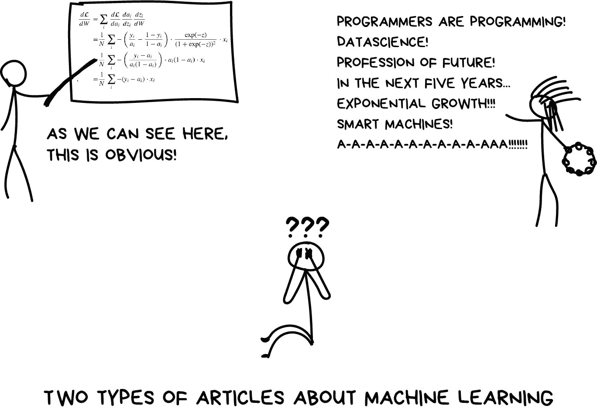
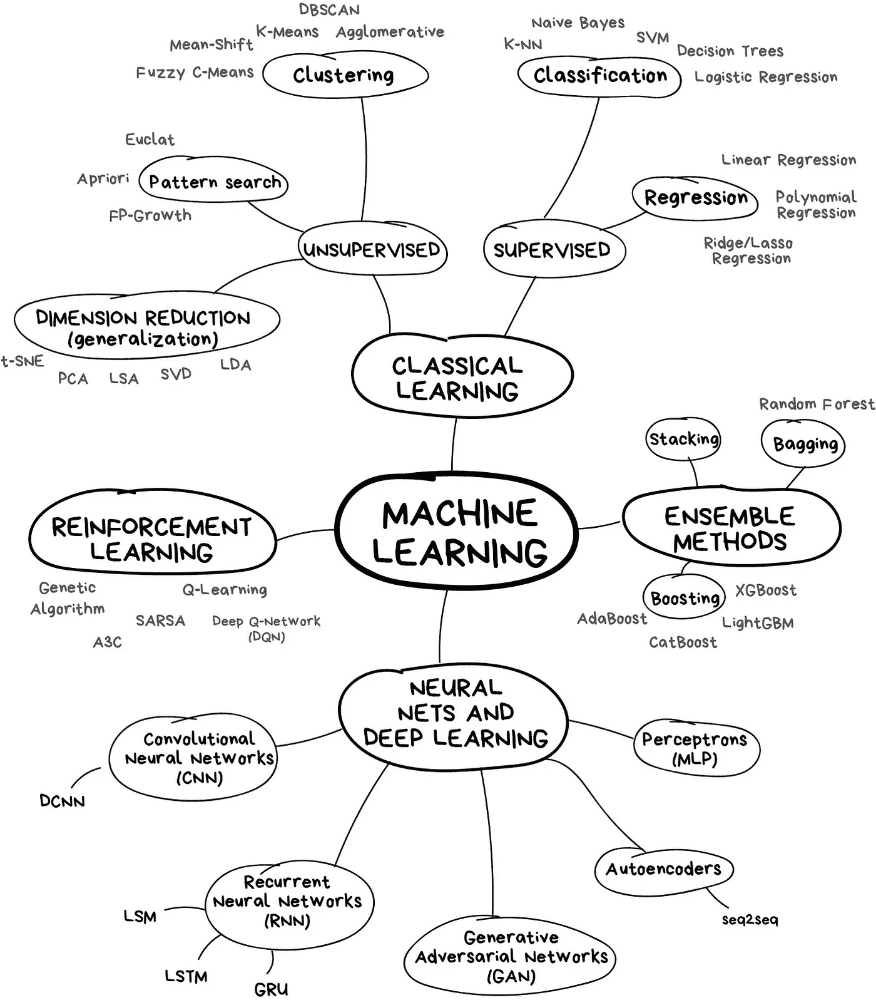
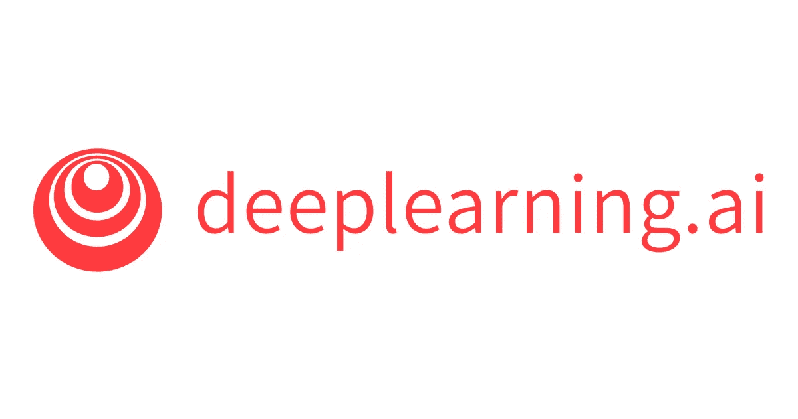
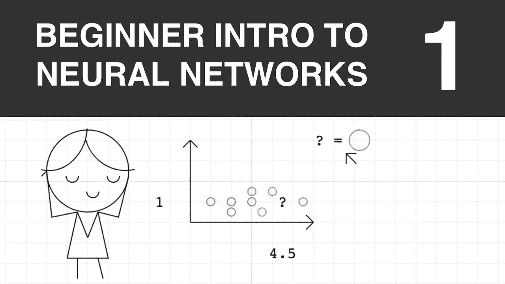
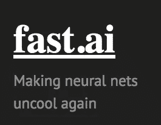
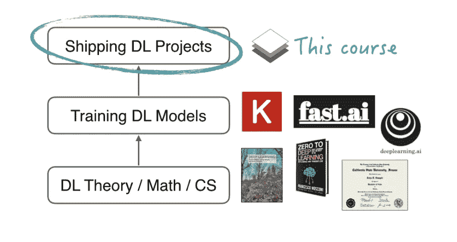
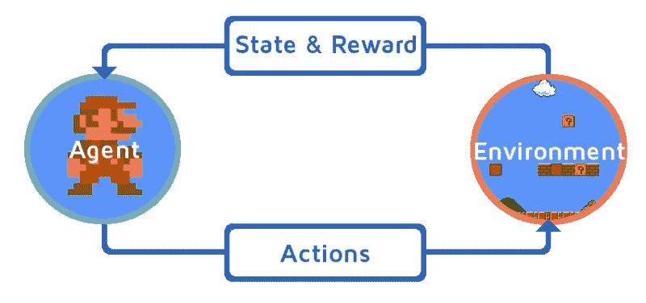

# 从机器学习到强化学习掌握

> 原文：<https://betterprogramming.pub/from-machine-learning-to-reinforcement-learning-mastery-47f33d9f6b41>

## ML 到 RL，没有博士学位

我决定写一篇我盼望已久的帖子。为那些一直想了解**机器学习**的人简单收集了**最佳资源**。一个适合所有人，无论你是**程序员**还是**经理**。

我们走吧。

永远要记住:在机器学习的世界里，从来没有一种方法可以解决问题。总有几个算法适合，你要选择哪个更适合。当然，一切都可以用神经网络来解决，但谁来支付所有这些 GPU 呢？

让我们从一个基本的概述开始:

那里有大量的资源，令人应接不暇。我们应该从哪里开始？别担心。

# 第一步:机器学习掌握

## [课程 01:吴恩达的机器学习(Coursera)](https://www.coursera.org/learn/machine-learning)

一切都是从基础开始教，这使得这门课非常容易上手。它仍然需要努力；然而，它会给你留下真正的自信和对所涵盖的主题的理解。更多**数学**。

## [课程 02:用 Python 进行机器学习——从线性模型到深度学习(MIT 6.86x edX)](https://www.edx.org/course/machine-learning-with-python-from-linear-models-to-deep-learning) (2019 版)

> 通过亲自动手的 Python 项目，深入介绍机器学习领域，从线性模型到深度学习和强化学习。

完美的中级课程。

## **练习:** [**练习你技能的最佳地点**](https://www.kaggle.com/) **。**

开始[这里**开始**这里](https://www.kaggle.com/c/titanic)！预测泰坦尼克号上的生存，熟悉 ML 基础知识。

# 第二步:深度学习掌握

## [课程 01:吴恩达深度学习专业化](https://www.deeplearning.ai/deep-learning-specialization/)

> 深度学习专业由人工智能领域的全球领导者、Coursera 的联合创始人吴恩达博士创建并教授。

> 除了讲座和编程作业，你还将观看许多深度学习领导者的独家采访。他们会和你分享他们的个人故事，给你职业建议。

## [课程 02:神经网络入门(YouTube)](https://www.youtube.com/watch?v=ZzWaow1Rvho&list=PLxt59R_fWVzT9bDxA76AHm3ig0Gg9S3So)

这是一个**系列**视频，教你你可能想知道的关于神经网络的一切，从它们背后的数学到如何自己创建一个并使用它解决你自己的问题！

## 可选:一些令人惊叹的博客和书籍可供阅读！

1.  [*打造自己的神经网络*塔里克·拉希德](https://www.amazon.com/Make-Your-Own-Neural-Network-ebook/dp/B01EER4Z4G)。
2.  [探索深度学习作者安德鲁·特拉斯克](https://www.manning.com/books/grokking-deep-learning)。
3.  [Victor Zhou 的神经网络介绍](https://victorzhou.com/blog/intro-to-neural-networks/)。

## [课程 03:程序员实用深度学习— Fast.ai](https://course.fast.ai/)

> *“我希望很多人能够意识到，即使他们不是斯坦福大学深度学习博士，他们也可以实现深度学习的最先进成果。”——****杰瑞米·霍华德***

## [课程 04:向顶级从业者学习生产级深度学习](https://fullstackdeeplearning.com/)

本课程涵盖:

> -制定**问题**和估算项目**成本。**
> 
> -查找、清理、标记和增加**数据。**
> 
> -选择正确的**框架**和计算**基础设施。**
> 
> **-故障排除**培训并确保**再现性。**
> 
> **-按比例部署**模型。

# 第三步:强化学习掌握

## [课程 01:**RL 上的 UCL 课程**](http://www0.cs.ucl.ac.uk/staff/D.Silver/web/Teaching.html)

*这是关于强化学习的最好的课程之一，它涵盖了以下主题:*

第一讲:强化学习简介

第二讲:马尔可夫决策过程

第三讲:通过动态规划进行规划

第四讲:无模型预测

第五讲:无模型控制

第六讲:价值函数逼近

第 7 讲:政策梯度方法

第 8 讲:整合学习和计划

第九讲:探索与开发

第十讲:案例研究:经典游戏中的 RL

## [课程 02:深度 RL 训练营](https://sites.google.com/view/deep-rl-bootcamp/lectures)

这个训练营将通过讲座和动手实验室会议的混合来教授您深度 RL 的基础，因此您可以继续使用这些技术构建新的迷人的应用程序，甚至可能推动算法的前沿。

## [课程 03:David Silver 的深度强化学习](http://videolectures.net/rldm2015_silver_reinforcement_learning/)

在本教程中，David Silver 将讨论强化学习(RL)如何与深度学习(DL)相结合。有几种方法可以将 DL 和 RL 结合在一起，包括基于价值、基于政策和基于模型的规划方法。这些方法中的一些具有众所周知的发散问题，并且将提出解决这些不稳定性的简单方法。

## [课程 04:深度强化学习 cs 294–112](http://rail.eecs.berkeley.edu/deeprlcourse/)

本课程将假设你对强化学习、数值优化和机器学习有所了解。这是 RL 的中级课程。

## [课程 05:由 OpenAI 在深度 RL 中旋转](https://spinningup.openai.com/en/latest/index.html)

这是一个由 **OpenAI** 制作的教育资源，可以更容易地了解深度强化学习(deep RL)。

## [课程 06(可选):***Arthur Juliani***](https://medium.com/emergent-future/simple-reinforcement-learning-with-tensorflow-part-0-q-learning-with-tables-and-neural-networks-d195264329d0)用 Tensorflow 系列(中篇)进行简单强化学习

这是 Arthur 关于 RL 的完整博客系列，以非常简单明了的方式涵盖了 RL 的所有要点。值得一读！

## [**可选资源:**https://github.com/frontbench-open-source/Data-Science-Free](https://github.com/frontbench-open-source/Data-Science-Free)

你做到了！是的，没有博士学位你也掌握了一切！

