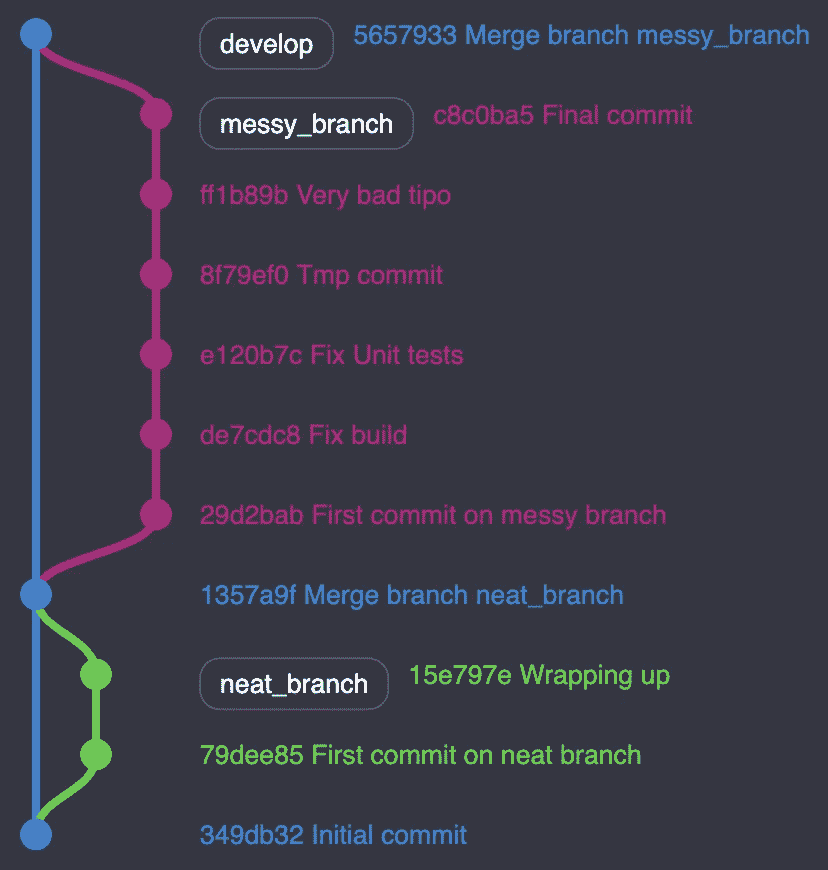
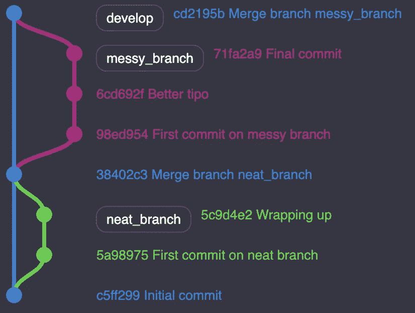

# 用 Git Rebase 画出整齐的树

> 原文：<https://betterprogramming.pub/from-messy-to-beauty-with-git-rebase-2d2e9ec6070f>

## 使用交互式重置基准编辑或放弃您的提交


照片由[在](https://unsplash.com/@thecreative_exchange?utm_source=medium&utm_medium=referral) [Unsplash](https://unsplash.com?utm_source=medium&utm_medium=referral) 上的创意交流拍摄

重定 Git 分支的基础很有挑战性。我建议在深入研究之前，通过阅读“[不要为 Git Rebase](https://medium.com/better-programming/dont-fret-with-git-rebase-75fe3ed5ca8f) 而烦恼”来更加熟悉它。

如果您决定使用这个强大的命令，那么您已经迈出了最重要的一步。您已经展平了您的 Git 历史，创建了一个任何人都可以阅读的线性树。

我们能做的就这些吗？当然不是——我们还没有利用 Git rebase 背后的真正力量。我会告诉你怎么做。

# 超越 Rebase

让我们假设你已经将`neat_branch`和`messy_branch`合并成了`develop`:



生成的树看起来又平又整齐。不过，多挤压我们的树不是更有帮助吗？也许有些行为是可以避免的？

虽然`neat_branch`看起来不错，`messy_branch` 包含了几个我们可以丢弃的提交。两次提交表示“固定”前缀，这可能不会带来太多信息。更糟糕的是，有人推了一个临时提交。

Git rebase 提供了进一步重写 Git 历史的选项。让我们收拾残局吧。

# 与你的 Rebase 互动

当引用官方的[文档](https://git-scm.com/docs/git-rebase#_interactive_mode)时，你可以在重定分支的基础上与你的提交交互。让我们关注以下选项:

*   选择(p):默认选项。基本上，保持提交原样。
*   Reword (r):选择提交，但允许您重命名提交的标题。
*   挤压:将提交的内容与前一次提交的内容合并。

注意:你不能压制你的第一个分支的提交。

回到我们的例子，我们将几个提交合并成一个，并重命名提交的标题，使它更相关。

```
$ git fetch --all
$ git checkout messy_branch
$ git rebase -i origin/develop
```

我们立即得到分行历史的提示。

```
pick 29d2bab First commit on messy branch
pick de7cdc8 Fix build
pick e120b7c Fix Unit tests
pick 8f79ef0 Tmp commit
pick ff1b89b Very bad tipo
pick c8c0ba5 Final commit
```

现在让我们挤压一些不相关的提交，并重命名一个错误类型的提交。我们只与我们感兴趣的提交进行交互。

```
pick 29d2bab First commit on messy branch
s de7cdc8 Fix build
s e120b7c Fix Unit tests
s 8f79ef0 Tmp commit
r ff1b89b Very bad tipo
pick c8c0ba5 Final commit
```

让我们继续这个设置。我们将把第二到第四个提交压缩到第一个中。我们还利用重命名第五个提交。

击中第一个壁球时，基础将停止。提示器显示你所有被挤压的提交将变成一个更重要的提交。验证并继续。

最后，是时候按照上面的要求重命名我们类型不良的提交了。编辑您的提交名称，并最终确定 rebase。



虽然这看起来像是一个小小的进步，但我向你保证，它可以让你避免眼睛过度疲劳。有些分支可能每个分支包含二十多个提交，迫使您在找到想要的内容之前向下滚动很多次。

# 关于壁球的想法？

人们经常问我我们应该什么时候打壁球。在我看来，对每项任务进行单独的提交可以减轻审查，应该鼓励这样做。

一旦您的团队成员批准了您的拉请求，您可能会在合并之前将您的分支重新基于目标分支。我建议通过做最后一次清扫从这次行动中获利。

我希望你能养成清理 Git 历史的习惯。从长远来看，这次行动对你和你的整个团队都有好处。

请保持联系，我们会有更多的文章。