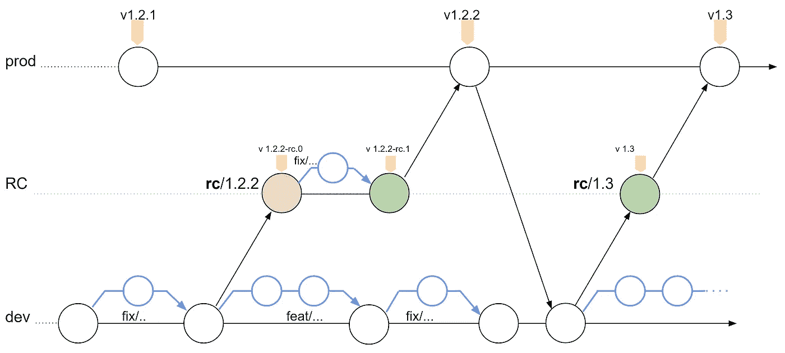
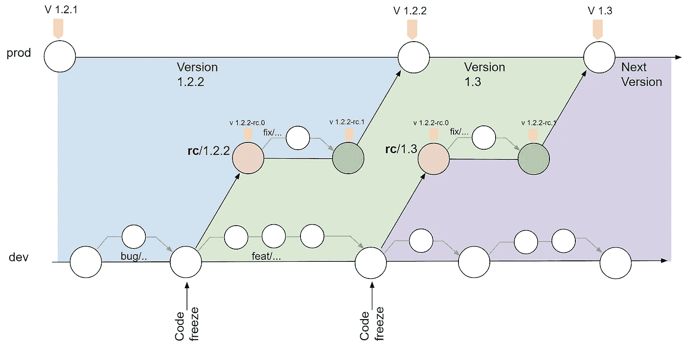
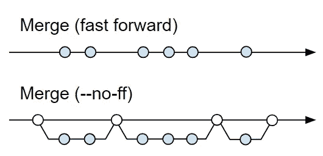
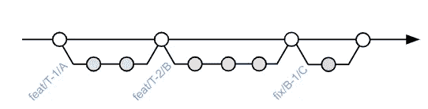
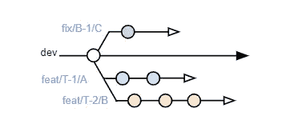
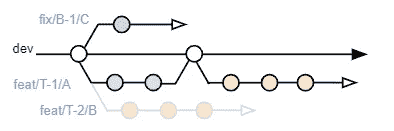
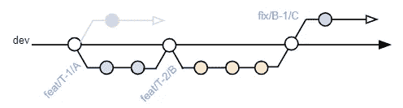
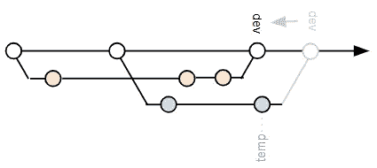
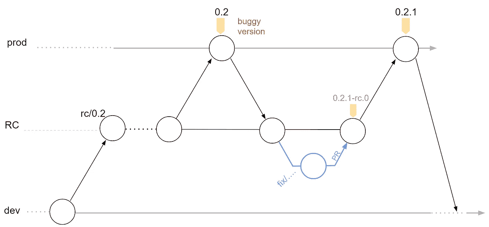

# 从微观到宏观

> 原文：<https://betterprogramming.pub/from-micro-to-macro-git-branching-model-and-workflow-8dc1b230a28e>

## 自定义 git 分支模型和工作流


阿尔瓦罗·雷耶斯在 [Unsplash](https://unsplash.com/s/photos/workflow?utm_source=unsplash&utm_medium=referral&utm_content=creditCopyText) 上拍摄的照片

在过去的一年里，我一直致力于一个简单而干净的 GIT 工作流和一个分支模型。该流程适合中长期生产项目，尤其是基于 web 的项目，但是可以扩展到任何项目。

该流程分为两部分。首先是**宏**分支模型，它定义了不同的分支以及它们之间的关系。第二个是**微观**模型，它定义了每个分支内部的 GIT 工作流。

> *该模型基于 Florent Lebreton 撰写的*“[中长期项目的高效 GIT 工作流](https://fle.github.io/an-efficient-git-workflow-for-midlong-term-projects.html)”中发表的观点。

# TL；速度三角形定位法(dead reckoning)



# 定义

在进入流程之前，让我们先定义一些我们稍后会用到的术语:

*   **微流程**是指处理特性\bug 分支上的提交的工作流，包括提交命名约定和合并分支的指令。
*   **宏流程**描述了所有分支(bug、特性、静态分支)之间的关系以及如何管理它们，包括:分支命名约定、处理 bug 和热修复、合并特性、创建发布候选、以及标记发布。
*   **静态分支**是那些一直存在的分支(即开发、发布候选和产品\主)
*   **特性\Bug 分支**是短期分支(新特性和 Bug 修复)。这些存在直到它们被合并到静态分支(开发，发布候选)。
*   Git-Master 是一个负责执行宏流程、计划和协调静态分支，以及帮助修复任何其他问题的人。根据我的经验，修复静态分支上的错误可能很耗时，因此最好有一个对流程有深刻理解的维护者来协调和管理存储库。
*   **bug-fix**vs**release candidate fix**vs**hot-fix**都是 Bug 修复，区别在于发现 Bug 的时间，更重要的是，它将在何时被修复:
*   Hot-fix :一个关键的优先 bug 修复，通常在计划的产品周期之外进行修复。
*   **Bug-fix** :来自数据库的预定 Bug 修复。
*   **发布候选修复**:在新特性完成后(合并到`dev`)和代码发布前(合并到`prod`)发现的 bug 修复。
*   我们处理流程中每种类型的 bug 修复的方式略有不同。

我们还应该定义一些分支类型:

*   **dev** 分支包含最新的特性和 bug 修复**。这个分支应该总是为发布候选(RC)做好准备。换句话说，我们应该避免合并正在进行的工作。任何新的特性或计划的 bug 修复分支都是基于`dev`的，并在重设基础后合并回`dev`(更多关于微流程中的内部管理)**
*   **RC** (rc/x.y.z):发布候选(RC)分支是一个“代码冻结”点(在`dev`上)。对于每一个准备发布的版本，我们创建一个临时分支来代表发布候选(在宏流程中有更多关于这个分支的信息)。
*   **prod** (或 master):这个分支包含所有被标记的官方(非候选)版本。

# 规则

对于整个流程，我们应始终遵循以下规则:

*   一次一个维护者(Git-Master)。
*   永远不要直接提交到任何静态分支。
*   永远不要改变静态分支的基础。
*   不要脱离计划好的工作流程。

# 流程概述

目标很简单:以最简单、最干净的方式将代码从`dev`带到`prod`，允许验证团队在代码进入`prod`之前对其进行测试。

对于任何**新特性**或 **bug 修复**，我们会基于`dev`创建一个新的分支。完成后，我们合并回`dev`。一旦新特性/缺陷修复准备好发布，我们通过创建一个新的发布候选`rc/x.y.z`分支来“冻结代码”，并且我们将该版本标记为发布候选`x.y.z-rc.0`。在这一点上，验证团队可以验证这个候选版本。如果没有发现错误，该版本可以合并到`prod`并标记为正式版本`x.y.z`。否则，我们修复`release candidate bugs`并创建另一个发布候选。我们重复这个过程，直到候选人通过验证。最后，我们可以将`RC`分支合并到`prod`。

下面的流程说明了“代码冻结”点的概念。很容易看出，每个`RC`分支都是一个保护层，允许验证团队测试版本，并允许开发团队修复发布候选错误。



RC 提交颜色代表验证状态(红色=失败，绿色=通过)

# 第一部分:宏观分支模型

我认为，在我们进入管理提交的细节(第二部分中的微观工作流)之前，如果我们理解大图(宏观分支模型)会更容易。

我们将使用以下分支命名约定。就我个人而言，我发现这些惯例有助于保持历史的整洁和可读性。但是，只要每个人都同意，您可以使用其他约定:

*   **特征分支名称** — `feat/<ID>/<title>`。
    `ID` —待办事项中的任务\故事 ID 号。
    `title` —一个简短的(最多几个字)，小写的特征标题。
*   **Bug 分支名称—** `bug/<ID>/<title>`(针对任何 Bug 修复类型— A、B 或 C)
*   **发布候选**(分支)— `rc/<version>`
    `version` —对于版本化，我们使用[语义版本化](https://semver.org/)约定。
*   **发布候选标签**——在创建了一个`RC`分支之后，我们可能想要将它标记为候选标签`<version>-rc.<index>`(例如`1.2.3-rc.0`)。

## **宏工作流程配方**

在这个食谱中，我将描述从完成工作(在`dev`上)到发布的步骤。

1.  基于`dev`创建一个`RC`分支`rc/x.y.z`。
2.  使用标准版本标记发布候选。
    `standard-version --prerelease rc & git push`
    —如果`RC`有 bug，修复它们(遵循微流程的约定)，再次标记，重复直到候选被批准发布。
    —在这一点上，我们期望看到下一个版本的带有后缀`-rc.0`的新标签。
3.  如果我们需要修复 bug:
    **a .**创建一个新的 bugfix 分支`git checkout -b fix/<name>`(微流中的名称更多)并修复 bug。
    **b.** 将 bug 合并到`RC`分支(建议:为代码评审创建拉请求。如果使用 GitHub，使用“合并拉取请求”选项)
    **c.** 标记新的发布候选(回到步骤 2)。
4.  (假设没有 bug，版本获得了绿灯)
    将`RC`分支合并到`prod`。
5.  标记发布提交。
    `standard-version & git push`
6.  合并`prod`到`RC`和`dev` :
    执行标准版本工具将更新 changelog(在`prod`上)。因此，要获得正确的版本，我们需要:
    **a.** 将 prod 合并到`RC`(以防我们需要热修复)
    **b.** 将`RC`合并到`dev` *注意:我们可以直接将 prod 合并到* `*dev*` *，但是当使用类似于*[*git kraken*](https://www.gitkraken.com/)*的工具时，上面的流程会产生更好的图形。*

## **附加步骤**

删除最后两个分支之前的`RC`分支(我们总是保留最后两个`RC`分支)

*   看一下结果图——确保它看起来像你预期的那样。
*   删除所有合并的临时分支(即 feat\fix)。
*   将所有现有的分支重新设置为最新的`dev`是一个很好的实践。

# 第二部分—微 GIT 工作流

实现简单、干净和可读的分支的方法是维护线性分支。

**线性分支**是一个 ***"*** *Git 历史，其中所有的提交都是一个接一个的"* ( [来源](http://www.bitsnbites.eu/a-tidy-linear-git-history/))。我们通过在合并前总是重新建立基础来实现它。让我们更深入地了解一下**重定基础**和**合并:**

为了给**重设基础**，我们使用`**git rebase -i** <branch>`

`-i`允许编辑提交(重命名、压缩、删除等):

> (`-i` ) " *最简单的形式是将另一个分支合并到您当前工作的分支中的命令，并且* ***将重定基础分支之前的所有本地提交移动到该分支上的历史*** *的顶部。*”([来源](https://nathanleclaire.com/blog/2014/09/14/dont-be-scared-of-git-rebase/))。

对于合并，我们有两个选项:有或没有`--no-ff`(无快进)标志:



对于**静态分支，**我们使用无快进合并(在合并期间使用`--no-ff`标志)。

例如，`dev`分支应该看起来像:



通过使用`--no-ff`,我们将提交分组在一起。这些组使得分支历史更具可读性，更重要的是，通过多次提交可以很容易地恢复特性或修复——我们所需要做的就是恢复单次合并提交。

TK 由于使用特性/修复分支，我们不希望对提交进行分组，并且恢复多个提交将是线性快进`— ff`合并。

## 履行约定

因为我们使用的是标准版本，所以使用 [GIT 常规提交消息](https://www.conventionalcommits.org/en/v1.0.0-beta.2/)很重要

从标准版本文档:

> *“只要您的 git 提交消息是常规的和准确的，您就不再需要指定 semver 类型——并且您可以免费获得 CHANGELOG 生成！\o/"*

典型的提交消息具有以下格式:

```
<type>: <ID> <description>
```

要讨论的另一点是提交什么以及提交多少次。一般来说，当你在一个分支上工作(特性或者 bug 修复)时，你可以尽可能频繁地提交(保存状态)，并且当你不再需要它们时压缩提交。我的经验是，只有在将来有机会使用(恢复或审查)代码时才提交。

例如，在 bug 修复分支中，bug 修复通常应该在一次提交中完成。如果它是一个特性分支，那么将特性分成更小的有意义的子任务并对每个子任务进行提交是有意义的。

## **微工作流程配方**

1.  使用`dev`分支作为基础，从`dev`创建一个新的工作分支(除非我们和其他人一起工作在相同的特性上——稍后会详细介绍)。
2.  通过使用`rebase` — `git rebase dev`，让工作分支与`dev`保持同步是一个好的做法。在这一点上，与`dev`的冲突是可能的，但是保持工作分支总是与最新的`dev`保持一致应该使它们容易解决。
3.  当开发完成后，返回到`dev`并创建一个 pull 请求(GitHub)用于代码评审。`git rebase dev` 或者，如果需要分支清理，`git rebase -i dev`修改工作分支历史。
4.  在代码被批准并准备好被合并之后:
    —确保工作分支在`dev`被重置为最新提交。
    —Git-Admin 使用“[合并拉取请求](https://help.github.com/articles/about-pull-request-merges/)”选项将分支合并到`dev`。另一个选项是命令行:`git merge --no-ff <branch>`。

## **例子**

在这个例子中，我们有三个开发人员在三个分支上工作:

*   开发者 1💙:正在制作一个功能`feat/T-1/A`
*   开发者 2💛:正在修复一个错误`fix/B-1/C`
*   开发者 3💜:正在制作一个功能`feat/T-2/B`



开发者 1💙:完成，他准备合并，因为他与开发是最新的，他可以创建 PR，当 PR 被批准的分支可以由 Git-Admin 合并。

开发者 3💛:遵循最佳实践，并将其代码重置为`dev`



Git-Admin 合并了开发人员 3💛编码并询问开发人员 2💜重定基数:



在 PR 被批准后，错误修复💜可以合并到`dev`


## **注意事项和提示**

你可能已经注意到，神奇的词是 rebase。Git-Admin 应该在合并分支之前验证它是否被重定了基。即使犯了错误，撤销更改也很容易:

*   只需**将**的`dev`分支重置为之前的提交:
    `git checkout dev`
    `git reset — hard HEAD~1`
    `git push`
*   为了确保在这个过程中不会丢失分支，在分支的最后一次提交(分支的`HEAD`)中创建一个临时分支(作为分支的指针)。
*   遵循微流程中的步骤 3–4(重设基础和合并)。



为了保持工作环境的整洁，最好删除本地和远程分支。

我个人使用 GitHub 分支视图来移除分支。它帮助我避免意外删除未合并的分支。

在 pull 请求被审查并且分支被合并到 dev 之后，没有理由保留远程分支——最好是**删除**已完成的分支以保持 git 环境的整洁。

## **处理热修复**

报告了一个严重的错误，您必须提供快速修复？让我们看看如何利用这种优势。还记得我们保留的树枝吗？我们用它来修复关键的错误。

1.  将`prod`合并到 stage 中(因为我们需要将标签版本放入`RC`)。
2.  可能已经有另一个打开的`RC`分支(最新版本)，但是如果没有，跳到步骤 3。如果是这样，我们必须删除 RC 分支上的所有标签(并在`rebase`之后重新创建它们)。
3.  遵循宏工作流程:提交`hotfix`，标记(`pre-release`，合并到`prod`，释放，然后合并到`dev`。



# 摘要

我希望到现在为止，您已经很好地了解了这个流程是如何工作的。我喜欢这个流程的一点是它的灵活性。由于每个项目都是不同的，团队结构会发生变化，任务管理方法也是不同的，所以您可以根据自己的需要修改和扩展流程。

我要感谢 Dominique Legault 的流程设计和评审！