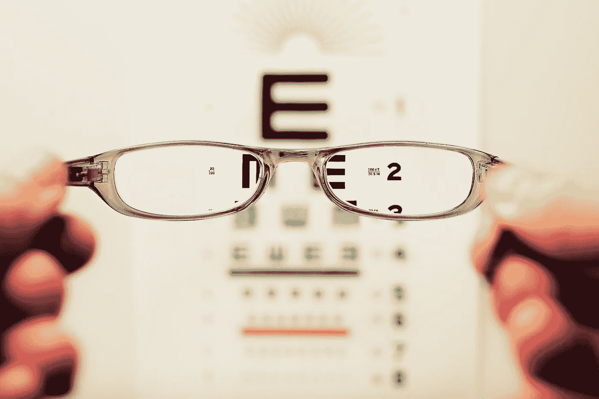
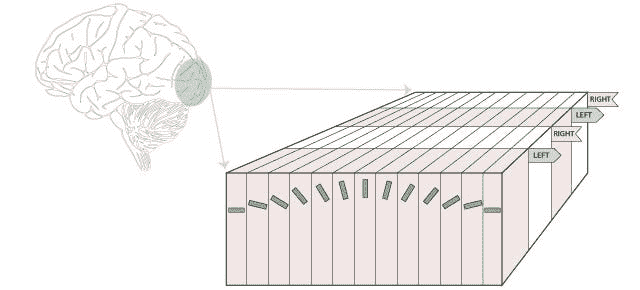
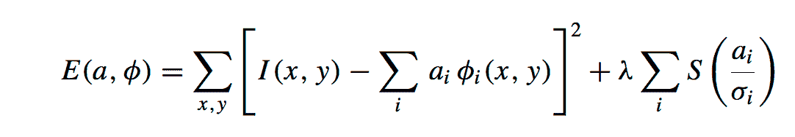
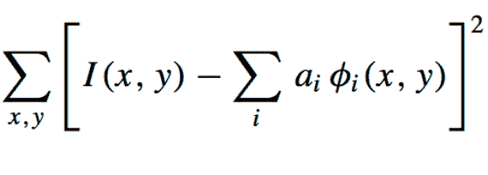
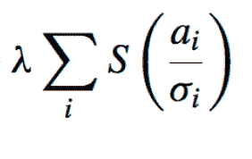
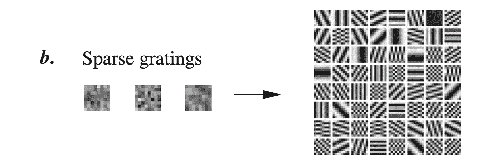
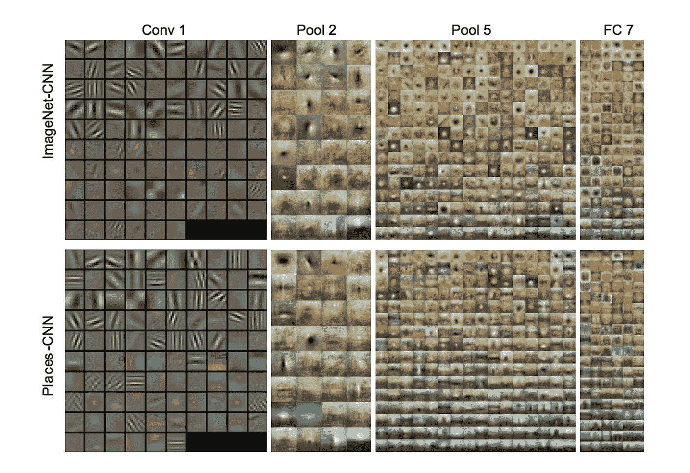
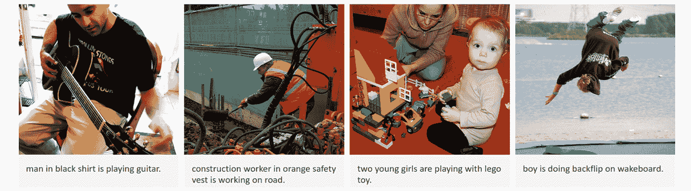

# 从神经科学到计算机视觉

> 原文：<https://betterprogramming.pub/from-neuroscience-to-computer-vision-e86a4dea3574>

## ***一个 50 年的 l*** 着眼于人类和计算机视觉

照片由[大卫·特拉维斯](https://unsplash.com/@dtravisphd?utm_source=unsplash&utm_medium=referral&utm_content=creditCopyText)在 [Unsplash](https://unsplash.com/s/photos/vision?utm_source=unsplash&utm_medium=referral&utm_content=creditCopyText) 上拍摄

视觉如何运作是人脑(现在是计算机大脑)必须承担的复杂任务。我们认为大脑的许多功能都是理所当然的。例如，深度感知、物体跟踪、光照差异、边缘检测和许多其他我们大脑跟踪的特征。扫描环境并定位我们在空间中的位置是我们的大脑不断在做的事情。

在过去的某个时候，研究人员可能从未想过有可能创造出能够执行与我们大脑类似任务的系统。然而，在过去的 50 年里，我们已经从神经科学中看似微小的进步发展到计算机能够描述图片中的场景。

在神经科学课程中教授了大量的轶事来帮助学生理解大脑是如何运作的。这可能是菲尼亚斯·盖奇被一根铁路杆毁坏了他的左额叶皮质并幸存下来，或者是布里顿的[论文描述了大脑何时能够在一堆混乱的移动点中检测到信号](https://www.jneurosci.org/content/jneuro/12/12/4745.full.pdf)。所有这些零零碎碎的研究开始加深对我们大脑运作方式的理解。

Hubel 和 Wiesel 的研究就是这样一个例子，它为人类视觉和计算机视觉的大量研究奠定了基础。

由于他们在心理学方面的工作，胡贝尔和威塞尔获得了 1981 年的诺贝尔生理医学奖。他们在视觉系统的信息处理方面有了突破性的发现。

他们给我们带来了原汁原味的脆片、脆片和爆米花——不，不是麦片。通过将电极连接到神经元，他们能够听到神经元对光条刺激的反应。

他们开启了对 V1 皮层神经元如何运作的新理解，这令人兴奋不已。他们的研究有助于展示 V1 神经元的图谱和功能。

在下面的视频中，两人演示了 V1 中的神经元如何只对特定位置和角度的光条做出反应。当光柱移动时，会有劈啪声。你听到的是猫的神经元对刺激的反应。

通过这项实验，他们展示了几种类型的神经元如何仅在特定刺激下被激活。另一个有趣的特征是，这些细胞似乎可以自然地映射不同的角度。如下图所示，V1 的每个部分都包含一组非常特殊的神经元，它们主要对特定角度的光条做出反应。

图片来源:[胡贝尔和威塞尔](https://www.nobelprize.org/nobel_prizes/medicine/laureates/1981/)

当这些细胞反应结合在一起时，理论上能够以某种方式创建自然世界的自下而上的图像。也就是说，通过拍摄许多神经元对各种光条的反应，人脑开始绘制周围世界的画面。

让时间快进到近 30 年，两位专注于计算神经科学领域的研究人员 Olshausen 和 D. J. Field。这是关于大脑如何编码和解码信息的研究。奥尔森和菲尔德将这项工作推进了一步。事实上，他们甚至引用了 30 年前 Hubel 和 Wiesel 所做的工作。

他们的团队不是只关注单个的光条，而是拍摄照片，并开始研究算法如何识别和编码所述图像中的特征。

他们的一篇论文叫做“[自然图像统计和高效编码](https://pdfs.semanticscholar.org/e309/e441a38ccee6456bd02e0f1e894e44180d53.pdf)”*，写于 20 多年前的 1996 年。*

*本文的目的是讨论 [Hebbian 学习模型](https://en.wikipedia.org/wiki/Hebbian_theory)在图像识别中的失败，特别是利用主成分分析的 Hebbian 学习算法。问题是，模型当时无法学习构成自然图像的局部、定向、带通结构。*

*这在理论上比 Hubel 和 Wiesel 在他们对真实神经元的研究中开始展示的要高几层。除了现在，他们在一个更现代的神经网络中模拟 192 个单元(或节点)的输出。他们的研究表明，在对自然图像中存在的规律进行编码时，开发更注重稀疏性的模型要有效得多。*

*使用备用模型，集中于限制每个基函数列表所需的系数数量，以表示图像中的各种特征。*

*下面的公式证明了这一点。*

**

*Olshausen 和 D J Field [*自然图像统计和高效编码*](https://pdfs.semanticscholar.org/e309/e441a38ccee6456bd02e0f1e894e44180d53.pdf)*

*本质上，下面的部分涉及在实际图像和代表图像的函数之间寻找最小的平均误差。*

**

*奥尔森和维 J 场[T3【自然图像统计】和高效编码 ](https://pdfs.semanticscholar.org/e309/e441a38ccee6456bd02e0f1e894e44180d53.pdf)*

*然后，它与一个[成本函数](https://en.wikipedia.org/wiki/Loss_function)合作，迫使算法限制表示图像所需的系数数量。*

**

*Olshausen 和 D J Field [*自然图像统计和高效编码*](https://pdfs.semanticscholar.org/e309/e441a38ccee6456bd02e0f1e894e44180d53.pdf)*

*使用[梯度下降](https://www.kdnuggets.com/2017/04/simple-understand-gradient-descent-algorithm.html)然后最小化表示图像所需的系数数量。*

*这篇论文本身还没有展示能够翻译图像的神经网络。*

*让他们休息一下，这是 1996 年！互联网在 1991 年刚刚公开！*

*现在，科学已经从用猫的神经元检测光条发展到从图像输出实际特征的网络数学模型。*

*1996 年论文的最后一行是“一个重要且令人兴奋的未来挑战将是将这些原理外推到更高级的皮质视觉区域以提供预测。”这是一个挑战，创建模型，可以采用各种计算研究科学家目前正在建模的低层特征，然后创建一个自下而上的网络，可以实际预测图像的上下文。*

**

*Olshausen 和 D J 字段 [*自然图像统计和高效编码*](https://pdfs.semanticscholar.org/e309/e441a38ccee6456bd02e0f1e894e44180d53.pdf)*

*Olshausen 和 Field 模型的输出与上面的相似。*

*这个输出的低级特征矩阵看起来熟悉吗？是的，尤其是如果你是深度学习的粉丝！*

*在过去的几年中，有许多论文利用了非常相似的矩阵。这些矩阵被用作卷积神经网络中的卷积层。这应该是模仿单个神经元对视觉刺激的反应方式。*

**

*安德烈·卡帕西和李菲菲"[用于生成图像描述的深度视觉语义对齐](https://cs.stanford.edu/people/karpathy/cvpr2015.pdf)*

*除了现在，利用这些低级特征并预测图像的实际上下文的思想不再是一篇论文的最后一行。它不再只是一个理论。这是现实。*

*这就是事情的发展方向，从证明神经元可以识别光条，到拥有可以获取低级特征并预测图像内容的神经网络。*

*斯坦福大学的安德烈·卡帕西和李菲菲在 2015 年写了一篇关于这个主题的伟大论文，名为“[生成图像描述的深度视觉语义对齐](https://cs.stanford.edu/people/karpathy/cvpr2015.pdf)他们展示了一种循环神经网络，能够提供图像的详细描述——不仅仅是指出照片中的一只猫或一只狗，还能够描述图像。比如“男生在尾波板上做后空翻”(比如下图)。*

**

*安德烈·卡帕西和李菲菲"[用于生成图像描述的深度视觉语义对齐](https://cs.stanford.edu/people/karpathy/cvpr2015.pdf)*

*现在，它并不完美。但是，离 1968 年还是突飞猛进！*

*这是一个漫长的过程。只是本文引用的论文，从头到尾都有 50 年的时间。然而，总的来说，这很快，而且只会越来越快。神经网络不仅仅是识别图像。神经网络正被用于从医学图像中检测癌症，预测人类、无人驾驶汽车等表现出的情感表达。*

*未来 50 年，计算机视觉会有什么样的发展？*